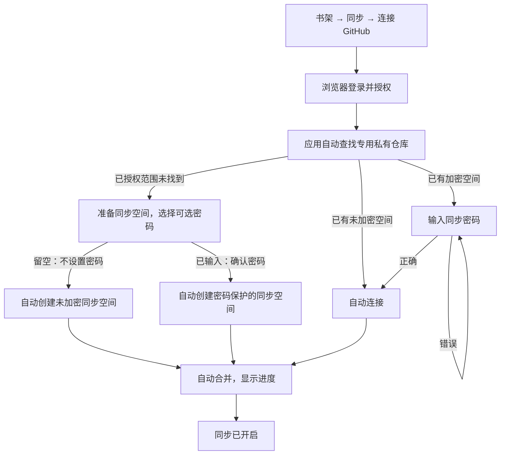

# 跨端同步首次配置：自动连接与可选密码

- 日期：2026-09-18
- 状态：生产配置流程已接入共享及双端原生入口；独立审查、Windows 正式运行及 Android API 26 R8 验证通过，外部联调和剩余平台门槛见 roadmap。
- 原型：[双端 HTML DEMO](prototypes/multi-device-sync/index.html) · [运行与审阅说明](prototypes/multi-device-sync/README.md)
- 关联：[原技术方案](2026-09-13-multi-device-sync-technical-proposal.md)
- 实施：[本次配置迭代 Roadmap](roadmap/2026-09-18-sync-onboarding-password-roadmap.md)

范围：本文仅覆盖本次“自动连接同步空间与可选密码”迭代，包括配置入口、授权后的自动处理、密码交互、首次合并、恢复路径及设置中的相关变化。日常同步、批量处理、记录、倒计时等沿用既有设计，只进行受影响路径回归，不在本次重新设计或开发。

## 1. 设计目的与决策

用户应以“登录 GitHub，然后使用同步”理解功能。创建仓库、绑定仓库、初始化空间由应用处理；只有首次创建时是否设置密码，以及连接已有加密空间时输入密码，需要用户作出决定。

本设计替代旧方案中“用户选仓库 → 保存或导入恢复资料 → 确认首次合并”的正常配置流程，以及默认强制客户端加密的决定。GitHub 私有仓库的访问控制与客户端加密是不同机制；本轮明确选择便利性优先，是否额外加密由用户决定。

| 项目 | 本轮决定 |
| --- | --- |
| 同步入口 | 书架顶栏同步按钮；未连接时显示“连接 GitHub” |
| 登录 | 系统浏览器完成 GitHub 登录/授权，应用自动继续；不手填访问令牌 |
| 仓库 | 应用自动查找个人账号下的专用私有仓库，不要求用户命名、选分支或绑定 |
| 新空间 | 先询问可选同步密码，再按用户选择创建、初始化并开始合并 |
| 未设置密码 | 私有仓库内的同步数据不额外进行客户端加密，新设备登录后直接连接 |
| 设置密码 | 同步数据加密，新设备登录后须输入正确的同步密码 |
| 恢复资料 | 新流程不再生成、导出、展示、导入恢复文件或恢复代码 |
| 首次合并 | 自动执行并显示进度，空书架不会产生取消操作；不再额外确认合并范围 |
| 日常同步 | 一次“立即同步”完成上传和接收；取消待确认不阻断其他变动 |

## 2. 正常操作流

“一次登录入口”不意味着能跳过 GitHub 自身的账号登录、双因素验证、应用安装或授权确认。这些由 GitHub 页面负责，应用不重复询问仓库和恢复资料。DEMO 沿用本地设备码授权模拟窗口；应用外场景选择用于模拟查找结果，不属于正式产品步骤。

## 3. 首次创建：可选密码

仅当授权有效、已授权范围查找成功且未找到有效空间时显示。按用户批准的第10.6节采用固定名安全创建；查找超时或权限不足不得当作“不存在”，同名目标不可见时也不承诺账号没有空间。

标题：**设置同步密码**。

说明：**准备同步空间；如需新建，将使用以下密码选择。设置密码后，其他设备必须输入正确密码才能连接这个同步空间。**

输入框：**同步密码（可选）**，默认空白、隐藏字符，提供“显示密码／隐藏密码”。不预填随机密码，不加入第二个确认输入框，不要求勾选保存资料。

| 输入状态 | 主按钮 | 点击结果 |
| --- | --- | --- |
| 空字符串 | 不设置密码 | 自动创建私有仓库、初始化未加密空间并开始同步 |
| 任意非空字符串 | 确认密码 | 将本次输入作为同步密码，创建加密空间并开始同步 |
| 输入后清空 | 不设置密码 | 恢复无密码选择 |

按钮文字在输入和粘贴时立即更新，不重建输入框，不丢失焦点、光标或输入法组合状态。密码按原样区分大小写；不悄悄去掉前后空格或改变字符。若生产实现引入长度上限等校验，应显示明确错误，不能把不合格的非空密码当作未设置密码而创建明文空间。

点击确认后显示“正在准备同步”，执行中禁止重复提交。创建、绑定和初始化采用同一次操作身份；按钮恢复可用前应先核对结果，避免重试生成多个空间。创建成功即开始合并，无额外“创建仓库成功 → 下一步 → 确认合并”的向导。

关闭密码页表示尚未确认创建，清除未提交的密码。重新进入时可继续当前配置步骤，无需重做登录；生产实现须在实际创建前重新核对远端，其他设备已经创建空间则按已有空间规则处理。已确认并开始的准备/合并任务允许收起，继续使用书架，完成后不抢占页面；重新打开提供当前进度或结果。

## 4. 已有空间：自动连接或密码解锁

未加密空间：登录授权后直接开始合并，不出现密码框、“不设置密码”按钮或创建选项。

加密空间：显示“输入同步密码”及“已找到受密码保护的同步空间。请输入正确的同步密码，连接后将自动合并数据。”密码与 GitHub 登录密码独立。主按钮为“连接同步空间”，空输入不可提交；提供显示／隐藏密码。错误时在当前页提示“密码不正确，请重试”，可立即修改重试，不重做 GitHub 登录，不初始化或覆盖远端空间，不退回未加密模式。

通过验证后自动进入首次合并。解锁所需信息由本机安全存储保管，正常使用不重复询问密码；原始密码不写入日志、普通偏好或仓库。

“忘记密码”不能通过再次登录 GitHub 绕过加密。仍有已解锁设备时，未来可以设计由该设备重新设置密码的路径；本轮不提供尚未实现的找回、改密或迁移按钮。全部设备均无法解锁且密码遗失时无法解密旧数据。

## 5. 页面与状态反馈

复用现有书架同步面板及面板内子页面，不新增底栏或平级页签。Windows 与 Android 的业务流程、文案和按钮规则一致，沿用各自外壳尺寸、返回及关闭操作。

| 状态 | 用户看到的内容 | 可操作项 |
| --- | --- | --- |
| 未连接 | 连接 GitHub | 开始登录 |
| 等待授权 | 等待浏览器完成登录/授权 | 重新打开授权页、关闭 |
| 正在查找 | 正在准备同步 | 可收起，无需选择仓库 |
| 新空间待确认 | 可选密码页 | 不设置密码／确认密码、返回或关闭 |
| 已有加密空间 | 同步密码输入页 | 显隐、输入密码、连接 |
| 准备或合并中 | 进度与已完成数量 | 可收起；沿用合并暂停/继续 |
| 完成 | 同步已开启 | 查看同步；正常面板继续显示定时倒计时、明细和立即同步 |
| 设置页 | 当前账号与密码保护“已开启／未开启” | 连接检查、重新登录、原有频率与设备设置 |

仓库地址等放在设置的账号信息或连接详情中，不成为普通配置步骤。移除恢复资料设置入口。密码保护状态只表示当前空间的模式，本轮不把它做成可随手切换的开关，因为既有数据改密、加密或解密需要单独的迁移设计。

同步结果、密码错误及准备失败使用当前面板会话内反馈。关闭后不回放旧的成功通知；仍未解决的连接问题可通过当前状态重新进入处理。

## 6. 失败与边界

| 情形 | 设计要求 |
| --- | --- |
| 用户取消授权、设备码过期 | 留在可重试的登录状态，不创建空间 |
| 查找失败或权限不足 | 显示重试／重新授权，不推断为空账号，不改为让用户手填仓库 |
| 创建失败 | 保留可恢复状态；重试先重新查找并核对上次结果，不盲目重复创建 |
| 创建成功但初始化中断 | 识别本次应用创建的空库并继续，不能把未知空库直接占用 |
| 密码错误 | 停留在输入页，未解锁前不合并、不上传、不替换密码 |
| 同名非同步仓库 | 不覆盖、不清空；自动查找其他有有效标识的空间，无法唯一判断时显示异常处理入口 |
| 多个有效空间 | 只在该异常下要求一次选择，不猜测并合并多个空间 |
| 两端同时首次创建 | 根据远端实际结果重新查找；先创建者决定空间模式，后加入者遵循已有空间流程 |
| 私有仓库变为公开 | 暂停新增上传并提示恢复为私有；不声称此前明文历史已被撤回 |
| 已有数据合并 | 本地缺少某漫画或作者不构成取消；取消操作仍进入各接收端待确认列表 |
| 新协议或未知加密模式 | 明确要求兼容版本，不能因未知字段而按未加密读取或覆盖 |

上述表格区分完整生产约束与 DEMO 可审阅的有限场景：本轮原型覆盖授权取消/过期、查找/创建重试、密码错误和关闭/重开；并发创建、权限探测、真实远端、密码学和迁移是生产接入验收项。

## 7. 技术接入约束与旧方案关系

### 7.1 自动创建的权限前提

GitHub 官方个人仓库创建接口 `POST /user/repos` 支持 GitHub App 用户访问令牌，要求 Administration 写权限；请求必须显式指定 `private: true`。原方案仅有 Contents 读写，不能直接声称已经满足自动创建条件。[GitHub 创建仓库接口](https://docs.github.com/en/rest/repos/repos#create-a-repository-for-the-authenticated-user)

GitHub App 的安装与用户授权不是同一个步骤。官方说明应用创建的仓库会自动授予该应用访问权限，但新账号、已有安装、仅选定仓库授权以及重新授权的真实链路仍须验证，不能以本地模拟页替代。生产应用应以一次入口串接所需的官方页面，不内置 App 私钥或客户端机密，也不以扩大到用户所有私库访问来悄悄绕过安装限制。[GitHub App 安装说明](https://docs.github.com/en/apps/using-github-apps/installing-a-github-app-from-a-third-party)

本次不变更真实 GitHub App 权限或创建真实仓库。若当前注册方式无法实现目标流程，应先完成这项可行性验证，再调整生产授权 adapter；不能让“登录即可使用”的承诺建立在未验证权限上。

### 7.2 可选密码的协议影响

空间元数据须显式区分未加密与密码保护模式，并带版本号。密码保护模式可复用已有随机数据密钥与 AEAD：由密码派生的密钥包装数据密钥，将盐、算法参数及包装后的密钥随空间元数据保存。具体算法、参数及最低端性能需在生产批次确定并验证，不把用户字符串直接当作 AES 密钥或上传为明文。

未加密模式复用同一操作日志、合并、批次校验、幂等及待确认规则；内容不额外加密并不允许放弃协议校验。账号令牌仍须使用本机安全存储，密码只影响同步内容保护，不替代 GitHub 授权。

现有 [SyncRecovery.kt](../domain/src/commonMain/kotlin/mihon/domain/sync/crypto/SyncRecovery.kt) 以恢复资料交付随机数据密钥，[SyncPanelContent.kt](../presentation-sync/src/commonMain/kotlin/mihon/presentation/sync/SyncPanelContent.kt) 已有保存/导入恢复资料入口。两者均不会因为改名而自动支持密码。用户已确认无需兼容：生产迭代只支持新空间格式，不保留旧恢复资料导入／导出入口，不实施旧数据迁移。旧加密空间不含密码包装元数据，遇到旧格式明确拒绝连接与交换，不能覆盖旧空间或把旧数据默认视为明文。

### 7.3 复用与本轮范围

HTML 沿用 `preview.js` 双端容器、`app.js` 书架面板、`sync-interactions.js` 交互场景、本地授权模拟页和现有首次合并进度。应用外控件选择“首次创建／已有无密码／已有密码”等样本；正式页面不呈现该选择。保持插件建议、阅读模式、取消批量处理、倒计时及临时反馈既有约定。

本轮交付设计、原型与浏览器交互验证；不实现真实查库/建库、密码加密、生产协议迁移和系统凭据落盘。DEMO 中的正确密码仅是显式演示值，不能视为真实密码验证或安全实现。

## 8. 交互验收

1. 双端分别选择首次创建场景，完成本地授权 → 自动查找后出现可选密码页，授权页及应用内均无仓库选择步骤。
2. 空框按钮为“不设置密码”；输入后为“确认密码”；清空恢复“不设置密码”；输入、粘贴和显隐切换不丢焦点或内容。
3. 不设置密码 → 自动准备、合并并完成；设置页显示密码保护未开启，全程无恢复资料。
4. 输入密码并确认 → 自动准备、合并并完成；设置页显示密码保护已开启。
5. 已有无密码空间 → 授权后直接合并，无密码选择或合并确认页。
6. 已有密码空间 → 空密码不能提交，错误密码可重试，正确密码才开始合并；不出现“不设置密码”绕过入口。
7. 取消授权、设备码过期、查找或创建失败 → 有明确反馈和恢复入口，失败不能显示同步已开启。
8. 密码输入中关闭再打开 → 清除未提交密码；合并中收起 → 继续运行且不抢页，重新打开可查看进度或完成状态。
9. Windows 与 Android 均可操作，窄屏无横向溢出；操作一端不更改另一端正在输入的密码或所在页面。
10. 既有立即同步、倒计时、取消待确认与批量入口仍可用；相关插件建议场景仍可进入。

实际验证命令和结果维护在原型 README；复用仍有效的测试证据，不要求仅为本轮 HTML 改动执行 Android/Desktop 构建。

## 9. 本次迭代交互补充与覆盖核对

核对依据为原型 `sync-interactions.js` 的配置状态和事件、`github-authorization-demo.html`、`sync-setup.test.cjs` 与 README。本节补齐本轮交互细节，不将原型所有功能纳入本次范围。下表是设计覆盖索引，不表示生产测试已经通过。

| 编号 | 本轮交互及入口 | 完整要求 | DEMO 审阅方式 |
| --- | --- | --- | --- |
| O1 | 未连接 → 连接 GitHub | 显示“让阅读跟随你”；说明收藏、关注、阅读可同步，阅读模式独立。有尚未完成配置时入口为“继续连接同步空间” | 首次创建场景 |
| O2 | 登录授权 | 收到经校验的设备码后自动复制验证码并打开系统浏览器，等待浏览器完成；“复制验证码并打开 GitHub”仍可手动重开。尚未取得设备码时不打开授权页；可取消、过期后重新获取。浏览器完成后应用自动继续，无手填令牌或仓库选择 | 本地授权页输入 DEMO-CODE；取消／过期样本 |
| O3 | 自动查找 | 显示“正在查找同步空间”，可收起。未找到才询问可选密码；已有无密码直接合并；已有密码进入解锁 | 首次创建／已有未设密码／已有密码三个场景 |
| O4 | 新空间密码 | 单个空密码框、显隐；按钮随输入／粘贴／清空切换“不设置密码／确认密码”。显隐保留文本、焦点和选区；不新增保存恢复资料或第二次输入 | 首次创建，分别空框和非空确认 |
| O5 | 已有空间密码 | 空框禁用“连接同步空间”；错误在原页可改正重试，不重登、不覆盖，不提供跳过密码；正确才合并 | 已有密码样本，演示密码 mihon-demo |
| O6 | 创建与首次合并 | “正在创建同步空间”后自动开始合并；展示进度、暂停／继续，收起仍可使用书架。完成回到正常同步面板，当前打开会话显示“同步已开启” | 新建两分支、已有空间两分支 |
| O7 | 配置中断与重试 | 查找／创建失败保留本机数据；“重试”先重新查找再继续，错误不能被当作没有空间。关闭未提交密码页清空输入，重开继续步骤 | 查找失败／创建失败；密码页关闭重开 |
| O8 | 设置中的变化 | 账号与空间信息可查看；保留检查连接、重新连接。恢复资料入口替换为“同步密码：密码保护已开启／未开启”，仅显示状态 | 创建或连接完成 → 齿轮设置 |
| O9 | 既有恢复入口接入新流程 | 访问问题 → 重新连接 GitHub；密码问题 → 重新输入同步密码；更换空间确认后 → 登录并自动查找。断开确认后保留本机数据，下次从登录开始 | access／key 样本、设置 → 更换／断开 |
| O10 | 双端及后台回执 | 流程一致，密码与配置页面按设备隔离；后台完成不抢占设置、插件或阅读页面。关闭期间完成不补播成功通知 | 并列两端输入；收起后等待完成再打开 |

### 9.1 导航与临时状态

配置复用书架同步面板内的子页面，保留既有标题、返回和关闭方式，不新增独立配置窗口或层层底部弹窗。返回离开当前子页；关闭收起整块面板。完成授权后，即使面板已经关闭也不能强行打开它；重新进入从当前阶段继续。

未提交密码不跨关闭保存，不在双端之间共享。确认后不再保留输入明文；生产只保存继续任务必需的安全材料。已经启动的创建／合并不是临时通知，收起后任务状态仍可恢复。设置中的保护状态以实际连接空间为准，不能仅根据输入框是否有字来显示成功。

查找、创建、合并进行中禁止重复启动相同任务。重试创建须区分确定失败和结果未知：结果未知先查远端；如果空间已由另一设备创建，改走已有空间分支，不用本机尚未提交的密码覆盖它。

### 9.2 首次合并与原型旧样本的区别

正常新配置**没有**“选择创建／加入”“选择仓库”“确认合并 · 3/3”“导入恢复资料”步骤。原型保留的 `import`、`empty-device` 独立旧样本仅用于审阅数据合并语义，不能重新接进正常配置向导。新流程合并完成后自动回到同步主面板，不增加必须点击“查看同步”才能完成的步骤。

首次合并沿用现有基线合并：本机缺少收藏不表示取消，阅读模式不改变。暂停后显示已完成进度并可继续，不要求重新登录或重新输入已经验证的密码。后台完成时仅更新实际状态，不改变用户当前所在子页。

### 9.3 本次调整的边界

重新授权同一账号复用当前合法绑定；若账号改变，必须重新查找并隔离旧账号的连接与未上传操作，不能直接把旧队列写入新空间。这里只调整新配置的接入，不重做断开、批量处理和操作日志规则。

用户于 2026-09-18 明确确认“无需兼容”。本轮不要求旧连接继续同步，也不提供旧恢复资料兼容入口或迁移；启动时遇到旧绑定、发现时遇到旧空间均提示格式不支持并停止该连接的交换。保留已有本机书架和远端文件，不自动删除、覆盖或将旧队列发布到新空间。此决定取代此前关于保护旧连接可用及兼容例外待审核的要求。

GitHub 真实权限、并发创建、重启持久恢复、加密算法和旧协议拒绝处理是生产验收项。DEMO 中固定密码与定时状态转换仅证明交互可审阅；本次文档核对不修复无关原型模型问题，不把它们扩成实施任务。

## 10. P1 实现契约（2026-09-18）

状态：已核对生产入口，用户已确认无需旧格式兼容及固定名安全创建，App注册权限已实际核验通过。以下冻结为P2/P3实现契约，不代表代码实现、安全审查或性能验收已通过。实际权限证据见roadmap第6节。

### 10.1 当前代码事实

- [SyncRecoveryCodec](../domain/src/commonMain/kotlin/mihon/domain/sync/crypto/SyncRecovery.kt) 的 v1 恢复资料包含 32 字节随机数据密钥的原文 `rawKeyset`，并绑定空间及 generation；不是密码包装密钥。
- [SyncRuntime](../data/src/commonMain/kotlin/mihon/data/sync/runtime/SyncRuntime.kt) 在 `connect` 中先导入恢复密钥、读取真实快照，再通过安全存储 CAS 保存材料及 actor 身份，最后执行现有基线合并。这是当前实现事实，不是新版本的旧格式兼容要求；新流程不自动清空或替换已有密钥。
- [GitHubSyncTransport](../data/src/commonMain/kotlin/mihon/data/sync/transport/GitHubGitDatabaseClient.kt) 同时加密 batch、index、head 和 bootstrap；bootstrap 位于 `.mihon-sync/index/bootstrap/0/bootstrap.bin`，没有可在解密前读取身份与模式的公共空间描述符。旧目录只说明“疑似旧格式”，不能证明密钥正确或空间完整。
- [SyncTransportPort／SyncPreparedUpload](../domain/src/commonMain/kotlin/mihon/domain/sync/transport/SyncTransport.kt) 硬编码密文类型。无密码模式须覆盖索引、head、持久重试产物与快照校验，不能只关闭 batch 加密，或暗中生成需要恢复的密钥。沿用现有操作日志、链校验及非强制 Git 发布。

### 10.2 已确认：无需兼容旧格式

用户于 2026-09-18 明确决定“无需兼容”，撤销此前兼容导入／导出的候选方案。新版本只支持本轮新空间格式，不要求保留旧格式交换能力，不新增恢复资料入口或迁移功能。

| 情形 | 实施要求 |
| --- | --- |
| 启动时存在旧格式绑定 | 显示“此同步空间使用不受支持的旧格式”，停止该连接的上传与接收；不能显示同步正常或密码保护未开启 |
| 配置时发现旧格式／疑似旧索引 | 返回不支持或数据异常，不出现密码解锁或恢复资料导入，不视为空库或无密码空间 |
| 本机书架、旧队列及远端文件 | 保留本机数据和远端文件，不自动迁移、删除、覆盖，也不把旧队列重新绑定到新空间 |
| 新格式配置 | 使用可选密码或密码解锁流程，不提供恢复资料导入／导出 |

“不兼容”不构成删除旧数据或重建远端仓库的授权。本决定解除兼容例外审核门槛，不替代实际 GitHub 权限与发现范围核验。

### 10.3 空间封装

事件协议继续为 1，另设 `spaceFormatVersion = 2`。新增 `.mihon-sync/space.json`，严格 UTF-8 JSON、最多 16 KiB。必需字段为 `application: "mihon-sync"`、`spaceFormatVersion: 2`、`eventProtocolVersion: 1`、`spaceId`、非负 `generation` 及 `protection`。未知／重复字段、错误类型、缺失字段、超限均拒绝，不靠解析失败推断明文。

| protection | 字段 |
| --- | --- |
| 无密码 | `mode: "none"`，禁止出现 KDF／包装字段 |
| 密码 | `mode: "password"`、`kdf: "PBKDF2-HMAC-SHA256"`、`iterations: 600000`、`saltHex`（32 个小写十六进制字符）、`aead: "AES-256-GCM"`、`wrappedKeyHex`（120 个小写十六进制字符） |

未知版本／模式返回 `Unsupported`，缺损结构返回 `Malformed`。描述符缺席且存在旧索引返回 `UnsupportedLegacy`；已绑定 v2 的描述符丢失必须报数据异常。任意未知 `.mihon-sync/` 残留都阻止初始化。描述符和 bootstrap 在同一 Git tree／commit 中发布，避免半初始化空间。

v2 batch、index、head、bootstrap 使用统一显式模式封装，带空间封装版本、模式和载荷字节；不得先解密失败再尝试明文。明文仍校验 SHA-256、身份、路径、序号、索引链及快照历史；SHA-256 不等于密钥认证。密码载荷复用现有 AEAD，并将空间封装版本和模式加入 AAD；不要求实现旧 v1 的读写兼容。

实际 v2 JSON 封装的未加密字段为 `plaintext`，密码模式字段为 `ciphertextBase64`（规范 Base64）；描述符内包装密钥仍使用 `wrappedKeyHex`。原始批次上限仍为 512 KiB，v2 封装上限为 1 MiB + 16 KiB，以容纳 JSON 字符串转义和封装字段；旧 AEAD 上限与上传重试产物上限不扩大。

v2 AAD 字段按顺序为域标识、空间封装版本、事件版本、模式、空间 ID、generation；包装域 `mihon-sync-wrap-v2` 再追加 KDF、迭代数、盐、AEAD 名称，载荷域 `mihon-sync-payload-v2` 再追加载荷身份及路径。字段用 UTF-8 字节长度前缀及 NUL 分隔，不能依赖 JSON 属性顺序。既有设备将模式及描述符摘要绑定到本机安全材料，远端变更拒绝交换；新设备的首次描述符依赖 GitHub 授权信任，不宣称可验证此前历史。

### 10.4 密码与性能验收标准

采用 PBKDF2-HMAC-SHA256、600,000 轮、随机 16 字节盐、32 字节输出，作为 KEK 包装随机 32 字节数据密钥。沿用 AES-256-GCM 无前缀布局：12 字节 nonce、32 字节密文、16 字节 tag。参数参考 [OWASP 密码存储说明](https://cheatsheetseries.owasp.org/cheatsheets/Password_Storage_Cheat_Sheet.html)，包装边界参考 [OWASP 加密存储说明](https://cheatsheetseries.owasp.org/cheatsheets/Cryptographic_Storage_Cheat_Sheet.html)。这是本轮复用现有 Android/JVM 密码学边界的实现选择，仍需独立安全审查与真机性能验证，不宣称优于内存困难 KDF。

输入严格编码为 UTF-8，不 trim、不做 Unicode 规范化；空字符串只在新建时代表 none，空格仍是密码。上限为 1,024 UTF-8 字节，超限及无效代理字符明确报错，不截断、不转无密码。双端须用包含中文、emoji、组合字符及前后空格的同一向量验证，不能假定不同 provider 对密码字符的转换一致。

不另存密码哈希，以包装 AEAD 验证成功为准。错误密码与包装篡改不能可靠区分，统一提示“密码不正确或空间验证失败，请重试或检查连接”；结构错误单独报告。原始密码及 KEK 仅短时驻留，安全存储只保留数据密钥及绑定；状态、日志、异常和持久任务不得包含密码或密钥。

性能验收门槛：最低受支持 Android 真机及正式 Desktop runtime 各预热 1 次、测量 10 次，记录设备／系统／构建及 p95；派生 p95 不超过 2 秒，不占主线程，关闭／返回 100 ms 内受理，取消后的结果不提交配置或恢复旧页面。当前没有测量证据，不能据此声称达标，失败时不自动降低工作因子，按 roadmap 审核替代方案。

### 10.5 实现接口与 fixtures

接口为职责约定，复用现有 runtime，不建立第二套控制器：

- `inspect(repository, head): SpaceInspection` → `V2(descriptor, digest)`／`UnsupportedLegacy`／`EmptyOwnedAttempt`／`NotSync`／`Unsupported`／`Malformed`，读取同一不可变 Git head；访问失败单独返回。
- `discover(account): DiscoveryResult` → `Found`／`NoVisibleSpace`／`MultipleCandidates`／`VisibilityUnknown`／`AuthorizationRequired`／`Incompatible`／`RetryableFailure`。完整分页无有效候选返回 `NoVisibleSpace`，不代表账号没有空间，也不扩大all-repositories授权。固定名create-only及碰撞细节按第10.6节执行。
- `createOrResume(account, attemptId, protectionChoice)` → 先重新发现，未知建库结果先重新读取；尝试绑定账号、repo、space 与模式。不能占用无本机尝试证据的空库；并发输家服从远端赢家模式。
- `unlock(descriptor, password)`／`connectVerified(repository, descriptor, material)` → 先验证材料与真实快照，再复用安全存储 CAS 及基线合并。账号／空间／尝试身份贯穿异步回执，过期结果丢弃；旧格式在进入解锁及连接之前拒绝，不进入兼容 adapter。

| fixture 组 | 必需输入及断言 |
| --- | --- |
| 空间识别 | none／password、真实旧 bootstrap、未知版本／模式、缺包装、重复键、超限及描述符丢失；拒绝降级 |
| 密码向量 | 固定合成盐／密钥／nonce 的跨端预期结果，空／空格／中文／emoji／组合字符、上限边界、坏参数、密码错误、包装及 AAD 篡改；随机数注入仅供测试 |
| 完整交换 | 两模式真实 codec → batch／index／head／bootstrap → transport → 重开；路径交换、断链、重放、持久重试模式错配失败；旧格式向量仅用于拒绝与零写入验证 |
| HTTP／发现 | 分页完整／截断、selected 安装、同名非同步、多候选、401／403／404可见性不明／429／500、畸形响应、私库创建及响应丢失、初始化中断和并发冲突 |
| 本机材料／生命周期 | 旧绑定重开后拒绝交换且保留数据、新模式重开、密码错误零写入、账号回执隔离、敏感内容不进入可观察输出，必须通过 production wiring |

上述格式、HTTP、完整交换及本机生命周期 fixtures 已接入真实 production 实现并完成 focused 红绿验证；批次证据与未验收项见 roadmap。源码扫描不作为行为验收，MockWebServer 不代替真实 GitHub 写入验收。

### 10.6 固定名安全创建（用户已批准，替代先证明不存在的前提）

固定个人账号下的 `mihon-sync` 仓库，保留 `mihon-sync-v1` 分支名以复用现有路由；分支名不代表支持旧空间封装。穷尽已授权范围后无有效空间时返回 `NoVisibleSpace`，404 只表示目标不可见。密码页说明改为“准备同步空间；如需新建，将使用以下密码选择”，不承诺已证明账号没有空间。用户确认后再次查找，再对固定名称使用 GitHub 的 create-only 接口，始终指定 `private: true`；不改名重试、不覆盖已有空库、不删除旧库。

| 远端事实 | 行为 |
| --- | --- |
| 可见有效空间 | 按其实际模式连接；多个候选只走既定异常选择 |
| 可见同名非同步库或旧格式 | 明确占用／不支持，零写入 |
| 201 创建成功 | 核对账号 ID、仓库 ID、名称、私有属性及本次标记后初始化 |
| 422 | 不直接断言重名；重新查找，存在有效空间则遵循赢家模式，仍不可见时引导到 GitHub 安装设置恢复权限；其他校验错误明确反馈 |
| 超时、断线、5xx、重启 | 先读取固定目标核对上次结果；无法证明归属则保持待恢复，禁止自动重复 POST |
| 并发发现正在初始化的库 | 等待／重查，不使用后加入设备的密码覆盖初始化 |

创建前持久化账号、随机 attempt ID、固定目标和保护选择；密码模式的继续任务材料保存在现有安全存储，不保存密码明文。将非秘密 attempt ID 标记随建库请求写入 description，创建成功补存仓库 ID。响应丢失后只有账号、目标、标记和预期初始内容均相符，才能认领未初始化库；单凭“空库”或本机曾发请求不足以认领。首次空间描述符与 bootstrap 同次 Git 发布，非强制更新遵循已有 transport。

GitHub 空仓库的 Git Database 查询可能返回 409，仅在仓库元数据确认 `size=0` 时进入空库 bootstrap 路径。恢复须分别核对默认分支及已存在的同步分支：只允许 `.mihon-sync/bootstrap` 精确初始内容及其父目录条目；未知文件、额外条目或内容篡改均停止。transport 在建立同步分支和发布空间前再次核验不可变树，不能依赖较早的发现结果放行写入。

此方案的边界是：**手工改名且未授权给 App 的空间无法发现，可能随后创建新的独立空间。** 不通过开放所有私库权限绕过该限制，不声称全账号唯一空间。用户已明确批准调整原“只有确定不存在才询问密码并创建”的前提；它不扩大同步数据字段或授权真实远端建库。

### 10.7 本机配置与双端入口的实现边界

配置继续使用共享 `SyncPanelController` 和 `SyncPanelContent`。Android 只保留浏览器、剪贴板、系统返回适配，Desktop 保留浏览器、剪贴板及 Escape；产品不再提供恢复文件导入、导出或旧格式迁移入口。设置页从实际连接材料显示保护模式，未连接时不显示已开启。

设备码只在当前可见授权步骤首次到达时触发一次平台浏览器动作；同一验证码的状态刷新或界面重挂载不重复跳转。关闭授权页会清除验证码并取消等待，用户需要重开浏览器时可使用显式按钮。取码开始即在首屏显示旋转图标和“正在获取 GitHub 验证码…”，5 秒仍无结果时在下方追加“如果持续无法获取，请检查您的网络是否能够访问 GitHub。”；取得验证码后改为“等待你在浏览器完成授权…”，同时显示验证码、手动复制并打开浏览器的按钮及取消入口。取得验证码、取消或失败后停止显示取码与网络提示，重试从新请求起计时。网络提示只说明可能的检查方向，不将延迟直接判作网络故障。取得设备码的请求最多等待 30 秒，超时取消请求并显示可重试的连接提示；浏览器启动失败由平台适配器反馈，不能把网页是否打开冒充授权成功。取得设备码前的网络等待也不能当作浏览器故障。

新建密码和已有空间解锁复用同一输入组件：显隐保留光标和焦点；提交或关闭清除界面输入，不把密码放入面板状态、Test Mode、日志或通知。配置任务可在关闭面板后继续，后台结果不跳转当前页面，也不补播已关闭会话的临时通知。首次合并真实完成后才显示完成，暂停时保留继续入口。

本机安全存储保存 v2 账号、仓库、描述符及可选数据密钥，创建任务保存独立 attempt 与已提交状态。每日交换重新验证账号稳定 ID 和仓库私有属性；私库变为公开时停止写入并保留队列，恢复私有后允许重试。重新输入密码只可修复同一账号、仓库和描述符的本机材料，不借此替换远端模式或迁移其他空间队列。

旧绑定打开时明确提示格式不受支持并禁用交换，保留原记录及本地数据。恢复边界还包括实际绑定写入与配置进度写入之间的中断；这两处启动入口已通过真实中断注入测试和用户批准的限定独立复核，证据见 roadmap。
