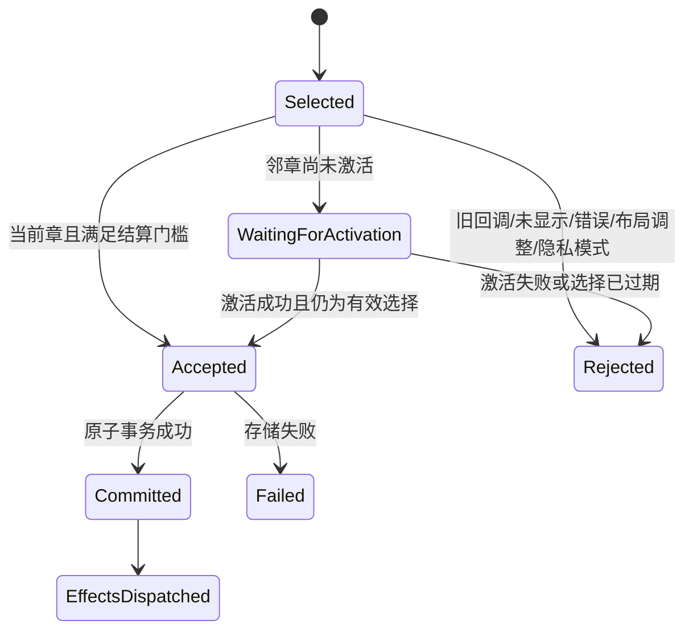

# Android 快速跨章时的阅读进度结算修复设计

日期：2026-09-27。状态：**RP-01 实施中，待独立审查与正式包验收**。本文件定义目标行为和实现约束；自动化转绿不等于原实机问题已验收。

执行计划：[修复 roadmap](roadmap/2026-09-27-android-reader-progress-settlement-roadmap.md)。证据：[诊断报告](evidence/android-reader-tail-settlement-2026-09-27.md)，诊断测试提交 `723512708b`。架构依据：[共享阅读器核心](architecture/reader-shared-core.md)、[阅读器权威与 Fork 偏差](architecture/reader-authority.md)。本修复属于跨平台可靠性在 Android 生命周期适配中的补全，不改写上游行为来源。

## 1. 用户结果、证据与范围

用户操作：Android 实机打开《後日之舞》第四卷 → 快速翻过最后一组页面进入下一卷 → 返回详情。若最后一组已经真实显示并被阅读器接受结算，212 页章节应保存第 212 页并标记已读；下一卷保留自己的阅读位置。

已观察到实机上一卷最后记录为索引 209，即第 210 页，而下一卷已有进度事件。原始日志不足以恢复缺失序号对应的全部渲染回调。自动化进一步证明了一条可产生同类现象的路径：五页最小样本中，末组 3/4 已经触发 `pending.settled=true`，此前写入尚未返回时选择下一章，最终数据库仍为索引 2。16 个不同用例中其余 15 个通过，该回归用例三次执行均为 `expected:<4> but was:<2>`。

本设计修复这条已证实路径，并补齐正常退出时同一写入链的存活保证。不能据此断言实机历史复现一定只经过这一条分支；正式包仍须在原设备、原章节验收。

范围包括 Android 结算受理、跨章写入顺序、正常退出、完成副作用与必要错误反馈。保持现有单页/Webtoon 的结算入口语义、双页渲染门槛、配对算法、翻页方向、history 计时、同步协议及数据库 schema。没有新的阅读设置或按钮，不修复历史上已经缺失且无法证明读完的进度，不自动把 210/212 批量改为已读。

## 2. 当前链路与根因

| 位置 | 当前行为 | 风险 |
| --- | --- | --- |
| `DualPageR2LPagerViewer.reportSettledDualViewport()` | 当前双页组、非布局调整、pager 停稳且两张图显示成功后才回调 | 应保留；不能用源页面 Ready 或进入下一章替代 |
| `ReaderViewModel.onPageSelected()` | 每次选页产生新序号，也用于相邻章激活 | 导航意图会使上一章已经结算但尚未写入的序号过期 |
| `onDualViewportSettled()` | 先设置 settled，再异步等待 `runIfLatest()` | 显示事实已成立，持久化却仍受未来导航控制 |
| `ReaderViewportSettlementArbiter.runIfLatest()` | 拿到事务锁之后只允许最新序号执行 | 队列中合法末页可能被静默丢弃 |
| `updateChapterProgress()` | 写入时再次要求章 ID、activation 和当前窗口一致，并读取 `ReaderChapter.pages` | 单独去掉序号检查仍不能跨章保存；旧窗口释放后页面列表还可能被回收 |
| `launchNonCancellable()` | 先在调用者 scope 启动 IO coroutine，再进入 NonCancellable | scope 先取消、任务尚未启动时不保证写入获得执行机会 |
| 完成/退出副作用 | 完成处理在事务前；跟踪、删除各自另启 coroutine；退出立即清理下载 | 保存失败、延迟完成或快速退出时，可能出现副作用先行或删除排队晚于退出清理 |

目标是把导航的 latest-wins 规则保留在**受理之前**，让已经接受的进度事实拥有独立的持久化生命周期。

## 3. 复用决策

| 现有能力 | 设计决定 |
| --- | --- |
| 共享 `ReaderProgressPolicy` / `ReaderProgressEffect` | 继续作为可见集合、末页、页码和幂等 key 的唯一策略；不另写 Android 完成判定 |
| `RecordReadingProgress` / `ReadingProgressSession` | 继续保存每个 activation 的同步观察快照和会话内事务串行性 |
| `SqlDelightReadingProgressRepository` | 原样复用 reading_events、chapter、同步 journal 的原子事务；不新增表或另一条直接 SQL 写入路径 |
| `ReaderViewportSettlementArbiter` | 保留最新选页/相邻章激活的权限判断；停止用其 latest 检查取消已受理进度 |
| Desktop `enqueueProgressLocked()` | 沿用其“先捕获上下文、依次写入、关闭后排空”的语义，并以已有 Desktop production 测试作为跨端契约对照 |
| `AndroidChapterPairingCoordinator` | 沿用应用级 scope、同步登记 predecessor、完成后清理 tail 的实现模式；不能直接复用其按章节分组的 repository API |
| 两端已消费的 `data/src/testFixtures/kotlin` | 在现有共享测试源码入口定义接受/排空行为契约，由 Android/ Desktop production adapter 执行同一组断言；不新建测试模块 |

拟新增的 `AndroidReaderProgressCoordinator` 是 Android 生命周期/IO adapter，通过现有 `AppModule` 单例注入。其同书跨章排序、Reader 关闭标记与完成副作用不同于双页配对存储，也无法直接调用 Desktop session 私有方法。它不成为第二套进度业务策略。本轮不为少量排队代码抽取通用任务框架，不迁移 Desktop runtime；共享语义通过行为契约及双端生产接线测试验证。

## 4. 受理状态与不可变命令

### 4.1 状态机



`Accepted` 的含义是：资格检查、共享策略计算、不可变输入捕获及队列登记均已完成。它不等于数据库已经保存。进入 Accepted 后，切章、后续选页、viewer 销毁及正常 Reader 关闭都不能把它改成过期请求。

### 4.2 受理时机

所有受理判断在主线程串行处理，与实际章节 activation 发布保持同一顺序。

1. 当前 activation 已可用：真实结算回调中同步检查并登记队列，不能先 `launch` 再等 IO 才决定是否受理。
2. 邻章尚在加载：保留 Pending，不提前提交。activation 完成后切回主线程，再检查选页 token、章/窗口身份、页面列表身份、可见页和错误状态。检查通过后同步受理；新的选页可以取消这类尚未受理的候选。
3. 双页沿用已显示且停稳的 viewer 回调。单页/Webtoon 沿用各自现有入口和错误门槛，进入同一受理/写入链，不借本修复统一改变渲染标准。
4. 仅导航、预加载、布局重排、手动跳章、未渲染末页不产生完成事实。旧 holder/旧 page-list 的迟到回调即使页码相同也必须拒绝。
5. 重复回调只受理一次。双页 pending 的 accepted 标记应在登记成功时设置；不能设置标记后因排队失败留下无写入的“已结算”状态。

### 4.3 命令内容

建议使用不可变 `AcceptedReaderProgress` DTO（命名可随现有代码规范调整），包含：

- Reader 实例标识、manga/chapter ID、接受次序；已校验的 activation/window/page-list 身份仅用于证据，不作为后续当前窗口门禁。
- `ReaderProgressEffect`、接受时刻、隐私及功能偏好快照、原 activation 的 `ReadingProgressSession`。
- 完成处理需要的 domain manga/chapter 元数据、当次有序章节身份及删除策略；不捕获 Activity、viewer、holder、Bitmap、stream、可变 `ReaderPage` 或完整页面列表。
- 向仍存活 Reader 回传结果所需的实例/请求标识。结果回传可以因 UI 过期被丢弃，已受理写入不能因此取消。

`ReaderProgressPolicy.reduce()` 在受理时以当时真实 activeChapterId 执行。写入阶段直接使用 effect，不把当前章节伪造成旧章节，不重新读取旧 chapter 的 pages。

同一 Reader 内维护受理后的逻辑 read 状态：末页被受理后，后续回翻产生的 effect 的 `wasRead` 必须为 true，避免排队期间捕获旧 false，随后把已读覆盖回未读。继续复用共享 effect 的 `isRead` 语义；**lastPageRead 不是最大值**，主动回翻仍保存实际位置。该内存投影不是持久化成功提示，也不得触发下载删除。
`ReaderChapter.read` 的 UI 投影仅在该命令事务成功回执后更新；事务失败时仍保留未读展示，后续回翻的 `wasRead` 则继续取受理态，直到新的有效命令写入。

## 5. 写入通道、顺序与生命周期

### 5.1 应用级所有权

Coordinator 使用可注入、应用持有的 `SupervisorJob + IO dispatcher`，不依赖 `viewModelScope` 或 `lifecycleScope`。`submit()` 同步把命令连接到 predecessor 并返回只读结果句柄；取消调用者等待不得取消已经登记的操作。

接口职责固定如下，具体 Kotlin 命名可在该边界内调整：

| 接口 | 调用与约束 |
| --- | --- |
| `openReader(mangaId)` | 新 Reader 初始化时等待先前接受工作的 barrier，取得独立 handle；旧操作失败应返回可观察结果，不无限等待或伪造成功 |
| `handle.submit(command)` | 非 suspend，同步接受并分配顺序，返回 receipt；封闭的 handle 明确拒绝，不静默丢弃 |
| `receipt.await()` | 只观察本命令的事务/本地副作用结果；等待者取消不传播到 writer；事务结果与副作用结果分开，不能把后者失败报成页码未保存 |
| `handle.close()` | 非 suspend，幂等封闭并登记关闭标记，内部保证清理此前受理工作；不停止其他 Reader handle |
| `awaitAccepted(mangaId)` | 等待调用时已登记的 barrier，供初始化/测试使用；不无限追随后来不断加入的任务 |

队列按 **manga ID** 排序，而不是只按 chapter ID：同一本书的旧章末页与新章页码同时影响续读位置，必须按受理顺序执行。不同书可以独立运行，不在 IO 期间持有全局锁。锁只保护登记、Reader 关闭状态和 tail 清理。不能只靠多个异步 launch 竞争 Mutex 推断受理顺序。

未完成命令仅保存轻量 DTO；完成后清理节点和无引用的队列尾。重复回调不得生成节点；本轮不增加丢弃末页的队列截断/合并策略，也不引入持久任务表、无限重试或后台服务。

```text
受理顺序：A 中间页 → A 末页 → B 首页 → Reader 关闭标记
持久化：  A 中间页 → A 末页 → B 首页 → 完成已登记的本地副作用 → 退出清理
UI：      可以提前进入 B；不会等待 A 的数据库写入才翻页
```

这一点必须让现有回归用例直接转绿：测试在释放旧写入前等待 B 激活，修复不能通过阻塞切章让该用例永远等不到 B。

### 5.2 正常退出与重开

- `onActivityFinish()` 同步停止该 Reader 接受新候选，并只登记一次关闭标记；标记排在已经接受的命令之后。Activity 正常返回无需在主线程阻塞等待。
- `onCleared()` 先幂等封闭 Reader handle，再释放章节窗口；若没有显式 finish，仍让已经登记的工作排空。页面/loader 可按现有规则释放，命令不再读取它们。
- 首次关闭时捕获当前已取消的排队下载对象。关闭标记在先前写入排空后读取已提交章节状态：仍未读（包括进度写入失败或状态查询失败）则恢复该下载，已读则不恢复；之后再执行已登记的下载删除清理。回调只保留下载身份及服务依赖，不持有 Reader/ViewModel/Activity。
- 配置重建仅销毁旧 viewer 时，不等于关闭仍存活的 ViewModel handle；旧 viewer 回调不能继续受理，已登记命令仍继续执行。
- 新 Reader 打开同一本书时，初始化读取章节进度前异步等待先前已接受工作的 barrier，避免用旧数据库状态覆盖刚退出的末页。等待走现有加载状态，不堵塞主线程；这仅用于新 Reader 初始化，不能用于阻塞同 Reader 的正常跨章。显式传入的同步 resume snapshot 仍保持既有观察语义。
- `drain/awaitAccepted` 只用于测试、初始化 barrier 和生命周期收口；不能代替真实窗口关闭、数据库重开测试。

保证限定在应用进程仍存活、存储可用的正常退出/重建。进程被系统终止、force-stop、崩溃或断电前尚未提交的内存命令没有持久保证；不承诺“绝不丢进度”。已经提交的事务必须可由新数据库连接读到。

### 5.3 同步边界

继续用原 activation 的 `ReadingProgressSession` 提交；不得在执行旧命令时改取新章的 session，也不得为了让 snapshot 看起来最新而重开会话、吸收未观察到的远端 heads。隐私许可在受理时捕获，隐私模式中的事件不入队；同步 scope/generation 变化仍由现有仓库门禁决定是否允许上传。

保留现有幂等 key 和同步格式。FIFO 保证本地操作发出顺序，不自动等于改写了跨章节会话的因果快照。必须用现有真实同步存储契约验证 A 末页/B 首页各自字段、原 snapshot 以及 B 的续读结果；如现有同步策略不能满足这些断言，作为接口阻塞处理，不绕过门禁或隐式扩大为同步协议重构。

## 6. 完成副作用与错误处理

### 6.1 提交后执行，始终指向原章节

将 `updateChapterProgressOnComplete()` 的职责拆开：受理时产生逻辑状态，事务成功后再派发跟踪、重复章节标已读和下载删除。依旧复用现有 `TrackChapter`、`UpdateChapter`、`DownloadManager` 及重复章节决策，不另写一套完成规则。

- 完成处理使用命令里的原漫画/章节身份及接受时偏好。执行时不得用 `getCurrentChapter()`、当前页或当前 `chapterToDownload` 代替旧章。
- 延迟的 A 完成不得清掉 B 的 `chapterToDownload`、改变 B 页码或触发 B 的完成。相关 UI/下载状态投影必须核对所属章节及 Reader 实例。
- 删除候选使用原有有序章节关系和 `removeAfterReadSlots` 语义；受理时可依据先前已受理的 read 投影固定候选身份，但事务成功后仍须从持久章节状态确认该候选已读，才交现有持久删除队列。这样 A/B 快速完成不会漏删 A，A 写入失败也不会误删。先 await 本地 enqueue，再运行关闭标记中的 `deletePendingChapters()`，避免退出清理先于新增删除任务。
- Tracker 的网络调用继续交既有 use case 的后台执行，不把网络返回作为下一次阅读进度写入的前提。它的失败不能回滚已保存页码；按现有跟踪语义处理重试，不重复发“完成”。
- 同一命令的重复结果通知不得重复副作用。后续重新阅读产生的新 settlement key 按现有完成语义处理；不引入全局“一个章节一生只能完成一次”的去重规则。

### 6.2 失败语义

| 失败位置 | 必须行为 |
| --- | --- |
| 未激活、失效 callback、未显示或图片错误 | 不受理、不写入、不标已读，不把它当存储错误提示 |
| 队列已封闭 | 不再接受新候选；此前命令继续执行，不把关闭后的回调补成进度 |
| 数据库事务失败 | 命令返回失败，不执行该命令的完成/删除副作用；记录受限诊断，后续独立命令仍可执行，不无限重试 |
| 完成副作用失败 | 保存成功事实不回滚，分别记录对应服务错误；存储事务不因 tracker/下载失败重复提交 |
| UI 已销毁时收到成功/失败 | 不访问旧 Activity，不调用旧 ViewModel scope 来保证持久化，不弹跨页面过期消息 |

仍在显示该 Reader 时，存储失败通过既有 eventFlow → Activity Toast 路径提供一次反馈，建议文案“阅读进度保存失败，请稍后重试”。需补充对应 i18n 资源和真实事件接线测试；不新增弹窗、按钮或持久错误中心。退出后的失败仅记录诊断，下一次打开以真实数据库状态为准，不暗示已保存。

接受时的内存 read 投影不因一次失败而撤销后续已经有效接受的阅读事实；它不能冒充 SQL 成功。后续有效阅读可再次提交，事务失败情形不属于“完整保存已经成功”的验收结论。本轮不增加自动重试；未来若重放同一命令，必须保留其幂等 key，不能靠新 key 重复发完成副作用。

## 7. 行为验收矩阵

以下为实施验收要求，不是本轮已执行结果。所有竞态使用 Deferred/可控 dispatcher/barrier，不靠 sleep 或源码字符串测试。

| ID | 场景与真实入口 | 必须断言 |
| --- | --- | --- |
| T1 | 保留现有 mounted 双页回归：A 末组显示，旧写入阻塞，B 激活，再释放写入 | A 末页/已读/完成事件保存；B 进度独立，原测试不删不跳过 |
| T2 | 等待末页提交后切章；未渲染就切章；错误图片与回退拖动 | 正向仍完成；负向不生成末页或完成事件 |
| T3 | A 末页已受理，立即 finish + 清 ViewModelStore，旧章页面列表回收后释放写入 | 原章仍成功提交；旧 UI 不更新；通过关闭连接后重开文件库验证持久化 |
| T4 | 接受命令后 writer 尚未获得执行机会即清 ViewModel；同书快速重开 | writer 获得执行且可排空；新 Reader 读取在先前 barrier 后；旧写入不能倒盖新进度 |
| T5 | 邻章激活阻塞后回到当前章；过期 holder/page-list；布局或配对重排 | 保留原 stale activation 保护；未受理候选没有进度副作用 |
| T6 | A 末页受理后回翻到较早页，所有写入均暂时排队 | read 保持 true，lastPageRead 为最后真实接受位置；重复回调没有重复事件 |
| T7 | A 完成排队后切 B，B 有下载恢复状态，再退出 | 跟踪/重复章/删除指向 A；不清 B 下载状态；完成入删除队列先于退出清理 |
| T8 | 注入事务失败、随后成功命令、完成副作用失败 | 不误报保存成功、不提前删除、不饿死后续；活跃 UI 只收到对应失败反馈 |
| T9 | 隐私开关、同索引不同章、同步 session/scope 变化、A/B 同书顺序 | 按受理许可和原 snapshot 写入，沿用真实仓库门禁；B 续读不被迟到 A 覆盖 |
| T10 | 实际 AppModule 解析与 ViewModel/Activity wiring | 新依赖可解析；断开生产写入或错误反馈链会使行为测试失败 |
| T11 | 共享 effect 契约及现有 Desktop production 排空用例 | 最大可见页、完成、回翻、幂等及已受理写入不因关闭失效的语义一致；不能只各写一份不同预期 |
| T12 | 原 Android 实机/原书，核对 APK 身份后快速跨章并退出 | 212 页章 `last_page_read=211`、`read=1`、完成事件；下一章位置正确；正常重开后保持 |

T12 另做未加载末页直接跳章的负向对照，记录实际 mode、分组和可见页，不以页数奇偶代替真实双页分组。应分别做连续快速翻页及末组显示后立即切章/返回，各三次；失败保留日志再定位，不通过人为长等待把竞态隐藏。用户数据仅按已授权范围操作，禁止清库或自动修改历史进度。

## 8. 实施落点与不采用的方案

实施差异记录：重复章节的未过滤列表仍沿用旧实现，在进度事务成功后读取；命令在受理时固定漫画 ID、完成章身份和偏好，再由应用级完成适配器读取并执行更新。这样保留原同步会话测试所覆盖的读取时机，且不会把当前已切换章节当作完成目标。该查询的失败只属于完成副作用失败，不回滚已提交页码。

预计修改 Android `ReaderViewModel`、仲裁器、新 progress coordinator/完成 adapter、`AppModule`、Activity 错误事件及 i18n；扩充已有 mounted/VM/同步 tests 和必要共享契约。公共接口/业务策略只有在现有能力不足且有失败契约证明时才调整，不碰正在并行修改的 `ReaderSessionCore` 或 Desktop runtime 以凑本修复。

不采用以下方案：进入下一章就把上一章标已读（会误标跳章）；写入时无条件放行旧 callback（会接受真正过期页面）；只移除 latest 检查（仍受当前章/页列表门禁）；增加固定延时或只在退出补写当前页（依赖时序且已丢旧章上下文）；只扩大 NonCancellable（不能解决入队前失效及启动前取消）；对数据库页码取最大值（破坏回翻恢复）；重放历史缺失事件（缺少真实显示证据）。

实施中若发现必须更改同步协议、schema、跨端 runtime 或渲染门槛，停止该扩展，提交具体失败证据、替代方式和追加成本后再调整计划。上述内容不作为已批准的顺带重构。
