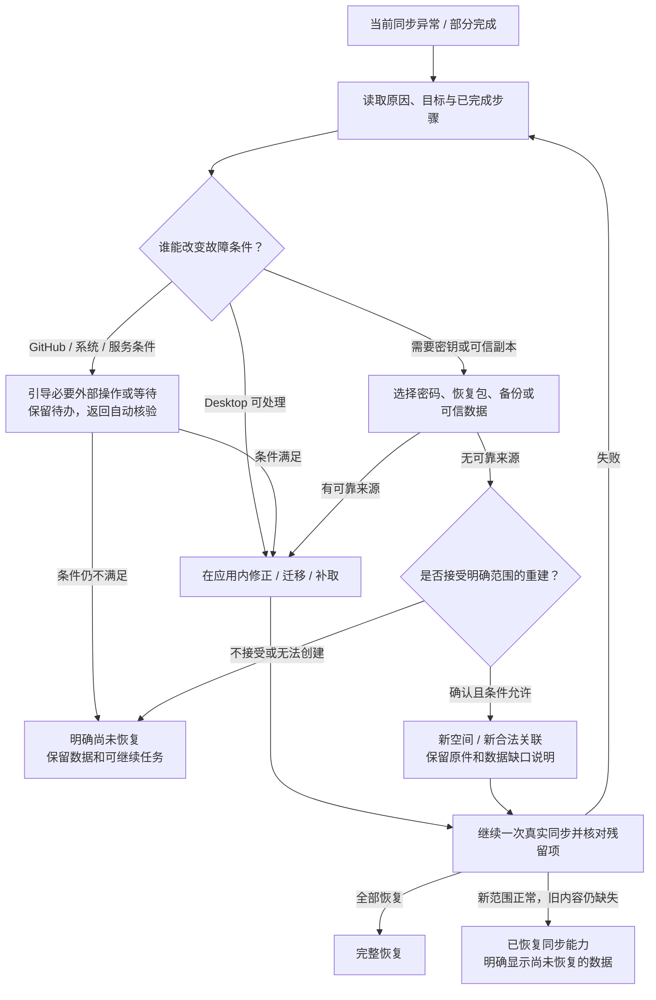

# Mihon Desktop：同步异常能否由用户在应用内解决

日期：2026-10-07。生产源码基线：`4c40566283`（上一提交仅新增异常清单，产品代码仍与 `92d8204ddb` 一致）。

审查输入：[118 项异常、等待与正常状态对照清单](2026-10-07-sync-exception-flow-audit.md)。本次逐项重新判断“有错误提示”是否已经形成“用户能够处理并恢复同步”的路径。这里只记录审查和设计，不表示建议已实现，也不表示完成了实机验收。

审查结果：**69 项缺少完整路径、27 项只有部分路径、14 项已有可追溯处理、8 项是正常行为或分类对照**。需要补齐的 96 项合并为 29 组处理能力；它们共享很多根因，不是 96 个相互独立的 bug。逐项结论见第 5 节，方案与限制见第 4 节。

## 1. 判定标准

**PROJECT_POLICY：Mihon Desktop 必须负责引导用户完成问题处理，直到真实同步验证完成；不能把解释原因、打开日志、联系维护者或退回主页当作解决完成。**

合格路径至少包括：

1. 从发生异常的页面直接进入相应处理，保留当前空间、账号和失败阶段；用户不必自行猜测应该去哪个设置页。
2. 提供能改变故障条件的操作及反馈；已有前置步骤只在事实失效时要求重做。纯“重试”只适合确实可能自行消失的故障。
3. 操作可取消、可恢复；关页、重启、授权返回后仍知道下一步。拒绝授权或主动暂停是用户选择，不能自动越过。
4. 修复后提供“继续同步并验证”，或在此前恢复授权范围内自动继续；完成必须来自真实同步结果，不能只凭 HTTP 200、成功登录或恢复页关闭。
5. 若仍失败，保留新证据并给下一个有效选择，不能回到同一无效按钮循环。
6. 不静默删除本机数据、远端历史、未上传操作或待用户确认事项。重建前说明可保留、无法取回及尚不能确认的范围。

这里严格区分三个问题：

| 判断 | 含义 |
|---|---|
| 能在应用内实现 | 条件由 Desktop 控制，可提供完整操作和验证；不表示当前已实现 |
| 有条件实现 | 还需要可用网络、GitHub 同意/权限、兼容版本、源服务或可信数据副本；条件满足后由 Desktop 接续，条件未满足时不能显示已恢复 |
| 不能保证完整恢复 | 所需信息已永久丢失、第三方拒绝服务或程序本身存在尚无修正版的缺陷；可提供明确等待或保全后的重建，但不能把数据缺失伪装成完整恢复 |

“所有步骤都不离开 Desktop”和“Desktop 负责处理到完成”不是同一承诺。GitHub 身份验证、权限同意、安装恢复等可能仍受 GitHub 控制；本报告明确标为外部前置条件，不把浏览器跳转冒充纯应用内完成，也不因此放弃应用内的进度、返回接续和结果验证。

关闭同步、忽略损坏数据、把失败项移出计数、换空间后显示绿色，都不自动满足本次要求。新空间成功仅证明新范围恢复；旧数据未找回必须保留明确结果。

## 2. 已证实的关键缺口

- **SOURCE：创建新空间仍要求用户手工建仓库。** `PREPARE_REPOSITORY` 打开 GitHub 创建页，随后依靠“我已创建”再次发现；`createOrResume` 校验现有仓库，不创建仓库。
- **SOURCE：错误页的解决入口受可读旧绑定限制。** `canChangeSpace` 要求绑定解码正常、启用、格式支持、凭据可读。存储损坏/未来格式时，关闭危险切换正确，但还需要独立、安全的恢复入口。
- **SOURCE：空间重新检查是只读验证。** `recheckSpace` 成功清除恢复原因，controller 返回主页；用户仍可手动同步，但尚无一个对原问题负责、展示最终验证结果的连续恢复过程。
- **SOURCE：诊断页面主要采集、显示 JSON、导出和打开文件。** 不是数据修复或环境修复工具。
- **SOURCE：部分不可用字段可自动重试，非法批次却没有同等的用户修复入口。** 有的接收失败只留下粗原因并结束该 discovery；需要先保证错误事实可追溯，才能做可靠修复。
- **SOURCE：已有外围能力可复用。** Desktop 有代理与连接测试、扩展安装/启用、作品迁移、备份恢复、更新模块。同步面板还没有携带故障对象进入这些能力并返回验证的完整 wiring。
- **SOURCE：更新模块不能直接视为本 fork 的兼容升级渠道。** `DesktopUpdateScreenModel.releaseArguments` 默认仓库为 `mihonapp/mihon`；更新流程还存在没有兼容包、仅能手工安装等状态。须先核对发布源、协议兼容性及正式包身份。
- **SOURCE：平台前提不同。** Desktop 定时器依赖进程存活，不能照搬 Android WorkManager 的权限/后台限制建议。

## 3. GitHub 操作能否搬进 Desktop

以下按 2026-10-07 打开的官方文档核对。生产请求使用 API `2026-03-10`。没有读取本用户凭据或真实 App 配置，因此**没有证据证明现有安装已授予下列新增权限**；当前代码明确检查的是 Contents write。

| 操作 | 官方接口边界与本项目结论 |
|---|---|
| 创建专用私有仓库 | 当前接口支持 GitHub App token；需 `Repository creation: write` 或 `Administration: write`。可研究采用最小创建权限，让 Desktop 创建并核对结果，不能假定现有 token 可用。[官方创建接口](https://docs.github.com/en/rest/repos/repos#create-a-repository-for-the-authenticated-user) |
| 将新仓库加入安装范围 | 当前文档支持 App token，但需 `GitHub App installation repository access: write`，并要求用户对仓库有管理员权限。可纳入创建事务；上线前须验证真实 App/用户授权组合。[官方安装范围接口](https://docs.github.com/en/rest/apps/installations#add-a-repository-to-an-app-installation) |
| 修改私有性、名称、归档状态 | 更新仓库接口要求 `Administration: write`。可提供用户确认后的原生操作，但应核对目标与权限；不能默默扩大授权或修改其他仓库。[官方更新接口](https://docs.github.com/en/rest/repos/repos#update-a-repository) |
| 恢复被暂停的 App 安装 | 对应接口需要 App JWT，普通用户 token 不够。Desktop 不得内置 App 私钥。是否可由用户在 GitHub 恢复或需 App 管理者处理，取决于暂停主体。[官方恢复安装接口](https://docs.github.com/en/rest/apps/apps#unsuspend-an-app-installation) |

结论：手工创建/维护仓库的一部分负担可以移入 Desktop；但必须完成 App 权限配置、用户同意与真实 API 验证。若不改变当前权限设计，则这些项不能承诺纯应用内处理。个人账号首次安装、接受新增权限、账号恢复也不能由客户端替用户同意。搜索缓存与当前文档有差异时以实际打开的页面为依据，实施前仍以真实接口验证为准。

## 4. 缺少合格路径的处理方案

下列 R01–R29 是需要补齐或接入的处理能力。每个原清单项在第 5 节单独给出判断与方案编号，避免把共享原因重复实现。所有“新增”“应”都是 PROJECT_POLICY/设计建议。

### R01：恢复过程的统一入口、继续和最终验证

- **当前缺口**：跨设置/恢复/诊断页面后，用户仍要判断哪一步成功、接下来点什么；PARTIAL 未统一指向具体剩余任务。
- **合格路径**：异常页 → 一个主操作 → 保留已验证前提的处理步骤 → 继续同步并验证 → 展示完成或尚未处理清单。检查结果绑定账号、仓库 ID、空间代数及凭据版本；这些变化才失效相应步骤。
- **可行性**：应用内可实现。复用共享 panel/controller、recovery observation、run store、scheduler，补上连续恢复上下文；不另造第二套同步引擎。按问题生成步骤，不给所有错误同一组按钮。
- **完成证据**：真实交换完成；未解决的被拒批次、不可用字段、未发布操作和待决定事项可核对。用户明确保留本机等决定可算已处理；仅忽略或排除的条目须另列。新运行结果为 SUCCESS 也不能抹掉旧轮未记录完整的失败。

### R02：网络、代理、TLS 与连接超时

- **当前缺口**：“检查网络后重试”缺少从同步页进入的诊断/修正流程。已有通用代理页显示已保存与实际生效配置，部分改变需重启。
- **合格路径**：“检查连接” → 用 production 客户端分别显示代理握手、TLS、HTTP/业务访问结果 → 携带目标进入已有网络设置 → 应用设置或保存检查点后重启 → 返回原恢复步骤 → 实际同步验证。
- **可行性**：代理地址/模式错误可在应用内处理；断网、代理服务器失效、系统证书/时钟问题有外部条件。没有可用链路时不能恢复在线同步；保留本地使用和可恢复任务，不伪造成功。不把关闭 TLS 验证当修复。
- **复用与验收**：`DesktopNetworkRoutingPort`、`GeneralSettingsScreen` 和 `networkHelper.client`；同步已注入同一 production client。通用 testConnection 成功不能代替带真实同步权限的调用链验证。

### R03：GitHub 服务故障、授权/仓库响应畸形

- **当前缺口**：大多通用重试，没有区分暂时服务异常、响应被中间设备替换、客户端不兼容。
- **合格路径**：有界重试和保存进度 → 判定网络/服务/格式分支 → 网络转 R02；已知兼容问题转 R13；服务问题保留等待任务，恢复后接续验证。持续出现时提供 R29。
- **可行性**：暂态可自动恢复；GitHub 持续故障、缺少修正版时不能承诺当场解决。新建仓库通常不能解决同一个服务端错误，不能作为默认出口。

### R04：授权拒绝、配对码过期、撤销和账号错误

- **当前缺口**：有重新授权能力，但不同原因共用文案；账号不符缺少完整的原账号恢复/新账号迁移选择。
- **合格路径**：拒绝由用户决定是否重来；过期生成新码；撤销重新授权；账号不符展示原/当前账号及“用原账号授权”，另给明确保全后的账号切换流程。完成授权后继续空间与同步验证，不能反复催授权。
- **可行性**：流程可以由 Desktop 承接；GitHub 登录/同意及找回账号不能由 Desktop 代办。新账号路径是新的关联，要保全本机数据并重新获得空间访问权，不能把旧队列直接写到新账号。

### R05：授权、发现和交换阶段的限流

- **当前缺口**：交换已有账号冷却，授权/发现的分类与 UI 不完全一致；可能把权限拒绝也报为限流。
- **合格路径**：依据真实响应区分权限/限流 → 显示冷却期限或“服务尚未允许重试” → 禁止重复请求绕过预算 → 到期重试原步骤 → R01 验证。不能自编一个没有服务端依据的保证恢复时间。
- **可行性**：等待、节流与自动接续可实现；解除 GitHub 限流不由客户端控制。到期仍拒绝时继续明确等待或按新证据处理，不改报成功。

### R06：未安装 App、缺仓库授权、Contents 权限和写权限

- **当前缺口**：主要是说明文字和 GitHub 管理链接；用户需理解用户登录授权、App 安装授权和仓库权限的区别。
- **合格路径**：同一页面逐步列出真实检查结果；先完成必要安装/同意，再由 Desktop 检查并在权限允许时添加目标仓库，补齐可写条件；不可获得旧仓库权限时转 R07。每一步成功立即记忆，返回应用自动检测但不过量轮询。
- **可行性**：部分仓库授权操作可原生化，前提见第 3 节。首次安装、App 请求权限升级和用户无管理员权限属于条件项。不能要求用户粘贴高权限 PAT 作为默认绕行方案。

### R07：仓库删除、无可用空间、同名占用和原仓库被替换

- **当前缺口**：删除与归档混淆；创建依赖手工网页操作；固定 `mihon-sync` 被旧内容占用时，“再建空间”也会失败。
- **合格路径**：“创建新同步空间” → 显示本机可恢复范围并确认 → 选择/生成无冲突的专用名称 → 在权限允许时创建私有空仓库并授予访问 → 读回 repository ID 和属性 → 沿用现有初始化、密码、基线和切换事务 → 完成验证。已经存在的有效新仓库可直接验证加入；同名仓库必须按 ID 视为新对象。
- **可行性**：有条件实现，不能只加按钮。除第 3 节权限外，需要让空仓库选择/创建接收明确目标，不能继续硬编码唯一空仓库名称。保留不相关旧仓库，优先使用新名称，避免要求用户手工改名/清空。
- **数据边界**：恢复本机及用户提供的可信副本；仅在已删除远端的数据无副本则无法完整恢复。其他设备需明确加入新空间；Desktop 不能保证离线设备立即完成迁移。创建响应丢失须读回身份，不能盲目连续创建。

### R08：仓库归档、变为公开

- **当前缺口**：提示用户去 GitHub 修改，没有应用内操作。当前混合文案还会误导已删除仓库的用户。
- **合格路径**：确认实际属性 → 在权限允许时提供“解除归档并继续”或“设为私有并继续” → 明确影响并确认 → API 写后读回 → 检查权限和空间 → 同步验证；拒绝该操作则选择新的私有空间。
- **可行性**：有条件实现，需管理权限。只在属性有证据时提供；不能对 404 执行解除归档。设回私有不等于撤销此前已经发生的公开访问，不能承诺消除历史影响。

### R09：App 安装被暂停、仓库/账号被平台停用

- **当前缺口**：把“到 GitHub 恢复”作为完整方案，没有说明用户是否有恢复权。
- **合格路径**：按暂停/停用主体展示可执行操作与状态 → 有权限的原生/官方恢复流程 → 返回后自动核验；若仅单个空间不可用且平台仍允许创建新目标，可由 R07 恢复可同步数据。
- **可行性**：不能保证纯客户端恢复。App 管理方暂停需要有权主体；平台停用/账号限制可能只能由 GitHub 处理，另建仓库也不一定允许。不能内置 App 私钥，不能把申诉/联系支持标成“已解决”。条件不满足时明确未恢复及可保存的数据。

### R10：首次初始化中断、条件变化、写入结果未确认

- **当前缺口**：底层已有六阶段检查点，但具体失败经常被压成 RETRYABLE，导致重试同一失效前提。
- **合格路径**：“继续准备”先读回尝试归属；同一尝试安全继续；其他设备已完成则验证后加入；仓库身份/空状态变化则进入选择/创建；本地尝试失效先封存检查点再确认另建。legacy 放弃只处理本地记录，不能假称撤销远端写入。
- **可行性**：有条件实现，大量底层能力可复用。必须把 NeedsExplicitAction 的原因传到面板，允许针对原因选择下一步；不强写 ref、不擦除无归属内容。完成以实际连接和同步为准。

### R11：文件/数据库/安全存储不可用

- **当前缺口**：STORAGE 或 UNKNOWN 后通常只有详情/重试；旧绑定读不出来时恰好又不能进入更换空间。
- **合格路径**：提供不依赖损坏同步状态的安全恢复入口 → 区分磁盘空间、路径权限、数据库损坏、系统凭据后端、记录缺失 → 对可丢弃缓存提供有范围的清理；对可读数据先备份，再恢复可信备份或迁移到可写位置 → 校验新数据 → 重新关联并验证。主数据库无法打开时，入口须能在正常 DI/数据库初始化前工作。
- **可行性**：部分可在应用内处理；权限提升、硬盘故障、系统凭据解锁可能需外部处理。Desktop wrapping key 的名字包含目录路径摘要，不能只移动目录就声称修复；迁移需在旧密钥可读时正确重加密/绑定。损坏数据库不能直接删同步表凑可启动。
- **不能保证的情况**：没有可读数据库、没有备份且磁盘/密钥不可恢复，无法找回原信息。只能明确保全现有文件和提供新实例/重新连接；不能静默覆盖原数据。

### R12：忘记密码、密钥丢失、密钥与空间材料不匹配

- **当前缺口**：只支持重输密码；“重新授权”不能解密原空间，普通书库备份也不是同步密钥备份。
- **合格路径**：先核对空间身份与密钥错误，区分密码输入错和材料损坏；有密码则解锁；可新增专用加密恢复包导入/可信设备协助流程，验证空间身份后重新关联；均不可用时提供 R07，明确仅重建可读数据。
- **可行性**：有正确密码/密钥/可信副本时有条件实现。专用恢复包和跨设备协助目前没有对应同步 UI，不能伪装成已有普通备份能力；不得克隆其他设备 actor 或 GitHub token。密钥和明文均永久丢失时，原加密数据不能保证恢复。

### R13：协议、绑定或载荷版本不兼容

- **当前缺口**：“更新到兼容版本”没有验证本 fork 是否真有可用包，也没有升级后回到此问题的链路。
- **合格路径**：读取可验证的协议/版本要求 → 检查本 fork 的可信兼容包 → 下载、验证身份/签名/校验、确认安装 → 保留恢复任务并重启 → 再次核验数据和同步；旧格式只有已实现、可回滚的迁移才执行。
- **可行性**：有兼容包及支持的安装路径时有条件实现。不存在修正版、当前 OS 不支持或只能手工安装时，不能承诺纯应用内解决。另建兼容空间只能基于当前可读数据；不得降级解析未知字段或改写未来格式。

### R14：远端回退、历史丢失、空间文件损坏

- **当前缺口**：检测与阻止写入已有，用户没有可信快照修复/重建入口。反复重试无法解除数据事实冲突。
- **合格路径**：比较远端与已验证记录 → 优先排除缓存损坏并重取 → 有完整可信副本时预览修复范围 → 在新空间/明确设计的新代中重建并验证，再切换；原空间保留用于核对。涉及旧设备重新加入时显示未完成设备状态。
- **可行性**：有副本时可设计完整流程；远端唯一副本已丢失则不能完整恢复。当前没有“安全恢复任意旧 ref/代”的产品能力，优先复用 R07 的独立新空间，不把随意清 guard、force push 或降低校验当解决。

### R15：非法批次、字段、效果组合、因果图或相同 ID 冲突

- **当前缺口**：“拒绝并诊断/由产生端修复”把后续工作交给用户；部分失败缺少可再次定位的记录。
- **合格路径**：持久记录批次身份、校验原因和受影响范围 → 重取以排除传输/缓存问题 → 已知规则且有可信原始状态时重建合法数据，保留异常原件 → 修复导致重复产出错误的本机版本/逻辑 → 验证依赖及同步。无法原位修复时按 R14 重建可信范围。
- **可行性**：已知、可重建的数据有条件实现；未知语义或缺少原始值不能通用自动修复。不可修改已发布事件而继续复用原 ID/密文；也不能假定隔离一条坏记录后所有因果依赖都完整。其他设备持续产出非法数据时，需要兼容检查和重新加入流程，Desktop 不能无依据宣布那些设备已修好。

### R16：长期缺父事件/前置效果

- **当前缺口**：等待依赖正确，但长期缺失没有下一步。
- **合格路径**：列出缺失依赖范围 → 从已验证清单定位并补取 → 重新归约 → 依赖确已不存在则转 R14/R15；保留未能补齐的条目，不能一直显示正常等待或完成。
- **可行性**：依赖仍在可访问远端/可信副本中，可应用内补齐；永久不存在时只能重建可证明的数据，不能补造父事件。

### R17：设备身份、轮次、序号异常或复制身份冲突

- **当前缺口**：只拒绝事件/报告冲突，没有“修复本机同步身份”能力。
- **合格路径**：区分本机持久化问题与其他设备数据 → 备份当前未发布事实 → 按现有 actor/epoch 规则注册新的合法本机身份 → 由可读本机状态生成合法新操作或新空间基线 → 验证无重复写入。涉及已发布冲突时同时走 R15。
- **可行性**：有可靠本机状态和正确实现时有条件实现；不能原地重编号既有事件，不能远程修改另一设备身份。身份修复后仍重现说明代码/存储原因未修复，应停在 R11/R13/R29。

### R18：批次、效果、父引用或载荷超限

- **当前缺口**：“正确拆分/修复产生端”不是用户可执行的应用操作。
- **合格路径**：本机未发布数据由应用按语义与大小重新规划批次；无法拆分的单个字段给用户可理解的编辑/迁移入口；远端不可变坏批次按 R15 重建，并验证所有因果引用。
- **可行性**：合法可拆分数据可以内部处理；无意义超大字段、未知字段语义或父图结构不能靠任意截断修好。放大上限、截断 URL/身份/密文不是合格方案；无法恢复的具体内容必须列明。

### R19：源缺失、禁用、不可安装或已停服

- **当前缺口**：有 unavailable 和后续 retryUnavailable，但未从同步失败项直接找到对应扩展并返回。
- **合格路径**：“修复此源” → 带 source ID 定位已安装/可用扩展 → 启用、验证后安装/更新 → 自动重试受影响项。找不到可用源则进入现有迁移搜索，由用户确认目标，保留原对象与映射证据。
- **可行性**：扩展存在、兼容且源服务可用时可在 Desktop 内完成；签名不可信、插件不兼容、源永久停服时不能保证原源恢复。迁移是用户确认的数据变更，不能悄悄按标题配对或通过忽略字段清零失败数。

### R20：漫画/作者/章节描述缺失

- **当前缺口**：要求“产生端补齐”但不给接续操作。
- **合格路径**：优先重取已验证描述，再用可用源获取匹配身份的元数据；确实允许人工补齐的展示字段可编辑，但不能让用户猜写身份字段。无可靠来源时列出无法恢复项并提供可信备份导入/迁移。
- **可行性**：有合法来源时可实现；没有任何能确定内容的来源时不能完整恢复。补标题不能替代作品/章节身份验证。

### R21：作品、作者、章节身份无法映射

- **当前缺口**：只有 IDENTITY 失败，没有带上下文的匹配/迁移过程。
- **合格路径**：展示原对象、源、可用候选及受影响的阅读记录 → 复用作品迁移/章节数据能力，让用户明确确认映射 → 生成新的有效关联操作 → 重算受影响字段并同步。无候选转可信副本恢复。
- **可行性**：能证实对应关系时可实现；不能仅凭相似标题自动合并。作者身份、章节排序变化和阅读位置要分别验证，不把通用作品迁移误当全部同步字段迁移已实现。

### R22：用户批量决定中的失败项

- **当前缺口**：有成功/跳过/失败计数，失败项被标为 FAILED；“继续批处理”消费尚未处理项，不等于重新处理失败项。
- **合格路径**：结果页列出失败项 → 解释对应存储/身份等原因并进入处理 → 对仍适用的失败项重新确认、建立新的冻结集合 → 仅重试这些项 → 应用后继续同步验证。已成功/已过期项不能再次执行。
- **可行性**：应用内流程可实现；根因仍按 R11/R21 等条件解决。不能把重按全选或再次运行旧 job 作为可靠的失败重试方案。

### R23：普通备份恢复部分失败/取消/损坏

- **当前缺口**：已有备份界面和重试，但同步页没有关联到该恢复结果，也没有保证失败范围已解决。
- **合格路径**：从同步基线问题打开对应恢复结果 → 选择可读备份/处理受影响对象 → 仅让成功恢复单元产生基线 → 继续同步并核对未完成项。坏备份允许另选副本，取消保持用户意图。
- **可行性**：有可用备份和本地写入条件时可复用实现；无任何可信备份时不能恢复原内容。备份不应携带旧设备凭据/actor 作为新设备状态。

### R24：同步阅读位置在本机无法采用

- **当前缺口**：越界会提示并回退到可用页；章节匹配不到时接续位置返回 null，缺少用户选择并确认新位置的同步恢复路径。
- **合格路径**：“选择正确章节/位置” → 先刷新章节或迁移对象 → 用户选择实际页面 → 记录新的用户阅读操作 → 同步确认。旧位置可以查看，不能让自动回退默默冒充用户更正。
- **可行性**：章节和页面仍可用时可在应用内处理；源消失/章节移除要先走 R19/R21。越界位置本身不能保证被重新创造。

### R25：系统等待、自动同步条件与重试耗尽

- **当前缺口**：缺少从等待/耗尽状态按真实原因进行修正的统一入口；不能把所有延迟描述为断网。
- **合格路径**：显示正在等待什么 → 网络转 R02、冷却转 R05、手动暂停只给用户继续、开关关闭可直接开启/立即同步 → 对失败重试先处理原因 → 更新下一次可运行安排并验证。
- **可行性**：配置和运行中的调度恢复可内部实现；应用完全退出、系统休眠或主机离线时不能承诺仍在某个时刻同步。除非另行设计 OS 后台服务，现有进程模型不能满足那个承诺；本审查不增加后台服务实施范围。

### R26：切换空间、过期任务、初始化或统计长时间无推进

- **当前缺口**：已有 PREPARING/ACTIVATING 恢复、CAS 和 owner 保护，但过期意图/持久化失败常落入通用错误；不能仅等待一个永远不再推进的动作。
- **合格路径**：核对正在运行的 owner 和有效检查点 → 活跃操作继续等待；已退出任务安全接管 → PREPARING 可确认取消/重新选择；ACTIVATING 只能按已提交目标恢复 → 根因转 R10/R11。统计无推进先诊断并提供安全暂停/继续，不能重复并行启动。
- **可行性**：暂态抢占/重启通常已有能力；永久目标或检查点损坏需要新增修复设计。不能仅凭超时强解锁活跃任务，不能为了恢复按钮可点而撤销一半激活。

### R27：诊断读取、报告保存、导出失败

- **当前缺口**：主要仍是错误提示；默认输出目录不可写时缺少替代保存位置，失败报告依赖外部打开。
- **合格路径**：保留原故障页与原错误 → 诊断可重新采集，必要时仅显示可读部分并注明缺失 → 应用内查看脱敏报告 → 导出提供可写位置/另存或复制摘要；诊断功能失败不阻断能执行的实际修复。
- **可行性**：内置查看、另存和重试可实现；全部存储都不可写时不能保证文件生成。报告导出成功只是辅助操作成功，恢复仍回 R01，不能用日志作为让用户自行编程的任务单。

### R28：浏览器、复制、外部查看器不可用

- **当前缺口**：有通知/Toast，但失败后替代动作和原任务接续不完整。
- **合格路径**：验证码始终可见，提供复制和手动输入所需信息、选择可用浏览器/重新打开；报告内置阅读，外部查看器只作可选。授权完成后应用主动验证并回到原任务。
- **可行性**：文件阅读可彻底内部化；GitHub 必要授权在没有任何可用浏览器/登录途径时不能保证纯应用内完成。不能收集 GitHub 密码来绕过授权边界。

### R29：未知错误或所有已知方案失败

- **当前缺口**：UNKNOWN 仍可能只有重试/详情；若原因是存储/客户端缺陷，新空间也未必解决。
- **合格路径**：保留阶段与可用证据 → 运行有界的账号、空间、网络、本地存储检查 → 能归类则转对应方案 → 修正版存在转 R13；原空间特定问题可按 R14/R07保全后重建；否则明确“尚未恢复”并保存可继续任务和用户数据。
- **可行性**：完整诊断与下一步引导可实现；任意未知软件缺陷不能保证由预设按钮修好。维护者修复之前，联系支持是问题升级而非合格恢复结果；不能把“总有新建按钮”当作覆盖全部故障。

## 5. 118 项逐一判定

状态：**缺**＝缺可完成的用户处理路径；**部**＝已有部分操作，但该项包含未覆盖的长期/外部/数据恢复分支；**有**＝静态源码可追到现有应用操作与接续，仍受通常网络/存储前提约束；**对照**＝正常行为或仅声明的分类，不另造修复入口。

本表的“有”只表示本次静态审查没有发现必须新增的独立处理路径，不表示真实环境已验证全部情况。缺/部均属于本次需要补齐的清单；R01 统一承接进度和最终验证，不改变用户暂停或取消意图。

### 授权

| 原编号 | 对象 | 状态 | 具体不足或现有路径 | 能否提供合格方案 |
|---|---|---|---|---|
| A01 | 网络/HTTP/设备码申请超时 | 缺 | 只有网络提示/重试，未接修正工具 | 有条件：R02/R03 后验证；真断网不能即时恢复 |
| A02 | 授权响应畸形 | 缺 | 无格式/兼容问题处理入口 | 有条件：R03/R13；无修正版不能保证 |
| A03 | 用户拒绝授权 | 部 | 可重新授权，拒绝原因及接续反馈不足 | R04 可承接；必须由用户改变决定并在 GitHub 同意 |
| A04 | 配对码过期 | 部 | 可重新授权，但未清楚区分过期和其他失败 | R04 可生成新码并接续；授权是外部条件 |
| A05 | 授权限流/403 误分类 | 缺 | 无完整冷却/权限分流 | R05 可实现等待接续；不能主动解除平台限流 |
| A06 | token 撤销/刷新失效 | 部 | 有重新连接，未统一处理到验证完成 | R04/R01；GitHub 同意后可恢复 |
| A07 | 授权待同意/降低轮询频率 | 对照 | 已有等待、降频与过期处理 | 保持现有行为；超时进入 A04，不能强行通过 |
| A08 | 用户取消授权 | 对照 | 取消轮询，保留原连接，可重新发起 | 不应自动恢复或重新授权 |
| A09 | 返回账号不是原账号 | 缺 | 阻止替换，但无完整账号更正/迁移选择 | 有条件：R04；原账号不可访问时只能明确迁移可读数据 |
| A10 | 凭据读写/安全存储/CAS 失败 | 缺 | 存储失败没有用户修复步骤 | 有条件：R11/R26；密钥丢失还需 R12 |
| A11 | 浏览器完成但应用未确认 | 部 | 已有 WAITING/VERIFYING，辅助操作失败缺接续 | R01/R28 可补齐；不能仅凭浏览器页确认成功 |

### 空间发现与仓库

| 原编号 | 对象 | 状态 | 具体不足或现有路径 | 能否提供合格方案 |
|---|---|---|---|---|
| B01 | 未安装 App | 部 | 安装指引要求外部操作 | R06 管理全过程；首次安装不能替用户同意 |
| B02 | 目标仓库未授权/不可见 | 缺 | 无原生授权补齐，也与缺仓库混合 | R06/R07；有额外权限时可内部添加仓库 |
| B03 | Contents 权限不足 | 部 | 打开安装管理，缺自动接续验证 | R06；App 权限配置和用户同意是前提 |
| B04 | App 安装暂停 | 缺 | 未说明有权恢复的主体 | R09；普通 Desktop token 不足以解除全部暂停 |
| B05 | 仓库不可写 | 缺 | 用户自行修正权限，无完整替代流程 | R06，无法取得权限时 R07；均有权限前提 |
| B06a | 原仓库删除/不可访问 | 缺 | 错误归档文案，创建仍在下一层并要手工建仓库 | R07/R06；可恢复同步，远端唯一数据不保证找回 |
| B06b | 仓库归档 | 缺 | 没有解除归档操作 | R08；管理权限不足则 R07 |
| B06c | 仓库停用 | 缺 | “去 GitHub 恢复”未证明用户能操作 | R09；平台停用不能保证由客户端解除 |
| B06d | 同名仓库 ID/owner 已改变 | 缺 | 拒绝旧绑定后无明确新空间确认过程 | R07/R10；安全重绑可实现，不能继承旧身份 |
| B07 | 仓库非私有 | 缺 | 仅要求用户自行设回私有 | R08 或 R07；需权限且不能撤销历史泄露 |
| B08 | 发现时授权失效 | 部 | 有重授权入口，但需完整接续 | R04/R01；有条件 |
| B09 | 发现时限流 | 缺 | 等待和反馈未统一到授权/交换预算 | R05；可实现完整等待流程，不保证平台即时放行 |
| B10 | 临时失败/列表与直查不一致 | 部 | 重试可能解决暂态，持续失败缺排查 | R02/R03；按证据处理，不默认删库重建 |
| B11 | JSON/分页/树结构异常 | 缺 | 停止并给粗错误，无用户修复 | R03/R13/R14；有可靠来源或修正版才可完整恢复 |
| B12 | descriptor/空间格式不兼容 | 缺 | 更新建议未接可信兼容版本 | R13；不能保证未知版本当前可恢复 |
| B13 | 固定名称被其他内容占用 | 缺 | 要求用户改名/迁移旧仓库 | R07 增加明确新名称目标；可实现，勿碰无关内容 |
| B14 | legacy 创建结果不确定 | 部 | 可检查/放弃旧记录，后续仍可能卡在建仓库 | R10/R07；以读回事实决定，不盲目重建 |
| B15 | 账号或仓库身份变化 | 缺 | 无完整原账号恢复/合法迁移引导 | R04/R07；不可默换账号 |
| B16 | 多个有效空间 | 有 | 列表选择后验证、解锁并进入设置/同步 | 保留现有选择；失败转相应分支 |
| B17 | 已证实空仓库 | 对照 | 正常密码设置和初始化入口 | 不是故障，不需要另加修复按钮 |
| B18 | 没有可见空间 | 缺 | 授权与创建仍靠用户理解和网页操作 | R06/R07；权限到位后可原生化 |
| B19 | 改名但 ID/空间不变 | 有 | 重新检查核验身份后更新地址，再从主页同步 | 可复用；R01 可把继续和最终结果集中展示 |

### 密码与初始化

| 原编号 | 对象 | 状态 | 具体不足或现有路径 | 能否提供合格方案 |
|---|---|---|---|---|
| C01 | 密码过长/编码非法 | 有 | 输入页提示并允许修改提交 | 已有应用内路径；不需要新建空间 |
| C02 | 密码错/材料不符/忘记密码 | 部 | 重输可解决输入错，忘记密码/材料损坏没有方案 | R12；无密钥或明文副本不能保证完整恢复 |
| C03 | legacy 设置记录 | 部 | 精确匹配可迁移；不匹配仍需重建流程 | R10/R07；有条件 |
| C04 | 身份/默认分支/空仓库条件变化 | 缺 | 具体前提失效被压成重试 | R10 重新核验与选择；有条件 |
| C05 | bootstrap 写入归属无法确认 | 部 | 有安全读回，但长期无法确认无下一步 | R10；证据不够则明确另选目标，不能强认成功 |
| C06 | 已确认提交/树缺失或被改 | 缺 | 停止后只有粗重试 | R10/R14；需可信副本或明确重建 |
| C07 | ref/分支查询或发布未确认 | 部 | 短暂错误可读回重试，长期失败无分流 | R02/R03/R10；有条件 |
| C08 | 材料、树、权限、私有性等初始化异常 | 缺 | 多种原因折叠，操作无法对应原因 | 分别 R06/R08/R11/R12/R14；不能靠统一重试解决 |
| C09 | 检查点变化/CAS/持久化失败 | 缺 | 未给状态重读和存储恢复路径 | R26/R11；真实存储故障有条件 |
| C10 | 初始化竞争发现别的有效空间 | 部 | 部分可转加入，部分折成 RETRYABLE | R10 显式确认已有空间并验证；可实现 |

### 统计、交换与确认

| 原编号 | 对象 | 状态 | 具体不足或现有路径 | 能否提供合格方案 |
|---|---|---|---|---|
| X01 | 断网/代理/DNS/TLS/超时 | 缺 | 无同步专用环境修复与返回 | R02；网络可用前不能恢复在线同步 |
| X02 | GitHub 5xx | 部 | 有退避，但持续服务错误无准确等待/接续路径 | R03；服务恢复是前提 |
| X03 | 交换限流 | 部 | 冷却已有，原因与期限反馈未完全独立 | R05；不能由 Desktop 解除平台限制 |
| X04 | 401/非限流 403 | 部 | 有复查，但缺按权限细分后的完整处理 | R04/R06；有条件 |
| X05 | 必需仓库/空间数据缺失 | 缺 | 仓库不可访问与数据缺失缺具体修复入口 | 仓库 R07，空间数据 R14；数据完整性有副本前提 |
| X06 | 并发发布/actor 前进冲突 | 部 | 普通重试已有，持续冲突无处理路径 | 先 R26 核验任务/新快照，身份冲突 R17；不覆盖其他设备 |
| X07 | 已发送但发布未确认 | 有 | 保存同一上传产物，读回或恢复重试 | 暂态已有；持续网络/权限错误转 X01/X04，不强增完成数 |
| X08 | 远端历史回退/旧对象改变 | 缺 | guard 阻断，没有可信修复入口 | R14；没有完整副本不能完整恢复 |
| X09 | 快照或 owner 已过期 | 有 | 拒绝过期结果，可重试取得新候选 | 正常竞争已有；持续失败按 R26，不能清除有效保护 |
| X10 | 解密、内容或结构校验失败 | 缺 | 拒绝/粗诊断，没有可完成修复 | R12/R13/R14/R15/R18；按原因有条件，不通用放宽校验 |
| X11 | DB/文件/安全存储失败 | 缺 | 详情/重试不能修复持续故障 | R11；副本、磁盘、权限决定可恢复范围 |
| X12 | 同步中仓库公开 | 缺 | 没有设回私有并继续的操作 | R08；有管理权限时可内部处理 |
| X13 | 未分类异常 | 缺 | 无有界诊断和可证实的下一步 | R29；不能保证任意未知缺陷即时恢复 |

### 协议与数据拒绝

| 原编号 | 对象 | 状态 | 具体不足或现有路径 | 能否提供合格方案 |
|---|---|---|---|---|
| P01 | MALFORMED | 缺 | 拒绝后没有重取/修复数据入口 | R15；有可信原始数据时可重建，否则不保证 |
| P02 | EMPTY_FIELD | 缺 | “让产生端修”不是用户操作 | R15/R20；只能补可证明的内容，不能造 ID |
| P03 | UNKNOWN_PROTOCOL | 缺 | 缺真实兼容升级与返回 | R13；有兼容版本才可恢复原空间 |
| P04 | WRONG_SPACE | 缺 | 拒绝后无绑定/错误输入修复流程 | R26 校验绑定，R14/R15 处理错放数据；有条件 |
| P05 | WRONG_GENERATION | 缺 | 无安全代数恢复或新空间迁移 | R14/R26；不能把旧代事件改个数字继续用 |
| P06 | INVALID_ACTOR | 缺 | 无身份修复入口 | R17；可读本机状态或可信副本是前提 |
| P07 | INVALID_EPOCH | 缺 | 无合法轮次重建入口 | R17；不改写已发布事件 |
| P08 | INVALID_SEQUENCE | 缺 | 无合法新操作重建入口 | R17；原内容丢失不能靠重编号恢复 |
| P09 | INVALID_OBJECT_IDENTITY | 缺 | 要求维护者修映射 | R21/R15；有可靠映射才可修复 |
| P10 | INVALID_CATEGORY | 对照 | 当前仅声明，不直接产出 | 实际走 P01/P24；不虚构独立按钮 |
| P11 | INVALID_EFFECT/父引用超限 | 缺 | 无有效图重建工具 | R18/R15；有条件，不能随意丢父引用 |
| P12 | INVALID_PARENT | 缺 | 无关系恢复入口 | R15；需可信因果事实 |
| P13 | DUPLICATE_EFFECT_ID | 缺 | 无合法新事件重建入口 | R15；不在原事件内擅自改号 |
| P14 | DUPLICATE_PARENT | 缺 | 无完整验证后的重建路径 | R15；已发布事件不可就地改内容 |
| P15 | PARENT_FOREIGN_SPACE | 缺 | 拒绝后用户无法处理 | R14/R15；不能删除引用后假定等价 |
| P16 | PARENT_FOREIGN_GENERATION | 缺 | 无跨代错误恢复流程 | R14/R15；重建可信范围，不混代 |
| P17 | MISSING_PARENT 对应实际 pending | 部 | 枚举不直接产出；长期依赖等待缺下一步 | R16；依赖永久缺失不能保证完整恢复 |
| P18 | MISSING_PARENT_EFFECT | 缺 | 父事件已有却缺目标效果，无修复入口 | R15；不能靠再等同一父事件解决 |
| P19 | CROSS_FIELD_PARENT | 缺 | 没有字段关系重建入口 | R15；需可信来源，不能强连其他字段 |
| P20 | CAUSAL_CYCLE | 缺 | 拒绝环后无用户恢复路径 | R15/R14；不能任意删边宣布修好 |
| P21 | SAME_ID_DIFFERENT_CONTENT | 缺 | 相关记录失效，但无冲突取证和重建流程 | R15/R17；需可信状态，不随机保留一个版本 |
| P22 | UNKNOWN_PAYLOAD_FIELD | 缺 | 只拒绝，未接兼容升级 | R13；未知语义无通用自动修复 |
| P23 | INVALID_PAYLOAD | 缺 | 无带字段上下文的编辑/重建入口 | R15/R20/R21；能证实内容才可恢复 |
| P24 | INVALID_EFFECT_COMBINATION | 缺 | 无合法操作重建入口 | R15；不能通过应用部分效果掩盖 |
| P25 | BATCH_TOO_LARGE/空批次 | 缺 | 没有用户可触发的合法重规划 | R18；本机未发布可处理，远端坏批次需 R15 |
| P26 | TOO_MANY_EFFECTS/无效果 | 缺 | 没有合法组合重建流程 | R18/R15；按语义拆分而非机械截断 |
| P27 | PAYLOAD_TOO_LARGE | 缺 | 仅让产生端修正 | R18；不能截断身份、URL 或密文冒充修复 |

### 应用条目、用户决定与阅读

| 原编号 | 对象 | 状态 | 具体不足或现有路径 | 能否提供合格方案 |
|---|---|---|---|---|
| M01 | SOURCE | 缺 | 扩展功能未与失败项、返回重试相连 | R19；源和兼容扩展可用时可内部完成 |
| M02 | DESCRIPTION | 缺 | 要求其他设备补描述 | R20；有合法来源才可恢复 |
| M03 | IDENTITY | 缺 | 无对象/章节映射修复入口 | R21；有对应关系才可确认 |
| M04 | DEPENDENCY | 部 | 正常等待已有，永久缺失没有下一步 | R16；先补取，确无副本则不能完整恢复 |
| M05 | 批次/事件/认证拒绝 | 缺 | 无完整失败事实和重处理入口 | R15/R12/R14；不能把跳过当应用完成 |
| M06 | 远端取消收藏/关注待决定 | 有 | 列表中确认取消/保留本机，支持批量 | 现有用户决定路径可复用；失败转 M08 |
| M07 | 用户决定已过期/不适用 | 有 | 校验后不套用过期决定，刷新/跳过 | 正常过期已有处理；不重复逼用户确认 |
| M08 | 批量单项 FAILED | 缺 | 继续剩余项不等于重试失败集合 | R22；先解决根因再冻结重试集合 |
| M09 | 普通并发阅读位置 | 对照 | 按策略选择下次位置，不强跳当前阅读 | 无需把正常并发当故障；不可采用位置转 M11 |
| M10 | 备份恢复部分失败/取消 | 部 | 独立恢复能力已有，缺同步结果关联 | R23；无完整副本不能保证完整数据恢复 |
| M11 | 接续章节缺失/页码越界 | 部 | 有回退提示，无确认并同步新位置流程 | R24/R19/R21；页面存在时可内部更正 |

### 暂停、等待和调度

| 原编号 | 对象 | 状态 | 具体不足或现有路径 | 能否提供合格方案 |
|---|---|---|---|---|
| S01 | 用户暂停 | 有 | 继续按钮、冻结计时与持久暂停 | 已有；不得自动越过暂停 |
| S02 | 网络/系统条件不满足 | 部 | Desktop 需具体条件，不能照搬 Android 建议 | R25/R02；离线或主机不运行时不能即时完成 |
| S03 | 持久重试期限未到 | 有 | 期限、冷却和恢复逻辑已有 | 保持；授权/发现的不一致另见 A05/B09/R05 |
| S04 | 网络重试耗尽 | 部 | 可手动重试，但持续故障没有修正入口 | R02/R03/R25/R29；先修因再重试 |
| S05 | 重复触发/任务占用 | 对照 | 合并请求或跳过重复启动 | 正常防重无需修复；失去推进能力转 R26 |
| S06 | 未连接/断开/关闭自动同步 | 有 | 连接、设置开关及手动同步入口 | 原因修正可内部操作；首次授权/建仓库仍走对应条件项 |
| S07 | 进程中断后恢复 | 有 | 重启后恢复持久任务，不覆盖用户暂停 | 已有正常恢复；应用完全退出时不可能依靠该进程执行 |
| S08 | 用户取消/断开/旧轮被替代 | 对照 | 保留已确认事实，主动新起一轮 | 用户意图不是异常，不能偷偷恢复取消任务 |
| S09 | PARTIAL | 缺 | 剩余原因未统一变成可逐项处理的入口 | R01 汇总并转具体 M/X/P 方案；不能仅重算计数 |
| S10 | 统计/估时尚未知 | 对照 | 等待条、计划固定后计时、未知估时省略 | 正常不确定性；真正长期无推进转 R26，不伪造百分比 |

### 切换、本地状态和辅助操作

| 原编号 | 对象 | 状态 | 具体不足或现有路径 | 能否提供合格方案 |
|---|---|---|---|---|
| W01 | 未完成 PREPARING 切换 | 有 | 继续准备/确认取消，重开可续 | 现有检查点路径可复用；具体准备故障走 C/B |
| W02 | ACTIVATING 中断 | 部 | 有恢复，但冻结目标/持久状态坏时无修复入口 | R26/R11；不能强行取消一半激活 |
| W03 | 账号、旧绑定或目标已变化 | 缺 | 通用错误，没有重读/重新确认流程 | R26/R04/R10；按事实重建选择 |
| W04 | 无其他空间/只见旧空间/空目标 | 缺 | 创建仍要求手工建仓库和授权 | R07/R06；有条件 |
| W05 | 保存切换或激活失败 | 缺 | 只有检查点保留，没有存储修复出口 | R11/R26；不可读数据不能无损强切 |
| L01 | 本地存储/系统密钥不可用 | 缺 | 缺安全恢复模式和分类操作 | R11/R12；硬件/密钥永久丢失不能保证完整恢复 |
| L02 | 本地绑定旧/未来格式 | 缺 | 停写正确，但无兼容升级/安全迁移流程 | R13/R11；有兼容实现才可恢复 |
| L03 | 绑定缺失/读取失败/状态矛盾 | 缺 | 无独立于损坏绑定的恢复入口 | R11/R26；从可信记录恢复或保全后重新关联 |
| L04 | CAS/会话/owner 过期 | 有 | 拒绝过期回调/写入，重读或新轮继续 | 正常并发保护已有；持续失败转 C09/W03 |
| L05 | 诊断读取失败/不一致 | 部 | 有重采集，无安全分层排查与修复接续 | R27/R11；诊断坏不应堵住其他可执行修复 |
| L06 | 诊断导出/会话文件写入失败 | 缺 | 缺可写位置选择/内置替代 | R27；所有存储不可写时不能保证导出 |
| L07 | 失败报告生成失败 | 缺 | 提示失败后无可完成的替代查看路径 | R27/R11；内置结果可避免依赖外部报告文件 |
| L08 | 浏览器/剪贴板/查看器失败 | 部 | 只有通知不够完成原操作 | R28；文件查看可内部化，GitHub 授权仍有外部前提 |
| L09 | 可丢弃对象缓存失效 | 有 | 重取并验证；写缓存失败可退化 | 现有自动恢复可复用，真实请求失败转 X；不能据此丢权威数据 |

## 6. 恢复页面契约与成功判定

按 Desktop UI 规范定义本次方案契约，不是将旧 HTML 原型当成已经实现的恢复页面。

| 字段 | PROJECT_POLICY |
|---|---|
| 入口 | 当前同步错误、等待、部分完成或设置失败卡片；保留原页面标题和上下文 |
| 状态 | 检查中、可执行、执行中、等待外部条件、待用户确认、验证同步中、完整恢复、重建后可同步但存在数据缺口、未恢复 |
| 主操作 | 当前能推进的一项；重新检查只在外部条件可能变化时使用。日志/详情不能占据唯一解决入口 |
| 返回/关闭 | 返回上一步或原问题；关闭不丢进度、不假装取消已提交操作。真正取消需明确结果；激活中不能承诺回滚 |
| 局部状态 | 记忆已确认步骤、操作目标、结果、失败原因；凭据/账号/仓库/代数变化后按范围重新验证 |
| 焦点和布局 | 复用当前 Desktop 弹层、原生设置/迁移入口；外部返回恢复焦点，键盘可达，长内容可滚动，不重置输入 |
| 副作用 | 写 GitHub 设置、换空间、迁移/重建、安装扩展/应用都先展示准确目标和影响，再按用户明确操作执行 |
| 验收 | 点击真实按钮 → 执行 production 操作 → 失败分流与重启恢复 → 回到原问题 → 正常同步及残留项核验；按钮只存在或只有 HTTP 测试均不算完成 |

循环必须有预算和状态变化依据；同样失败、没有新条件时转明确未恢复，不能自动无限执行 CHECK → FIX。修复动作成功、创建仓库成功、普通 HTTP 可达、重新检查通过均不是最终 OK 的证据。

## 7. 实施可复用性与真正的产品决策

这是设计可行性结论，不是已授权实施的 roadmap。本轮不新增服务、不修改 GitHub App 配置、不申请权限、不运行故障注入。

| 能力 | 可复用实现 | 必须新增或决定的边界 |
|---|---|---|
| 统一恢复过程 | SyncPanel/Controller、SyncRuntime、recovery observation、run store | 结构化失败原因、恢复步骤状态、实际按钮与验证接续；Android 共享语义，Desktop 外围操作用平台 adapter |
| 原生建仓库/维护仓库 | GitHub HTTP/发现/初始化/持久切换 | App 权限配置和真实授权校验、创建事务、非固定名称目标；不另造同步引擎 |
| 网络修复 | 同一个 networkHelper.client、代理设置、testConnection | 业务链路诊断、携带恢复上下文跳转和重启接续 |
| 源和对象修复 | 扩展列表/安装/启用、迁移搜索、投影重试 | 源 ID/失败对象定位、可信映射、返回后的定向重试；不能把现有迁移当作完整同步修复 |
| 本地/远端数据恢复 | 备份读写、原始持久记录、快照保护、独立新空间 | 无损保全、可信副本验证、损失范围、非法数据重建；这是数据完整性变更，后续需独立审查 |
| 兼容更新 | DesktopUpdateController/Installer | 本 fork 发布源、兼容包身份、签名/安装支持及恢复任务接续；不能只接一个“检查更新”按钮 |
| 诊断和未知错误 | 已有诊断/失败报告 | 内置可理解结果、替代导出路径、按事实生成下一步；支持反馈不得冒充恢复 |

必须明确接受的现实边界：

- 如果要求连 GitHub 登录、首次安装、权限同意都不能离开应用，则当前授权模型不能无条件满足；不能用客户端藏密钥、代替用户同意来实现。
- 如果要求在网络/平台持续不可用时也即时恢复在线同步，则当前 GitHub 单后端无法保证；增加其他后端是独立产品能力，并不能找回只在不可达后端中的唯一数据。
- 如果要求任何数据丢失都无损恢复，则需要事先存在可验证的备份/可信副本和密钥恢复机制。事后增加恢复按钮不能创造已经丢失的信息。

这些边界不免除 Desktop 提供具体处理路线的责任；它们决定最终应显示“已完整恢复”“已恢复同步但有数据缺口”还是“仍待条件满足”，不能统一显示成功。

## 8. 源码与验证依据

本轮按以下入口查阅实际实现；原始异常类型和其余底层依据见前一份清单。

| 依据 | 本轮重点 |
|---|---|
| [共享面板](../presentation-sync/src/commonMain/kotlin/mihon/presentation/sync/SyncPanelContent.kt) | RecoveryPage、SetupErrorActions、PREPARE_REPOSITORY、ErrorRecoveryExit、DiagnosticPage、批量结果 |
| [面板动作](../data/src/commonMain/kotlin/mihon/data/sync/runtime/SyncPanel.kt)、[控制器](../data/src/commonMain/kotlin/mihon/data/sync/runtime/SyncPanelController.kt) | 实际可派发操作、canChangeSpace、authorize/recheckSpace、切换准备/激活 |
| [Runtime](../data/src/commonMain/kotlin/mihon/data/sync/runtime/SyncRuntime.kt)、[设置存储](../data/src/commonMain/kotlin/mihon/data/sync/runtime/SyncSetupStorage.kt) | 只读空间检查、凭据确认、保护旧绑定和切换检查点 |
| [GitHub 空间客户端](../data/src/commonMain/kotlin/mihon/data/sync/auth/GitHubSyncSpaceClient.kt)、[请求选择器](../data/src/commonMain/kotlin/mihon/data/sync/auth/GitHubRepositorySelector.kt) | createOrResume 实际只验证已有仓库，固定空仓库名称，权限与 API 版本 |
| [Desktop DI](../app-desktop/src/main/kotlin/mihon/desktop/di/DesktopAppModule.kt) | SyncRuntime 使用 networkHelper.client、凭据后端及实际目录 |
| [网络设置](../app-desktop/src/main/kotlin/mihon/desktop/ui/settings/GeneralSettingsScreen.kt)、[网络端口](../app-desktop/src/main/kotlin/mihon/desktop/network/DesktopNetworkRoutingPort.kt) | 已保存/生效配置、重启提示、现有连接测试 |
| [Desktop 安全存储](../app-desktop/src/main/kotlin/mihon/desktop/sync/DesktopSyncSecureStore.kt) | wrapping key 与目录身份绑定，不可直接删除/搬目录修复 |
| [收件箱投影](../data/src/commonMain/kotlin/mihon/data/sync/inbox/SyncInboxProjector.kt)、[收件箱 SQL](../data/src/commonMain/sqldelight/tachiyomi/data/sync_inbox.sq) | unavailable 重试、批量 FAILED 与未处理集合的区别 |
| [扩展界面模型](../app-desktop/src/main/kotlin/mihon/desktop/ui/extension/ExtensionsScreenModel.kt)、[安装端口](../app-desktop/src/main/kotlin/mihon/desktop/extension/DesktopExtensionInstallPort.kt)、[迁移搜索](../app-desktop/src/main/kotlin/mihon/desktop/ui/migration/MigrationSearchScreen.kt) | 已有安装/启用/迁移能力，不能从存在这些类推断同步已接入 |
| [备份恢复模型](../app-desktop/src/main/kotlin/mihon/desktop/ui/settings/BackupRestoreScreenModel.kt)、[备份工作流](../app-desktop/src/main/kotlin/mihon/desktop/backup/BackupWorkflow.kt) | 备份预览、取消、重试与部分结果 |
| [更新界面模型](../app-desktop/src/main/kotlin/mihon/desktop/ui/settings/DesktopUpdateScreenModel.kt)、[更新控制器](../app-desktop/src/main/kotlin/mihon/desktop/update/DesktopUpdateController.kt)、[安装器](../app-desktop/src/main/kotlin/mihon/desktop/update/DesktopUpdateInstaller.kt) | 默认发布源、无兼容包、手工安装与身份验证边界 |
| [Desktop 调度器](../app-desktop/src/main/kotlin/mihon/desktop/sync/DesktopSyncScheduler.kt) | 进程内启动/定时/重试，不是 OS 常驻服务 |
| [Desktop UI 规范](design/mihon-desktop-ui/README.md)、[组件事实表](design/mihon-desktop-ui/desktop-reference.md)、[页面契约格式](design/mihon-desktop-ui/page-contracts.md) | 本轮 SOURCE/PROJECT_POLICY 区分、复用、返回与副作用要求 |

验证结果：118 个原编号逐项覆盖且不重复，29 组方案引用与 26 个本地文档/源码链接有效，表格列数与 Mermaid 基本结构检查通过；基本结构检查不等于图形渲染验收。提交前执行 `git diff --check`。本次以一份文档保留逐项可追溯性，虽超过 400 行，但只涉及审查材料和原清单的交叉链接，没有产品行为或数据格式变更。

不运行产品测试、发布构建、真实用户 API 写操作；可行性中的新增权限、恢复包、数据重建和兼容升级均没有在本轮完成实现/实机验证。
