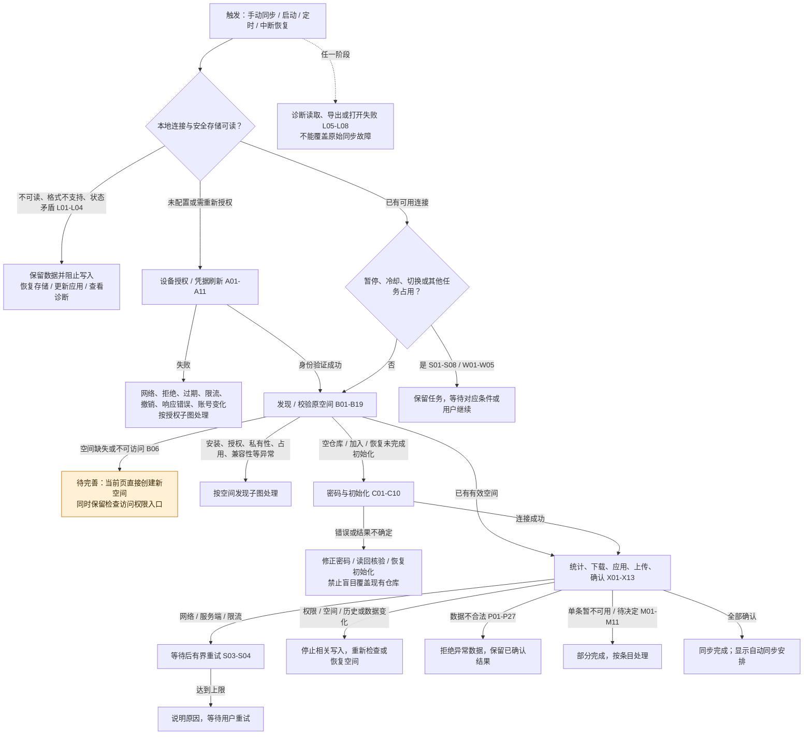
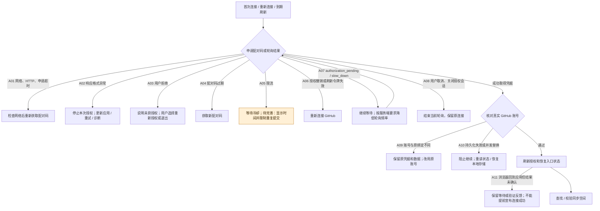
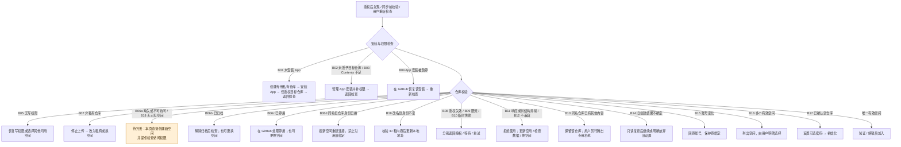
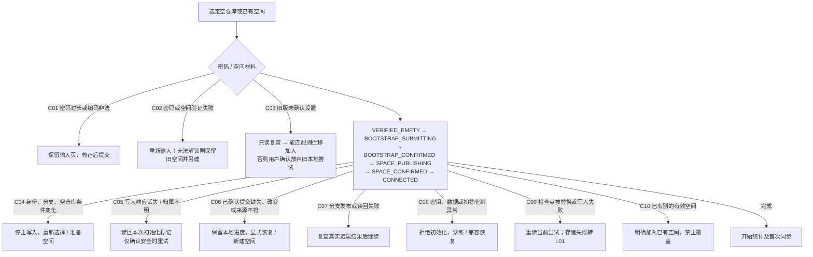
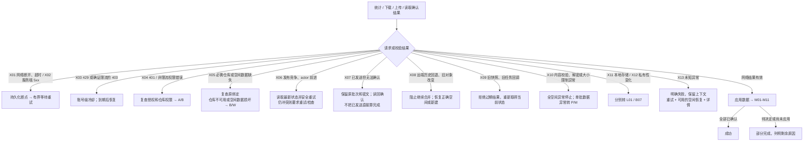
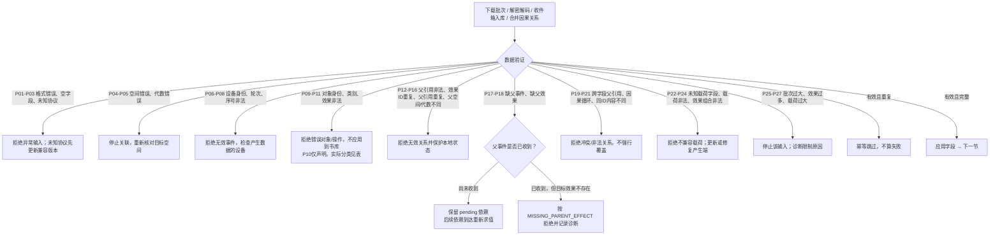
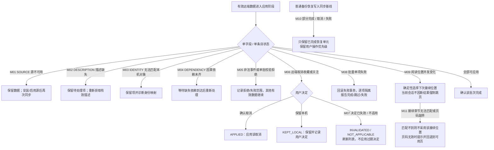
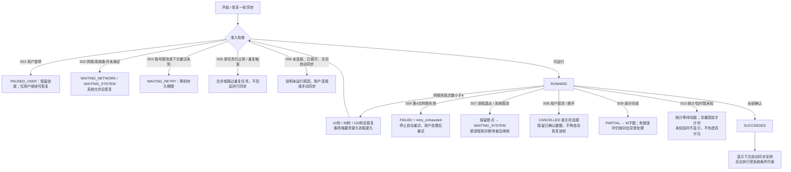
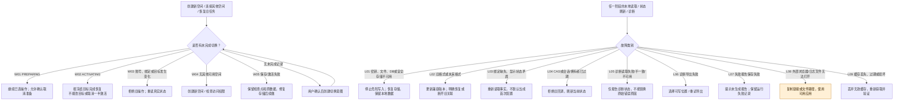
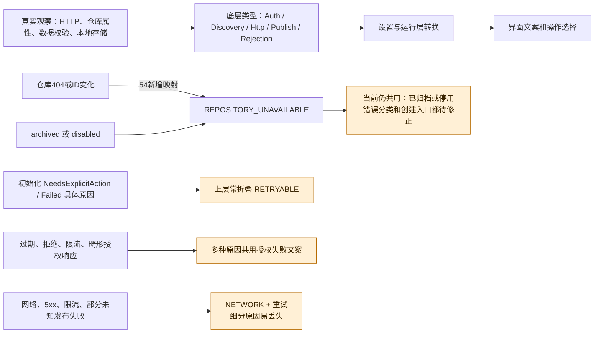

# 多设备同步：异常触发、处理流程与交互缺口

日期：2026-10-07。源码基线：`92d8204ddbbf04ea183492dfdefb65b80b2279c3`，Android 候选 `0.19.4-aex.36 / 54`。

这是源码审阅和交互设计文档，不是已经完成的功能清单。本轮不修改产品代码。

后续审查：[Desktop 能否让用户在应用内处理至同步恢复](2026-10-07-desktop-sync-recovery-closure-review.md)。该审查逐项重评下文应对方案；“查看诊断”“请更新”“到 GitHub 修正”不再单独视为合格解决方案，需以实际操作、恢复接续和最终同步验证收口。

共 10 幅流程图、118 个编号清单项；清单含异常、等待/中断和必要的正常状态对照，不意味着存在 118 种独立故障。异常与恢复状态按 24 组生产枚举核对，另外覆盖初始化字符串原因及平台回调失败。

## 阅读范围与图例

- 范围：GitHub 多设备同步的授权、空间发现、创建/加入、首次合并、上传/下载/确认、数据应用、空间更换、暂停/重启、后台调度、存储和诊断；包括普通备份恢复写入同步基线的接口。
- 不包含追踪网站进度同步、漫画下载和书库更新本身的异常；它们与这里的 GitHub 同步不是同一能力。
- **现状**来自实际 production 分支；**应对方案**是用户应得到的处理路径。标记 **待完善** 的内容尚未在当前 APK 完整实现，不能据图宣称已修复。
- 前九幅图展示异常发生后的处理路线，是否已实现以各表“当前实现”为准；第十幅图展示当前错误转换链路。橙色或“待完善”标注指出已确认的缺口。相同编号在流程图、清单和源码索引间对应。
- “所有”指当前代码明确建模的异常种类、实际分支中的特殊失败、等待/中断/部分完成，以及未分类异常兜底。任意操作系统/第三方库异常按网络、存储或未知归类，不声称穷举 JVM 每一种异常类。
- 检查失败不等于仓库不存在；授权完成不等于仓库可访问；收到数据不等于已经成功应用；暂停、等待和没有变化都不应被报告成失败。

## 1. 总览：异常在什么时候出现

后续图是分阶段异常路由；每个叶节点的具体触发条件、当前行为和处理边界在紧随其后的表中。跨阶段通用故障统一转 X/L/S，不重复假造另一套原因。

## 2. 授权与重新连接 GitHub

| 编号 | 触发时机与异常类型 | 当前实现 | 应对方案与边界 |
|---|---|---|---|
| A01 | 申请设备码、轮询或刷新时断网、DNS/TLS/连接异常、非成功 HTTP；`GitHubAuthFailureReason.HTTP` | 申请设备码有 30 秒超时；等待 5 秒后有网络提示；授权页提供重试。刷新路径另外映射到 X/L | 检查网络后重新申请。不得把网络失败解释为仓库被删 |
| A02 | 设备码/token 缺字段、格式/类型/有效期非法；`MALFORMED_RESPONSE` | 终止授权；与多种其他原因共用授权失败文案 | **待完善**：说明“授权响应无法验证”，可重试、更新应用和查看详情，不能反复要求创建仓库 |
| A03 | GitHub 返回 `access_denied`；`ACCESS_DENIED` | 停止轮询，显示通用授权失败 | **待完善**：明确“你未同意授权”，由用户决定重新授权或退出 |
| A04 | `expired_token`、截止时间到达或轮询边界耗尽；`EXPIRED` | 结束本轮，提供重新授权 | **待完善**：明确配对码过期，获取新码，不复用旧码 |
| A05 | 授权端点 403/429；`RATE_LIMITED` | 授权客户端把 403/429 映射为限流；界面仍是通用失败。此处不等同于同步请求的持久冷却机制 | **待完善**：区分权限拒绝与真正限流，显示等待/冷却，再允许重新申请 |
| A06 | 401、缺少刷新令牌、刷新令牌过期、`bad_refresh_token` / `invalid_grant`；`REVOKED` | 不能自动刷新，进入授权问题处理 | 重新连接 GitHub；保留原空间绑定，验证账号后才替换凭据 |
| A07 | `authorization_pending`、`slow_down` | 继续轮询；slow_down 增加间隔，受截止时间/次数限制 | 等待浏览器授权，不算同步失败，不生成另一轮授权请求 |
| A08 | 用户取消授权、关闭相应会话、授权任务被取消；协程 `CancellationException` | 取消不伪装成授权失败；版本和会话检查阻止旧回调改写新页面 | 返回原页面；再次授权产生新会话。`SyncRecoveryAuthorization.CANCELLED` 与 `FAILED` 必须区分 |
| A09 | 授权返回后 `/user` 身份与已绑定账号不符；`ACCOUNT_CHANGED` | 在替换原凭据之前拒绝；不是仅根据浏览器“成功”页放行 | 使用原账号重新授权；切换账号不能隐式继承旧空间和待上传数据 |
| A10 | 凭据读写失败、版本不符、CAS 并发冲突、安全存储损坏 | `SyncSecureStoreException`，按 L01 处理；旧刷新不能覆盖新授权 | 先恢复存储/重读状态。不得生成替代密钥或清空应用数据 |
| A11 | 授权页显示成功但 App 仍等待 token、核验账号或保存凭据 | 恢复授权状态包含 `CHECKING / WAITING / VERIFYING / CONFIRMED / FAILED`；54 已补授权后刷新恢复入口 | 只有真实验证后显示“授权已确认”；回到 App 不是成功证据。浏览器无法打开时提供复制码/手动打开能力，平台打开失败反馈见 L08 |

正常授权状态 `IDLE`、`CONFIRMED` 不是异常；确认授权后仍需独立确认空间可访问。

## 3. 空间发现、仓库缺失和 GitHub App 权限

| 编号 | 触发时机与类型 | 当前实现 | 应对方案与边界 |
|---|---|---|---|
| B01 | 列举当前账号 App 安装后找不到 Mihon 安装；`NEEDS_INSTALLATION` | 显示创建私有仓库、安装 App、返回检查的步骤 | 按顺序操作；安装授权与设备配对授权是两件事 |
| B02 | 仓库不在安装授权范围，或目标未出现在可见列表；`NEEDS_REPOSITORY_ACCESS` | 创建/授权说明及管理入口；固定仓库 404 也可能落在这里 | **待完善**：分别显示“创建仓库”和“授权已有仓库”，不能推断用户必定没授权 |
| B03 | 安装缺少 Contents write；`NEEDS_CONTENTS_PERMISSION` | 提示更新安装权限，有安装上下文时可管理 | 接受 App 所需 Contents 权限后复查 |
| B04 | 安装记录 `suspended_at` 有值；`INSTALLATION_SUSPENDED` | 阻止使用，提供管理安装路径 | 恢复安装。不能把“App 安装暂停”写成“仓库停用” |
| B05 | 仓库没有所需写入权限；`REPOSITORY_NOT_WRITABLE` | 拒绝初始化/写入，提示权限问题 | 修正仓库/App 权限或选择可写空间；单纯重新登录不保证解决 |
| B06a | 原仓库 404、授权清单没有原 repository ID、访问被拒绝；`SyncRequiredResourceUnavailable(REPOSITORY)` / `SPACE_UNAVAILABLE` | 54 的设置页归为 `REPOSITORY_UNAVAILABLE`，旧主文案仍错误描述“已归档或停用”；创建还在更换空间内 | **待完善，最高优先级**：提示“无法访问原空间”；本页主按钮“创建新同步空间”，次按钮“检查访问权限”，辅助“连接其他空间”。用户确认删除后直接推进创建，不要求恢复已删除仓库 |
| B06b | 已成功取得仓库信息且 `archived=true` | 同一个 `REPOSITORY_UNAVAILABLE` | 此时才提示解除归档；同时允许更换空间。名称仍占用时不能在相同账号再建同名仓库 |
| B06c | 已成功取得仓库信息且 `disabled=true` | 同一个 `REPOSITORY_UNAVAILABLE` | 明确停用，去 GitHub 处理或换空间；不宣称 App 能自行解除停用 |
| B06d | 同名仓库删除后重建、owner/ID 与固定绑定不符 | `verifyRepository` 拒绝，按仓库不可用处理 | 作为新空间重新确认，不能仅凭名称复用旧上传记录/密钥 |
| B07 | `private=false`；`REPOSITORY_NOT_PRIVATE` | 拒绝读写/设置，运行层有同名问题分类 | 提示改为私有或换空间；App 不擅自修改仓库可见性 |
| B08 | 发现阶段 token 无效、401/权限错误；`AUTHORIZATION_REQUIRED` | 返回重新授权或恢复授权流程 | 区分用户授权失效与 B02 App 仓库授权不足 |
| B09 | 发现请求 429、具有限流证据的 403；`RATE_LIMITED` | 分类存在；各阶段提示和等待机制不完全一致 | 遵循服务端冷却时间，不让反复点击“重新检查”绕过限流；见 S03 |
| B10 | 5xx、网络失败、列表/直查结果不一致；`RETRYABLE` | 通用错误及重试；有有效旧绑定时提供更换空间 | **待完善**：显示“检查未完成”，保留上次确定结果；仅作为备选给空间设置入口，不能因此断言仓库被删 |
| B11 | JSON 缺字段/类型错、重复仓库、分页环/超界、错误 SHA、截断树/重复路径等；`MALFORMED` | 拒绝结果；可能归为远端数据校验失败 | 更新应用/稍后复查；持续发生查看诊断。不能根据畸形响应清空原连接 |
| B12 | descriptor 无法解析、旧空间/新版本格式、缺 descriptor 却已有同步数据；`INCOMPATIBLE` | 停止加入，提示兼容问题 | 更新到兼容版本或明确选择新的空间；不覆盖无法识别的数据 |
| B13 | 固定名称 mihon-sync 已被非空、非有效同步空间占用；`NAME_OCCUPIED` | 停止初始化，提示名称占用 | 用户自行保留并改名/迁移旧仓库，再准备空的专用私有仓库；不能自动删除内容 |
| B14 | 旧版创建记录已提交但结果不能确认；`CREATION_UNCONFIRMED` | 只读复查；提供放弃旧设置的确认 | 先查是否已有可加入空间；明确放弃只清旧本地设置记录，不宣称撤销了远端写入 |
| B15 | 发现/恢复账号或仓库身份和原尝试不符；`ACCOUNT_CHANGED` | 阻止错误关联 | 改用原账号；如需其他账号，应先确认断开旧关联再进行新账号设置，不能在恢复过程中暗换账号 |
| B16 | 多个有效空间；`Multiple` / `MULTIPLE_SPACES` | 常规发现显示选择列表；创建中的竞争结果可能以异常返回 | 用户选定一个空间；禁止随机选择、静默切换 |
| B17 | refs、默认分支、根内容等共同确认空仓库；`EmptyRepository` | 进入新空间密码设置；正常状态 | 不把某一次 404 当成空仓库证据；空密码意味着用户选择不设置空间密码，不是错误 |
| B18 | 无可见空间；`NoVisibleSpace` 或 `NeedsRepositoryAccess` | 初次设置给仓库/安装指南；更换流程可显示空列表及创建入口 | **待完善**：对已删旧仓库的用户直接提供创建入口，同时给授权已有仓库的出口 |
| B19 | 原仓库改名但 ID、账号、descriptor/内容仍一致 | 显式重新检查可核验并更新本地地址，保持原空间 | 告知地址已更新后继续；改名不是删除，不应强迫重建 |

授权了多个仓库/所有仓库只产生范围提醒，本身不是同步故障；App 不会擅自缩减 GitHub App 授权范围。

## 4. 密码、首次准备和断点初始化

| 编号 | 触发时机/类型及子情况 | 当前处理 | 应对方案 |
|---|---|---|---|
| C01 | 创建/输入密码时 `SyncPasswordInputIssue.TOO_LONG / INVALID` → `SyncPasswordProblem.TOO_LONG / INVALID`；UTF-8 最多 1024 字节，非法编码拒绝 | 输入页显示错误，可修改 | 明确输入限制，不跳到仓库恢复页，不记录密码 |
| C02 | 解锁已有空间；`IncorrectSyncPassword` / `SyncPasswordProblem.INCORRECT`；底层解锁失败还可能是空间材料不匹配 | 返回可编辑密码页 | 先重输原密码；**待完善**：说明忘记密码无法靠重新授权解密，另建空间只恢复本机仍有的数据 |
| C03 | 发现本地 legacy 创建/加入记录 | 已有加入记录只有精确匹配仓库、descriptor 后才迁移；旧创建不猜测完成 | 复查、加入有效空间或确认放弃本地旧设置。与 B14 对应 |
| C04 | `NeedsExplicitAction`：空间 identity 不符、attempt identity 非法、repository identity 改变、默认分支改变、仓库不再为空、无法继续验证为空 | 底层停止写入；onboarding 复查后常降为 `RETRYABLE` | **待完善**：保留具体原因，指导重新选择/准备正确仓库，不无限重试同一失效前提 |
| C05 | bootstrap 写入返回丢失；`bootstrap ownership could not be confirmed for this attempt` | 先读回匹配本次尝试的 bootstrap；只有仍验证为空时才允许安全补写；归属不明停止 | 告知“准备结果尚未确认”，先重新检查；不再随意创建第二份初始化内容 |
| C06 | confirmed bootstrap commit/tree 缺失、SHA 非法、内容改变；同步分支不是本次空间或不是已确认 bootstrap 的后代 | `NeedsExplicitAction`，保护原数据；上层经常显示笼统重试 | **待完善**：明确“原准备记录与远端不一致”，提供恢复/新建选择 |
| C07 | repository/branch/default branch 查询失败、创建 ref 未确认、ref update 失败；兼容初始化缺默认分支 | `Failed` 或 `NeedsExplicitAction`；写后读回确认，409/422 不直接算成功 | 网络类等待重试；竞争创建则验证并加入现有空间；必要时引导准备仓库 |
| C08 | space material/index key 不可用、初始化树不完整/含无法识别数据、已有同步文件需要恢复、空间不是私有/已归档停用/不可写 | 底层拒绝；部分原因以字符串返回，进入设置后可能丢失细分 | 分流到 L01/B05/B06/B07/B12；保留既有内容，不自动重置 |
| C09 | 本地 setup 已变化、阶段倒退、CAS 失败、密钥/检查点持久化失败 | 拒绝提交旧尝试；安全存储失败转 L01，其余可能转通用错误 | 重读当前记录再继续；不得清掉有效检查点来“修复” |
| C10 | 初始化时另一设备已建立有效空间；descriptor 与本次不同、创建返回 `Existing` 或 `Adopted` | 满足同账号/固定仓库身份等条件时转加入；切换目标变化有额外保护 | 显示将加入的空间，必要时输入其密码；无法证明同一目标时重新选择 |

`Initialized / Adopted` 为成功结果，`NeedsExplicitAction / Failed` 为需要处理的结果。六个初始化阶段是持久化检查点，不应都显示成“同步失败”；不能把“准备中”误说为 App 正在代用户创建 GitHub 仓库，当前仓库创建由用户在 GitHub 完成。

## 5. 统计、上传、下载与结果确认

| 编号 | 类型与触发时机 | 当前处理 | 应对方案/边界 |
|---|---|---|---|
| X01 | 任何网络阶段的 IOException、DNS/代理/TLS/连接中断/超时；`SyncHttpFailureClass.NETWORK` 或可重试 `SyncHttpException` | 多数归为 `SyncRunProblem.NETWORK`，持久断点及自动重试 | 提示网络检查、等待时间和重试；已确认条目保留。此类底层原因目前没有全部独立 UI 类型 |
| X02 | GitHub 5xx；`SERVER` | 归入 NETWORK，受业务重试预算限制 | 显示服务暂不可用，自动等待后继续；不重新创建空间 |
| X03 | 429、限流头/secondary rate/abuse detection 证据；`RATE_LIMITED` | 读取 Retry-After/reset，账号级阻止过早请求；上层仍常显示 NETWORK | **待完善**：明确限流和可重试时间。手动重试不能绕过账号冷却 |
| X04 | 401 或非限流的 403；`AUTHORIZATION` | 执行真实授权/仓库复查；可能落入授权恢复或空间不可用 | 401 重新授权；App 授权不足去管理安装；不要把每个 403 都归为 token 失效 |
| X05 | `SyncRequiredResource.REPOSITORY / SPACE_DATA` 缺失；运行问题 `SPACE_UNAVAILABLE` | 运行后再检查，确认后持久阻止继续；空间数据缺失可转 `SPACE_DATA_INVALID`；复查未完成不写死删除结论 | 原仓库不可用直接给创建/授权选择；空间数据缺失给恢复/连接其他空间。普通可选 ref 404 不自动视为数据丢失 |
| X06 | 更新 ref 的 409/422、其他设备前进、同 actor 数据已变化；发布 `CONFLICT` | 安全更新并读回；发布最多 3 次尝试，仍失败为 `REMOTE_CHANGED`；不能覆盖别人更新 | 获取最新状态后重试，反复冲突查看详情。不要删除仓库解决普通并发 |
| X07 | `SyncPublishStatus.UNCONFIRMED`：上传对象完成但 ref 响应/读回无法证明发布成功 | 保留已冻结的同一上传产物，后续读回/重试；未确认不增加完成数 | 提示正在确认/等待恢复，避免把响应丢失直接当成“未上传”并生成新批次 |
| X08 | 已观测历史回退、旧对象消失/指纹变化；`SyncRemoteSnapshotRejected` | 持久 guard 阻止继续，归 `REMOTE_CHANGED`；不是普通网络重试可解除 | **待完善**：明确历史变化，提供恢复正确远端或新空间；旧空间正确恢复前不循环执行相同写入 |
| X09 | 快照 fence、拥有者或 revision 已过时；`SyncRemoteSnapshotStaleCandidate` | 拒绝旧候选；也归 `REMOTE_CHANGED`，与 X08 同大类 | 应重读当前状态；不要把过期回调错误地提示为不可恢复的数据损坏 |
| X10 | `SyncRemoteDataInvalid`、`SyncCryptoException`、畸形树/descriptor/index/blob、摘要/绑定不符、HTTP body/树深度/文件或索引数等超限；`INVALID_REQUEST / INVALID_DATA` | 关键快照失败停止；单批认证/解码失败可能记录为被拒绝并继续处理其他批次；部分 require 异常落 UNKNOWN | 拒绝可疑数据，保留原始原因；提示兼容性、数据恢复或联系维护者。不能仅改大上限/跳过校验以算成功 |
| X11 | SQL/文件/安全存储失败；`STORAGE` | 安全存储有独立异常；普通未类型化数据库/IO 异常也可能进入 UNKNOWN/NETWORK | **待完善**：区分磁盘/数据库与网络问题，见 L01；不建议清除 App 数据 |
| X12 | 同步中仓库变为公开；`REPOSITORY_NOT_PRIVATE` | 停止相关操作 | 改回私有后复查，或换空间；不自动修改 GitHub 设置 |
| X13 | 其他未分类异常；`SyncRunProblem.UNKNOWN`、`SyncHttpFailureClass.UNKNOWN`、发布 `UNKNOWN` | coordinator 兜底 UNKNOWN；不同来源有的映射 NETWORK，有的通用失败 | 保留阶段、可重试性和诊断；已有可读绑定时提供恢复出口。**待完善**：错误页不能只剩“详情/重试”，也不能把未知问题断言为仓库删除 |

`SyncPublishStatus.PUBLISHED` 才表示发布已确认；`FAILED` 还必须结合 `SyncPublishFailureClass`。完整发布失败分类为 `NETWORK / AUTHORIZATION / RATE_LIMITED / CONFLICT / INVALID_REQUEST / UNKNOWN`。`SyncRunProblem` 八类在 X01–X13 全部列出，但它们是粗分类，不足以直接决定每种文案。

## 6. 协议和数据校验：全部拒绝类型

下列 27 个 `SyncRejectionReason` 是数据验证结果，不能每个都伪装成“网络失败”。单事件拒绝、依赖待补齐和整批失败的处置范围不同。

以下“当前处理”按 codec / reducer / inbox 所在层决定整批拒绝或事件拒绝；没有为每种原因提供独立普通用户按钮。推荐的维护侧修复须保留原事件身份，不直接手改远端生产文件。

| 编号 | 枚举类型 | 触发条件 | 应对方案 |
|---|---|---|---|
| P01 | `MALFORMED` | 事件/批次序列化结构、字段类型等无法解析 | 拒绝，保留诊断；检查产生端版本和数据来源 |
| P02 | `EMPTY_FIELD` | 必填字段为空，或空间/批次/效果 ID 超长；导入事件缺 importId | 拒绝；由产生端修复数据，不能补造身份 |
| P03 | `UNKNOWN_PROTOCOL` | 事件/批次协议版本不支持 | 更新兼容版本；不降级吞掉未知字段 |
| P04 | `WRONG_SPACE` | 事件所属空间不匹配 | 拒绝；核对绑定/重新连接正确空间 |
| P05 | `WRONG_GENERATION` | 空间代数为负或与预期/批次不匹配 | 拒绝；不混入旧代数据，按空间恢复流程处理 |
| P06 | `INVALID_ACTOR` | 设备/actor 标识不合法 | 拒绝；检查产生端身份记录 |
| P07 | `INVALID_EPOCH` | 设备轮次非法 | 拒绝；检查产生端持久化状态 |
| P08 | `INVALID_SEQUENCE` | 事件序号小于等于 0；该枚举不代表批次顺序/连续性验证的全部失败 | 拒绝/诊断相应批次；不能通过更改已有序号绕过 |
| P09 | `INVALID_OBJECT_IDENTITY` | 漫画、作者、章节稳定身份非法 | 拒绝该对象操作；维护者修复产生端映射 |
| P10 | `INVALID_CATEGORY` | 枚举已声明，当前 codec/reducer 未直接产出；未知类别解析归 MALFORMED，类别与效果不匹配归 INVALID_EFFECT_COMBINATION | 按实际产生的 P01/P24 处理；不能把声明等同于已有独立错误分支 |
| P11 | `INVALID_EFFECT` | 当前直接触发于单个效果的父引用数量超限；其他效果错误有各自分类 | 拒绝，不能应用部分非法效果来凑完成数 |
| P12 | `INVALID_PARENT` | 父引用结构不合法 | 拒绝错误因果关系 |
| P13 | `DUPLICATE_EFFECT_ID` | 单事件效果 ID 重复 | 拒绝；不是正常的重复接收 |
| P14 | `DUPLICATE_PARENT` | 父引用重复 | 拒绝；由产生端修复编码 |
| P15 | `PARENT_FOREIGN_SPACE` | 父节点来自其他空间 | 拒绝跨空间关系 |
| P16 | `PARENT_FOREIGN_GENERATION` | 父节点来自其他代数 | 拒绝跨代关系 |
| P17 | `MISSING_PARENT` | 枚举已声明，当前 reducer 未直接产出；父事件未收到时实际加入 pending 集合 | 等待补齐并重新计算；不能立即宣称数据永久损坏 |
| P18 | `MISSING_PARENT_EFFECT` | 父事件已收到且有效，但其中不存在被引用的效果 | 拒绝当前无效事件并记录原因；与 P17 的“尚未收到”严格区分 |
| P19 | `CROSS_FIELD_PARENT` | 父效果不属于同一字段关系 | 拒绝，不把其他字段当作冲突解决依据 |
| P20 | `CAUSAL_CYCLE` | 事件因果关系成环 | 拒绝环及受影响关系；维护侧修复产生端 |
| P21 | `SAME_ID_DIFFERENT_CONTENT` | 相同事件身份出现不同内容，或同一批次重复事件 ID；父事件身份已冲突也会触发 | 拒绝冲突关系；收件箱会失效相关事件及依赖，不能继续把已有冲突记录当作可信结果 |
| P22 | `UNKNOWN_PAYLOAD_FIELD` | 载荷出现协议不认识的字段 | 拒绝；检查版本兼容性 |
| P23 | `INVALID_PAYLOAD` | 值、类型、范围或内容无效 | 拒绝该数据；不能默认设为 0/空来继续 |
| P24 | `INVALID_EFFECT_COMBINATION` | 同一事件的效果组合违反约束 | 拒绝组合，检查产生端逻辑 |
| P25 | `BATCH_TOO_LARGE` | 明文字节超限，或事件数量不在 1–256；空批次也归此类 | 拒绝非法批次；产生端应正确拆分且不发送空批次 |
| P26 | `TOO_MANY_EFFECTS` | 效果数量为 0 或超过协议上限 | 拒绝；修复产生端批处理策略 |
| P27 | `PAYLOAD_TOO_LARGE` | 单个载荷、对象 URL、importId/batchId/contentDigest 等长度超限 | 拒绝；修复异常字段/产生端 |

领域模型 `SyncIngestStatus` 声明了 `ACCEPTED / DUPLICATE / PENDING_DEPENDENCY / REJECTED`，但当前 production 收件箱返回的是 `SyncReceptionResult(accepted, duplicate, error, batch)`，数据库批次状态使用 `RECEIVED / REJECTED`；依赖等待由 reducer/projector 维护，不能把领域枚举误当成实际入库返回值。批次认证失败还可能直接返回无 batch 的 `SyncReceiveResult`，归 X10/M05。绑定已断开或空间不再 active 时也会拒绝入库，归 W03/L04，防止过期同步继续写入。

## 7. 数据已收到但未全部应用、用户确认与备份恢复

| 编号 | 触发时机/类型 | 当前实现 | 应对方案与边界 |
|---|---|---|---|
| M01 | 合并漫画/章节/作者时源不可用；`SyncProjectionUnavailableReason.SOURCE` | 持久记录 unavailable；后续 exchange 执行 `retryUnavailable` | 安装/启用对应源后继续；可查看失败项；不重新下载整个空间来掩盖原因 |
| M02 | 缺少可用于建立本机对象的名称/描述；`DESCRIPTION` | 记录不能应用的字段，保留已接收事实 | 产生端补齐有效对象描述后再同步；**待完善**：向用户区分描述缺失与源缺失 |
| M03 | 作者身份、漫画/章节 key、父对象、页码/时间等无法验证；`IDENTITY` | 不应用错误身份，记录失败项 | 更新/修复映射后重试；不能用相似标题猜测对应对象 |
| M04 | 字段投影有未满足依赖；`DEPENDENCY / PENDING_DEPENDENCY` | 当前字段等待，依赖到达后再计算；不是取消用户数据 | 继续获取前置数据；长期不解消时诊断缺失链，不无限显示正常完成 |
| M05 | 收件箱拒绝单批/事件、crypto 验证失败、非法因果关系 | 结构无效批次可结束该 discovery；非法事件有拒绝记录，不能确认应用完成 | **待完善**：准确报告“哪些数据未应用”；整批无 batch 分支当前信息较粗，不能保证每种拒绝都有独立可见报告 |
| M06 | 远端要求取消本机仍收藏/关注的对象；`DECISION / pending_decision` | 在待确认列表给确认取消/保留本机；其他数据仍可同步 | 用户逐项或批量决定；这不是网络失败。`CONFIRM / KEEP_LOCAL` 是用户决策 |
| M07 | 确认前空间、绑定、heads 已变；`INVALIDATED / NOT_APPLICABLE` | 不套用过期决定，批量可记为跳过；正常结果是 `APPLIED / KEPT_LOCAL` | 刷新最新列表，说明项目已变化；不要求用户重复确认已不适用的操作 |
| M08 | 批处理事务失败、其中一项解析/应用失败；批量 `FAILED` | 整页回滚后逐项隔离，已完成项不重复执行；记录失败数 | 显示成功、跳过、失败并允许处理失败项；暂停/继续批处理不应变成重复全量操作 |
| M09 | 另一设备同步了不同阅读位置/历史；并发 heads | 读取策略按用户事件优先、时间及稳定 tie-break 决定下次位置；数据层消费 nextPosition。策略中的 requiresAdoption 不等同于已接入一套弹窗确认 UI | 通过现有接续阅读入口采用位置；保持当前会话。普通并发不是通用“同步失败” |
| M10 | 普通备份恢复结束为 `SyncRestoreOutcome.PARTIAL / CANCELLED / FAILED` | 单元级事务和幂等记录；已恢复单元可产生低优先级 baseline，未完成不冒充完成 | 在备份恢复界面处理失败，后续同步仅消费有效基线；不克隆其他设备 actor/token/运行状态。`COMPLETED` 正常 |
| M11 | 接续阅读时章节 key 在本机无匹配，或加载实际页列表后发现保存页码越界 | 无匹配章节时 resumePosition 返回 null；Android 发出 SyncResumePageUnavailable 提示，Desktop 设置 resumePageUnavailable 并通知，同时采用可用初始页 | 先恢复/刷新章节映射，或由用户选择实际位置；不能把越界页码当成重新授权/重建空间的理由 |

无头投影 `EMPTY`、正常重复、正常并发归约均非故障。并发收藏/关注加减优先保留添加，并发已读/未读优先保留未读；不是发生冲突就全轮失败。最终 `PARTIAL` 还可能是 `projection_pending`，必须区分“等待用户决定”“等待依赖”“字段无法应用”，不能只报一个无法操作的部分成功。

## 8. 暂停、离线、重试、重启与自动同步

| 编号 | 时机/类型 | 当前行为 | 应对方案/边界 |
|---|---|---|---|
| S01 | 用户暂停同步/首次合并；`PAUSED_USER`，进度 hold `PAUSING / PAUSED` | 持久暂停、停止工作、冻结计时；自动触发不能越过暂停 | “继续同步”；统计未完成时恢复等待动画，传输阶段恢复已有进度 |
| S02 | 无网络、后台约束未满足；`WAITING_NETWORK / WAITING_SYSTEM`，hold `OFFLINE / RECOVERING` | 状态模型支持；Android WorkManager 要求联网，但并非每次离线都显式写 WAITING_NETWORK | **待完善**：根据真实条件显示等待，不能把每个挂起都断言为断网；建议回前台/恢复网络，必要时检查系统后台限制 |
| S03 | 业务重试或账号级限流期限未到；`WAITING_RETRY`，`network / rate_limit`，hold `WAITING` | 持久 deadline；业务退避为 10/30/120 秒，取服务端要求的更大值；手动也尊重账号冷却 | 显示可重试时间并等待，避免按钮不断发送重复请求 |
| S04 | 一轮累计第 4 次网络失败；`FAILED / retry_exhausted` | 不再让定时/启动无限重开同一失败轮次；允许用户主动重试 | 明确“自动重试已停止”，主操作“重试”，辅以原因/诊断；不能把这里当成正常成功 |
| S05 | 手动、启动、定时重叠；同一任务所有权争用、重复点击 | coordinator 合并进行中请求，runtime 准入可返回 `SKIPPED`；过期 owner 不得写结果 | 显示当前任务，禁止重复启动；不是额外失败。待执行为 `QUEUED` |
| S06 | 尚未连接、已断开、自动同步关闭、当前轮不允许恢复 | 可能 `SKIPPED`；关闭定时取消周期任务，但不等于关闭全部手动/恢复能力 | 显示具体条件及开启/连接入口；启动开关与定时开关分别说明 |
| S07 | 系统终止、应用退出、协程被系统取消、进程重启；`WAITING_SYSTEM / process_restart / cancelled` | 持久化队列恢复；不会借启动触发强行恢复用户暂停/阻塞轮次 | 继续已有可恢复任务，恢复前重算易失统计；Android 前台服务提升失败被捕获，不能据此保证后台一定及时执行 |
| S08 | 用户明确取消、断开连接、手动重试取代旧 BLOCKED 轮次；`CANCELLED / user / superseded_by_manual_retry` | 原轮结束/不自动继续，旧结果保留；新轮独立 | 用户明确再开始；取消不撤回已经完成的远端写入 |
| S09 | 已有部分上传/下载成功，或仍有待确认/待应用数据；`SyncRunStatus.PARTIAL` | 无 problem 时运行状态 PARTIAL；有 problem 时仍可能 WAITING_RETRY/BLOCKED | 明确剩余原因并去 M 或 X，不能把“部分传输成功”当成“整轮成功” |
| S10 | 总量未固定、样本不足、估时过期、暂停/断网、额外工作变化 | 统计等待条，计划固定后计时；无估时只显示已用；恢复时不复用无效瞬时估时 | 这是显示不确定性而非错误。若长时间无推进，应保留暂停和详情，不以伪进度掩盖 |

运行状态完整集合：`QUEUED / RUNNING / WAITING_NETWORK / WAITING_RETRY / WAITING_SYSTEM / PAUSED_USER / BLOCKED / SUCCEEDED / PARTIAL / FAILED / CANCELLED`。`BLOCKED` 表示原因处理前不能继续写入，和可自动重试的网络故障不同。运行结果 `SUCCESS / PARTIAL / FAILED / SKIPPED` 与运行状态不是一一对应。

进度 hold 的 `ACTIVE` 表示正常运行，不是异常；另外五种 `PAUSING / PAUSED / OFFLINE / WAITING / RECOVERING` 已分别在 S01–S03 列明。

Desktop 自动调度依赖应用进程运行；Android 交给 WorkManager，可能被网络/系统调度延后。UI 应表达“已安排的时间/条件”，不能承诺一定在某秒开始。

## 9. 更换空间、本地状态与诊断

| 编号 | 触发时机/类型 | 当前行为与应对方案 |
|---|---|---|
| W01 | 已保存新建/连接意图但未完成；`SWITCH_PENDING / PREPARING` | 已有“继续创建/继续连接”；取消需确认且仅限允许取消的准备阶段。关页不等于取消，重开记忆此前选择 |
| W02 | 已确认目标，激活中断；`ACTIVATING` | 按冻结检查点恢复本地激活，不能绕过成新的任意目标；`COMPLETE / CANCELLED` 为终态 |
| W03 | active switch、账号、旧 binding revision、目标 setup 与确认时不一致 | 校验失败阻止执行；**待完善**：把原因从通用重试中分离，提示重新检查当前目标 |
| W04 | 查不到其他空间、只找到原空间、CONNECT 找到未初始化空仓库 | 显示无候选，提供授权和创建；空仓库不能当成已有同步空间加入 |
| W05 | 保存切换、绑定目标、事务或密钥持久化失败 | 保留原连接及冻结目标/检查点，停止交换；修复存储后恢复，不静默删除待上传批次。新空间准备前须告知：只能重建本机仍有的数据，无法恢复只在已删除远端/其他设备上的内容 |
| L01 | `SyncSecureStoreException`、存储/密钥解密失败、丢失 wrapping key、文件权限/空间/数据库事务错误 | 安全存储按 STORAGE，普通异常可能 UNKNOWN/NETWORK；保护原记录。Android 使用 Keystore，Desktop 使用系统凭据后端。**待完善**：明确存储修复方向，不能让“重试 GitHub 授权”成为唯一出口 |
| L02 | `UnsupportedSyncSpace`、binding `UNSUPPORTED`、旧/未来版本记录 | 阻止误读误写；升级到兼容版本或经过明确恢复/断开确认处理。不能默默用新格式覆盖旧密钥 |
| L03 | binding `MISSING / READ_FAILED / UNKNOWN`，数据库有连接但密钥记录缺失，状态互相矛盾 | 有正式事实读取与诊断；**待完善**：区分真正未配置与读取失败，不因一次读取失败显示“创建新空间”并覆盖旧关系 |
| L04 | 凭据/连接/setup CAS 冲突、页面会话已结束、授权版本变化、run owner 过期 | 忽略过期回调或拒绝旧写入；重读当前事实。正常防重不应向用户显示未知崩溃 |
| L05 | `SyncDiagnosticStatus.READ_FAILED / INCONSISTENT / UNAVAILABLE`，反馈 `READ_FAILED / INCONSISTENT` | 展示诊断读取/一致性问题；`OK / CAPTURED` 正常。重新采集；不能据诊断缺失断言仓库不存在 |
| L06 | 导出诊断或开始/结束诊断会话无法写文件；`SyncDiagnosticFeedback.SAVE_FAILED` | 提示导出/保存失败；恢复写入位置后再导出。`EXPORTED / SESSION_STARTED / SESSION_ENDED` 正常 |
| L07 | 本轮字段失败报告生成失败；`SyncFailureLogStatus.SaveFailed` | 有独立保存失败反馈；`Ready` 才能打开报告。重试生成，不抹除原同步失败 |
| L08 | 浏览器/剪贴板/分享查看器/打开日志能力不可用或失败 | Android 浏览器失败弹 Toast，Desktop 通知未知错误；两端复制/打开报告也有失败反馈，未形成统一可恢复状态。**待完善**：在当前页给复制链接/码、文件位置和重试打开，不能仅靠短暂通知 |
| L09 | 持久 Git 对象缓存缺失/损坏、过期标记或写入失败 | 缓存为可丢弃优化，读取失效时重取并验证；实际请求失败再转 X，权威数据库/密钥失败不能按缓存丢弃。通常自动恢复，无需用户清空全部应用；必要时说明重新检查可能变慢 |

## 10. 错误分类在各层如何丢失，以及当前必须补齐的设计

| 优先级 | 缺口 | 应落地的设计要求（尚未实现承诺） |
|---|---|---|
| P0 | 删除/不可访问/归档/停用混用一个文案 | 保留检查证据，拆分原因；无法确定时说“无法访问”。缺失场景当前页直接“创建新同步空间”，同时保留权限检查和连接其他空间 |
| P0 | 有效的解决路径藏在更换空间下一层，或被 canChangeSpace 限制吞掉 | 逐一覆盖已有绑定、首次配置、断开后重连、无凭据后授权成功、无可见仓库；存储不可读时提供安全诊断/恢复，不能直接强行开新绑定 |
| P1 | 初始化的具体失败被降为 RETRYABLE | 保留结构化原因和阶段：重试可解、用户必须改条件、需要选择已有空间三类分别给动作 |
| P1 | GitHub 用户授权、App 安装授权、仓库可用性混为“授权” | 三项独立检查和记忆；已确认步骤显示结果/时间，不持续催用户重复授权 |
| P1 | 授权限流、网络、失效等共用文案 | 准确原因 + 一个主操作 + 可执行的备选；限流显示冷却，过期获取新码，拒绝由用户决定是否重试 |
| P1 | PARTIAL、批次拒绝和字段不可用反馈过粗 | 分清待用户决定、依赖未齐、源不可用、描述/身份错误、校验拒绝，并能定位到受影响条目；其他已确认数据不重做 |
| P2 | 自动同步时间和系统等待容易被理解成精确承诺 | 显示“计划时间 + 等待条件”；取消、暂停、失败和正常空同步分别呈现 |
| P2 | 导出/浏览器打开失败覆盖原错误或没有反馈 | 保持原始故障可见；辅助工具失败只影响自己的操作，提供替代入口 |

统一页面规则（设计建议）：主标题只陈述已证实事实；主操作应推进当前最可能有效的下一步；“重新检查”是验证外部改变的辅助操作；危险的换空间/放弃记录须说明保留范围并确认；未知原因仍须有可用出口，但不能通过跳过身份/数据校验放行。

## 11. 源码索引与覆盖边界

以下均为本次已读取的生产文件；它们是清单和图的依据，历史 roadmap/HTML DEMO 不作为当前实现证据。

| 覆盖编号 | 生产依据 |
|---|---|
| A | [授权模型](../domain/src/commonMain/kotlin/mihon/domain/sync/auth/SyncAuth.kt)、[设备授权与刷新](../data/src/commonMain/kotlin/mihon/data/sync/auth/GitHubAuthClient.kt)、[凭据存储](../data/src/commonMain/kotlin/mihon/data/sync/auth/PersistentGitHubCredentialStore.kt)、[Runtime 身份确认](../data/src/commonMain/kotlin/mihon/data/sync/runtime/SyncRuntime.kt) |
| B | [空间发现](../data/src/commonMain/kotlin/mihon/data/sync/auth/GitHubSyncSpaceClient.kt)、[仓库选择/HTTP](../data/src/commonMain/kotlin/mihon/data/sync/auth/GitHubRepositorySelector.kt)、[仓库校验](../data/src/commonMain/kotlin/mihon/data/sync/runtime/SyncOnboarding.kt) |
| C | [初始化检查点](../domain/src/commonMain/kotlin/mihon/domain/sync/transport/SyncTransport.kt)、[初始化实现](../data/src/commonMain/kotlin/mihon/data/sync/transport/GitHubGitDatabaseClient.kt)、[密码](../data/src/commonMain/kotlin/mihon/data/sync/crypto/SyncSpaceCrypto.kt)、[Onboarding](../data/src/commonMain/kotlin/mihon/data/sync/runtime/SyncOnboarding.kt) |
| X | [HTTP](../data/src/commonMain/kotlin/mihon/data/sync/http/SyncHttpClient.kt)、[发布/读回](../data/src/commonMain/kotlin/mihon/data/sync/transport/GitHubGitDatabaseClient.kt)、[交换与异常映射](../data/src/commonMain/kotlin/mihon/data/sync/runtime/SyncDatabaseExchange.kt)、[快照保护](../data/src/commonMain/kotlin/mihon/data/sync/transport/SyncRemoteSnapshotGuard.kt)、[批次认证](../data/src/commonMain/kotlin/mihon/data/sync/transport/SyncBatchSyncService.kt) |
| P | [协议全部拒绝类型](../domain/src/commonMain/kotlin/mihon/domain/sync/SyncProtocol.kt)、[编解码校验](../domain/src/commonMain/kotlin/mihon/domain/sync/SyncCodec.kt)、[因果归约](../domain/src/commonMain/kotlin/mihon/domain/sync/SyncReducer.kt)、[收件箱](../data/src/commonMain/kotlin/mihon/data/sync/inbox/SyncInboxStore.kt)、[归约应用](../data/src/commonMain/kotlin/mihon/data/sync/inbox/SyncInboxProjector.kt) |
| M | [字段应用](../data/src/commonMain/kotlin/mihon/data/sync/projection/SyncRemoteProjectionWriter.kt)、[待确认/批处理](../data/src/commonMain/kotlin/mihon/data/sync/inbox/SyncInboxProjector.kt)、[阅读位置选择](../domain/src/commonMain/kotlin/mihon/domain/sync/SyncReadingPolicy.kt)、[接续数据读取](../data/src/commonMain/kotlin/tachiyomi/data/reader/SqlDelightReadingProgressRepository.kt)、[Android 接续页检查](../app/src/main/java/eu/kanade/tachiyomi/ui/reader/ReaderViewModel.kt)、[Desktop 接续页检查](../app-desktop/src/main/kotlin/mihon/desktop/ui/reader/ReaderScreenModel.kt)、[备份基线](../data/src/commonMain/kotlin/mihon/data/sync/journal/SyncBackupRestorer.kt) |
| S | [调度器协调](../domain/src/commonMain/kotlin/mihon/domain/sync/runtime/SyncCoordinator.kt)、[业务预算/恢复](../data/src/commonMain/kotlin/mihon/data/sync/runtime/SyncRuntime.kt)、[运行存储](../data/src/commonMain/kotlin/mihon/data/sync/runtime/SyncRunStore.kt)、[进度事实](../data/src/commonMain/kotlin/mihon/data/sync/runtime/SyncProgressTimeline.kt)、[Android 调度](../app/src/main/java/eu/kanade/tachiyomi/data/sync/AndroidSyncScheduler.kt)、[Android Worker](../app/src/main/java/eu/kanade/tachiyomi/data/sync/SyncWorker.kt)、[Desktop 调度](../app-desktop/src/main/kotlin/mihon/desktop/sync/DesktopSyncScheduler.kt) |
| W/L | [持久设置/切换](../data/src/commonMain/kotlin/mihon/data/sync/runtime/SyncSetupStorage.kt)、[运行恢复](../data/src/commonMain/kotlin/mihon/data/sync/runtime/SyncRuntime.kt)、[诊断模型](../data/src/commonMain/kotlin/mihon/data/sync/runtime/SyncDiagnostics.kt)、[失败报告](../data/src/commonMain/kotlin/mihon/data/sync/runtime/SyncFailureReportStore.kt)、[缓存](../data/src/commonMain/kotlin/mihon/data/sync/transport/SyncPersistentGitObjectCache.kt)、[Android 密钥存储](../app/src/main/java/eu/kanade/tachiyomi/data/sync/AndroidSyncSecureStore.kt)、[Desktop 密钥存储](../app-desktop/src/main/kotlin/mihon/desktop/sync/DesktopSyncSecureStore.kt) |
| 文案/按钮/跨层转换 | [共享面板](../presentation-sync/src/commonMain/kotlin/mihon/presentation/sync/SyncPanelContent.kt)、[控制器](../data/src/commonMain/kotlin/mihon/data/sync/runtime/SyncPanelController.kt)、[面板模型](../data/src/commonMain/kotlin/mihon/data/sync/runtime/SyncPanel.kt)、[中文资源](../i18n/src/commonMain/moko-resources/zh-rCN/strings.xml) |
| 平台辅助操作 | [Android 外部操作](../app/src/main/java/eu/kanade/tachiyomi/data/sync/AndroidSyncPanel.kt)、[Android 浏览器反馈](../app/src/main/java/eu/kanade/tachiyomi/util/system/ContextExtensions.kt)、[Desktop 外部操作](../app-desktop/src/main/kotlin/mihon/desktop/sync/DesktopSyncPanel.kt)、[Desktop 诊断打开](../app-desktop/src/main/kotlin/mihon/desktop/sync/DesktopSyncDiagnosticOpener.kt) |

本轮验证为静态源码核对、24 组显式异常/恢复枚举覆盖检查、50 个源码链接有效性、表格列数和 Mermaid 图结构检查；图结构检查不等同于渲染验收。不执行产品测试或真实 GitHub 故障注入，某条分支在文档中出现不代表该故障已在实机复现。后续实施应从上表 P0/P1 独立拆分可验收批次，并为跨层状态和实际按钮路径加入对应回归，不能只验证枚举值存在。
