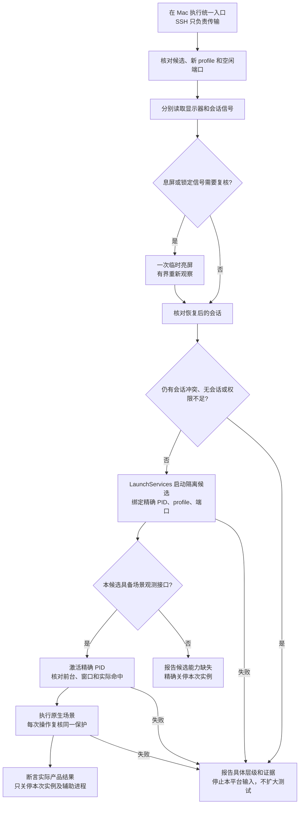

# macOS 正式应用验收经验与维护约束

更新日期：2026-10-06。

本文汇总 Mihon Desktop 在 Mac 上的正式运行、安全存储、窗口和原生输入验收经验。适用于本机执行及可用的远程执行入口；SSH 只是传输和执行工具，不是验收前提。一般操作和接口分别见 [Test Guide](TEST_GUIDE.md) 与 [API Reference](API_REFERENCE.md)。执行预算、TDD、构建入口和提交要求仍遵循项目 [AGENTS.md](../../AGENTS.md)；本文不授权额外全量测试、提前发布、系统权限修改或真实账号写入。

## 使用者必须维护本文

后续 Agent 在任务中采用本文经验时，必须遵守以下规则：

1. 使用前核对当前源码、脚本、候选及系统环境，不把历史路径、PID、端口或结果当作本轮事实。
2. 如果发现新的可复用经验、现有步骤失效、新的适用边界，或已有结论被证据否定，必须在本次任务收口或交接前更新本文，不能只写在聊天或临时日志中。没有新发现时无需制造更新。
3. 更新相应章节，并在末尾经验记录中说明日期、环境与候选、观察、证据、结论及限制。未证实原因明确标为待验证；不把单次观察升级成普遍机制结论。
4. 替代旧结论时保留必要的失败背景，说明为何修订；通用维护经验写在本文，任务通过/失败与剩余门槛仍写在该任务唯一 roadmap 或证据记录，本文不能代替 checkoff。
5. 新增流程与 Test Guide/API Reference 保持一致；接口行为改变时更新相应参考，避免维护互相矛盾的命令。只做必要局部修改，不建立额外状态系统或逐次运行报告。
6. 不写密码、令牌、账号稳定标识、授权链接或真实数据；只保留可复核且脱敏的必要证据。纯文档更新检查 UTF-8、链接与 diff 后按项目规则提交；实际代码变化继续遵守其验证和审查要求。

## 1. 先确认目标，再执行

### 统一原生验收入口

当前状态（2026-10-06）：统一入口已在真实 macOS 14.8.4 / Python 3.9.6 经 SSH 连续完成两个全新 profile 的 `sync-main` 原生验收及精确关停。第一轮从自然息屏、锁定标志为 true、前台为 loginwindow 自动恢复，无需认证或人工置前台；第二轮由主代理独立执行。19 项脚本回归通过。使用本轮官方 preview 候选 `0.11.19.73.1f5a0b8`，不是缺少 `/test/sync/ui` 的旧 75 包。已关闭此次息屏误判、SSH 启动/前台观察和候选能力误分类的流程缺口；其他功能、密码页、Keychain 和视觉仍按各自范围验收。此前失败保留在[实施证据](../evidence/testing-workflow-rollout-2026-10-06.md)。

在 Mac 本机运行下列命令；Windows Agent 使用已配置的 SSH 入口传输并执行同一命令。SSH 是传输通道，应用仍由 Mac 的 LaunchServices 在桌面会话启动。不要在 SSH 中直接运行 `Contents/MacOS` 可执行文件代替此路径。

```bash
python3 scripts/mac-acceptance.py \
  --app '/absolute/path/to/isolated/Mihon Desktop.app' \
  --profile '/absolute/path/to/new-profile' \
  --http-port 59463 --jmx-port 59464 \
  --output '/absolute/path/to/mac-acceptance.json'
```

路径和端口必须换成本次已核对的值。默认 `sync-main` 场景复用生产同步入口，要求候选具备 `/test/sync/ui`，使用全新、未连接的 profile。报告分别记录环境准备、启动、目标身份、原生场景和关停；通过表示这条小范围真实原生路径可执行，不表示任意页面、密码输入、Keychain 或发布矩阵通过。其他功能场景应复用同一会话保护，并补自己的实际入口与结果断言。



只读预检保持只读，因此它可能报告待亮屏或待核对窗口；统一入口负责完成这些后续动作，Agent 不应停在预检的 `NOT_RUN` 上。入口最多进行一次临时亮屏恢复，不修改系统设置、不输入解锁材料、不循环等待用户。恢复后仍存在锁定信号则停止输入，报告残留信号或会话冲突及原始证据，不直接归因为用户锁屏；缺失锁定字段保留为未知，结合精确目标前台、窗口、输入权限和实际命中判断该目标是否可以操作，不虚构“系统已经解锁”的结论。

### 后续任务如何使用与收口

只有本次范围需要 Mac 原生验收时才执行该入口；文案、文档和其他平台变更不因此增加一轮 Mac 验收。当前 `sync-main` 是已实现的场景，不是全应用测试。新功能需要不同用户路径时，在现有入口增加最小场景，复用启动、身份确认、会话保护和清理，场景只负责实际输入与产品断言；不另起一套 SSH/锁屏诊断。功能候选必须与本次代码匹配，只有验收工具自身的维护才可以用明确标注来源的旧包作运行夹具。

| 当前观察 | 自动处理与结论 | 不能据此推断 |
|---|---|---|
| 显示器息屏，锁定标志为 true | 一次临时亮屏，等待同一次有界恢复，记录前后信号；随后核对精确候选 | 用户必须解锁、SSH 无法 GUI |
| 亮屏后锁定字段缺失 | 保留字段未知；原生动作前核对当前前台 PID、窗口焦点和 AX 命中 | 字段缺失本身证明已解锁或窗口可操作 |
| 前台观察仍是旧 PID | 刷新观察，并在固定激活窗口内等待目标前台、焦点与命中就绪 | 立即要求人工置前台、重建应用 |
| 目标 HTTP 已启动，但场景接口返回 404 | 报告候选缺少场景能力；停止该场景，精确关停已绑定实例，改用具备接口的本轮候选 | 锁屏、网络断开或产品业务断言失败 |
| 本场景未使用的 JMX 端口没有监听 | 按实际场景需要判断；绑定身份依赖精确命令行与本场景 HTTP 监听者 | 未使用的服务未启动就代表 GUI 不可用 |
| 恢复后仍有锁定信号、权限不足或目标不匹配 | 停止输入，记录具体证据和对应恢复条件；不重复恢复、不操作其他实例 | 所有平台都不能继续验收 |

已有实例未被本轮明确绑定时，不发送业务动作或 shutdown。身份绑定须独立于某一场景的观测接口，避免接口缺失时连本次实例也无法清理。HTTP 状态正常不能代替鼠标、键盘断言；场景通过但应用/包装器/辅助进程未按约退出，也不报告整体通过。

验收基础设施发生变化时，可复制已核对的既有正式包并使用全新 profile 验证启动/原生/关停链；报告必须写清使用的旧候选版本，不冒充本轮产品构建。构建空间预算只适用于实际构建，不是执行已有候选的硬门槛。不要因既有包可验证流程而跳过功能任务要求的当前候选构建。

`mac_acceptance_session.py` 是预检与原生执行共用的会话判断入口。新原生脚本不得复制 `CGSSessionScreenIsLocked` 单字段判断。分支缺失上述脚本时先核对并定向整合本流程提交，不重新发明临时启动/解锁逻辑。2026-10-03 的 `92f1617fd3` 与 2026-10-05 的 `2eba179e1c` 已有息屏误判及短暂亮屏恢复证据；它们曾停留在其他分支，本轮保留来源并将可执行保护与规则一起提交，避免只传播文字经验。

- 日常体验使用 `build-desktop.sh preview`，构建包保存在本工作树的 `app-desktop/artifacts/preview/macos/<id>/`。构建、LaunchServices 启动、原生输入与视觉分别留证；包生成不表示后三项通过。打包临时目录及最终目录都须位于 APFS；查询普通目录时先用 `df -P <目录>` 找到设备，再对设备调用 `diskutil info -plist`，不能把普通目录当成磁盘标识。
- 从本次构建日志和产物核验确定正式 `.app` 的绝对路径、版本及来源。不要猜测 `/Applications` 下的日常应用就是本次候选，也不要以系统 JDK 或独立客户端替代正式应用调用链。
- 使用本次独立 Test Mode profile；首次运行应为空或不存在，持久化复验才复用同一 profile。只修改 `user.home` 不能替代项目的 profile 隔离。
- 启动前检查目标实例、HTTP/JMX 端口和已有服务；端口冲突或实例身份不明时停止本次启动，不连接旧服务继续验收。
- 通过实际应用 PID、可执行路径和参数核对实例。`open -W` 的 PID 是启动包装器，不是应用 PID。
- 原生输入或视觉工具预检遵循 [AGENTS.md](../../AGENTS.md)；只操作任务授权的精确隔离候选窗口。Test Mode 本身仍没有截图 API。
- Mac 本地可直接执行这些步骤。需要远程执行时先确认已有入口可达及目标机器身份；连接失败按项目有界重试规则处理，不能反复换连接方式并把未执行的检查记为通过。SSH 成功也不代表桌面会话、窗口或钥匙串可用。

## 2. 启动上下文与真实安全存储

验收正式应用的系统安全存储时，优先使用 macOS 应用启动服务 LaunchServices 启动已核对的应用包。示例中的路径及端口必须替换为本次核验结果：

```bash
MIHON_ACCEPTANCE_APP='/absolute/path/to/validated/Mihon Desktop.app'
MIHON_ACCEPTANCE_PROFILE="${TMPDIR%/}/mihon-acceptance-$(uuidgen)"
open -n -W -a "$MIHON_ACCEPTANCE_APP" --args \
  --test-mode --test-profile="$MIHON_ACCEPTANCE_PROFILE" \
  --test-http-port=49163 --test-jmx-port=49164
```

`open -W` 会等待应用退出，应通过已声明的进程/日志跟踪，不能因外层等待超时另起应用。只验 HTTP 或安全存储时可加 `--headless`；原生窗口与键盘验收必须去掉它。

安全存储最低证据是正式应用实际写入、读回、正常退出、同一 profile 重启后读回并删除测试记录。可用版本中，调用保留前缀的 `/test/sync/probe/write` 和 `/test/sync/probe/verify/{id}`，只保留虚构 probe；本地 HTTP 显式绕过代理，不读取真实账号或空间秘密。

历史观察：同一正式候选在 SSH 直接执行应用包内程序时，WRITE 阶段返回 503 / `SyncSecureStoreException`；改为 LaunchServices 桌面应用启动路径后，跨进程写入、读回和删除通过。默认钥匙串查询曾成功但只报告读取状态；用户说已解锁后，SSH 查询仍未报告解锁/写入状态。可证实的是启动上下文存在差异，具体钥匙串会话机制尚未定位。不能由这些查询断言用户桌面钥匙串不可用，也不能宣称 SSH 连接失败或产品存储代码已修复。

系统提示、解锁和授权由值守用户处理；不收集密码、不代改钥匙串或权限、不降级存储以换取通过。没有提示也不能代替真实读写断言。

## 3. 窗口、锁屏与可见性的证据

启动成功、HTTP health 正常、产品 state 的 `visible=true` 和去掉 `--headless`，都不能单独证明用户已经看见窗口。`visible` 表示产品面板状态。

原生验收应核对实际应用 PID 的 on-screen 窗口元数据、几何信息和当前焦点，并在需要时取得用户现场确认；元数据存在也不等于未被遮挡或已经获得输入焦点。需要激活时用精确应用包路径，进一步核对实际 PID，避免打开日常实例。

按 [AGENTS.md](../../AGENTS.md) 将 SSH 连通性、显示器息屏、图形会话锁屏和 Keychain 作为独立观察项：本节的启动、窗口和安全存储步骤分别提供对应证据，不以其中一项推断其他项。

先单独检查主显示器的 online/asleep 状态。[`CGDisplayIsAsleep`](https://developer.apple.com/documentation/coregraphics/cgdisplayisasleep(_:)) 只报告显示器休眠，不报告是否需要用户解锁。本次 Mac 在息屏时同时出现 `CGSSessionScreenIsLocked=true` 和前台 `loginwindow`；仅临时亮屏后，锁定标志消失、前台回到 Mihon，没有输入认证材料。因此，息屏时的这两个信号不能单独证明必须由用户解锁。只读预检分别输出 `main-display` 与 `graphical-session`，保留原始 `reportedLockFlag`，不把息屏解释成已确认锁屏。

在已授权的原生验收中，需要亮屏时可单独执行 `caffeinate -u -t 8`，让临时用户活动断言自动退出，再重新核对显示状态、锁定信号、本轮候选前台及实际命中；这不修改锁屏设置或代输密码。预检脚本自身不会执行亮屏。亮屏后仍有锁定信号时继续停止原生输入；标志缺失也不自动宣称窗口可操作，仍需目标前台/命中证据。保持显示使用下文的有界 `caffeinate -di -w`，不能以重建应用或全量测试代替这些前置检查。

发送输入前使用共享保护复核恢复后的会话及精确目标；不得把恢复前的息屏信号直接转换为人工解锁要求。确有认证界面或恢复后仍有会话冲突时停止输入，并报告对应证据；用户处理后重新读取状态。用户确认不替代机器前置检查，HTTP 状态也不能替代窗口或视觉证据。钥匙串解锁与屏幕解锁是不同前置条件。需要维持本次已授权候选验收期间的显示时，可按下文使用 `caffeinate`；它不能解锁桌面或证明钥匙串可用。

值守确认与实际输入之间仍可能再次自动锁屏，应把检查放在每次原生事件前。需要维持本次验收期间的显示时，可在已有授权范围使用 `caffeinate -di -w <本次实际应用PID>`；记录辅助进程并随该应用退出释放，不修改系统锁屏设置。它不能解锁已经锁定的会话，也不能代替前台与焦点核对。

等待用户值守检查时保留本次窗口；未收到的反馈不记为通过。不要把首次窗口未见的原因归咎于 SSH、锁屏或钥匙串，除非取得对应证据。

## 4. 鼠标命中与原生键盘

点击坐标来自实际已挂载控件的最新布局及所属 owner 的 density，换算为 AWT screen points；窗口移动后重读，禁止猜坐标或复用陈旧坐标。输入前核对 PID、应用包、profile、场景、控件启用状态及坐标稳定性。

CoreGraphics 的窗口矩形列表可用于确认目标窗口存在，不能仅按矩形的前后顺序判定实际鼠标命中。本次 Dock 曾报告覆盖全屏的 layer 20 矩形，但系统辅助功能坐标命中接口返回目标 Mihon PID。外部工具应使用 `AXUIElementCopyElementAtPosition` 与 `AXUIElementGetPid` 只核对真实命中 PID，不读取元素名称、文本或值；权限不可用或目标不符时停止，不直接绕过检查。

外部 AXFocusedUIElement 查询可能返回错误或暂时没有可用元素；必须记录具体接口与错误码，不能仅据此判断输入权限缺失。原生事件预检、前台 PID 和 AX 焦点读取是不同证据。焦点几何无法读取时，可保留候选并请现场用户观察真实键盘焦点；未收到观察反馈前不得判定焦点验收通过。

验证目标后，原生工具通过 CoreGraphics HID 发送鼠标事件，通过核对后的应用 PID 发送键盘事件。HTTP 只读观测可作为断言；HTTP 打开面板、导航或业务动作不能替代真实鼠标入口、Tab、Escape、Enter、Space。

Test Mode 自身不提供桌面截图 API，也不得通过 Test Mode 接口读取系统桌面像素。视觉验证可使用离屏测试；外部工具的授权、能力判断和观察边界遵循 [AGENTS.md](../../AGENTS.md)，本节的窗口检查只核对目标应用实例与原生交互前置。

## 5. Compose/AWT 焦点与默认控件

同一 AWT 窗口可包含不同 Compose owner。弹层挂载时，底层工具栏可能保留局部 Focus 标记；不能将它直接判定为当前焦点泄漏，也不能仅凭该标记宣称键盘能操作背景。

面板挂载时检查其作用域，卸载后检查工具栏；同时核对 `ownerFocused` 和实际 `focusedWindow`。Tab 必须完整遍历真实启用控件、回到起点，Shift+Tab 应完整逆向回环；Escape 关闭后验证真实入口焦点，再分别用 Enter 和 Space 重开。

Material 默认 DragHandle 的外层接收点击及焦点，内层 modifier 不一定收到父焦点事件。不能为方便测试改变默认控件行为或在观测端伪造焦点。现有 Desktop 只读桥接在把手挂载时，读取本次应用拥有的聚焦窗口中公共 AWT Accessibility 的 `FOCUSED` 与几何信息，按中心与宽度匹配；遍历有界、去环，不读名称/角色/文本/值。Compose internal API 不通过抑制或反射绕过。桥接单测通过仍须在真实发布应用验证。

同步专项脚本为 `scripts/mac-sync-native-acceptance.py`，依赖只读 `GET /test/sync/ui`。使用前核对当前 checkout 和正式候选确实具备接口与脚本；缺失时记录前置依赖，不临时复制另一分支实现或用 HTTP 业务动作冒充。接口的白名单不能作为任意页面完整控件树。

## 6. 隔离关停、失败与证据边界

完成后仅对核对过的本次实例调用 `/test/shutdown`，确认实际应用 PID 和 LaunchServices 包装器都退出。异常时只处理本次精确进程树，不全局清理 Java、Gradle 或其他 Mihon 实例；需要保留窗口供用户检查时明确告知，现场检查结束再关停。

每层结果分别记录：构建、运行版本、production wiring、安全存储、窗口、原生输入、视觉、真实远端及设备升级。一个层级通过不能替代另一个层级。失败保留原记录；针对具体问题补验，不因验收工具排障自动重跑完整测试或正式构建。外部工具修改不自动要求重打包应用；production 代码有变化时重新判断原证据有效性并遵守预算。

未登录 MAIN 面板的原生输入通过，不代表密码页输入/视觉、真实 GitHub 双端或 Android 真机验收。MockWebServer 及离屏 Compose 结果也必须标明证据层级。真实远端写入、实体设备安装或系统设置改变，依用户授权和项目规则执行。

## 7. 已验证经验记录

| 日期与环境 | 观察、证据与结论 | 限制 |
| --- | --- | --- |
| 2026-10-05；macOS 14.8.4；正式历史候选 `0.11.19.75.05fdb81`，独立 profile `mac-75-single` | 用户再次确认 Mac 是息屏而非锁屏。只执行一次 `caffeinate -u -t 5` 后，原 `locked=true` 字段消失、`onConsole=true`；精确 PID55981 的原生预检确认窗口1024×768及前台 PID，输入权限通过。未执行解锁、修改系统设置或绕过明确锁屏标志。AX 焦点位置仍返回 -25202。 | 只证实本次短暂唤醒前后的观察，不证明旧标志冲突原因或所有息屏场景规律。空按键预检和事件发送成功不等于搜索/焦点正确；仍需真实界面或现场结果确认。不得继续把本轮用户的息屏描述改写为“待解锁”。 |
| 2026-10-03；macOS 14.8.4；历史阅读器候选 `0.11.19.70.c4adc8a`，独立缓存包 | 外部只读 `ioreg` 两次报告 `onConsole=true`、锁屏字段存在且为 true；用户明确指出 Mac 未锁屏，只是息屏。先前直接报告“系统锁屏”的结论已修正为机器标志与现场观察冲突，并请求点亮屏幕后重核会话及候选。期间未发送原生按键。 | 息屏与锁屏不等同；冲突原因尚未证实，不能将用户描述改写成已解锁，也不能将该标志解释为所有息屏均锁定。原生验收尚待完成。 |
| 2026-09-30；macOS 14.8.4；候选 `0.11.19.68.412248c` | SSH 直接启动的安全存储 WRITE 失败；同一包经 LaunchServices 两次启动，正式 production store 写/读、重启读/删通过。流程记录提交 `1385f0fc01`。 | 已证实运行路径差异，尚未定位钥匙串机制；旧失败保留。 |
| 2026-09-30；同一 Mac 与候选 | 核对实际应用 on-screen 窗口元数据，用户明确确认“现在看见了”。窗口证据记录提交 `ecd7d4ca1d`。 | 窗口可见不能代替键盘、视觉或同步验收。 |
| 2026-09-30；macOS 14.8.4；候选 `0.11.19.71.ecd7d4c` | 锁屏时停止输入，用户解锁后重新核验；Dock 全屏矩形误阻塞通过实际 AX 命中 PID 排除；鼠标打开、五控件正反 Tab 回环、Escape 还焦、Enter/Space 重开通过；应用及包装器正常退出。实现与证据提交 `9967e556cffc2cb2dc0b20f98458716aea415b37`。 | 只覆盖未登录 MAIN；底层工具栏局部焦点与模态作用域区分，不冒充密码页或远端双端。 |
| 2026-10-01；macOS 14.8.4；正式历史阅读器候选 `0.11.19.69.be45751`，任务独立缓存包 | 用户确认已解锁且测试作品可见；外部工具重新核对 onConsole、精确 PID20338 的窗口、输入权限及前台 PID，空按键预检通过。AXFocusedUIElement 查询返回 -25202/-25204；精确应用 AX 查询可取得 owner PID，但读取 AXPosition 仍返回 -25202。AXIsProcessTrusted 实际为 true，无法稳定读取焦点几何不等于权限未授权。 | 预检未发送按键，不能替代取消、Tab/Shift+Tab 或焦点恢复验收；已请求现场观察，尚待反馈。 |
| 2026-10-01；macOS 14.8.4；历史阅读器隔离工作区 `c6ed1458871a1bc7c22376ae6ad7d33de82829d5`，尚未构建正式候选 | 只读 `ioreg` 观测到 `onConsole=true`，但锁屏字段缺失；外部输入工具将该状态判为未知并停止输入。 | 仅证实字段缺失和前置检查边界，尚无本次正式窗口或原生输入通过证据；不能据此声称已解锁。 |
| 2026-10-01；macOS 14.8.4；候选 `0.11.19.73.7a66e79` | 无密码真实空间加入后，同 profile 重启无需再次 OAuth，当前书架列表读回 963 行。重启实例关停请求返回 202，外部 45 秒等待超时；随后仅观察确认实际应用及包装器自行退出，未终止、重发或启动重叠实例。 | 具体退出耗时和超时原因未定位；超时不改写为首次等待通过。 |
| 2026-10-01；同一 Mac 与候选 | 用户解锁后启动有密码隔离实例，OAuth 完成；下一次原生检查又明确报告锁屏，在 AX 内容读取及输入前停止。仅为该实际应用启动临时防休眠辅助进程。 | 用户确认是一次时点信息；防休眠不能解锁或证明密码框已获得焦点。 |
| 2026-10-01；macOS 14.8.4；候选 `0.11.19.73.7a66e79`，模拟器协同续验 | 旧实例实际已退出，重新启动并核对新 PID/profile/端口；MAIN 与 SETTINGS 的原生操作通过。弹层几何变化被保护拒绝后，重新取得稳定几何再操作通过。AX 前台/命中可用，但 role/subrole 返回 `-25202`；公共 AWT 只读观察器在正式实例成功取得有界 role/state/geometry。 | 首次几何保护停止保留；SIGN_IN 观察结果不能替代密码字段、正确解锁或真实交换验收。 |
| 2026-10-01；同一 Mac 与正式候选，新合成密码空间 | 实际 `PASSWORD_TEXT` 焦点、前台及命中通过；错误提交被拒绝，帮助返回清空草稿。同一新材料逐码点输入后，原生 Enter 正确加入；生产书架/详情读回一部收藏漫画、一个已读章节，同 profile 正常退出并冷启动后仍连接、队列空，无需再次 OAuth 或输入密码。 | 整串 Unicode 事件的失败保留；未读取字段内容或长度，不宣称已定位产品/IME 原因；旧测试空间与不匹配材料未覆盖。 |
| 2026-10-01；同一 Mac 与候选，日常交换收尾 | 实际 LIGHT/DARK 选择状态、两主题正反六控件回环和帮助清理通过，原 SYSTEM 读回恢复；另一个独立实例存在时，通过 `open -g` 同 profile 正常冷启动自动收到未读，再正常标已读并同步，Android 收到已读，最后精确三个自有进程正常退出。 | 深色 discovery 一次 NETWORK 失败与正常 Retry 成功分别保留；该次后台启动只执行 HTTP production 动作，不代表后台可以原生输入；章节书签只在本地，未纳入现有同步协议。 |
| 2026-10-06；macOS 14.8.4；流程脚本试点 | 真实 `diskutil` 拒绝普通临时目录，改为查询其设备后，4 项 preview 调度、版本隔离与清理回归通过。首次只读预检观察到锁定标志、APFS 剩余约 2.88 GiB；其中锁定标志的解释已按下行复核更正。 | 测试以假 Gradle 隔离外部编译，不能当作真实应用构建或原生验收；空间预算仍独立判断。详见[本轮证据](../evidence/testing-workflow-rollout-2026-10-06.md)。 |
| 2026-10-06 16:45–16:55；同一 Mac；息屏复核 | `CGDisplayIsAsleep=true`，会话与 IOConsoleUsers 均报告锁定标志，前台为 `loginwindow`。仅执行 `caffeinate -u -t 8`，两秒后显示器 awake、锁定标志缺失、前台回到 Mihon。新预检在真实 Mac 上正确分层输出；18 项定向测试通过。 | 本次无需认证或用户解锁，撤回先前“必须解锁”的判断；不推广为所有 Mac 的锁屏标志均无效。主显示器亮屏、目标窗口输入、安全存储和正式候选验收仍是不同证据。 |
| 2026-10-06；macOS 14.8.4 / Python 3.9.6；本轮 preview `0.11.19.73.1f5a0b8` | 统一入口两次全新 profile 均通过真实鼠标打开、五控件正反 Tab 回环、Escape 还焦、Enter/Space 重开及精确关停。第一轮自然息屏时单次亮屏恢复；第二轮由主代理独立复验。每次原生事件核对精确 PID、前台、窗口和 AX 命中。19 项 focused 通过；报告见[实施证据](../evidence/testing-workflow-rollout-2026-10-06.md)。 | 旧包 `/test/sync/ui` 404 和未启用 JMX 的误分类已修正；身份绑定不再依赖场景接口，失败仍能关停自有实例。仅证明该原生场景及生命周期，不外推为全应用、视觉、安全存储或其他平台通过。 |

上述同步专项详细记录位于 `codex/sync-password-review` 的 `docs/roadmap/2026-09-28-sync-password-safety-roadmap.md`；当前分支未包含它时，可从对应提交只读查看，不把不存在的路径写成当前可用验收入口。历史临时目录、PID、动态端口和候选不是后续任务的默认配置。
