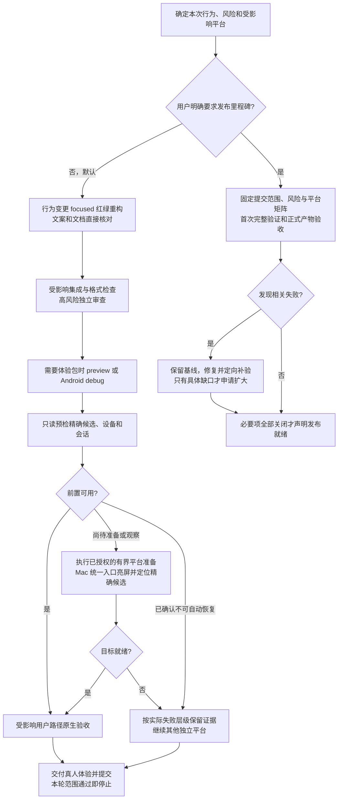

# Mihon Desktop 自动化测试指南

双端原生 UI 审阅窗口的同步面板试点已[封存](archive/NATIVE_UI_REVIEW_EXPLORATION_2026-09-29.md)；历史启动方法保留在[试点指南](NATIVE_UI_REVIEW.md)，不作为全应用 UI 审阅的默认流程。

验证范围与退出条件以仓库 [AGENTS.md](../../AGENTS.md) 为准：默认按本次行为和风险完成日常体验验证；只有用户明确指定发布里程碑时才执行完整发布矩阵。TDD、真实 production 接线和高风险专项仍在本批完成。



对比旧流程：roadmap 勾选完不再自动触发完整发布矩阵；日常体验包不递增正式版本；已通过且未受影响的证据可以复用；平台阻塞不会要求其他平台重测。详细审计与两个历史会话的证据见[流程评估](TEST_WORKFLOW_REVIEW_2026-10-06.md)。

## 快速开始

### 阅读器翻页动画回归

在「设置 → 阅读器 → 翻页动画」中切换开关。单页、双页和左右阅读方向下，
鼠标点击、键盘、滚轮与页码跳转共用此设置；常规设置里的既有开关使用相同偏好值。
条漫保留连续滚动方式。

分页视图保留前后各一个视口的图片持有，使已就绪相邻页在关闭动画时直接切换，
避免重新挂载图片期间露出背景。相邻视口预热必须等到当前章节可见页实际绘制后才开始，
避免额外解码抢占首帧；章节代际切换后重新等待绘制确认。此窗口复用现有解码与释放链路，不保证尚未下载、
未解码或加载失败的页面瞬间显示；这些页面继续提供加载或重试反馈。
快速连续请求必须以最后一次请求为准，鼠标操作中断动画后不得残留页码反馈屏蔽。
分页点击监听挂在稳定的 Pager 容器上，以便按下和松开跨越动画帧时仍接收同一次手势。
外部跳页尚在动画中时，首次用户点击以先前停稳页为基准；随后连续点击以最新用户目标为基准。
拖动或新的外部跳页会清除该用户目标。此规则同时适用于单页、双页及左右阅读方向。

`ReaderPageTurnPresentationTest` 挂载真实 ReaderContent 与图片 owner，以离屏帧检查
动画、无黑帧、设置实时生效、跨帧点击与快速请求；mounted production 测试同时约束相邻窗口
之外不得提前解码、可见页不得重复解码。

`ReaderCriticalPathProductionTest` 与 `ReaderIoProductionWiringTest` 保护首帧前仅当前页
打开和解码的约束。离屏夹具应注入真实偏好、有界推进渲染与后台 I/O，并释放每帧图片；
不能依赖不推进虚拟时间的循环触发 `withTimeout`，也不能通过放宽首帧计数接纳预热回归。

定向验证示例：

```powershell
$env:PYTHONUTF8 = '1'
$env:PYTHONIOENCODING = 'utf-8'
python scripts/gradle-coordinator.py run --key reader-page-turn -- .\gradlew.bat :app-desktop:jvmTest --tests mihon.desktop.ui.reader.ReaderPageTurnPresentationTest
```

### 构建与测试

按仓库 [AGENTS.md](../../AGENTS.md) 为当前行为选 focused 测试。以下命令运行完整 Desktop JVM 模块与 Robot 客户端测试，只在用户明确选择的发布里程碑或经授权的具体扩大验证中使用：

```bash
./gradlew :app-desktop:jvmTest :test-desktop:test
```

日常体验构建使用 `preview`；完整发布构建只在用户明确指定的里程碑执行：

```bash
./scripts/build-desktop.sh preview
./scripts/build-desktop.sh
```

`build-only` 仅供用户明确指定的发布里程碑收口使用，并且要求已有有效的完整 Desktop JVM 证据。证据可以覆盖当前源码，也可以是完整测试基线加上后续差异的相关回归、集成补验及影响范围说明；基线中的相关失败必须关闭，未执行范围不能算通过。使用组合证据时应保留首次完整测试结果和补验依据，不能写成“最终源码已全量通过”。

满足上述条件且只需避免正式收口构建重复运行测试时，显式使用：

```bash
./scripts/build-desktop.sh build-only
```

`build-only` 仍会分配新的 BUILD 版本、构建正式未打包应用、执行生产扩展安装与运行版本验收，
但跳过脚本内的 `:app-desktop:jvmTest`。默认、`feature`、`stage`、`msi` 和 `evidence` 模式仍会运行测试；
它不代替本批要求的 focused 测试，也不授权提前进行发布收口。

Windows 默认先在 Gradle 临时目录生成未打包应用并完成运行验收，然后将完整应用发布到持久目录；
不会生成 MSI。构建成功后可直接运行、并应写入完成报告的最终 EXE 为：

```text
app-desktop/artifacts/windows/Mihon-Desktop-0.STAGE.FEATURE.BUILD.GIT_HASH-unpacked/Mihon Desktop.exe
```

构建日志会输出该次构建的准确绝对路径：

```text
Final unpacked EXE: D:\...\app-desktop\artifacts\windows\Mihon-Desktop-<完整版本>-unpacked\Mihon Desktop.exe
```

完成报告必须复制这条输出中的实际路径并在报告前确认文件存在，不能根据模板猜测版本号。
`app-desktop/tmp/` 仅供内部构建、运行验收和 Test Mode 使用，不能作为完成报告中的构建地址。
最终目录中的 launcher 必须与同级 `app/`、`runtime/` 一起保留。Windows 构建成功后还会生成可搬运的完整 ZIP：

```text
app-desktop/artifacts/windows/Mihon-Desktop-0.STAGE.FEATURE.BUILD.GIT_HASH-windows.zip
app-desktop/artifacts/windows/Mihon-Desktop-0.STAGE.FEATURE.BUILD.GIT_HASH-windows.zip.sha256
```

对外分发和人工安装可使用 ZIP；直接运行验收可使用上述最终未打包 EXE。脚本会在成功前检查压缩包内
同时包含 launcher、应用文件和 Java runtime，并生成 SHA-256。

构建脚本会先启动临时构建 EXE，确认窗口标题中的运行版本与本轮
`0.STAGE.FEATURE.BUILD.GIT_HASH` 完全一致，再发布最终目录。只有发布时才显式执行
`./scripts/build-desktop.sh msi`；MSI 不能替代未打包版本的开发验收。

### 日常体验包

日常体验使用隔离预览入口：

```bash
./scripts/build-desktop.sh preview
```

该模式复用 production 打包链，不跑产品测试、不修改 AppVersion，也不覆盖既有产物。Windows 产物位于
`app-desktop/artifacts/preview/windows/<id>/`，macOS `.app` 与 manifest 位于
`app-desktop/artifacts/preview/macos/<id>/`。使用 `preview-manifest.json` 和构建日志记录的真实候选路径；Windows 完成报告仍应链接该轮输出的 `Final unpacked EXE:`，并确认文件存在。manifest 的 `productionRuntime=PASS` 仅表示 Windows 既有扩展运行时检查，`nativeInteraction=NOT_RUN` 仍需外部原生验收；macOS 预览只表示应用包构建完成，`productionRuntime` 与 `nativeInteraction` 都保持 `NOT_RUN`，须另行执行 LaunchServices/原生验收。体验构建不能代替完整发布矩阵。

### 候选与设备只读预检

`acceptance-preflight.py` 只检查给定候选、设备或会话，不启动应用、不安装、不发送输入：

```powershell
$env:PYTHONUTF8 = '1'
$env:PYTHONIOENCODING = 'utf-8'
$env:PYTHONDONTWRITEBYTECODE = '1'
python scripts/acceptance-preflight.py --platform windows --artifact 'D:\path\Mihon Desktop.exe'
python scripts/acceptance-preflight.py --platform macos --artifact '/path/Mihon Desktop.app'
python scripts/acceptance-preflight.py --platform android --artifact 'D:\path\candidate.apk' --adb 'D:\Android\Sdk\platform-tools\adb.exe' --serial '<本轮确认的设备>'
```

输出为 JSON，只读范围标记为 `read-only-preflight`，含平台、总状态和逐项检查的层级、状态、原因、下一步及事实；`PASS` 退出码为 0，其他状态退出码为 2。Android 可附 `--package` 指定预期前台包（这不验证 APK 签名），也可用 `--min-free-gib` 提供调用者选择的磁盘余量阈值；未指定时不设默认阈值。该预检不验证签名或完整 provenance，不执行 Computer Use，也不能把 `nativeInteraction=NOT_RUN` 改成通过。

Windows 的 `native-tool=NOT_RUN` 是 CLI 无法代探当前会话 Computer Use 的边界，不能解释成未安装该能力。接下来按 AGENTS 初始化实际 Node 工具，枚举并只选择本轮 EXE 路径对应的窗口。截图只有桌面背景、无法观察应用内容或激活失败时，不沿用猜测坐标点击；重新选择并有界恢复一次，仍失败则记录具体 `TOOL_FAIL` 并继续其他独立项。正常 HTTP 状态或应用内部 `active=true` 不能替代外部原生/视觉证据，也不据此更改产品的安全/隐私设置。

Windows 输入桌面、显示拓扑和 Computer Use 是独立检查。WTS 会话 Active、`OpenInputDesktop` 为 Default、窗口 visible，均不证明当前存在可捕获的显示输出。`display-topology` 只读调用 `GetDisplayConfigBufferSizes(QDC_ONLY_ACTIVE_PATHS)`：成功但活动路径容量为 0 时记录 `NOT_RUN` 与 `NO_ACTIVE_DISPLAY_PATH`，引导核对显示连接和实际捕获；调用失败保留错误码，不能把初始化为 0 的输出解释为无显示器。容量为正只表示当时的元数据，不能直接宣称原生输入或截图通过；本 API 返回的是缓冲容量，可能大于实际路径数，见[微软 API 说明](https://learn.microsoft.com/en-us/windows/win32/api/winuser/nf-winuser-getdisplayconfigbuffersizes)。

真实 Computer Use 同时报 `CreateForMonitor 0x80070057` / 无法激活时，结合本次显示拓扑、候选和会话证据诊断，不仅凭 `WinDisc` 名称、历史崩溃日志或某一个标志推断原因。已授权验收可做一次短时 `SetThreadExecutionState(ES_DISPLAY_REQUIRED)` 亮屏请求并释放，再复核显示拓扑；这是[临时电源请求](https://learn.microsoft.com/en-us/windows/win32/api/winbase/nf-winbase-setthreadexecutionstate)，不会替用户解锁或修复物理断开。未恢复时停止相同条件的捕获/激活重试，记录需要恢复有效显示输出的具体前置；不反复重建应用、换 renderer、全量测试或擅自安装驱动/修改安全设置。条件恢复后重新选择真实窗口，再补原生路径和关停，不复用陈旧坐标或旧窗口对象。

### Computer Use 集中操作与归还桌面

目标是减少用户桌面被占用的次数和时长。需要原生交互的验收项仍在原有最小充分范围内执行；只读 API、无界面测试和构建不因此改为 Computer Use。Windows、通过本机窗口操作的远程 Mac、模拟器等共享桌面操作遵守同一安排；直接在远端运行的原生验收也应及时释放对应桌面。

| 时机 | 执行要求 |
|---|---|
| 进入前 | 先完成实现、构建、数据准备、可离线执行的预检、审查与工具文档读取，准备报告和提交内容。列出本轮必要原生路径和停止条件即可，复用已有计划，不另建任务台账。将当前已就绪的兼容场景集中安排在本轮末尾；需要独立 profile 的场景仍分别隔离，存在依赖的场景不强行合并，也不等待其他不就绪任务。 |
| 开始时 | 简短告知将操作的应用、验收范围和预计占用时间，已有授权不重复申请。同一桌面只有一个主代理或子代理派发输入，交接前由原执行者停止控制。使用本次候选和最新返回的窗口对象，不沿用历史坐标。 |
| 操作中 | 只做必要原生动作和即时结果核对，保持“观察 → 一次动作 → 刷新观察”。集中的是连续操作时段，不是无观察的输入串。短暂动画等待按平台指南有界观察；原生证据仍与 HTTP/离屏证据分开。 |
| 需要离开界面工作时 | 编译、修复代码、长下载或网络等待、深入诊断、等待用户答复、写长报告之前，先执行下面的收尾。当前 Windows 版本未找到受支持的中途释放接口，须随即用 `final` 结束本轮，说明未完成项，后续工作留到下一轮；不能在 reset 后继续长时间运行并宣称已归还桌面。 |
| 用户接管或停止时 | 立即停止后续输入和自动激活，不抢回焦点，不把用户接管当成普通工具故障执行重试。仅做不抢占桌面的精确收尾，记录未完成项；需用户明确恢复后才继续输入。 |
| 完成、失败或中断时 | 所有退出路径都执行收尾；脚本在 `finally` 中安排已有的精确清理，人工工具步骤也遵守同一顺序。强制中止来不及清理时，下次恢复先核对本次记录的实例并收尾，再安排新操作。 |

收尾顺序：

1. 停止本批后续输入、截图、自动激活及自行安排的轮询，不让异步 GUI 操作在交接后继续运行。
2. 使用当前工具文档明确提供且已验证的结束/释放方式；当前 Windows 的边界与替代流程见下节。通过已有非交互关停入口清理本次拥有的测试实例、辅助进程和临时电源请求，核对精确 PID、路径、profile 与端口。Windows 沿用 `/test/shutdown`，Mac 沿用统一 runner 的清理流程，Android 只处理本次创建的实例。正常关停失败只记录具体残留，不全局终止同名应用或共享工具进程，也不为收尾重新抢占用户桌面。
3. 用户要求留作体验的应用保持打开并交给用户，停止继续控制；记录哪些实例已退出、哪些有意保留。保留应用不等于保留 Computer Use 控制。
4. 立即说明已停止输入、清理结果及残留问题。当前 Windows 仅做简短证据落盘和已准备好的必要提交，随后直接输出 `final` 结束本轮；其余平台也须先有实际释放依据，才能继续离线工作。没有释放依据时不能只凭停止发出工具调用、重置内核或关闭应用宣称已完全退出。

#### Windows 退出边界与本轮末尾收口

2026-10-07 核对本机 Computer Use `26.803.41515`、`@oai/sky 0.7.6`：公开 `sky` 不暴露退出方法。源码中的内部客户端虽有原型方法 `close()`，可信服务代理只导出自有方法，不能将内部方法当成公开 API 调用，也不得杜撰 `sky.stop()` 或自行访问内部管道。官方[说明](https://learn.chatgpt.com/docs/computer-use#windows-foreground-use)确认 Windows 使用前台桌面；官方页面没有给出本插件的 agent 主动退出 API。

**同一轮现场对照结论：`node_repl.js_reset` 没有让控制提示提前消失。** 本次 kernel/trusted-worker 已退出、测试应用随后也已正常关停，但用户观察到提示直到根会话最终回复出现才消失。进程清理通过不等于主动释放通过；详见[本次验收记录](../evidence/computer-use-session-release-2026-10-07.md)。当前观察支持将结束本轮作为退出边界，不足以断言宿主内部 native pipe 或键鼠拦截机制。

当前版本的日常流程：

1. Computer Use 前完成可独立完成的代码、构建、focused 验证、审查和资料读取；准备简短报告及提交内容。将精确关停需要的候选、profile、端口和归属信息保存在 Node 会话之外。不要提前导入 `sky` 后等待其他任务。
2. 连续完成已就绪的必要原生操作。最后一次观察后停止输入与截图，仅做必要关停、简短证据落盘和本批提交，立即输出 `final`。不在这时再展开长报告、搜索、审查或等待代理；这些准备应在进入前完成。
3. 若原生验收失败或需要重新编译、深入修复，记录真实失败和未完成项，精确收尾并结束本轮；下一轮再继续。不得为了维持同一轮开发而让用户长时间保留控制提示，也不能为了结束而宣称未完成工作通过。
4. `node_repl.js_reset`（本机工具名 `mcp__node_repl__js_reset`）仅可用于有需要的执行端清理或工具恢复，不是每批必跑的释放验证。使用时先保存必要结果、确认本任务独立会话归属及无待完成操作，避免误清其他工作的绑定；不能以 reset 成功代替宿主控制释放，也不反复 reset、杀共享进程或重新导入 `sky`“检查退出”。

不要把子代理结束当成根会话控制释放：现有公开文档没有此保证，本项目也未实测通过。内部 `end_turn` 协议和轮次结束回调不是公开主动退出 API，不自行调用私有协议或修改宿主状态。版本更新后若出现受支持的释放接口，应以同一轮前后对照验证：保留测试应用、主会话继续运行，确认提示提前消失后再更新流程；不把这项版本核查变成每次验收都需用户确认的门禁。

### Windows 原生小场景与正常关停

显示条件恢复后，使用新的 profile 和当前空闲端口续验；既有实例及失败记录保持独立。先按上节集中安排原生操作及收尾，再执行以下顺序：

| 步骤 | 操作与通过依据 |
|---|---|
| 核对候选及条件 | 核对实际 EXE、launcher 哈希、preview manifest 的源码/差异指纹；记录当次显示连接条件。正的显示容量只是元数据，实际截图另验。 |
| 隔离启动 | 确认 profile 尚不存在、HTTP/声明端口空闲，以 `Start-Process -WindowStyle Hidden` 启动包装器，参数包括 `--test-mode`、精确 `--test-profile`、`--test-http-port`，需要声明 JMX 时附该参数；真实 GUI 由应用创建，原生场景不加 `--headless`。 |
| 绑定身份 | 从只读 `/test/sync/ui` 的 PID 核对实际 EXE/命令行/profile、launcher 父子关系及 HTTP 监听者；不接续未知旧服务。 |
| 选择与观察 | 在实际 Node REPL 导入 `@oai/sky`，读取当前插件 SKILL、guidance/api/confirmations。`list_windows` 按精确候选路径筛选到唯一返回对象，再用其 id/app 调用 `get_window` 和 `get_window_state`；不重造窗口句柄，不沿用上轮对象。必须看到实际应用内容。 |
| 一次动作再观察 | 从当次截图选取既有入口坐标，或从当次原生可访问性树选索引；只用 `sky.click` 等公开 API。动作后立即刷新并观察；返回前核对本轮实际前台 PID，用 `sky.press_key` 执行真实 Escape，再观察稳定关闭状态。 |
| 精确关停 | 重新核对本轮 PID/EXE/profile/HTTP 归属，仅对其本地 `/test/shutdown` 发一次 POST，记录响应并等待 runtime 与 launcher 自然退出；不全局终止同名进程。需要独立复验时另用新 profile/端口重复。 |

动画会让动作后的即时截图仍保留旧画面，或显示面板正在进入/退出。此时保持本次动作已经派发的事实，同一动作最多补两次观察；仍未稳定则记录结果未确认并停止该项，不重复输入或无限等待。布局未稳定时不复用旧截图 ID、坐标或索引。只读业务状态可辅助判断已经打开/关闭，但不能替代实际截图或真实输入。

2026-10-07 已在物理显示器连接时，用两个全新 profile 完成书架截图 → 同步入口单击 → 同步面板稳定截图 → 单次 Escape → 书架稳定截图及精确关停。首轮坐标与窗口对象只是该次观察结果，后续仍须重新选取；物理关屏、仅欺骗器/虚拟显示条件仍未验证。preview manifest 的原生层保持 `NOT_RUN`，通过证据单列，详见[双轮记录](../evidence/testing-workflow-rollout-2026-10-06.md#windows-物理显示器连接后的双轮收口)。

### macOS 原生与无界面验收入口

Mac 原生验收使用下文统一入口 `scripts/mac-acceptance.py`。即使通过 SSH 执行，也由 LaunchServices 启动精确隔离应用，不直接执行应用包内 launcher。只读预检中的待亮屏/待目标核对属于统一入口的后续动作，不是要求用户介入的最终结论。

无界面模式仅适合 HTTP 状态/API 测试：

```bash
open -n -W -a '/absolute/path/to/validated/Mihon Desktop.app' --args \
  --test-mode --test-profile=/absolute/path/to/dedicated-mihon-test-profile \
  --test-http-port=8080 --headless
```

### macOS 桌面会话的安全存储验收

验收正式应用的 Keychain 读写时，通过 macOS 应用启动服务启动已核对的 `.app`，并使用独立 profile。
SSH 中直接执行 `Contents/MacOS/Mihon Desktop` 的结果须记录为该启动上下文的证据；若安全存储失败，
再核对桌面应用启动路径，不能仅凭 SSH 的默认钥匙串状态断言用户桌面钥匙串不可用。
不要修改钥匙串设置或收集用户密码来绕过失败。

下例将 `MIHON_ACCEPTANCE_APP` 替换为本轮构建日志 `Final macOS app:` 的实际绝对路径；
先确认 HTTP/JMX 端口空闲，旧 Test Mode 服务存在时停止本次启动，而非复用旧服务。

```bash
MIHON_ACCEPTANCE_APP='/absolute/path/to/validated/Mihon Desktop.app'
MIHON_ACCEPTANCE_PROFILE="${TMPDIR%/}/mihon-keychain-acceptance-$(uuidgen)"
open -n -W -a "$MIHON_ACCEPTANCE_APP" --args \
  --test-mode --test-profile="$MIHON_ACCEPTANCE_PROFILE" \
  --test-http-port=49163 --test-jmx-port=49164 --headless
```

验收原生窗口时去掉 `--headless`，并单独核对本次应用进程的窗口元数据或取得用户现场确认。
启动命令返回成功、HTTP health 正常及同步 state 的 `visible=true` 都不能证明窗口已呈现；
其中 `visible` 只表示产品面板状态。原生验收入口按核对后的精确 PID 激活并检查实际前台，
避免同 bundle 的其他实例被误选。窗口元数据检查只核对目标进程的窗口存在性、屏幕列表和尺寸，不读取屏幕像素。
等待现场检查期间保持本次窗口打开；未收到反馈的窗口/键盘/视觉项目不记为通过。

`open -W` 等待应用退出，其 PID 是启动包装器，不能当作 Mihon 的 PID。通过本地 HTTP、显式绕过代理，
核对该实例的 health、production 同步面板打开/设置/关闭，再调用已有 `/test/sync/probe/write`。
保留返回的虚构 probe ID；正常 shutdown 后，复用同一 profile 再启动并调用
`/test/sync/probe/verify/{id}`，必须完成跨进程读回和删除。仅调用保留前缀的测试接口，不读取真实授权或空间秘密。
每次完成后调用 `/test/shutdown`，等待包装器退出并核对本次应用进程已退出；异常时只处理本次精确实例。
若有系统访问提示，由值守用户核对程序并决定授权；没有提示也不能代替真实读写断言。
`--headless` 的证据仅覆盖 HTTP/production controller/系统安全存储，不代表原生窗口、键盘或视觉验收。

### macOS 同步面板原生交互自动化

先阅读 [Mac 验收经验与统一入口](MACOS_ACCEPTANCE.md)。本轮正式应用必须包含只读 `GET /test/sync/ui` 接口。
统一入口在 Mac 本机或已有 SSH 会话中执行，使用全新隔离 profile，使同步面板初始关闭且未连接；不需要先手动启动或置前台：

```bash
python3 scripts/mac-acceptance.py \
  --app "$MIHON_ACCEPTANCE_APP" \
  --profile "$MIHON_ACCEPTANCE_PROFILE" \
  --http-port 49163 --jmx-port 49164 \
  --output '/absolute/path/to/mac-acceptance.json'
```

入口完成一次有界亮屏复核、LaunchServices 启动及精确实例绑定，再调用既有 `mac-sync-native-acceptance.py` 场景。预检、统一入口和该原生脚本共用 `mac_acceptance_session.py`；息屏、锁定字段缺失、SSH 连接本身不单独判成无法执行 GUI。亮屏后仍有明确锁定信号时停止输入；缺失字段保留为未知，通过目标前台、窗口、权限和命中继续判断。
脚本核对实际应用 PID、应用包路径、profile、窗口激活与控件坐标，并在原生操作前重新检查会话及目标。
CoreGraphics 窗口矩形仅用于确认目标窗口存在；Dock 等窗口可能报告覆盖全屏的矩形，不能单凭矩形顺序推导鼠标命中。
外部工具通过系统辅助功能的坐标命中接口只读取目标 PID，确认属于本次应用后才发送 CoreGraphics HID 鼠标事件；键盘事件发送给核对后的应用 PID。
它通过只读接口验证鼠标打开同步面板、Tab/Shift+Tab 完整正反回环、Escape 关闭与同步入口还焦、Enter/Space 重开。
HTTP 控制动作不能代替这些原生事件。同一 AWT 窗口中的底层 Compose owner 可能在弹层挂载后保留工具栏局部 Focus 标记。
面板挂载时只核对面板作用域，卸载后核对工具栏；同时要求 `ownerFocused` 和实际 `focusedWindow`，不把背景标记算作当前焦点。
脚本不读取屏幕像素，不登录 GitHub，不创建空间或读取输入内容；只验未登录 MAIN 场景，不覆盖密码页视觉或真实远端同步。
若恢复后仍锁定、系统拒绝原生输入或辅助功能命中权限，或场景发生变化，记录具体层级、原始证据及下一步，不概括为“SSH 不能操作图形界面”，不更改权限绕过验证。
统一入口只关停本次已验证身份的实例，并核对实际应用 PID 与 `open -W` 包装器退出；临时防息屏辅助进程随任务释放。关停未完成保留为失败，不静默强制结束应用。需要留给用户体验的包另按日常体验流程交付。

### 隔离验收配置

在个人电脑验收时始终显式传 `--test-mode --test-profile=<绝对目录>`。Windows 使用本轮正式未打包 EXE，
参数相同；不要仅修改 `user.home` 或指定 JDK 内部 `FileSystemPreferencesFactory`，前者不能隔离
Windows APPDATA/注册表，后者不保证在 macOS 发布运行时可用。

- 首次使用不存在或空目录；程序写入 `.mihon-test-profile` 标记，后续可复用以验证冷启动持久化。
- 作者身份正式运行验收可使用 `authors_state`、`author_resolve`、`author_add_aliases`、
  `author_set_display_name`、`author_set_frequency`，参数见 `API_REFERENCE.md` 的作者身份验收动作。
  `author_resolve` 仅解析现有漫画的真实署名。固定离线 `author_sync_fixture` 必须在显式隔离
  profile 中运行，不能对普通用户配置执行；它验证生产 inbox/projector/journal，不能代替真实
  远端同步验收。重启复验继续使用同一 profile，并重新读取当前 revision 后再修改。
  非空且无标记、根目录、普通 home、符号链接路径被拒绝。不要将日常数据目录伪装成测试目录。
- 启动入口在 crash handler、实例选举和 DI 之前选择 profile。数据库、缓存、日志、扩展、下载默认目录
  及历史 `user.home` 路径均隔离；Java Preferences 全局切换到该 profile 的可持久化后端，涵盖旧偏好和扩展设置。
  偏好已提前初始化时拒绝启动，不退回普通用户后端。普通启动及未传 profile 的历史 Test Mode 行为不变。
- Windows 凭据仍通过 DPAPI 加密，密文保存到隔离偏好；macOS Keychain/Linux Secret Service 使用 profile
  路径派生的专用 service 名，保留生产安全存储实现。不会注册或覆盖系统 URI handler。
- 这是默认状态隔离，不是恶意扩展沙箱。测试主动传入的导入、导出或存储路径仍须位于专用目录，勿登录真实账号。
  一个 profile 只供一个应用 owner 使用；不要在运行期间手动编辑 profile 文件。删除 profile 文件不会自动清除
  OS 安全存储中的测试凭据，应先在该 profile 内正常退出测试账号/关闭测试应用锁。
- `--headless` 只验收 HTTP/状态，不替代真实 Reader Compose 窗口验收；Test Mode 自身不提供桌面截图 API。

## 测试分层

| 层级 | 位置 | 目标 |
|---|---|---|
| JVM 单元测试 | `app-desktop/src/test/kotlin` | 业务逻辑、导航契约、HTTP parser、状态模型 |
| 桌面自动化 API | `app-desktop/src/main/kotlin/mihon/desktop/test` | 测试模式 HTTP server 与状态回读 |
| Robot 客户端 | `test-desktop/src/main/kotlin` | 面向场景的测试 DSL |
| Robot 测试 | `test-desktop/src/test/kotlin` | 客户端序列化、Robot API、场景 smoke |

## 编写规则

- 禁止“成功或失败都算通过”的断言。
- HTTP/API 变更必须覆盖成功、空数据、错误状态和 malformed body。
- 导航变更必须验证 Tab 与 Screen 类型，以及 pending 状态不会互相覆盖。
- Reader API 必须验证 UI 状态与 `/test/reader/state` 一致。
- Test Mode 自身不提供桌面截图 API，也不得通过其接口读取桌面像素。视觉问题可由 Compose 离屏测试覆盖；外部 Computer Use 与 Test Mode 的边界及工具预检遵循 [AGENTS.md](../../AGENTS.md)。

## 常用命令

```bash
# 全部桌面 JVM 测试
./gradlew :app-desktop:jvmTest

# Robot 客户端测试
./gradlew :test-desktop:test

# 指定测试类
./gradlew :app-desktop:jvmTest --tests "mihon.desktop.test.navigation.TestNavigationControllerTest"

# 冒烟测试脚本
./scripts/desktop-smoke-test.sh
```

## 测试模式 API

基础地址：

```text
http://localhost:8080/test
```

高频端点：

- `GET /health`：测试服务健康检查
- `GET /state`：应用状态
- `POST /navigate/{screen}`：导航
- `POST /action/{action}`：执行动作
- `GET /reader/state`：阅读器状态
- `POST /reader/next_page`：下一页
- `POST /reader/prev_page`：上一页
- `POST /reader/close`：关闭阅读器
- `POST /reset`：重置测试状态

完整字段见 [API_REFERENCE.md](./API_REFERENCE.md)。

## 最终对齐固定 EXE Runner

本轮构建已产出固定的 Windows 未打包应用后，运行：

```bash
./scripts/desktop-final-parity-test.sh
```

Runner 固定使用 `app-desktop/tmp/mihon-dist/main/app/Mihon Desktop/Mihon Desktop.exe`，并要求 `./scripts/build-desktop.sh evidence` 生成的 Task151 provenance sidecar。启动前会复用既有 provenance verifier 同时核对当前已提交 product source identity 和完整未打包应用哈希；EXE、sidecar 缺失或任一身份不匹配都会 fail-closed，不以 mtime 猜测 freshness。有效产物默认以带真实窗口的 `--test-mode` 启动，必须运行在可创建 Compose 窗口的 Windows 图形桌面或 macOS Aqua 会话中；`--headless` 不会创建 Reader Compose、Navigator 或 ScreenModel 生命周期，只适合 HTTP 控制面测试，不能作为 `FIRST_PAGE_PRESENTED`、关闭弹栈或 production resource disposal 的最终证据。若 `/test/health` 在启动前已响应则拒绝覆盖旧实例，启动后还会同时确认 health 与本次 PID 存活，并在成功、失败或超时时关闭本次启动的精确进程。

Reader 场景依次执行 downloaded directory、downloaded CBZ、local archive、online 与 partial download 五条 production 路径，验证真实页面 I/O、decode、首帧请求上限，以及 `closeRequested → productionClosed` 的两阶段关闭。partial fixture 由 production `DesktopDownloadManager` 实际提交若干页后打开 Reader：已提交当前页必须恰好走一次 probe/open/copy 且图片网络为 0，附近预取不能越过已提交边界，所有下载 I/O 都不得发生在 manager/index/coordinator/lifecycle 锁内。场景主体失败后仍会请求关闭，但清理失败不得覆盖原始首帧、I/O 或 decode 失败；场景主体成功时，关闭未获 production 确认仍使验收失败。

`test-desktop` 客户端通过 `MIHON_FINAL_PARITY_SUMMARY_FILE` 写入汇总。Runner 将它与既有 `test-mode-coverage-inventory.json` 对比，逐项输出 family 和 permanent protection，并要求：

```text
Families: 13/13
Permanent protections: 5/5
Capabilities: 64/64 unmapped=0
```

产物错误会给出固定路径和 `evidence` 构建命令；启动错误会区分旧 health 占用、本次进程提前退出与超时，并给出进程或启动日志。provenance、health command 和 test command override 仅用于隔离 runner fixture，正常验收不得用它们替换真实 verifier、固定路径或默认 `test-desktop` client。


## Windows 默认自适应阅读模式

入口：设置 → 阅读器 → 默认；或漫画详情／阅读器设置 → 阅读模式 → 默认。
“跟随全局设置”单独表示继承全局方向与单双页设置；阅读器选择漫画模式不会改写全局阅读方向。
全新偏好采用默认模式，已保存的手动方向保持原值；仅保存过单双页的旧配置保留手动 RTL 布局。
显式保存的 DEFAULT 不受历史单双页值影响。Android 阅读器本轮不变。

默认模式复用现有 RTL 单页／双页 presentation，以实际阅读内容 viewport 的宽高比判断。
首次有效尺寸或主动选择默认时，比例 ≥ 1.35 为双页，否则单页；后续单页在 ≥ 1.35 进入双页，
双页在 ≤ 1.25 退出。跨阈值后的目标须连续保持 150 ms；同一目标的连续 resize 不重置计时，
回到当前布局区间则取消待切换。无效尺寸取消待切换并保持布局；离开自动模式、销毁阅读器时取消计时。
共享策略位于 domain 的 `AdaptiveReaderLayout`，当前只有 Desktop adapter 接入。
临时工具栏和弹窗属于 overlay，不改变内容 viewport；图片比例变化不触发自动布局。

设置面板显示“默认 · 单页／双页”及说明，并禁用手动双页开关。双页配对、横向跨页图和章节末尾
继续按现有 presentation 处理，因此双页布局不保证每个视口都显示两张图。
双页当前页统一取逻辑阅读顺序的第一张：RTL 为右页，LTR 为左页；封面唯一页仍在左槽，当前页为封面。
单页进入双页时定位包含原页的配对，并将当前页归一到该配对的第一张；返回单页显示归一后的当前页。
底栏“调整跨页”原子更新配对边界与定位目标，例如 [1, 2] → [2, 3] → [1, 2]，不会停在新增边界的单页。
封面不调整，已有横向跨页与末尾唯一页仍按 presentation 处理。自动模式切换保留强制单页配对设置。
布局调整的 settled 回调只更新显示状态，不因新增伴页推进阅读进度；当前位置归一与进度抑制分别处理。
单页下自动匹配清理、跨页图检测等元数据更新不清除待完成的布局保护。用户跳页、选中其他显示单元或翻到不包含保护页的视口后，
恢复正常进度上报。双页 reporter 在显式定位请求后重新确认已显示页，配对往返不依赖数字页索引变化。

Desktop 自动标记保存于 viewerFlags 第 34 位，低 8 位仍为 Android RTL 值 2；显式方向覆盖清除自动标记，
继承全局同时清除 Desktop 双页覆盖位。Android 尚未接入自动策略；跨端使用本轮数据时仍以 RTL 解释。

回归证据使用共享 `AdaptiveReaderLayoutContractTest`、Desktop `DefaultReaderModeTest`、
真实 `ReaderContent` 离屏挂载的 `AdaptiveReaderViewportTest`、真实阅读器与底栏挂载的
`DualPageCurrentPageWiringTest`（默认／手动 RTL／LTR、连续调整、封面、后续翻页进度），
以及 `ReaderPageTurnPresentationTest` 的动画与快速翻页回归、设置搜索和漫画详情 persistence 测试。
手工验收：选择默认，拖动内容比例跨过 1.35／1.25，确认方向、单双页、当前页与阅读进度；
打开／关闭设置和工具栏不切换；选择手动方向后拉伸窗口不再自动切换；重开漫画仍保留选择。


## Android 原生同步导航与隔离远端验收

使用官方 `scripts/build-android.py debug` 产物及独立 `.dev` 身份，安装仍用官方 `install` 命令。先核对设备和两个包的身份，不降级或覆盖设备上更高的正式版本。用户处理系统权限弹窗、解锁并置 Debug 于前台后，在**新装且没有旧 GitHub 授权凭据**的 Debug 实例运行：

日常优先使用任务专属模拟器；先以 `adb -s <serial> emu avd name` 核对 AVD，不操作其他任务的已运行实例。API 36 可能以 `mWakefulness=Awake` 报告电源状态而没有 `mInteractive`；预检支持两种明确形状，未知/转换中仍保留未确认状态。Debug APK 可能同时包含 UI 审阅入口和正常主入口，通用 launcher resolve 返回系统选择器不代表安装失败；以实际 APK 的 launchable activity 核对目标。本轮正常应用启动试点选择 `eu.kanade.tachiyomi.ui.main.MainActivity`，完成主题欢迎页 Next → 存储页 → 系统 Back，不代替下列同步专项。

基础流程独立复跑使用新的任务专属 AVD 和 userdata，复用已经 `build-android.py verify` 核验的相同 APK，再经 `install --serial` 安装；不为重复验证重新构建或擦除其他 AVD。启动前核对空闲端口及内存，记录实际进程、AVD 名称和 serial，资源紧张时与 Desktop 实机验收串行。

欢迎页各步骤共用 `Welcome!` 标题，不能按标题是否变化判断导航成功。真实点击前从当次 hierarchy 唯一定位启用的 Next 按钮并取 clickable 父节点 bounds；存储步骤以 `Select a folder` / `Storage guide`（或对应当前语言资源）出现、主题选项退出为断言，系统 Back 后以 System/Light/Dark 主题选项恢复、存储控件退出为断言。输入前及读取 hierarchy 前后复用 `android-sync-native-acceptance.py` 的 `Device.guard()` 核对本次设备、未锁屏和目标包前台；截图补充确认实际页面，不以标题或 `adb` 退出码单独判断通过。此场景不授予存储权限、不进入账号或真实同步。

收尾再次核对 `emu avd name` 后仅向本次 serial 执行 `emu kill`，确认本次进程退出且 serial 从 `adb devices` 消失。重复运行的来源、真实原生结果和关停分别留证；其他功能需补自己的最小用户路径，不把欢迎页通过解释为全应用通过。

```powershell
python scripts/android-sync-native-acceptance.py --serial <本次确认设备> --fresh-debug
```

`--fresh-debug` 是调用者核验前置，不是脚本清数据或判定账号的手段。MAIN 未连接不能证明不存在旧凭据；已有凭据时 BeginSetup 可能访问远端，所以不能默认在既有安装上重跑。普通只读检查使用 `--inspect`；正式包仅允许只读检查。工具路径限于入口、MAIN、设置、系统 Back、登录说明页、Back、关闭；不点击授权、密码或同步。输出只含固定导航语义和几何信息，不保留层级、文本、密码或设备标识。

每次输入前须重新确认锁屏、真实前台窗口、控件唯一性及启用状态。Huawei 等设备的系统权限倒计时窗口不是应用界面，必须停止并由用户处理。`uiautomator dump` 退出码 0 仍可能伴随 null-root ERROR；工具要求精确成功标记、随机新文件、大小上限和有效 XML，读后删除，禁止读取旧固定文件回退。临时窄屏/大字号验收必须先保存原 wm override、density、font_scale 与旋转配置，在 finally 恢复并逐项核对。已有 override 不代表本轮脚本设置，不得直接 reset 丢失用户配置。导航通过不能证明密码页布局通过。

真实远端验收应使用用户授权的新私有空仓库，禁止使用已有非空 `mihon-sync`。仅测试版本可选择固定前缀 `mihon-sync-acceptance-...` 的专用仓库：

```powershell
python scripts/build-android.py debug --sync-acceptance-repository mihon-sync-acceptance-<本次隔离目标>
```

构建记录必须包含实际目标及配置摘要，安装前用官方 `verify` 核对该候选。正式构建不允许此参数。Desktop 使用包含同一配置能力的候选，并同时传 `--test-mode --test-profile=<安全绝对目录> --test-sync-repository=<同一目标>`；旧 `--test-profile-dir` 不足以隔离凭据，不能用于启用覆盖。不得以旧候选支持新参数为假设。共享生产链只发现指定隔离库，已有连接或 pending 指向其他仓库时安全拒绝；不会替调用者清旧记录或改连接。切目标前通过正常产品路径处理本地连接，不伪造凭据或写内部状态。

CLI GitHub 登录态不代替应用 OAuth 或 GitHub App 授权；核对实际账号及隔离目标后才继续创建和跨端验收。浏览器自动操作被拒绝时保留拒绝并请求用户完成网页确认，不采集 cookie、不向应用注入 CLI token，也不换入口绕过拒绝。两端实际提交、模式 descriptor、重启恢复和解锁都须各自验证，MockWebServer 或导航成功不能代替真实远端证据。


当前限制：测试仓库覆盖配置不改业务页面的固定帮助文案，安装访问权限页仍可能写默认 `mihon-sync`。隔离验收以 candidate manifest 的 `syncAcceptanceRepository` 为目标，不按默认文案创建或改动既有仓库；测试负责人应向值守用户明确两个隔离名称。登录授权完成后仍须 GitHub App installation 获得测试库访问权，看到“App 已安装但无法看到仓库”后先通过正常权限管理页补充指定库，再回应用重新检查，不能据此判断仓库不存在或密码功能失败。


官方 API 路径须分开核验认证类型：安装列表接口的 403 不等于增加库接口也不可用。用户已授权增加测试库、公开 installation ID 来源可靠且精确库 ID/所有者/私有/admin 条件核对后，才可按 [GitHub add-repository 官方接口](https://docs.github.com/en/rest/apps/installations#add-a-repository-to-an-app-installation) 最小增加；403 时停止，不提取应用 token 或浏览器 cookie。API 成功仍要回真实应用重新检查目标可见性，接口请求不代替生产创建/同步验收。


安卓浏览器验收边界：Windows 启动浏览器的一次审批拒绝不能扩展为安卓浏览器不可操作。手机网页的 UI hierarchy 可能只暴露浏览器外壳、未暴露网页控件；这不足以判断页面为空、登录失败或不能操作。用户授权原生网页操作后，可先通过应用正常管理入口打开页面，核对未锁屏、浏览器前台、目标管理 URL 与无密码输入字段，再用平台外部截图检查实际页面；截图只作临时诊断，读后删除，不写入长期文档或提交。该路径不改变 Test Mode 自身不得读取 Desktop 屏幕像素的规则，外部工具按 [AGENTS.md](../../AGENTS.md) 的授权与观察边界执行；截图不代替生产业务验收。若网页显示 GitHub Confirm access / sudo 身份确认，停止输入，由用户在页面自行完成 GitHub Mobile、验证器或密码确认；不索取、读取、自动填写或记录秘密。用户确认后重新观测权限管理页，才可按已授权的精确测试目标勾选、保存并回真实应用重新检查。

网页仓库选择菜单打开后，自动滚动、软键盘和焦点可能使旧坐标失效；层级中的 focused=false 与实际页面焦点也可能不一致。本次搜索尝试进入了 GitHub 全局搜索，未修改授权，具体原因未证实。发现输入落点不符时立即停止、关闭误入页面并重新观察；目标完整名称已在菜单中可见时直接选择该行，避免不必要的搜索。保存前核对原授权与本次两个目标、保持 Only select repositories，保存后重新加载核对集合，再回应用真实重新检查。嵌套可点击节点触发保护停止时，重新观察确切按钮及其边界，不放宽整个页面的点击保护。

测试仓库与 Debug 包身份隔离不等于本地数据为空。远端创建前检查实际 Debug 书架；发现已有用户内容时，不清应用数据、不注入内部状态，也不以“测试库”名义擅自上传。保留数据，先完成不提交的模式切换、风险说明及按钮状态检查；当前内容上传或数据替换须有明确范围。长期证据只记录状态与合成目标名称，不记录用户书架内容或账号。

### 设备授权、输入与材料核对

2026-10-01 的正常 GitHub device 页包含八个独立单字符输入框。核对精确 HTTPS origin 与 `/login/device` 路径，按 `urlsplit` 解析 hostname、scheme 及无 userinfo；不通过文本子串推断来源。每个字符输入前重新观测字段及边界，完整组合在内存核对与本次应用授权码一致后再继续，确认实际产品授权页及最终成功，再回应用读状态。授权码、账号、链接和凭据不写长期记录。未获用户明确授权时，身份确认或密码输入交由用户完成；保存的网页登录态本身不是授权。用户明确授权使用浏览器保存的密码、默认账号和普通确认时，可以在精确 GitHub 来源和本次流程中使用浏览器原生自动填充与确认，不读取密码字段值、不提取密码、cookies 或 token。默认账号仍需在内存核对与本次测试目标所属账号一致；需要额外设备或身份验证且浏览器不能完成时，保留页面交给用户。

Huawei 安全输入法可能遮挡应用，而普通 `dumpsys input_method` 标志未报告键盘显示；本次 `screencap` 退出码 0 但输出 0 字节，也不能作为截图成功。应用 XML 的控件坐标与 `mCurrentFocus` 不能独自证明点击未落在键盘上。发现这种状态后停止按旧几何点击；本次通过真实 Tab 离开密码输入、核对确认行/提交按钮的实际 focused、enabled、checked，再用 Space/Enter 操作。它只证明这些原生键盘事件，不把硬件 Enter 自动等同于软键盘 IME Done。

密码验收使用专门生成的测试秘密，并在 Git 外以系统保护方式保留。创建时应在**最终提交前**核对当前实际字段与测试材料一致；之后发生编辑、指针点击或键盘事件，先前的值核对不能沿用。受授权的测试值只在内存比较，不输出字段值、不保存完整层级、不显示含明文的截图；用户登录秘密不得读取。原材料无法加入时保留失败与原 descriptor，先核对本次输入及材料，不删除、覆盖或降级空间。需要新的受控夹具时使用新隔离库，保留原库及原授权，重新验证整个创建/正确加入链。

窄屏/主题切换造成 Activity 重建时，面板关闭及未提交秘密清理与同一 Compose composition 内重绘保持是不同验证范围。记录实际生命周期，不以系统设置切换证明草稿应跨 Activity 保存。

实体设备补验（2026-10-04）：Huawei 普通文本输入也可能经当前输入法转换，`adb input text` 成功不保证英文文件夹名原样输入。创建专用存储目录后，须读回实际名称、确认是刚创建的空目录，再通过系统选择器授权；不要根据预期字符串宣称目录身份。冷启动还可能延迟出现“读取已安装应用列表”等厂商权限弹窗；预期书架断言失败时先只读核对前台及当前层级，处理与任务相符的可选权限，再观测同一次启动，不立即重启、清数据或判定产品崩溃。

新版本阻止安装旧候选时，只有用户明确授权才卸载。授权卸载后的启动、空书架及冷启动结果必须写为全新安装验收；不能用它替代既有书架升级保留证据。优先复用统一入口已验签的候选，安装成功后还须核对实际版本和业务界面。

### Android 模拟器续验的隔离边界

可将厂商输入法造成的自动化阻塞与共享密码能力分开：使用已有 SDK/system image 创建独立 AVD、独立 userdata，明确本次 serial，只安装统一入口已 verify 的 Debug 或正式候选，不复用其他 AVD 数据、不对实体设备发送模拟器操作。Debug 的测试目标覆盖不进入正式 APK；模拟器正式运行不能冒充实体升级后既有数据保留检查。仅配置本次模拟器，先读回代理键及显示、字号、旋转和主题基线，收尾恢复已知基线或精确清除本次引入键，并只关闭本次进程。未读取的初值不能声称已逐值恢复。

本轮仅设置 Android `http_proxy` 后，应用真实 OAuth 请求超时；加入 emulator 启动代理后取得 code，但后续 poll 失败；补充 Android global proxy host/port 后，实际 requestCode、poll、授权与仓库发现成功。这是不同配置下的运行观察，未取得代理握手/TLS/HTTP 分段诊断，不单独归因某个键，也不以 TCP/curl 或独立客户端代替应用成功。合成密码仅在内存比较；软件键盘 Done 必须实际执行，硬件 Enter 结果单独记录。

API 36 LatinIME 的实际 `mInputShown` 与 editor action 6 可以表明键盘已显示，而 UI hierarchy 仍没有键盘节点。必要时用平台外部临时截图定位真实 Done，并同时核对窗口、尺寸、字段几何和前台；不保留含秘密像素。显隐两态的 XML 仍可能都标记 `password=true`，不可据此否定切换；以真实 Show/Hide 语义和测试值的内存比较核对。最终字段值比较后直接执行已核定的软件 Done，若发生编辑或重新聚焦则重新比较。

已连接实例使用“更换空间”补验 UNLOCK 时，先核对当前生产动作是否只进入 discovery，而非断开或清凭据；正常确认和同目标发现仍不能当作正确密码已验证。返回 MAIN 显示“继续连接”可能只由未完成的 setupStep 控制，不能单凭文案判定旧绑定丢失；核对实际启用连接、目标和密码状态，再用正常同 profile 冷启动验证持久状态，不写内部状态消除文案。需要证明密码解锁时仍须真实提交、错误反馈以及正确提交后的准备/完成转换。启动过渡期前台检查失败时，等待该已启动实例稳定后重新观测，不重复 start 或清数据。

### Windows 原生输入的实际前台

正式 EXE 的只读 `/test/sync/ui` 可给出 AWT/Compose 焦点及本次 PID，但 AWT 的局部 `focused=true` 不能替代 Win32 `GetForegroundWindow` 的实际所属 PID。本次其他程序处于前台时，键盘工具在任何输入前拒绝，即使激活请求返回成功。每次事件重查实际前台、锁屏、实例身份和命中；测试窗口真正前台后才继续，不向其他程序发送测试秘密。缺少密码控件的白名单 tag 时，不能猜坐标或扩大 HTTP 接口来提交密码；使用外部原生可访问性类型、焦点与几何证据，缺失时保留该门槛。

主代理与子代理的工具执行上下文可能不同。本次子代理的 CIM/Python/GUI 调用被拒绝，而主代理在当前图形会话中可以执行；不能把一处拒绝扩大为整台机器不可用。由原平台代理保留场景和证据职责，主代理执行其已完整核对的外部工具即可，不因此增加代理或重复产品实现。执行前冻结脚本及依赖并核对哈希；交付给执行者后不得修改同一文件。确需修改时另交新版本，重新核对后再执行，避免读到的源码与实际输入工具不一致。

同一活动 AWT 窗口中的背景 Compose owner 可以保留局部 FOCUSED。密码页已聚焦时，本次公共树同时报告密码字段和背景工具栏按钮 focused；旧工具将全部公共 focused 节点都要求落在面板，因而在首次 Tab 前停止。局部标记不能独自证明背景获得键盘事件：结合当前面板公共祖先、白名单控件的 ownerFocused、真实字段焦点及完整正反 Tab 结果判断作用域。出现多个标记时先只读诊断，不改产品焦点或伪造观测；也不能直接删除作用域与反向回环验收。

默认 Material DragHandle 的实际公共焦点可能是 `groupbox` 父包装器。本次原角色摘要只列 password/push button，因此到达把手时再次误判没有面板焦点；原始有界公共树实际包含面板祖先内的 focused/focusable groupbox，宽度、中心及高度与把手匹配。按源码 `SyncHandleAccessibility` 的宽度/中心容差和本次面板祖先验证该节点，不猜角色、不扩大到所有 groupbox，也不仅凭 HTTP tag 判定把手获得焦点。

同步结果的可选字段须按当前 serializer 及实际响应核验。`/test/sync` 的 `lastExchange` 来自临时 notice，可能不存在，不能以默认空对象加 `uploaded>=1` 作为每次真实同步的强制判据。本次仅运行一次真实标未读与同步，旧工具因该假设等待超时；随后没有重新派发，而以同隔离 profile 的只读 production run store 确认 MANUAL/SUCCEEDED/COMPLETE、uploaded/confirmed 各 1、failed 0，再由另一端真实接收读回确认。读取数据库仅限已核定的隔离 fixture、`mode=ro` 和必要计数，不写 SQL、凭据或内部状态。验收工具超时与业务失败分开记录。

`/test/navigate/LibraryTab` 的 success/currentScreen 可以只表示请求的 Tab 已更新，不能证明外层漫画详情 Navigator 已 pop。本次仍挂载详情时 `/test/sync/ui` 为 ready=false；不按标签假称已经回书架，也不反复 POST 同一路由。用真实详情返回控件退出外层页面，再核对实际挂载的同步入口。HTTP 导航恢复不能计作原生返回、帮助或还焦证据。

日常跨端验收先核对协议支持的字段。当前 `SyncField` 包含收藏、关注、已读、阅读位置和阅读摘要；章节书签只更新本地数据库，bookmark-only 不追加同步操作。一次真实 Mac 标已读并加书签后，Android 收到已读而仍未加书签，符合现有协议边界。保留这次观察，不把“本地操作成功”当成“该字段支持同步”，也不为密码验收新增书签协议或把它报告为已修复的产品 bug。
