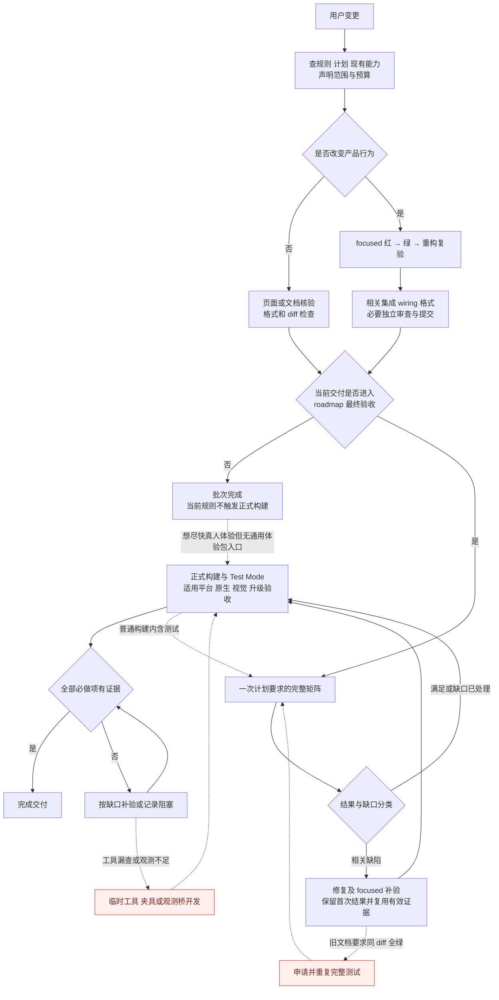
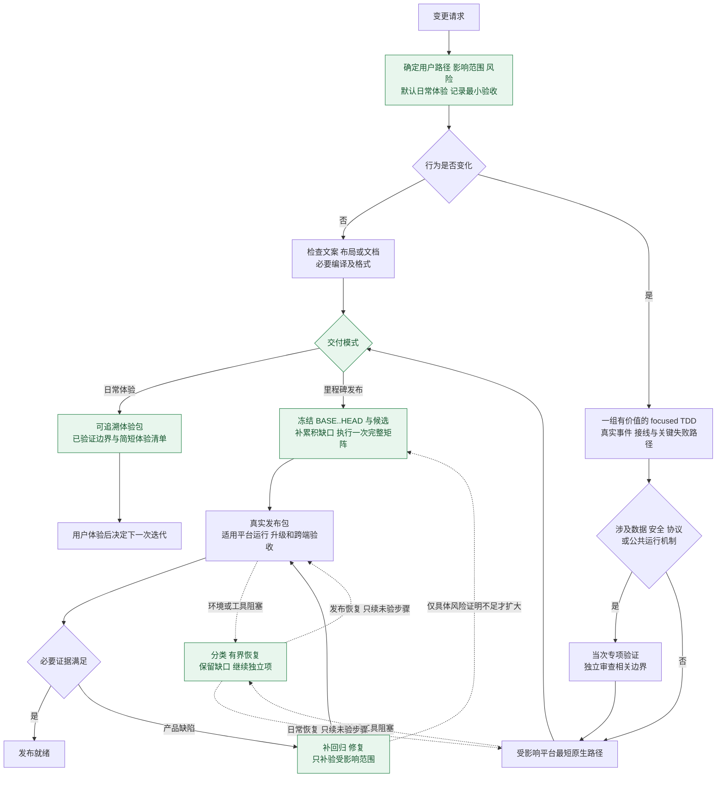

# 测试与自动化验收流程评估

日期：2026-10-06。仓库调查基线：`fb59f15b18`。本文是本次评估与建议方案，不改变现行 AGENTS、发布门禁或已约定的验收项。

**建议把按风险选择验证范围的日常体验流程设为默认，把完整回归与三端发布验收放到明确指定的里程碑。** 目前的问题既包括重复验证，也包括测试夹具不稳定、运行证据层级混用、工具入口漏查，以及缺少低成本交付体验版的路径。继续增加审批和检查条款，不能单独解决这些问题。

不建议把所有测试推迟到功能定型之后。应立即验证核心行为、真实接线、数据与安全边界；可以延后的是完整回归、广泛平台组合、耗时的发布验收和易随交互变化报废的细碎 UI 用例。真人体验判断功能是否有价值，自动化保护已明确的行为，两者各有作用。

## 1 调查范围与证据

- 对 Git 跟踪的项目 Markdown 做限定扫描，排除导入的 UI kit 参考包：142 份中 141 份提及测试或验收，包含 50 份 roadmap。这说明规则分布广，不等于有 141 个独立门禁。
- 深读现行 AGENTS、测试指南、平台验收文档、适用架构要求；核对构建脚本、Gradle 标签、CI 和主要 roadmap。历史规划按入口和冲突条款抽查，没有逐条复核全部历史验收结果或枚举所有测试方法。
- 读取用户指定的两个会话的本地原始日志。当前工具目录未暴露 `read_thread`，故限定读取相应 JSONL；只使用用户消息、公开进度、工具调用及结果，不以内部思考作为证据。
- 两会话分别在工作树 `0877`、`f235` 执行，不能用本仓库父 roadmap 当前状态倒推它们当时未获授权。下文所有会话时间均为北京时间。
- 未运行产品测试、构建、安装或远端设备操作；本次新验证仅为 Windows Computer Use 的模块导入和只读窗口枚举。现有工作区的同步原型及设计改动未纳入本次修改。

主要来源：

| 编号 | 权威或入口 | 用途与边界 |
| --- | --- | --- |
| R1 | [AGENTS](../../AGENTS.md) | 当前 TDD、分层验证、全量触发、审查、提交和运行验收的项目规则；另受本次用户提供的通用预算与权限约束 |
| R2 | [Test Guide](TEST_GUIDE.md)、[API Reference](API_REFERENCE.md) | Desktop 操作方法和 Test Mode 的真实能力；含部分陈旧门禁文字 |
| R3 | [macOS 验收](MACOS_ACCEPTANCE.md) | 正式应用、LaunchServices、Keychain、窗口、输入与历史失败处理 |
| R4 | [Android 构建与验收](../architecture/android-build-and-acceptance.md) | 身份、签名、候选、安装、模拟器与真机、R8、升级证据 |
| R5 | [Desktop UI 规范](../design/mihon-desktop-ui/README.md)、[页面契约](../design/mihon-desktop-ui/page-contracts.md) | 真实事件、导航、焦点、视觉来源；存在阶段完整验证旧条款 |
| R6 | [Desktop 构建入口](../../scripts/build-desktop.sh)、[Windows 实现](../../scripts/build-windows.ps1)、[Android 入口](../../scripts/build-android.py) | 命令真正执行的测试、构建和运行范围 |
| R7 | [Desktop Gradle](../../app-desktop/build.gradle.kts)、[Desktop CI](../../.github/workflows/desktop-ci.yml)、[Android CI](../../.github/workflows/build.yml) | 标签过滤、专项任务、CI 实际门禁 |
| R8 | [父 roadmap](../roadmap/2026-06-30-mihon-desktop-refactor-roadmap.md)、[当前子计划](../roadmap/2026-09-30-desktop-interaction-iteration-roadmap.md) | 当前工作树宏观阶段与最终矩阵；不能将所有历史计划叠加执行 |
| R9 | [原生 UI 试点封存记录](archive/NATIVE_UI_REVIEW_EXPLORATION_2026-09-29.md) | 仅同步面板试点，已封存，不是全应用预览或通用自动化方案 |
| R10 | [双页会话](codex://threads/01a102cd-3448-7a31-b105-6f534c98513c)、[历史页会话](codex://threads/01a102d8-f600-7c61-a5e0-a214f8954036) | 实际执行、失败、审批及能力判断记录 |

## 2 现行要求总表

以下归纳规定的类别、触发与退出边界。它覆盖测试流程规则，不把每项产品设计断言重复抄成另一套权威。

| 类别 | 何时触发 | 当前要求及停止边界 |
| --- | --- | --- |
| 行为红绿重构 | 新增、修改、修复产品行为 | 先确认失败原因，再最小实现，清理后复验相同 focused 范围；没有对应行为测试不得提交。纯文档、纯文案、机械调整豁免 |
| 真实实现与复用 | 全部行为验证 | 执行 production 与 wiring；禁止源码字符串存在检查、复制实现、虚假成功。优先复用共享核心和测试设施 |
| 跨端契约 | Android/Desktop 预期相同 | 用共享契约覆盖；平台 adapter 用独立集成测试，不各自维护互不约束的语义 |
| 领域与数据 | 用例、仓库、迁移、持久化 | 对应行为测试；涉及数据完整性时覆盖事务、失败恢复、真实旧库或持久化重开，不能用伪造版本号的当前库代替旧库 |
| 导航与 Screen | 修改页面、Tab、push/replace | 实例化、Screen/Tab 类型、实际导航上下文与事件接线；不能只检查目标类型而漏掉调用者 |
| DI | 新绑定或取依赖点 | 相关模块实际初始化并解析；新 Composable 依赖纳入 wiring 检查 |
| HTTP/API | 客户端、源、解析、加载变化 | MockWebServer 走原始响应到领域对象，成功、空/缺失、403/429/500、畸形体；不 mock parser |
| UI | 页面、导航、弹层、列表交互 | 固定入口、反馈、返回、焦点和适用危险操作确认；执行真实事件；源码、项目策略和 HTML 模拟来源分开 |
| 原型 | HTML/JavaScript DEMO | 文案做页面与 diff 检查；交互做相关 Node/浏览器测试；模型 TDD；共享预览覆盖双端隔离。不得升级成全产品构建 |
| 批次与阶段 | 独立用户能力完成 | 受影响单元、集成、wiring、格式检查；不是每批默认完整模块测试 |
| 独立修复 | 没有 roadmap | 对应回归、受影响集成、格式即可收口；提交与会话结束不是全量理由 |
| 最终矩阵 | 当前 roadmap 实施任务完成后 | 进入单独最终验收任务，按计划一次完整 Android/Desktop、Test Mode、正式构建与平台运行；不能提前执行 |
| 失败及补验 | 当前验证失败 | 保留首次结果，先分类和集中修复，定向补验；未受影响证据可复用，不宣称最终代码重新全量通过 |
| 扩大验证 | focused 覆盖不了具体风险 | 先说明未覆盖风险、较小范围不足、最小新增范围及成本，再取得授权；额度上限不是必跑次数 |
| 审查与提交 | 功能批次交付 | 实现、必要独立审查、验证、提交齐全才勾选；高风险接口在下游使用前审查。测试/实现/必要记录同批提交 |
| 过程预算 | 启动及显著扩展 | 声明步骤、代理、审查、测试和成本；默认最多两代理、一轮独立审查与一轮必要修复复审。持续相近任务复用代理 |
| Gradle 生命周期 | 重型验证/构建 | 同工作树协调器串行；等待超时先查原任务，不另起 Gradle；只处理本任务精确进程树 |
| 环境与网络 | 工具链、远端依赖或代理行为 | UTF-8、SDK/JDK/实例身份、代理与本地 bypass；网络有界重试。代理必须验证真实发布客户端的握手/TLS/HTTP阶段，curl 不代替业务 |
| Desktop 交付 | 正式收口 | 统一脚本、版本分配、产物追溯、production runtime；Windows 报告必须引用已存在的 `Final unpacked EXE`，临时 build 路径不作交付 |
| Android 交付 | 候选、安装、升级 | 使用统一 candidate/verify/install；原签名连续、版本单调、Debug 隔离；安装与 UI 操作授权分开；失败不清库、换证书或降级绕过 |
| 原生与视觉 | 对应平台交互验收 | HTTP、离屏、原生输入、截图、实体硬件各有证据边界；headless 不证明窗口与输入；Test Mode 本身无截图 API |
| 安全与真实环境 | 凭据、权限、真实账号/设备 | 隔离 profile/设备/端口，真实系统安全存储，保留失败；不能靠修改系统保护、假存储或读取真实秘密换取通过 |
| 溯源与状态 | capability、发布、升级 | manifest 是能力状态权威；roadmap/tracker 不反向覆盖。源码、相关 diff、构建配置、产物哈希、环境和实际执行范围须对应 |
| 维护与报告 | 长期规则或能力变化 | 同步文档；Mac 新经验回写原入口；区分产品失败、环境阻塞、未执行与通过，不以进程退出或文件存在证明验收 |

专项规则按影响追加：阅读器共享核心/资源租约/进度权威、同步协议与安全存储、数据库迁移、扩展签名/安装/重载、代理路由、发布身份与构建依赖。相关入口见 [reader-authority](../architecture/reader-authority.md)、[reader-shared-core](../architecture/reader-shared-core.md)、[migration-authority](../architecture/migration-authority.md)、[desktop-extension-artifacts](../architecture/desktop-extension-artifacts.md)、[desktop-network-routing](../architecture/desktop-network-routing.md)。这些不是每次改文案都要执行的附加矩阵。

CI 是独立触发的集成检查：Android workflow 运行 `testReleaseUnitTest` 和 unsigned candidate；Desktop workflow 在 Windows 运行默认 `jvmTest`。本地不需要为等待 CI 而反复重跑等价命令；反之，CI 未覆盖的 Mac 原生、Android ART/R8 或真实数据行为也不能靠 CI 绿灯补足。

## 3 现状流程图

实线表示当前 AGENTS 规定的主流程；红色虚线表示文档、工具及实际执行中发现的扩张路径，并非当前规则要求重复全量。

### 命令名称不能代表实际范围

| 当前入口 | 实际范围 | 易误解之处 |
| --- | --- | --- |
| `:app-desktop:jvmTest --tests ...` | 指定测试，仍受标签过滤 | 指定类不保证被标签排除的用例真的执行，须看测试数与 skip |
| `:app-desktop:jvmTest` | 完整默认任务；排除 integration、live-network、network-survey、final-parity-audit、parity-governance | 是完整模块调用，但不是所有测试类别 |
| `build-desktop.sh full-tests` | 默认完整任务再启用 integration | 不自动包含 live-network、survey、独立 parity、Android 或原生硬件 |
| 默认 Desktop build | JVM 测试＋版本分配/构建；Windows 另做真实包运行检查 | 先 full-tests 后默认 build 会重复测试 |
| `build-only` | 跳过脚本 JVM 测试，仍分配版本及构建 | 当前仅最终收口可用；不是现有日常快速体验模式 |
| Mac build 分支 | 测试或显式跳过 → createDistributable → 复制 `.app` | 源码分支没有 Windows 同等的启动运行验收，输出路径不表示原生通过 |
| `desktop-smoke-test.sh` | `*Smoke*` 测试过滤，同时 `--rerun-tasks` | 可能重跑前置编译；“smoke”不等于廉价无副作用 |
| `finalParityAudit` / final parity runner | 独立 capability 治理审计 / 正式 Test Mode 场景 | 仅在对应最终计划触发，不是普通功能退出条件；后者还依赖 provenance |
| Android `candidate` | Release/R8、签名、校验及清单 | 不隐式测试、安装、操作应用或发布；CI 可保存未通过测试的 unsigned 产物 |

### 当前明确冲突和缺口

1. **证据复用规则冲突。** AGENTS 第 59–63、192–200 行允许完整基线加相关补验；Test Guide 第 52–60 行仍要求同一 diff 的完整测试证据。旧 roadmap 也重复该要求。
2. **阶段完整测试冲突。** Desktop UI README 的“受影响模块完整验证一次”、部分旧 roadmap 的阶段完整矩阵，与现行 AGENTS 的阶段 focused 规则冲突。Android 规范分层表的“阶段/最终”也应拆开，避免误读。
3. **快迭代与发布绑在一起。** 小型功能只要写成两任务 roadmap，就很容易从“实现”直接走“最终三端交付”。现有正式构建规则没有通用体验版出口；原生 UI 试点已封存，不能拿它当全应用替代品。
4. **测试命名与门禁不透明。** `full-tests`、普通 JVM、集成、Test Mode、parity 与真实原生是不同集合，且普通构建隐含测试。Windows/Mac 同名成功也不是同层证据。
5. **观测能力不等于用户界面状态。** HTTP 状态可能不属于眼前 UI 实例；Compose/AWT/UIA 的控件树不完整；headless、元数据和真实像素各证明不同内容。
6. **工具发现没有统一前置。** 把工具名称缺失或旧 `cua_repl` 禁用等同于没有 Computer Use，在指定会话中已被直接反证。
7. **规则越补越细，仍缺成本停止条件。** 审批额度被理解成“下一次全量需再问”，不是“先判断是否需要下一次全量”；短诊断预算又被误解成频繁停工许可。
8. **历史经验与当前指令混杂。** 父 roadmap 第 7 行已有 active child，第 410 行仍称没有。历史报告、封存试点和旧失败必须标注适用范围，不能成为当前新增任务来源。

## 4 两个会话的实际行为

### 4.1 双页规则会话

[会话](codex://threads/01a102cd-3448-7a31-b105-6f534c98513c) 从 10 月 4 日 01:26 至最后记录 10 月 5 日 21:27，跨度约 44 小时。目标包含共享双页规则、两端呈现与资源调度，以及三端正式验收；不是一个单控件修改。最后 SP01 已完成，DP02 仍有原生验收缺口。

| 事实 | 对流程的判断 |
| --- | --- |
| 开始估计 18–30 小时、约 12 次定向循环；C 原估 3–5 小时，后来已用 13 小时 19 分；文件范围达 84 个 | 估计没有及时转成具体未解决风险与交付边界；按文件数本身不能判越界，但实际成本已明显失控 |
| 存在伙伴追加丢进度、挂载即计读、内容租约崩溃、取消后仍占解码等真实缺陷 | 必须修复这些行为，不能把相应红绿循环统称无效测试 |
| 同时反复修错误槽位、旧断言、参数/任务名、辅助编译、时钟与原图采样夹具 | 测试基础设施不可靠造成大量无效或低信息量失败，应先稳定契约和夹具再运行 |
| 截至 10 月 5 日 02:17，协调器去重后共 370 条：237 测试相关、1 测试/构建混合、85 构建、47 格式 | 不是 370 次全量；包含实施代理命令与预期 TDD 红。174 FAILED 不能解释成 174 个产品 bug |
| 上述命令约 200.6 分钟，加另计 59 份原生 stdout 报告 34.16 分钟，约 3 小时 55 分；统计窗口约 24 小时 47 分 | 可见机器执行约占 16%；剩余时间包含测试编写、诊断、交接、等待等，不能叫“84% 都在实现”，也不能准确归为测试净耗时 |
| 10 月 5 日 03:00 才开始首次 Desktop 完整测试；`start` 被拦后 `run` 实际执行 | Desktop 完整仅核实 1 次，不能把被拒启动再算一次；正式全量不是前半段拖延主因 |
| domain JVM/Android、Android App、客户端后续有实际完整范围；另一次误启动未过滤 Android 测试被取消 | 范围错误应记录为取消，不能记通过；客户端第一次缓存结果与之后实际 53 项执行需区分 |
| 原生验收陷入 R8 观察字段、数据库驱动、WAL、首帧条件等；最后 Android 夹具修正关闭问题，产品代码未变 | 验收工具/数据准备失败需独立分类，避免每次都当产品回归并触发重建/扩大测试 |
| 30 分钟诊断阈值一度变成再次请求许可；用户明确其目的是提速，随后才改为内部收敛点 | 需要有界排障与自主继续，不能把限额制度再变成审批循环 |
| 用户要求 Windows Computer Use 后，仍称无专用工具并走外部替代；末尾为 Windows 锁屏 | 锁屏可能是真实当前阻塞；它不证明 Computer Use 本身不可用，日志未见查 `@oai/sky` |

证据定位：该会话 JSONL 的 19996–20032 行为统计与超时回顾，20447–20532 行为首次 Desktop 完整启动，21495–21596 行为误启动/客户端范围，23530–23568 行为用户纠正预算解释。统计首次脚本在已输出协调器结果后遇编码错误；后续原生耗时单独补算，故这里只采用明确返回的部分，不称完整剖析。

**主要问题是过细的验证循环、夹具返工、验收临时工程和进度协调成本，而不是不断重复完整 Desktop。** 改进重点应是稳定可复用的测试入口、按完整用户能力成批验证、提前验证平台观测路径，以及允许先交付体验版。

### 4.2 历史页会话

[会话](codex://threads/01a102d8-f600-7c61-a5e0-a214f8954036) 从 10 月 4 日 01:39 至 10 月 5 日 12:44，跨度约 35 小时。HP01 约 5 小时 35 分完成并提交，受影响测试 348 项通过；之后主要进入 HP02 平台收口。

| 时间 | 观察与判断 |
| --- | --- |
| 10/04 07:14 | 首次 Desktop 完整测试 3321 项，4 失败、3 跳过；包括真实依赖接线治理缺口与旧夹具问题。首次矩阵本身有价值 |
| 10/04 上午 | data 暴露同步监听 scope 生命周期缺口，经用户批准扩展修复；不能据此认定是历史页改动引入 |
| 10/04 11:23 | 第二次 Desktop 完整 3322 项，剩 1 个焦点等待失败；只校准等待，定向测试已绿 |
| 10/04 11:40 → 14:23 | 又申请第三次 Desktop 完整并等待约 2 小时 43 分；14:30 完整通过。这次缺乏 focused 无法覆盖的风险理由 |
| 10/04 15:51 → 15:59 | 原生可访问名称缺口导致再申请四个完整目标；用户质疑后撤回，未执行。会话明确承认第三次及最新申请过度 |
| 10/04 至 10/05 | 另有把局部前台限制当整体暂停、把息屏当锁屏、R8 夹具/代理/UI 断言等问题；模拟器仍可继续却一度停工 |
| 10/05 12:38 → 12:44 | 先称无桌面工具，再查 Node 入口并完成导入、窗口枚举和正式 75 窗口无截图读取，自行纠正判断 |

真实完整调用核实：Desktop 3 次；data JVM、data Android、Android App 各 2 次；domain 双端、presentation-history 双端各 1 次。客户端 52 项曾为缓存复用，不能算新执行。至少两段审批等待合计约 4 小时 34 分，不能算测试进程耗时。

证据定位：JSONL 6506–6854 行为等待校准、第三次申请及执行；8011–8049 行为四目标申请、撤回与认错；10266–10338 行为 Computer Use 实际成功。

**这里存在明确的过度验证：把“最终全量重新变绿”当成默认退出条件。** 原生可访问性缺口原测试根本没覆盖，再跑相同全量不解决这个证据缺口，应补真实页面定向测试与原生复验。

### 4.3 不能倒用新规则解释历史

两会话起初的 AGENTS 已要求失败后 focused、再次全量需审批，但更明确的“首次完整基线＋局部补验即可关闭”和扩大申请论证门槛，是 10 月 4 日 16:13 左右才加入。第二会话在此之前已承认判断过度。结论不是简单追责违反后来规则，而是此前的审批式门禁容易诱导重复申请；新规则修正了部分问题，但旧指南和入口仍未同步。

## 5 建议采用的默认流程

只保留两种交付模式，不再按每种按钮建立一套流程：

- **日常体验，默认。** 本次变化按风险选最小充分测试，受影响平台做一条真实用户路径，产生可追溯体验产物，交给用户体验。无需等待里程碑完整矩阵。
- **里程碑/稳定发布，用户明确指定。** 冻结提交范围与当前候选，审查累积风险和欠缺验证，执行一次约定完整矩阵，完成真实发布 runtime、升级与适用跨端验收。

发布模式不会豁免尚未满足的安全、数据或正式签名门禁；日常模式也不允许把已知核心故障交付成“正常”。对不可逆的数据、安全和协议变化，专项验证与独立审查仍发生在本次使用之前。

### 建议流程图

图中“继续独立项”不把阻塞记成通过；里程碑缺必要证据仍不能发布。日常体验如只是非关键平台未验，可交付已验证平台并清楚列出限制；若连本次核心功能都无法验证，则报告实现状态与阻塞，不称体验通过。

### 以变化和风险选择验证

| 例子 | 日常最低充分范围 | 通常无需做 | 何时扩大 |
| --- | --- | --- | --- |
| 改一处普通控件文案 | 目标页面查看、截断/本地化资源检查、diff；涉及资源生成则必要编译 | 为字符串写新单元测试、全模块、三端打包 | 文案改变危险操作语义，或共享组件布局受影响 |
| 调颜色/间距/图标 | 相关组件及受影响尺寸/主题视觉检查，已有语义行为复用 | 全应用像素矩阵 | 共享 token、缩放或布局机制变化 |
| 给现有功能加按钮 | 一条真实点击→已有动作→反馈测试；涉及导航/DI则补对应接线；一条原生点击路径 | 为同一事件建立多层镜像测试、全模块 | 删除/批量/付费/数据动作，或新状态与新接口 |
| 局部 bug | 可复现回归红绿、相关集成、格式；重构后同范围复验 | 因提交或“修好了”全量重跑 | 发现跨模块传播且无法限定 |
| 新普通功能 | 正常路径、一个最重要失败/空状态、真实接线；触发协议有强制边界时补足 | 所有设备/主题/语言笛卡尔积 | 变成跨端能力、关键持久化或公共基础设施 |
| HTTP/源解析 | 对应成功、缺失、403/429/500、畸形响应契约 | 每次真实远端全源调查 | TLS/代理/认证/运行时差异需真实链路证据 |
| 数据迁移/同步/凭据/删除 | 当次验证回滚或失败恢复、持久化、身份边界及共享契约；独立审查 | 延后关键正确性到定型 | 按真实风险选择设备、旧版本及发布 runtime |
| 依赖、Main dispatcher、R8、签名、native ABI | 真实 production classpath/包专项验证与受影响系统集成 | 只凭 JVM mock/编译成功收口 | 影响无法限定才申请模块级，再必要时扩大 |
| HTML 原型 | 既有 Node/浏览器对应测试，实际改页面观察 | Android/Desktop 正式构建 | 原型结论需要在产品实现时另验原生 |

这里的“最低充分”是测试选择原则，不是固定测试数量配额。一个高价值测试可以覆盖多个断言；低风险改动不需要为了齐全而每层各造一个测试。保留现有行为 TDD，不要求先构建整个新测试框架再交付按钮。

### 明确停止条件

1. 开始时列出本次用户路径、关键边界、受影响集成点、平台、选定命令和交付模式，通常一张简表即可。
2. 选定范围通过、无未解释的相关失败、必要审查完成，即结束该批。每条新测试必须对应一个尚未覆盖的具体风险。
3. 完整矩阵失败后保留基线，集中处理已知相关失败；定向补验足够即关闭。额外模块失败先判断关联，不自动纳入当前修复。
4. 环境/工具失败先查前置与原进程；同条件重复执行不会产生新证据时停止重跑。诊断时间约定是内部检查点，预算内必要工作继续，不自动变成向用户请求续费/许可。
5. 测试夹具可单独失败。先修复能解释失败的夹具问题；不能通过放宽产品断言、取消门禁或把 skip 当通过来收口。
6. 无相关代码或环境变化，不重复已有效验证；不为文件名包含最终文档提交 hash 而重建。

## 6 在提交范围上集中完整测试是否更高效

**对本项目的探索型开发，通常值得采用，但应合并完整回归，不应合并掉每次变化的最小保护。** 此结论是对项目行为和成本结构的推断，不是已测得的节省比例。

里程碑输入可以是 `BASE..HEAD`，按以下步骤执行：

1. 固定 BASE、候选 HEAD、工作区相关 diff 与构建输入；用 Git 范围梳理最终行为、共享依赖、数据/协议、平台 adapter、构建配置与新增入口。
2. 在最终候选上审查累积变化和缺失测试，不逐个历史提交重新跑一遍。需要定位回归时才二分或回放个别历史状态。
3. 复用仍适用的 focused 与专项证据，补从未执行的交互/平台风险；不能把仅运行过 JVM 的行为记成真实 R8、Mac 或硬件已验证。
4. 执行一次提前写明任务、标签、平台与排除项的完整矩阵；结合原生与升级验收。所谓完整是相对于明示矩阵，不是仓库一切历史任务。
5. 首轮失败集中修复后定向补验；构建输入变化须生成对应新候选，并重验受影响 runtime。与修复无关的通过项可以复用，记录为组合证据。

成本模型：多次迭代各自完整验证的成本约为 `迭代次数 × 完整矩阵成本`；建议方式为 `各次 focused 总成本 + 一次完整矩阵 + 必要缺口修复`。节省会被缺陷延迟发现抵消，因此数据、安全、协议、公共 runtime 等问题不能拖到最后。

一个里程碑只保留一份紧凑记录：范围、风险、命令/结果、基线、修复后的影响、产物、平台缺口。不要再创建逐测试快照或第二套状态系统。若交互尚未定型，优先保存稳定的状态转换与用户结果测试，减少绑定坐标、私有字段和动画瞬时帧的脆弱断言。

## 7 稳定自动化验收应如何组织

### 7.1 先建立可发现的能力链

统一顺序应是：**发现本会话工具/技能 → 初始化 → 无写入健康检查 → 核对目标设备与候选 → 准备隔离状态 → 观察 → 一次动作 → 再观察并断言 → 精确清理。**

本次 Windows 实测：

- Node REPL `import('@oai/sky')` 成功；`sky.target` 为 `windows`；`sky.list_windows()` 成功返回窗口集合。
- 缓存技能要求 `sky.documentation(...)`，但当前实际导出没有该方法。本次读同版本插件的 `docs/guidance.md` 和 `docs/api.md` 后完成只读探针。应归为技能与运行时接口漂移，不能据此宣称 Computer Use 不存在。
- 本次没有测试截图或输入，也没有连接 Mac，因此不能宣称三平台自动化已打通。

第二会话还已经证明正式候选的无截图窗口读取成功，但只得到窗口外壳，未得到内部搜索框/弹窗。**工具能连接、目标能选中、控件能观测、动作能执行、断言能成立，是五个不同检查点。**

官方 [Computer use 文档](https://developers.openai.com/api/docs/guides/tools-computer-use) 说明了通过代码执行或工具操作界面、并由执行环境维持状态的方式；它不能证明本机某个插件或远程主机已就绪。本机判断应以实际技能、导入和健康检查为准，不能根据某个工具名字或旧开关推断。

### 7.2 四种环境共用验收语义，保留平台执行方式

| 环境 | 首选现有能力 | 每次前置 | 适用边界与停止 |
| --- | --- | --- | --- |
| 本机 Windows | Node REPL 的 Computer Use；Test Mode 只读业务断言 | 精确 EXE/PID/窗口、候选版本、隔离 profile、屏幕状态；读取当前真实窗口，不凭标题关键词选中资源管理器 | 真实事件验证入口；HTTP 不代替点击。UIA树不足时走获准的目标窗口视觉路径；没有观测依据不能猜坐标 |
| 局域网 Mac | 已配置主机上的本地执行；现有 Mac 原生脚本用于已支持场景，其他能力先探测 | 主机/checkout/产物一致；LaunchServices 启动；桌面未锁、目标前台/命中、权限、profile/端口 | SSH 只是传输；息屏、锁屏、Keychain、输入权限分别判断。同步专项脚本不是全应用控件工具 |
| Android 模拟器 | 现有 adb、原生 instrumentation、UIAutomator/已有 Android runner | 本次 `adb devices -l`、指定 serial、API/ABI、包名/版本/签名、前台、隔离数据 | 普通功能默认这里；检查 runner终态、执行数、失败/skip。R8敏感项用实际Release宿主，不以Debug替代 |
| adb 真机 | 与模拟器相同入口，精确指定设备 | 必要性、既有安装/数据、用户已给安装及操作授权、系统/OEM能力 | 仅 OEM/硬件/真实升级/模拟器不能覆盖的风险或用户要求时追加；不因每次开发而默认操作个人设备 |

Mac 的最小运行命令继续来自 R3：核对候选后 `open -n -W -a <绝对.app路径> --args --test-mode --test-profile=<隔离目录> ...`，验证原生时不能 headless。不能把 `open -W` 包装器 PID 当产品 PID，不能因一个连接失败就判断没有桌面。

设备升级并非必然只能真机测：普通同签名数据迁移可先在隔离模拟器用可信旧版验证；用户已有安装或 OEM/硬件特有状态才需要相应真实设备证据。真实性不能用“模拟器”或“真机”的标签概括，应看实际要证明的风险。

### 7.3 消除不必要的工具阻塞

建议把当前“Test Mode 不截图”的约束写清作用域：Test Mode 不加入通用桌面采集能力；外部 Computer Use 可在任务授权、工具安全规则允许时，只观察本任务隔离候选窗口。真实秘密、其他应用、系统权限和认证提示仍遵守工具规则。**这是建议修订，不能当作本报告已修改了当前约束。**

Windows 使用新鲜窗口对象和当前观测，观察后一次动作再读回；Mac 复用已验证的前台/命中与原生事件保护；Android 在页面、键盘和滚动变化后重读。对 UIA/AX 不完整先用现有获准能力诊断，再判断是否需要给产品增加稳定语义；不要先为一次验收发明 Attach/反射/私有字段桥。

不建议重启“把全应用都搬到独立审阅窗口”的封存方向。应复用真实产品入口和少量稳定业务夹具；每个场景描述用户动作与可观测结果，由平台执行器处理窗口、坐标和设备差异。

### 7.4 把前置和失败分类固定下来

| 状态 | 示例 | 下一步 |
| --- | --- | --- |
| PASS | 正确候选的真实事件及断言通过 | 保存所需证据，结束该项 |
| PRODUCT_FAIL | 数据丢失、事件无效、错误状态转换 | 回归红测与修复，补验相关范围 |
| ENV_BLOCKED | 锁屏、设备离线、必需权限/网络不可用 | 有界恢复或等待对应用户动作；继续不依赖它的工作 |
| TOOL_FAIL | SDK方法漂移、R8观察夹具失效、窗口句柄失效 | 检查当前工具契约并修工具；不自动判产品失败或重跑全量 |
| NOT_RUN | 当前没有该平台或硬件证据 | 明确缺口；不能写 PASS 或随机归为不适用 |

每次探针与场景输出最少字段：候选/源码身份、平台、profile别名、场景、层级、开始/结束、状态、理由、下一步和日志位置。复用已有 coordinator 日志、artifact清单及报告，不另建服务。秘密、私人设备标识与原始敏感画面不写长期记录。

重试应由失败原因决定：有证据表明短暂窗口/连接变化时，刷新目标后做一次有界重试；同样条件下重复失败时停止盲试。重试的成功与首次失败分别保留。运行中的 Gradle 或应用等待不能另启相同实例。

## 8 改进前后对应关系

| 改进 | 目前 | 建议最终形态 |
| --- | --- | --- |
| 1 默认交付 | roadmap 容易将一次小迭代引入三端最终收口 | 默认日常体验；发布由明确里程碑触发 |
| 2 验证选择 | 文档分散，按阶段/全绿状态追加 | 按行为、依赖、风险与用户路径选择最小充分范围 |
| 3 红绿粒度 | 夹具/小命令/格式反复启动 | 一个独立用户能力的一组 focused；必要红绿保留，批末一次范围格式检查 |
| 4 完整测试失败 | 反复申请重跑，等待审批 | 保留基线、集中修复、相关补验；扩大必须解释缺口 |
| 5 体验产物 | 正式构建绑定全量、版本与发布验收 | 统一脚本增加体验模式，复用同一产品与打包链；显示未发布状态和验证边界 |
| 6 平台可靠性 | 每次临时找工具、修夹具 | 固定能力发现和前置探针、稳定场景、分类结果、恢复后续未验步骤 |
| 7 视觉与输入 | Test Mode 限制被扩大为平台无能力 | 业务断言、原生事件、外部视觉各自明确；不把一种证据冒充另一种 |
| 8 设备矩阵 | 收口容易默认全部平台/真机 | 日常受影响平台；Android模拟器默认；真机按具体风险追加 |
| 9 证据与状态 | 多文档重复规则，旧记录像新门禁 | 一份规则权威、一份操作入口、现有平台附录；每里程碑一份紧凑证据 |
| 10 预算 | 时间上限可能诱导频繁许可请求 | 内部收敛检查点；仅真实超预算/扩范围/不可逆动作需要决定 |

## 9 建议如何落地

本次只完成评估，不把下面的建议命令写成已经可运行的接口，不扩大到验收框架实施。

1. **先统一规则与退出条件。** AGENTS 保留短的默认模式、风险分级、停止/扩大规则；Test Guide 只解释操作；修改旧指南、UI规范、仍生效 roadmap 的冲突文字，历史文件明确封存。将体验可交付与发布验收待完成分开记录，不强迫一个 checkbox 表达所有层次。验收：按“文案、按钮、数据迁移、里程碑失败补验”四个例子走查，不能导出相互矛盾的测试范围。
2. **增加体验交付与能力预检。** 在现有构建入口增加独立体验模式；复用正常产品入口和 runtime，使用隔离输出/可追溯标识，不隐含全量、不混入正式发布。Android复用已有Debug；需要R8证据时用现有candidate。给 Windows/Mac/Android 统一前置结果和最小启动场景。验收：模式行为TDD；证明不隐式启动全量/安装/正式发布；真实三个平台分别完成一次精确候选启动与自有实例清理。工具不可用时保留具体平台缺口。
3. **只维护高价值自动化场景和里程碑矩阵。** 先覆盖启动、书架→详情→阅读器、变更对应入口、持久化重启，以及本次涉及的同步/下载/迁移风险；复用现有Test Mode与native runner，不重建全应用观测树。把 `BASE..HEAD` 风险清单、标签过滤及证据复用规则放在一次里程碑记录中。验收：每个声明通过的场景实际执行；故意失效的前置能正确分类而不会点击错窗口；完整矩阵仅在该里程碑最终冻结时执行一次。

实施这些批次时再按功能风险分派与声明预算，不在本报告中预授权部署、全量或设备安装。首先解决规则冲突和体验出口，收益通常高于增加更多用例；原生框架只补现有能力的具体缺口。

观察之后连续三次普通迭代：首次可体验时间、测试/构建净耗时、验收工具失败次数、无新证据的重复执行、等待审批时间、体验后发现的相关缺陷。按事实调整流程；不预设测试数量越多质量越高，也不承诺未经测量的额度节省比例。

## 10 本次交付与未验证边界

- 已完成现行规定分类、脚本/CI核对、两个指定会话分析、现状与建议流程图、变更规模选择表、平台验收方案及迁移顺序。
- 本次没有修改产品、构建脚本、AGENTS 或运行门禁；没有宣称任何产品 bug 已修复。
- Windows Computer Use 已核实导入和窗口枚举；历史会话核实过目标窗口无截图读取。截图、输入、Mac远端、模拟器和真机在本次未做运行验收。
- “所有测试要求”按规则类型和适用入口整理；50份历史roadmap未逐项验真，不把历史报告的通过结论提升为本轮证据。
- 后续要让新流程实际生效，需要落实第9节的规则/脚本/平台批次；它们是后续实施范围，本次报告本身不能保证未来每个设备始终在线或权限可用。
