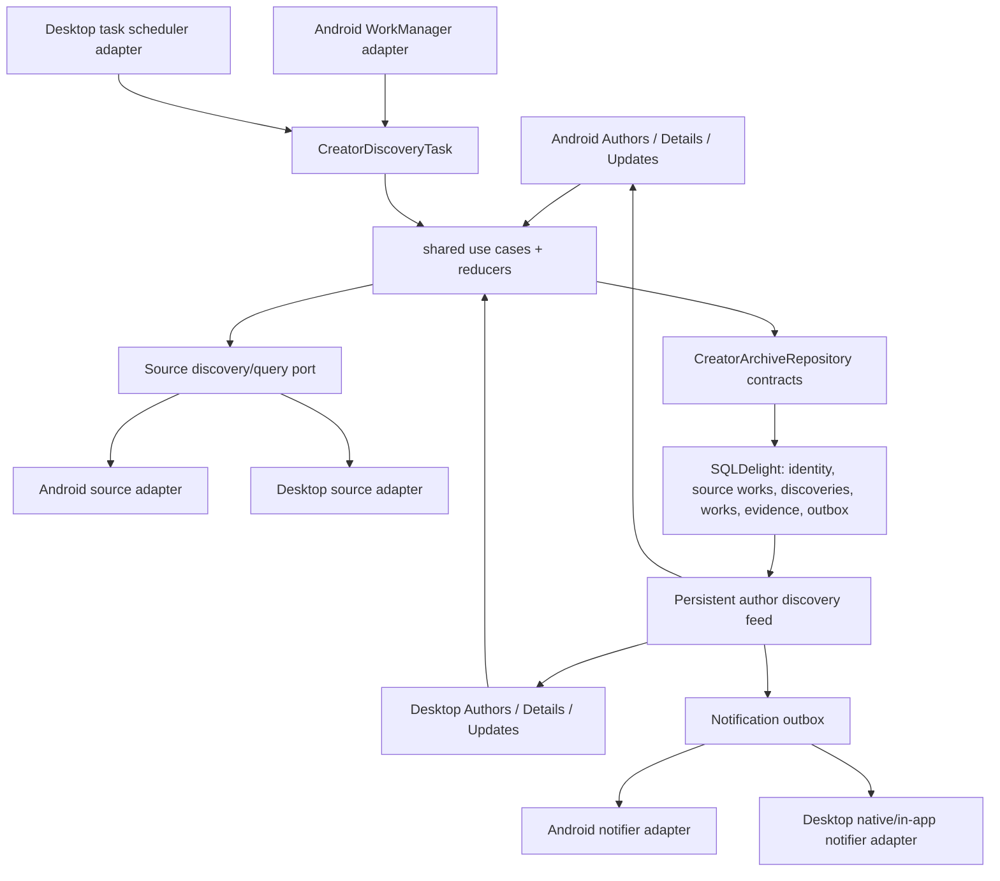
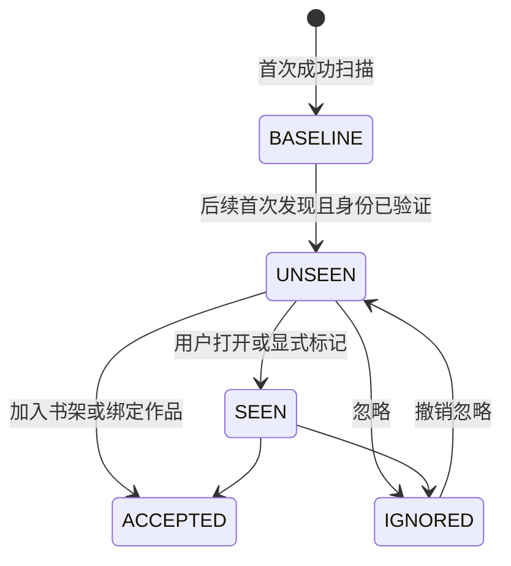
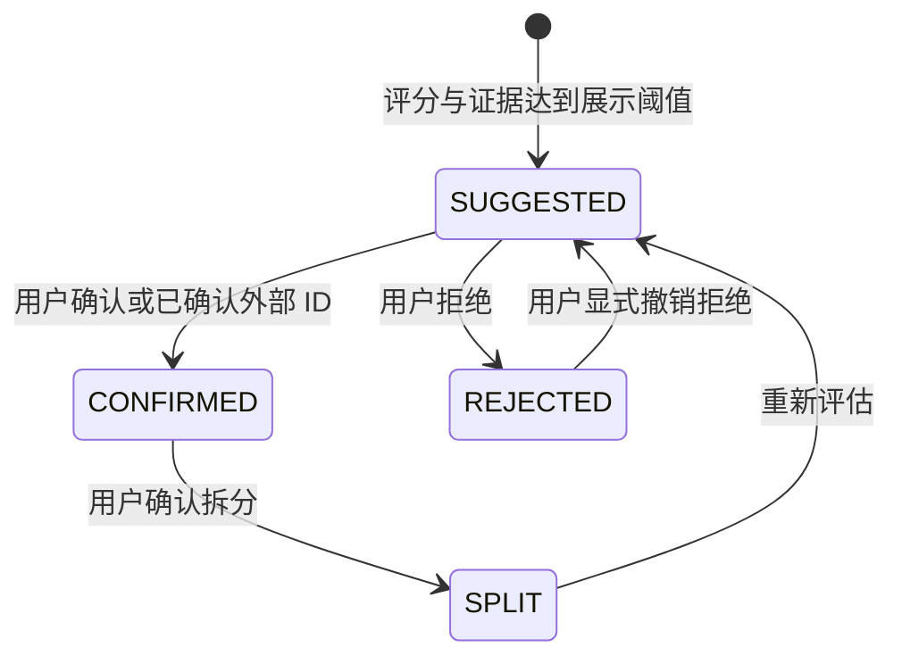

# 作者作品聚合、新作提醒与语言证据闭环 Roadmap

- 制定日期：2026-08-11
- 状态：`PLANNED`（尚未激活，不改变父路线当前唯一 `active-child-plan`）
- 产品规格：[`author-archive-discovery-plan.md`](../author-archive-discovery-plan.md)
- 审计基线：`main@024212ac6`（2026-08-11，只读审计）
- 上级路线：[`2026-06-30-mihon-desktop-refactor-roadmap.md`](./2026-06-30-mihon-desktop-refactor-roadmap.md)
- 协调计划：[`2026-08-02-mihon-desktop-non-reader-upstream-core-roadmap.md`](./2026-08-02-mihon-desktop-non-reader-upstream-core-roadmap.md)（当前活动计划，本计划激活前不得并行施工）
- 机器状态权威：[`parity-manifest.json`](../../app-desktop/src/test/resources/parity/parity-manifest.json) 继续只负责其 capability 状态；本文不创建第二份 capability 状态源
- 当前进度：激活后从第 9 节第一个未勾选顶层任务推导，不另设 `active-task`

本文把 2026-08-11 审计确认的“可运行原型”推进到产品规格定义的完整闭环。产品语义、用户承诺和非目标仍以产品规格为准；本文是唯一的纠偏施工顺序与任务状态来源。产品规格中的“阶段 1–6”不再表示实现进度，也不得用于宣称功能完成。

制定本文时，父路线仍把非 Reader 核心计划列为唯一活动 child plan，因此本计划只登记为顶层 sibling `PLANNED`。激活机制只有一种：在同一个治理提交中记录非 Reader 计划的安全停止点并将其文档状态改为 `PAUSED`，把父路线唯一 `active-child-plan` 切换到本文，再把本文 frontmatter/正文状态改为 `IN_PROGRESS`。三步未原子完成前不得开始 `AA0-01`，也不得让两份计划同时声称正在施工。当前工作树中与本计划无关的改动不属于实现证据，也不得被回滚或纳入后续功能提交。

## 1. 执行结论与最终完成定义

### 1.1 审计裁决

当前实现只能定义为“作者入口、关注持久化和普通搜索候选原型”，不能定义为“作者作品聚合与新作提醒”已完成：

- Authors Tab、作者详情入口、点击漫画作者建立关系、关注和手动搜索已经存在；
- `canonical_works`、`manga_work_matches`、`WorkMatchScorer`、`ChapterVariantNormalizer` 尚未形成真实产品调用链；
- 重复扫描会把旧候选重新写回 `NEW` 并重复计数，第一次扫描也没有基线语义；
- 自动发现依附在书库更新成功之后，失败被吞掉，提醒只是无回放的瞬时 Snackbar 事件；
- 语言检测把源语言、作品阅读语言、原作语言和文本猜测混为一个裸标签，存在可复现误判；
- 作者索引没有从书架回填，多人作者没有拆分，作者页只能在用户点击作者字段后逐渐出现数据；
- 现有测试主要证明 helper、interactor 或类存在，不能证明完整 production wiring。

### 1.2 只有同时满足以下用户承诺，功能才可关闭

1. **作者归档真实存在**：现有书架与后续入库作品会自动建立可解释的作者/画师索引；多人字段被拆分，用户无需逐本点击才能看到作者页。
2. **关注与发现可靠**：关注作者后建立基线；后续首次发现的作品只产生一个持久事件，重复扫描、重启、部分失败和并发运行都不会重复提醒或覆盖用户决定。
3. **提醒可追溯**：作者新作在 Updates 中有持久入口、未读数、筛选和可执行动作；“新作品候选”与“已有作品的新源版本”明确区分；系统通知只是可降级的投递方式，不是唯一事实来源。
4. **聚合是产品能力**：作者详情按规范作品展示多个源版本；比较页可从生产 UI 到达；确认、拒绝、拆分和忽略决定持久化并在后续扫描中复用。
5. **语言是证据，不是猜测标签**：区分“源版本阅读语言”和“作品原始语言”，保存值、置信度、证据与人工覆盖；低置信结果不会静默参与确定筛选。
6. **章节差异可解释**：版本比较能展示卷、独立话、拆分话、额外话和未知项；无法可靠解析时保留原始名称，不自动迁移阅读进度。
7. **共享核心真实被消费**：平台无关的索引、发现、状态机、匹配、语言与通知事件规则位于 shared domain/data；Android 与 Desktop 生产入口消费同一核心，平台仅保留调度、通知与 UI adapter。
8. **数据可迁移、可备份、可验证**：旧原型数据无损迁移，备份恢复覆盖新实体，Test Mode/E2E、双端 wiring、数据库升级和正式 Desktop 构建均有真实证据。

### 1.3 明确不作出的承诺

- 不承诺未知漫画源的语言可以 100% 自动识别；只有结构化元数据或用户确认值可视为确定。
- 不自动把候选加入书架，不自动把多个源版本合并成已确认作品。
- 不自动跨源迁移阅读进度、书签、下载或追踪状态。
- 不为发现作者作品无限翻页、全源爬取或绕过源的登录、限流、Cloudflare 与使用约束。
- 不要求 Android 与 Desktop 使用相同导航或布局；只要求业务规则、状态、持久化与失败语义共享。
- 不引入远程账户、云同步或第三方作者数据库；源请求仍由用户启用的扩展执行，人工覆盖默认只保存在 Mihon 数据中。

## 2. 权威、状态与现有计划的边界

### 2.1 三层权威

| 层级 | 负责内容 | 不负责内容 |
| --- | --- | --- |
| 产品规格 | 用户流程、能力边界、语言诚实性、源协议演进方向 | 施工状态、提交和测试结果 |
| 本 Roadmap | 纠偏顺序、依赖、任务状态、迁移/回滚、阶段门禁 | 复制 parity capability 状态 |
| `parity-manifest.json` 与 Test Mode inventory | 已登记 capability 和运行证据的机器权威 | 仅凭一条 Authors helper 测试宣称本产品闭环完成 |

`test-mode-coverage-inventory.json` 当前把 `authors-entry` 标为 `covered`，但 runner 只调用纯 helper。`AA0-01` 必须先把该证据改为真实 production 行为，或诚实降级为 partial；不得在 production 链尚未成立时继续沿用“covered”结论。

产品规格只继续拥有目标、用户流程、诚实性边界和非目标。审计已经否定的物理表、唯一约束、单一 candidate state、单值语言优先级、library-success 后置回调和旧阶段/MVP 顺序，由本文及 `AA0-02` 后续 ADR 有限 supersede；原文保留为设计历史，不能覆盖新契约。

### 2.2 与非 Reader 核心计划的接口

| 既有任务 | 本计划消费的边界 | 冲突规则 |
| --- | --- | --- |
| `MD-06` | 漫画详情作者/画师动作与平台中立导航 effect | 作者 chips、详情导航和同一 UI 文件不得并行修改；本计划不复制元数据动作 reducer |
| `LU-01` | shared background task 生命周期、约束、结果与通知决策 | 作者发现必须是独立任务，不能重新塞入 library executor 成为成功后回调 |
| `UP-01` | Updates 查询、筛选、选择与动作 reducer | 通过扩展 feed item/action contract 接入，不维护第二个 Updates 状态容器 |
| `BR-01` | enabled source policy、查询/分页、partial failure 与 materialize | 作者发现复用同一 source/query port；若 `BR-01` 未完成，先冻结窄接口，后者必须采用该接口 |
| `BK-01` | shared backup create/restore plan 与冲突合并 | 新作者实体作为可选 section 接入，不重建第二套备份 orchestration |
| `PA-01` | 平台通知 adapter 与生命周期 | 持久 inbox/outbox 属于本计划，系统通知投递复用平台 adapter |

开始任一共享文件批次前，执行者必须检查上述任务的实际已提交状态。若接口未冻结，只允许建立窄 contract 和测试，不得同时在两份计划中维护两个实现。

### 2.3 状态与 checkoff

| 状态 | 含义 |
| --- | --- |
| `TODO` | 尚未开始或依赖未满足 |
| `NEXT` | 本计划已激活，依赖满足，可作为下一功能批次 |
| `DOING` | 正在执行 RED/GREEN/重构和 production cutover |
| `BLOCKED` | 存在已记录、无法在任务内解决的真实阻塞 |
| `REVIEW` | 实现完成，等待独立审查、验证或提交 |
| `DONE` | 适用状态卡全部关闭且已有提交 |
| `DEFERRED` | 经产品决策延期，记录复查条件且不计入完整完成 |

- `[ ]` 在 `TODO/NEXT/DOING/BLOCKED/REVIEW` 均保持未勾选；只有实现、独立审查、验证、证据和提交全部完成才改为 `[x]`。
- 本 Roadmap 不设 `DONE_WITH_RECORDED_SKIPS`。任何第 12.2 节必需平台或数据安全门禁受阻时，相关任务与计划保持 `[ ]` 和 `BLOCKED`；`DEFERRED` 项也意味着“完整设计目的”尚未完成。
- 每个顶层任务原则上一个内聚提交，包含 RED、production、重构、测试和必要状态更新；审查修复最多增加一个提交。
- 任务可用 checkpoint 小步执行，但 checkpoint 不单独创建状态提交。
- 现有代码只能作为 GREEN 候选。必须先写会因正确缺口失败、且执行 production 实现或 wiring 的 RED。
- 源码字符串、类存在、复制 production 逻辑的测试、mock-only UI helper 和未挂载的 Screen 不能关闭任务。
- 备份是跨任务 checkoff：任何批次一旦新增 watch、alias/identity merge、read/ignored、confirmed/rejected 或 manual language 等用户意图，同一批次必须把该意图接入 versioned optional backup section 并通过 Android/Desktop round-trip；否则对应 `Legacy/Migration` 不得关闭，功能不得向真实用户 rollout。

每项任务使用统一状态卡：

> 状态卡：`状态` · 权威/范围 · RED/基线 · Shared/Data · Android · Desktop/UI · Legacy/Migration · Review · Verify · Evidence · Commit
>
> 记录：阻塞原因 · 审查结论 · 验证命令/结果 · 运行产物 · Commit hash

## 3. 当前实现基线与必须偿还的缺口

| 领域 | 当前可复用资产 | 审计缺口 | 目标任务 |
| --- | --- | --- | --- |
| 作者入口 | `AuthorsTab`、作者详情、漫画详情点击入口 | 没有书架回填；多人字段整体成为一个 Creator；作者详情未使用 ScreenModel 状态边界 | `AA1-01`、`AA3-03` |
| 关注 | `creator_watches`、关注/取消关注 interactor | 默认空源/语言过滤；无首次基线、确认/反馈、单源 checkpoint 与到期语义 | `AA1-03`、`AA2-02` |
| 候选持久化 | `(source,url)` 去重和 candidate 表 | upsert 总把状态写回 `NEW`；无法区分 Inserted/Updated/Unchanged；role 进入关系主键会产生重复 JOIN | `AA1-02` |
| 发现服务 | 普通搜索、详情抓取、源级 partial error | 使用全部 catalogue sources、无页数/时间/并发上限；未验证作者身份；吞 `CancellationException`；重复计数 | `AA2-01`、`AA2-02` |
| 自动任务 | Android/Desktop 已调用 shared discovery service | 依附书库更新成功，失败被吞，任务状态仍成功；无独立重试、恢复与诊断 | `AA2-03` |
| 新作提醒 | `DesktopNotificationService`、Home Snackbar | `SharedFlow(replay=0)` 会在 UI collector 前丢失；无持久 Updates feed、未读/已读与动作 | `AA3-01`、`AA3-02` |
| 作品聚合 | canonical/match 表、评分器与归一化器骨架 | 只有仓库测试，无 grouped read model、生产 matcher、确认/拒绝入口；比较页不可达 | `AA4-01`、`AA4-02` |
| 语言 | `MangaLanguageDetector` 与 candidate 字段 | production 不传显式语言；任意两字符 tag 可变成语言；日文汉字易判中文；无人工覆盖和置信筛选 | `AA5-01`、`AA5-02` |
| 章节编汇 | `ChapterVariantNormalizer` | 无 production fetch/store/projection/UI；无法比较源版本 | `AA6-01` |
| 源协议 | 通用 `CatalogueSource` 搜索 | 无可选作者搜索或结构化元数据；旧扩展兼容门禁尚不存在 | `AA6-02` |
| 备份与生命周期 | shared BackupCodec、双端备份流程 | 作者/关注/决定/人工语言/事件不在备份；缺 orphan 清理、删除策略和升级样本 | 各数据任务同步接入；`AA7-02` 最终审计 |
| 测试证据 | domain/data 测试、导航/DI/调度测试框架 | 多个 data 表达式体测试未被 JUnit 发现；Authors permanent protection 只测 helper；Test Mode 无作者动作 | `AA0-01`、`AA7-03` |

## 4. 目标架构与不可违反的规则



### 4.1 所有权矩阵

| 层 | 必须拥有 | 禁止拥有 |
| --- | --- | --- |
| shared domain | 作者解析、身份证据、发现计划、基线/新作状态机、匹配/拒绝、语言证据、typed result | Compose、Voyager、WorkManager、AWT/Swing、系统通知 API |
| shared data | 事务、唯一约束、migration、grouped projection、inbox/outbox、备份模型 | 源网络调用、UI 排序副本 |
| source/query port | enabled source 快照、分页、详情、结构化元数据 capability、typed source error | 用户决定、通知状态、canonical 合并 |
| 平台 task adapter | 调度约束、生命周期、持久任务恢复、系统取消 | 候选是否“新”、作者是否匹配、用户 review state |
| 平台 notification adapter | 投递、点击 deep link、系统不可用时降级 | 作为唯一提醒事实源、决定是否重复通知 |
| ScreenModel/presenter | 订阅 shared projection、接收 intent、发 one-shot effect | 直接查询 SQL、遍历源、在 Composable 中维护业务真相 |
| Compose UI | 布局、输入、导航、确认、反馈、无障碍 | 匹配分数、基线、过滤阈值和数据迁移 |

### 4.2 数据与行为不变量

1. 一个远端源版本由规范化后的 `(source_id, url)` 唯一标识；标题、封面和作者变化只更新快照，不创建第二项。
2. 作者别名是证据，不是全局唯一身份。相同规范名可以属于多个作者；跨作者合并必须有明确人工或结构化证据。
3. `(source_work_id, creator_id)` 最多一条当前关系；role 变化更新关系，不新增 JOIN 行。
4. SourceWork 与作者关系 upsert 必须返回 `Inserted/Updated/Unchanged`；只有 baseline 完成后新插入的合格 `(watch, source work)` 关系才能产生新发现事件，不能只看全局 SourceWork 是否新建。
5. 候选 review 状态、首次发现/未读状态、通知投递状态三者独立；扫描不得覆盖 `IGNORED/ACCEPTED/CONFIRMED/REJECTED`。
6. 对同一 watch 与 source work，in-app feed 至多一个 discovery event；进程重启和重复调度不得重复创建。
7. 第一次成功扫描用于建立源级 baseline，默认展示归档但不发送“新作”提醒。
8. 部分失败只更新对应 watch/source checkpoint；成功源提交，失败源退避，不把整个作者标成完全成功。
9. `CancellationException` 必须向上传播；已提交的源级事务保持一致，未完成源不更新成功 checkpoint。
10. 匹配建议、人工确认和拒绝决定可同时追溯；算法升级不得覆盖人工决定，拒绝关系不得在下次扫描重新建议。
11. 手工语言覆盖高于自动证据且可撤销；自动重扫只更新非手工 assertion。
12. 低置信/未知语言永远不能静默进入“确定为某语言”的筛选结果。
13. 所有危险或影响后续自动判断的动作都有确认或可撤销反馈；失败保留原状态并展示原因。
14. 备份恢复、删除漫画、删除作者、取消关注和清空事件都必须定义引用、孤儿与保留策略。

## 5. 目标逻辑数据模型与迁移策略

下表描述逻辑实体和必须保证的约束。`AA0-02` 可以根据 SQLDelight 与现有表兼容性调整物理表名，但不能削弱不变量。

| 逻辑实体 | 关键内容 | 关键约束 |
| --- | --- | --- |
| `CreatorIdentity` | 显示名、排序名、状态、创建/修改时间 | 不以单个规范名全局强制合并同名作者；merge/split 有人工决定 |
| `CreatorAlias` | 原文、规范值、来源、置信度、是否人工确认 | 一个作者内去重；同一 alias 可以指向多个待区分作者 |
| `MangaCreatorLink` | 本地 manga、creator、role、顺序、原始文本、证据 | `(manga,creator)` 一条当前关系；role/顺序可更新 |
| `SourceWork` | source/url、标题、作者快照、封面、详情时间、first/last seen、可选 manga id | `(source,url)` 唯一；作为候选和已入库漫画的统一源版本身份 |
| `SourceWorkCreator` | source work、creator、role、验证状态、证据 | 关系唯一；`POSSIBLE` 不产生提醒 |
| `CreatorWatch` | enabled、source allowlist/capability scope、周期、baseline 状态 | 查询前只应用 source scope；取消关注不删除归档与用户决定 |
| `WatchResultPolicy` | reading-language tags、确定性阈值、是否包含 probable/unknown、通知策略 | 取得 metadata/assertion 后应用；不把 `Source.lang` 冒充作品语言 |
| `DiscoveryRun` / `SourceCheckpoint` | run 状态、进度、游标、成功/失败、backoff、取消 | 作者与源粒度可恢复；并发运行有 lease/唯一键 |
| `CreatorDiscovery` | watch、source work、kind/reason、baseline generation、first discovered、read/review state | 唯一 `(watch,source_work)`；区分 work candidate/source version；review 与 read 独立 |
| `CanonicalWork` | 主标题、作品别名、原始语言 assertion | 不直接代表任何一个源版本 |
| `CanonicalWorkCreator` | canonical work、creator、role、顺序、证据 | 支持多作者/画师，不以单个 primary creator 表达完整关系 |
| `CanonicalWorkVersion` | canonical work 与 source work 的已确认关系 | 一个 source work 同时最多属于一个已确认 work |
| `WorkMatchDecision` | source work/work 对、分数、算法版本、证据、suggested/confirmed/rejected、actor | `(source_work,work)` 保留决定历史；manual 优先 |
| `LanguageAssertion` | subject、维度、BCP-47 tag、confidence、evidence kind/payload、actor、时间 | 区分 reading/original；人工覆盖可追溯且不被扫描覆盖 |
| `ChapterVariant` | source work/chapter、卷/话/part/type、原始名、证据 | 解析失败保存 `UNKNOWN` 与原始名 |
| `NotificationOutbox` | discovery event、渠道、idempotency key、attempt、投递结果 | in-app 事实先提交；外部通知可重试、不可丢失 feed |
| `AuthorArchiveBackupSection` | creator/alias、watch、discovery disposition、work decision、manual language 的自然键表示 | versioned optional；不恢复 pending outbox，不依赖本地数据库 ID |

### 5.1 状态机



`POSSIBLE` 作者匹配不进入上述“新作”状态机，只显示在“可能相关”区域；用户确认作者身份后才能建立正式 discovery。



算法重算只能替换未人工处理的 `SUGGESTED`；`CONFIRMED/REJECTED` 必须由显式用户动作改变。

### 5.2 从当前原型迁移

1. 使用 additive migration 建立新表/字段和唯一约束；在一个发布周期内保留旧表只读兼容，禁止长期双写。
2. 把 `discovery_candidates` 映射为 `SourceWork`；保留 `first_seen_at/last_seen_at`、缩略图和现有 review state，不把历史项重新标为新发现。
3. 合并 `discovery_candidate_creators` 中因 role 变化形成的重复关系，选择最高证据并保留原始证据记录。
4. 把 `manga_work_matches` 的当前 `CONFIRMED` 映射为 version link；`REJECTED` 迁入 decision 表，不能因 `manga_id UNIQUE` 丢失对其他 work 的拒绝历史。
5. 把现有 candidate 语言字段迁为自动 assertion，证据不可识别或 tag 非法时降为 `und/UNKNOWN`，不得伪造成高置信值。
6. 迁移完成后运行引用完整性与重复检查；失败时事务回滚并禁用 v2 自动发现，UI 给出可诊断错误，不清空用户数据。
7. `commonMain` 与 legacy `main` SQLDelight migration 目录当前版本不一致；`AA0-02` 必须先确定唯一 schema/migration 权威并建立 drift guard，禁止继续人工盲目镜像。
8. legacy production 读取桥最多跨越相邻两个顶层任务，`AA4-02` 必须移除该 adapter；legacy 物理表和 migration tooling 保留到观察期结束，由 `AA7-02` 在备份兼容和升级样本通过后清理。

## 6. 可靠发现、基线与提醒契约

### 6.1 一次扫描的固定步骤

1. 获取 watch 快照与 lease；重复手动/自动请求合并到同一个 run，或返回“正在检查”。
2. 从 shared enabled-source policy 取得源；应用用户 source 范围，排除 disabled、missing 和不支持 catalogue search 的源。language 范围默认作用于结果 assertion；只有被证明为单语言的源才可安全用于请求前预筛，多语言源不能仅因 `Source.lang` 被排除。
3. 按每个 creator 的已确认 alias 生成有界 query plan；同义 alias 去重，限制 alias 数量。
4. 优先调用可选 `AuthorSearchSource`；旧源使用普通搜索 fallback，并在证据中记录发现方式。
5. 每源按配置页数和超时执行；全局并发受 semaphore 限制；每页结果按 `(source,url)` 去重。
6. 获取必要详情，解析作者/画师；只有确切字段、已确认 alias 或结构化 ID 通过身份门禁。没有作者元数据的结果只进入 `POSSIBLE`，不计新作。
7. 生成/更新 `SourceWork`、creator relation 和语言 assertions，并映射已存在的 library/history/source URL；repository 分别返回 Inserted/Updated/Unchanged。
8. 对首次成功的 watch/source 建立 baseline：归档当前匹配项但不生成 UNSEEN 事件。
9. 对已完成 baseline 的 source，仅为后续新插入的 `(watch, source work)` 合格关系创建唯一 discovery event；全局 SourceWork 即使已存在，也可能是该 watch 的首次发现。身份必须为 VERIFIED，已知 library/history 项不得冒充新发现。
10. event kind 区分 `NEW_WORK_CANDIDATE` 与 `NEW_SOURCE_VERSION`：已有 confirmed canonical work 的新增版本不能称为新作品；只有 suggestion 时显示“可能是已有作品的新源版本”。metadata refresh 不创建事件。
11. 在同一事务提交 discovery 与 notification outbox；外部通知失败不回滚 feed。
12. 写 source checkpoint、耗时、结果数、截断标志和 typed error；失败源退避，成功源可继续。
13. 汇总 run result，向手动 UI 显示成功/失败/跳过和重试；自动任务保存终态并安排下一次 due。

### 6.2 默认资源边界

默认值必须作为 typed preferences，可在数据证明后调整：

- 自动任务每次最多处理 10 位到期作者；按最久未成功优先，跨运行轮转。
- 每位作者每次最多处理 8 个启用源；其余源通过 checkpoint 在后续运行继续，不永久遗漏。
- 普通 fallback 每源最多 2 页；结构化作者接口同样受页数上限约束。
- 全局并发最多 4 个源；单源请求超时 20 秒；单次后台任务软上限 10 分钟。
- 默认检查周期 24 小时；源失败退避建议为 30 分钟、2 小时、8 小时、24 小时封顶，并加入 jitter。
- 手动检查当前作者可绕过 due/backoff，但不能绕过并发 lease、用户取消、源禁用和硬请求上限。
- 自动任务默认只用启用且符合 watch source scope 的源；language scope 按上一条证据规则处理，不得直接调用未筛选的 `getCatalogueSources()`。

若 bounded scan 在页上限处截断，checkpoint 记录 `TRUNCATED`。后续首次出现的旧作品仍只能称为“新发现”；没有可信发布时间时不升级为“新发布”。

source scope 与 reading-language result policy 是两个独立概念：

- `source allowlist/capability scope` 在查询前应用，决定作者名会发送给哪些启用源；新增源或重新启用源时，只为该 watch/source 建立新 baseline。
- `reading-language result policy` 在详情与 language assertion 产生后应用。所有 VERIFIED 作者作品仍进入归档；confirmed 匹配项可生成普通未读事件，probable 进入“可能”区域且默认不发系统通知，unknown/conflict 进入待确认区域，只有用户显式“包含未知”才纳入通知策略。
- 修改语言 policy 不把历史归档重新变成“新发现”；修改 source scope 也只对新增 source 建 baseline。由用户主动要求“重新提醒历史项”必须是另一个显式动作，而不是策略更新副作用。

### 6.3 失败、取消与投递语义

- 源级 403/429/500、登录需求、Cloudflare、超时、畸形详情和缺失 source 必须保持不同 typed error，UI 给出可行动提示。
- 一个源失败不阻塞其他源；全源失败时 run 为 failed，部分成功为 partial，不得一律写 completed。
- library update 成败不决定 author discovery 是否运行；两者只共享宿主调度约束和通知 adapter。
- in-app discovery feed 提供 exactly-once 数据语义；系统通知在 OS 边界只能保证幂等键、持久重试和 best-effort 投递，不作不可证明的 exactly-once 承诺。
- App 启动早于 UI collector 时，未读 feed 与 outbox 仍从数据库恢复；不依赖 `SharedFlow(replay=0)` 保存事实。
- 点击系统通知必须 deep link 到对应 discovery/work；目标已删除时进入可解释的空状态，不崩溃。

### 6.4 性能与响应预算

`AA0-02` 必须记录固定 CI/reference Windows 环境、数据库规模、冷/热缓存条件和测量命令，再冻结最终阈值。以下是不得在最终阶段才临时放宽的初始门槛；只能在 production 实现前凭基线证据修改一次并提交理由：

| 场景 | 固定样本 | 初始通过门槛 |
| --- | --- | --- |
| 书架作者 backfill | 10k manga / 20k creator mentions | 总耗时 ≤ 15 秒；主线程单次阻塞 ≤ 100 ms；500 ms 内出现进度 |
| Authors 首屏 projection | 10k manga / 20k links / 5k creators | DB ready 后首批结果 p95 ≤ 500 ms；查询次数不随行数线性增长 |
| Updates 作者 feed | 100k discovery events，读取首 50 条 | indexed query + projection p95 ≤ 500 ms |
| 冷启动恢复 | 100 watches / 1k pending-or-unread events | 不在 UI 线程跑网络/backfill；同步启动开销 ≤ 100 ms |
| 用户取消 | 4 个并发源、至少一个慢请求 | 1 秒内停止发起新请求并持久化 cancelled；取消后无候选/outbox 新写入 |

网络任务还必须满足第 6.2 节 N/M/P、20 秒单源超时和 10 分钟后台任务上限。达到性能阈值不得以丢弃用户决定、关闭证据、无限增加内存或绕过 production repository 为代价。

## 7. 语言证据与筛选契约

### 7.1 两个不同维度

| 维度 | 含义 | 常见证据 | 默认 UI |
| --- | --- | --- | --- |
| `READING_LANGUAGE` | 当前源版本正文/发行语言 | 结构化 per-manga 元数据、语言过滤器、明确 genre/tag、单语言源 fallback、文本检测 | 版本行和筛选主标签 |
| `ORIGINAL_LANGUAGE` | 规范作品最初创作语言 | 结构化 originalLanguage、可信外部 ID/元数据、人工确认 | 聚合作品详情的独立字段 |

源语言不能自动成为作品原始语言；多语言源的 `Source.lang` 只能是低/中置信 fallback。纯汉字文本不能单凭 Unicode 范围确定中文，日文汉字也不能被静默判为 `zh`。

### 7.2 证据优先级

同一维度的有效值按以下顺序投影：

1. 当前人工覆盖；
2. 结构化 per-manga 元数据；
3. 明确的 source filter/genre language tag；
4. 已知单语言源 fallback；
5. 标题、简介、章节名文本检测；
6. `und/UNKNOWN`。

每条 assertion 保存 `tag`、`confidence`、`evidenceKind`、必要的安全证据摘要、actor、算法版本和时间。支持的 tag 走受控 BCP-47 规范化；任意两字符 token、`BL`、`GL`、`SF` 等不能因为长度被接受为语言。

### 7.3 UI 与筛选

- `CONFIRMED`：结构化或人工确认，进入确定筛选。
- `PROBABLE`：达到可配置阈值但未确认，可单独显示“可能为…”，默认不混入确定筛选。
- `UNKNOWN/CONFLICT`：显示未知或冲突证据，提供更正入口。
- 用户可以选择更正范围：仅该源版本的阅读语言，或规范作品的原始语言；UI 必须说明影响。
- 撤销人工覆盖后重新投影自动证据，但保留审计记录。
- 语言筛选同时展示“确定”“可能”“未知”数量，不能把低置信项直接隐藏到零结果。

## 8. 用户入口、状态与反馈矩阵

| Surface | 入口 | 必须显示的状态 | 主要动作与反馈 |
| --- | --- | --- | --- |
| Manga Detail | 拆分后的作者/画师 chips；键盘可达 | 未索引、已索引、同名歧义 | 进入作者页；同名时先选 identity，不把整段多人字段当一个作者 |
| Authors Root | 主导航 Authors Tab | loading、空书架、已关注、最近发现、全部、错误 | 名称搜索、语言/关注/检查状态筛选、最近发现排序、未读 badge |
| Author Detail | 作者列表或 Manga Detail | 别名、follow 状态、source scope、上次成功/部分失败、扫描进度 | 关注/取消确认、编辑 watch 范围、立即检查/取消/重试；Snackbar 与持久结果 |
| Archive sections | Author Detail | 已确认作品、待确认候选、可能相关、已忽略 | 打开作品、接受、忽略（可撤销）、恢复；空分组有解释 |
| Canonical Work | 作品卡片 | 主标题、作者、原始语言、源数、书架状态、最近更新 | 打开版本、编辑主标题/语言、拆分关系（确认） |
| Work Compare | 从作品卡/候选可达 | 每源名称、阅读语言/证据、章节数/差异、更新时间、可读性、书架状态、可解释源质量证据 | 确认同作、拒绝、拆分；说明对后续自动匹配的影响 |
| Updates | “作者新发现”筛选、顶部 badge、通知 deep link | 未读/已读、作者、作品/源、发现时间、证据、失败恢复 | 打开详情、加入书架、绑定已有作品、忽略、标记已读；动作结果持久 |
| Global Search | 搜索模式切换“漫画/作者”；普通漫画结果语言筛选 | per-source 进度、部分失败、作者 identity 候选、确定/可能/未知语言 | 打开作者、关注、查看 source works；普通漫画搜索按有界 metadata evidence 筛选，不把标题命中伪装成已验证作者结果 |
| Settings | 作者发现设置 | 周期、资源上限、默认 source scope、reading-language result policy、通知隐私、上次任务结果 | 修改设置、暂停自动发现、清理已读事件；危险清理确认；说明作者名会发送给所选源 |
| Android | Browse 二级 Authors 入口、详情 chips、Updates segment | 与 shared 状态一致 | 保留 Android 导航/通知样式；动作和失败语义与 Desktop 一致 |

“源质量”不定义为不透明总分，也不自动决定默认阅读源。比较页分别展示可读/登录状态、最近本地检查成功率与 typed failure、更新新鲜度、章节覆盖/缺失摘要、阅读语言置信度；这些只是本机可解释证据。未来若要排序或推荐源，必须另立产品决策、权重与用户控制，不得复用 matcher 分数冒充质量。

取消关注默认只停止后续扫描，不删除作者归档、人工语言或匹配决定。若用户选择删除全部作者数据，必须二次确认并说明不可恢复范围；优先提供备份和只清理已读事件的较小操作。

## 9. 分阶段实施计划

### 9.1 总览、依赖与估算

| 阶段 | 目标 | 退出门禁 | 预计 |
| --- | --- | --- | --- |
| Phase AA0 | 修正权威、失败证据与目标契约 | 当前误报被纠正；破坏 production wiring 会 RED；schema/状态机 ADR 冻结 | 4–7 工程日 |
| Phase AA1 | 建立可靠身份、索引与 v2 数据基础 | 旧 DB 无损升级；书架回填/增量同步；状态不被扫描覆盖 | 10–15 工程日 |
| Phase AA2 | 有界、幂等、可恢复的发现任务 | baseline/重复/partial/cancel/backoff 全绿；双端独立调度 | 8–13 工程日 |
| Phase AA3 | 持久新作 feed 与 Desktop 产品闭环 | 重启不丢提醒；Updates/Authors 有完整入口、动作和反馈 | 9–14 工程日 |
| Phase AA4 | 规范作品聚合与人工决定 | grouped projection 与比较页可达；确认/拒绝/拆分可持续复用 | 10–15 工程日 |
| Phase AA5 | 语言证据、筛选与作者搜索 | 两种语言维度、人工覆盖、低置信分区与作者模式全绿 | 8–12 工程日 |
| Phase AA6 | 章节编汇差异与可选源协议 | 版本差异真实可见；旧扩展兼容；未知信息诚实降级 | 8–13 工程日 |
| Phase AA7 | Android、备份、性能、Test Mode 与发布收口 | 双端真实消费者、备份/恢复、最终验证和正式构建通过 | 12–20 工程日 |

单人顺序执行预计 69–109 工程日，约 14–22 周；在 shared contract 冻结后最多两个低冲突工作流并行，预计 10–16 周。估算不含等待 Android/macOS/Windows 构建机、真实源恢复、上游接口变化或扩展维护者响应的外部时间。

```text
AA0-01 → AA0-02 → AA1-01 → AA1-02 → AA1-03
                                        ├→ AA2-01 → AA2-02 → AA2-03 ─┐
                                        └→ AA3-01 ────────────────────┴→ AA3-02 → AA3-03
AA1-02 + AA1-03 ────────────────────────────────────────────────→ AA4-01 → AA4-02
AA1-02 + AA4-02 ────────────────────────────────────────────────→ AA5-01 → AA5-02
AA4-02 + AA5-01 ────────────────────────────────────────────────→ AA6-01 → AA6-02
AA2-03 + AA3-03 + AA4-02 + AA5-02 + AA6-02 ────────────────────→ AA7-01 → AA7-02 → AA7-03
```

只有在接口冻结后允许以下并行：`AA2-01` 与 `AA3-01` 可分别处理 source port 和 data projection；`AA5-01` 与 `AA6-01` 可分别处理语言和章节纯算法。共同修改 creator model、SQLDelight、Desktop DI、Authors UI、Updates UI、backup schema 或 manifest 时必须串行。

### Phase AA0：权威、失败基线与目标契约

- [ ] `AA0-01` 建立动作级事实基线并修正虚假完成证据
- [ ] `AA0-02` 冻结 v2 数据、状态机、source port 与迁移/回滚契约

#### `AA0-01` 建立动作级事实基线并修正虚假完成证据

> 状态卡：`TODO` · 权威/范围 `[ ]` · RED/基线 `[ ]` · Shared/Data `N/A：证据批次` · Android `[ ]` · Desktop/UI `[ ]` · Legacy/Migration `N/A` · Review `[ ]` · Verify `[ ]` · Evidence `[ ]` · Commit `[ ]`
>
> 记录：阻塞 `—` · 审查 `—` · 验证 `—` · 运行产物 `—` · Commit `—`

- 依赖：本计划被显式激活；与非 Reader 计划的活动状态不冲突。
- RED：建立作者动作 inventory，至少覆盖 index/follow/manual scan/auto scan/feed/group/confirm/reject/language override/chapter compare；让断开的 Authors 导航、未调用 discovery、重复 upsert、丢失启动提醒和不可达 compare page 分别按正确原因失败。
- GREEN：把 `authors-entry` 当前 helper-only evidence 降级为真实状态，或用执行 DI-owned ScreenModel/repository/task/feed 的测试替换；修正 data 中未被 JUnit 发现的表达式体测试，使所有 intended tests 被报告。
- Android：只建立 shared service 调用与当前无 UI/通知反馈的真实基线，不伪造 feature complete。
- 证据边界：字符串扫描只可发现候选路径，不能作为 behavior evidence；每个 action 至少绑定 ENTRY/EFFECT/FEEDBACK，危险动作还要 CONFIRMATION。
- 关闭条件：测试报告中的用例数与源码预期一致；破坏五条关键 production edge 会导致测试失败；manifest/inventory 不再把原型描述为完整闭环。
- 预计：2–4 工程日，约 5–10 个 test/fixture/governance 文件。

#### `AA0-02` 冻结 v2 数据、状态机、source port 与迁移/回滚契约

> 状态卡：`TODO` · 权威/范围 `[ ]` · RED/基线 `[ ]` · Shared/Data `[ ]` · Android `N/A：contract 冻结` · Desktop/UI `N/A：contract 冻结` · Legacy/Migration `[ ]` · Review `[ ]` · Verify `[ ]` · Evidence `[ ]` · Commit `[ ]`
>
> 记录：阻塞 `—` · 审查 `—` · 验证 `—` · 运行产物 `—` · Commit `—`

- 依赖：`AA0-01`。
- RED：repository contract tests 固定 Inserted/Updated/Unchanged、review state preservation、source scope/result-language policy 分离、scope 变化 baseline、decision precedence、language projection、lease/cancel 和 outbox 原子性；数据库升级测试以当前 schema fixture 启动并暴露约束缺口。
- GREEN：新增/更新架构文档和 typed contracts；确认第 5 节逻辑模型的物理映射、schema version、legacy bridge 到期任务、versioned author backup section 字段编号/自然键/可选性与 rollback 策略；确定 `commonMain`/legacy `main` schema 与 migration 的唯一权威并建立 drift guard。
- Source port：只定义 enabled source snapshot、bounded page request、details/metadata capability、typed failure 和 cancellation；不复制 `BR-01` 的 query reducer。
- 性能：固定第 6.4 节 reference 环境、测量命令和最终阈值；若基线证明初始数字不合理，只能在本任务中调整并记录用户影响，后续不得为让实现过门而放宽。
- 关闭条件：每个状态转换、唯一约束、删除/保留策略和平台所有权都有可执行 contract；未决 schema 决策为零。
- 预计：2–3 工程日，约 4–8 个 contract/architecture/migration fixture 文件。

### Phase AA1：作者身份、索引与 v2 数据基础

- [ ] `AA1-01` 从书架回填并持续同步可解释的作者身份
- [ ] `AA1-02` 迁移统一 SourceWork、关系、语言 assertion 与聚合基础
- [ ] `AA1-03` 建立 watch、run/checkpoint、discovery 与 outbox 持久状态

#### `AA1-01` 从书架回填并持续同步可解释的作者身份

> 状态卡：`TODO` · 权威/范围 `[ ]` · RED/基线 `[ ]` · Shared/Data `[ ]` · Android `[ ]` · Desktop/UI `[ ]` · Legacy/Migration `[ ]` · Review `[ ]` · Verify `[ ]` · Evidence `[ ]` · Commit `[ ]`
>
> 记录：阻塞 `—` · 审查 `—` · 验证 `—` · 运行产物 `—` · Commit `—`

- RED：多人分隔符、author/artist 重叠、别名、罗马字/全半角、空值、同名不同人、人工 merge/split、字段修改、漫画删除、重复 backfill 和 10k 漫画批量样本。
- GREEN：复用并扩展 `CreatorNameNormalizer`，提取 `ExtractCreatorsFromManga` 与增量 indexer；事务批量回填现有书架，之后订阅 manga 增删改同步关系；人工 identity merge/split 事务化重映射 link/watch/decision 并通过唯一约束消除重复 event。
- UI：Authors Root 首次打开显示索引进度、空书架与失败重试；Manga Detail 把多人 chips 拆开，同名歧义先让用户选择/创建 identity；Author Detail 可管理人工 alias，并以确认对话框执行 identity merge/split。
- Android/Desktop：同一 parser/index use case；平台只决定后台触发与进度呈现。
- Backup：本任务建立 versioned optional section 的 creator/alias 片段；creator、alias 与人工 identity merge/split 使用自然键往返，恢复不得因同名规范值合并两位作者。
- Legacy：`LinkMangaCreator` 不再是唯一建索引入口；旧整段 Creator 迁移为可审查 alias，不能静默删除人工关注。
- 关闭条件：新安装与升级用户无需逐本点击即可看到完整作者列表；重复执行不产生重复 identity/link。
- 预计：4–6 工程日，约 8–14 个文件。

#### `AA1-02` 迁移统一 SourceWork、关系、语言 assertion 与聚合基础

> 状态卡：`TODO` · 权威/范围 `[ ]` · RED/基线 `[ ]` · Shared/Data `[ ]` · Android `N/A：data/shared` · Desktop/UI `N/A：data/shared` · Legacy/Migration `[ ]` · Review `[ ]` · Verify `[ ]` · Evidence `[ ]` · Commit `[ ]`
>
> 记录：阻塞 `—` · 审查 `—` · 验证 `—` · 运行产物 `—` · Commit `—`

- RED：当前 DB fixture 升级、candidate state preservation、role UNKNOWN→AUTHOR、重复 JOIN、source/url 规范化、confirmed/rejected 迁移、非法 language tag、事务失败回滚，以及回滚构建按既定策略忽略新表或明确拒绝不安全 downgrade。
- GREEN：实现第 5 节统一 source version、关系、decision 和 assertion schema；repository 返回 typed upsert outcome；grouped query 使用 `DISTINCT`/唯一关系保证稳定 key。
- 数据完整性：增加适合当前 SQLite 配置的 FK/cascade 或显式清理事务；所有 orphan 查询有测试。
- Legacy：停止向旧 candidate/match 表写入；只读迁移桥在 `AA4-02` 前删除。
- 关闭条件：旧 fixture 每个用户状态、时间戳和人工决定可追溯；重复 scan 不会把 review state 恢复为 NEW。
- 预计：4–6 工程日，约 7–13 个 schema/repository/migration/test 文件。

#### `AA1-03` 建立 watch、run/checkpoint、discovery 与 outbox 持久状态

> 状态卡：`TODO` · 权威/范围 `[ ]` · RED/基线 `[ ]` · Shared/Data `[ ]` · Android `N/A：data/shared` · Desktop/UI `N/A：data/shared` · Legacy/Migration `[ ]` · Review `[ ]` · Verify `[ ]` · Evidence `[ ]` · Commit `[ ]`
>
> 记录：阻塞 `—` · 审查 `—` · 验证 `—` · 运行产物 `—` · Commit `—`

- RED：source-level baseline、partial success、due selection、lease 冲突、进程重启恢复、取消、outbox 原子提交、read/review/delivery 独立状态和取消关注后保留归档。
- GREEN：新增 watch policy、run/checkpoint、discovery event、outbox repository 与 reactive projections；同时实现 versioned optional author backup section 的 creator/alias/watch 基础片段；所有状态转换通过 typed commands，禁止任意字符串 update。
- 性能：为 due watch、creator feed、unread、work/source 和 outbox pending 建索引；解释计划/基准样本不得出现每行 N+1。
- 关闭条件：数据库单独就能回答“谁到期、哪个源失败、哪些是未读新发现、哪些待投递”，不依赖内存 Flow 历史；creator/alias/watch 可双端备份往返后才能进入任何用户 rollout。
- 预计：3–5 工程日，约 6–11 个文件。

### Phase AA2：有界、幂等、可恢复的发现任务

- [ ] `AA2-01` 建立 enabled-source、身份门禁与有界查询计划
- [ ] `AA2-02` 实现 baseline、幂等、partial failure、取消与退避状态机
- [ ] `AA2-03` 将 Android/Desktop 切换到独立 CreatorDiscoveryTask

#### `AA2-01` 建立 enabled-source、身份门禁与有界查询计划

> 状态卡：`TODO` · 权威/范围 `[ ]` · RED/基线 `[ ]` · Shared/Data `[ ]` · Android `[ ]` · Desktop/UI `[ ]` · Legacy/Migration `[ ]` · Review `[ ]` · Verify `[ ]` · Evidence `[ ]` · Commit `[ ]`
>
> 记录：阻塞 `—` · 审查 `—` · 验证 `—` · 运行产物 `—` · Commit `—`

- RED：disabled/missing source、source watch scope、单语言/多语言 source 下的 result-language policy、scope 变更/新增源 baseline、probable/unknown 通知策略、alias 去重、页数/并发/超时上限、普通搜索无作者匹配、结构化作者匹配、UNKNOWN role、重复 URL、空/403/429/500/畸形详情与取消。
- GREEN：复用 `BR-01` source/query contract 或冻结窄 shared port；构建 bounded query plan 和 identity evidence evaluator；不匹配结果不进入正式 discovery。
- HTTP：若修改真实源解析，使用 MockWebServer 覆盖成功、空、403、429、500、malformed；fake source 不能替代 parser 测试。
- Legacy：移除直接 `getCatalogueSources()` 和无界 `while(hasNextPage)` 调用；普通搜索 fallback 明确标注证据级别。
- 关闭条件：任何源实现错误都不能突破硬上限或污染作者归档；POSSIBLE 与 VERIFIED 可区分。
- 预计：3–5 工程日，约 6–12 个文件。

#### `AA2-02` 实现 baseline、幂等、partial failure、取消与退避状态机

> 状态卡：`TODO` · 权威/范围 `[ ]` · RED/基线 `[ ]` · Shared/Data `[ ]` · Android `N/A：shared executor` · Desktop/UI `N/A：shared executor` · Legacy/Migration `[ ]` · Review `[ ]` · Verify `[ ]` · Evidence `[ ]` · Commit `[ ]`
>
> 记录：阻塞 `—` · 审查 `—` · 验证 `—` · 运行产物 `—` · Commit `—`

- RED：第一次扫描 0 条提醒、第二次相同结果 0 条、该 watch 新增一个合格关系恰好 1 条、全局 SourceWork 已存在但对当前 watch 首次出现、更新旧 metadata 0 条、ignored/accepted 不回退、单源失败、全源失败、截断、重入、lease 过期、进程恢复和 `CancellationException`。
- GREEN：实现第 6 节固定步骤；每源事务、baseline generation、typed run summary、backoff+jitter、manual force 和 cancellation 安全。
- 新发现事件必须由 watch-work relation 的 Inserted outcome、source baseline 与 VERIFIED identity 共同触发；禁止用全局 candidate 插入或循环结果数当 new count。
- Legacy：删除 `discoverDueWatches` 中的粗粒度 `runCatching`/Exception 吞噬与 watch 级单一 lastError 解释。
- 关闭条件：同一输入序列在任意重试/重启顺序下产生相同 source work、discovery 和 checkpoint 结果。
- 预计：3–5 工程日，约 6–11 个文件。

#### `AA2-03` 将 Android/Desktop 切换到独立 CreatorDiscoveryTask

> 状态卡：`TODO` · 权威/范围 `[ ]` · RED/基线 `[ ]` · Shared/Data `N/A：复用 AA2-02 shared executor` · Android `[ ]` · Desktop/UI `[ ]` · Legacy/Migration `[ ]` · Review `[ ]` · Verify `[ ]` · Evidence `[ ]` · Commit `[ ]`
>
> 记录：阻塞 `—` · 审查 `—` · 验证 `—` · 运行产物 `—` · Commit `—`

- 依赖：`AA2-02`；协调 `LU-01/PA-01` 的 task lifecycle。
- RED：library update 失败但 author task 仍按 due 运行、重复调度合并、约束不满足延后、取消、partial/failed 终态、checkpoint 恢复、task host 重启和 DI wiring。
- GREEN：Android WorkManager 与 Desktop scheduler 只负责计划、约束、生命周期和 adapter；两端调用同一 executor。library update 可以触发“重新评估 due”，不能成为唯一父调用。
- UI：任务状态进入作者详情和 Settings；手动检查显示源级进度并可取消，后台运行不弹阻塞对话框。
- Legacy：删除 `LibraryUpdateJob/LibraryUpdateScheduler` 中成功后直接调用并吞掉结果的旧链。
- 关闭条件：任一 library 结果都不影响到期作者最终被检查；两端 task result/重试分类一致。
- 预计：3–5 工程日，约 7–13 个文件。

### Phase AA3：持久新发现 feed 与 Desktop 闭环

- [ ] `AA3-01` 实现持久 inbox/outbox 与投递恢复
- [ ] `AA3-02` 将作者新发现接入 Desktop Updates、badge 与通知 deep link
- [ ] `AA3-03` 以 ScreenModel 收口 Desktop Authors 列表、详情与手动检查

#### `AA3-01` 实现持久 inbox/outbox 与投递恢复

> 状态卡：`TODO` · 权威/范围 `[ ]` · RED/基线 `[ ]` · Shared/Data `[ ]` · Android `[ ]` · Desktop/UI `[ ]` · Legacy/Migration `[ ]` · Review `[ ]` · Verify `[ ]` · Evidence `[ ]` · Commit `[ ]`
>
> 记录：阻塞 `—` · 审查 `—` · 验证 `—` · 运行产物 `—` · Commit `—`

- 依赖：`AA1-03`；其 data/outbox 与 platform port 可在 `AA2-01/AA2-02` 期间并行，但真实自动投递集成在 `AA3-02` 等待 `AA2-03`。
- RED：UI collector 晚启动、进程在 commit/投递边界崩溃、投递重试、同一 idempotency key、`NEW_WORK_CANDIDATE/NEW_SOURCE_VERSION` 分类、通知权限拒绝、系统 notifier 不可用、点击已删除目标、批量已读和清理已读。
- GREEN：feed 以数据库 projection 为事实源；outbox worker 通过平台 port 投递并记录 attempt/result；in-app fallback 读取同一 event；backup section 增加 discovery read/review disposition，pending/delivered outbox 明确不恢复。
- 外部通知不能决定 discovery read state；只有用户动作或明确策略改变已读。
- 关闭条件：关闭 UI、重启 App 后新发现仍存在；重复 worker 不产生第二条 feed；系统通知失败仍可在 Updates 找到；read/ignored 往返后不重发历史 outbox。
- 预计：3–5 工程日，约 6–11 个文件。

#### `AA3-02` 将作者新发现接入 Desktop Updates、badge 与通知 deep link

> 状态卡：`TODO` · 权威/范围 `[ ]` · RED/基线 `[ ]` · Shared/Data `N/A：复用 AA3-01 feed/outbox` · Android `N/A：AA7-01` · Desktop/UI `[ ]` · Legacy/Migration `[ ]` · Review `[ ]` · Verify `[ ]` · Evidence `[ ]` · Commit `[ ]`
>
> 记录：阻塞 `—` · 审查 `—` · 验证 `—` · 运行产物 `—` · Commit `—`

- 依赖：`AA3-01`；扩展 `UP-01` 的 feed item/action contract，不复制章节 Updates model。
- RED：作者 filter、未读 badge、日期分组、新作品/新源版本分组、打开 source/work、加入书架、绑定、忽略/撤销、已读、删除目标、动作 partial failure、通知点击导航类型与 owner close。
- GREEN：Updates presenter 合并 chapter update 与 creator discovery 两类 typed item；Desktop notifier deep link 到稳定 route；无 native 能力时显示持久 feed 加一次性可消费提示。
- UI：明确区分“新作品候选”“已有作品的新源版本”与“章节更新”；加入书架不自动确认跨源匹配；忽略可撤销。锁屏/系统通知默认只显示计数，详细作者/标题需用户显式开启。
- Legacy：Home `SharedFlow` Snackbar 只保留非持久提示，不再承担作者新作数据。
- 关闭条件：用户能从 Updates 完成发现→详情→加入/绑定/忽略闭环，重启后结果一致。
- 预计：3–5 工程日，约 7–14 个文件。

#### `AA3-03` 以 ScreenModel 收口 Desktop Authors 列表、详情与手动检查

> 状态卡：`TODO` · 权威/范围 `[ ]` · RED/基线 `[ ]` · Shared/Data `N/A：消费既有 projections/commands` · Android `N/A：AA7-01` · Desktop/UI `[ ]` · Legacy/Migration `[ ]` · Review `[ ]` · Verify `[ ]` · Evidence `[ ]` · Commit `[ ]`
>
> 记录：阻塞 `—` · 审查 `—` · 验证 `—` · 运行产物 `—` · Commit `—`

- RED：Authors Tab nested Navigator、Screen 实例化、DI resolve、loading/empty/error、follow confirm、watch filter、manual progress/cancel/retry、partial result、N+1 title fetch、stable list key 和 one-shot feedback。
- GREEN：新增/收口 AuthorsRoot/AuthorDetail ScreenModel 与 factory；UI 只渲染 reactive projections 和 effect；批量关联标题由 data projection 一次查询。
- UI：实现第 8 节 Root/Detail/Archive 的入口、筛选、状态和反馈；关注成功明确说明 baseline/自动检查语义；新增文案进入项目 i18n，键盘焦点、语义标签和大字号布局有 mounted 覆盖。
- Legacy：删除 Composable 内直接调用 interactor、启动协程和按 manga id N+1 查询；`shouldCollectAuthorOnOpen` helper 不再决定生产发现。
- 关闭条件：导航、DI、mounted state 和 production discovery wiring 任一断开都会使集成测试失败。
- 预计：4–6 工程日，约 8–15 个文件/可能超过 400 行；列表与详情是同一用户闭环，记录内聚性风险，不为行数拆开不可独立验收的提交。

### Phase AA4：规范作品聚合与人工决定

- [ ] `AA4-01` 建立可解释 matcher、suggestion 与持久决定
- [ ] `AA4-02` 接入 grouped archive、可达比较页和确认/拒绝/拆分 UI

#### `AA4-01` 建立可解释 matcher、suggestion 与持久决定

> 状态卡：`TODO` · 权威/范围 `[ ]` · RED/基线 `[ ]` · Shared/Data `[ ]` · Android `N/A：shared` · Desktop/UI `N/A：shared` · Legacy/Migration `[ ]` · Review `[ ]` · Verify `[ ]` · Evidence `[ ]` · Commit `[ ]`
>
> 记录：阻塞 `—` · 审查 `—` · 验证 `—` · 运行产物 `—` · Commit `—`

- RED：标题别名、同名不同作者、不同语言版本、外部 ID 一致、章节差异、阈值边界、算法版本升级、人工 confirmed/rejected 优先、撤销拒绝和 source work 已属于另一 work。
- GREEN：复用 `SmartSourceSearchEngine` 可共享的归一化/相似度，不另建重复 Levenshtein；`WorkMatchScorer` 输出分数、逐项证据、算法版本和等级；backup section 用 source/work 自然键保存人工决定。
- 默认行为：高分也只是 `SUGGESTED`；只有结构化稳定 ID 或用户确认可成为 `CONFIRMED`。用户接受单一 source work 时可创建 singleton canonical work，后续再合并版本；自动规则不得覆盖人工决定。
- 关闭条件：相同输入产生稳定、可解释 suggestion；拒绝后重扫不重新建议；算法升级只重算未处理 suggestion；confirmed/rejected/撤销决定可双端备份往返。
- 预计：4–6 工程日，约 6–11 个文件。

#### `AA4-02` 接入 grouped archive、可达比较页和确认/拒绝/拆分 UI

> 状态卡：`TODO` · 权威/范围 `[ ]` · RED/基线 `[ ]` · Shared/Data `[ ]` · Android `N/A：AA7-01` · Desktop/UI `[ ]` · Legacy/Migration `[ ]` · Review `[ ]` · Verify `[ ]` · Evidence `[ ]` · Commit `[ ]`
>
> 记录：阻塞 `—` · 审查 `—` · 验证 `—` · 运行产物 `—` · Commit `—`

- RED：`CanonicalWorkWithVersions` reactive projection、同一 candidate 不重复、confirmed/candidate/ignored 分组、compare navigation、源缺失、可读性/成功率/新鲜度/章节覆盖等源质量证据、确认/拒绝/撤销、拆分确认、并发 stale decision 和失败反馈。
- GREEN：Author Detail 只消费 grouped projection；Work Compare 从作品卡和候选卡都有真实 push；typed commands 使用 optimistic version 防止覆盖较新决定。
- UI：比较行展示 source、阅读语言/证据、章节数、更新时间、书架/可读状态和逐项源质量证据，不展示无依据总分；影响自动匹配的确认/拆分使用对话框，忽略使用可撤销 Snackbar。
- Legacy：删除平铺 candidate/mangaLinks 作为主界面；移除旧 match 的 production read adapter 和不可达 placeholder 文案；旧物理表仅为升级观察保留并由 `AA7-02` 清理。
- 关闭条件：确认后版本立即进入同一作品，拒绝后保持分离，重启/重扫均复用决定；比较页有 production navigation 测试。
- 预计：5–8 工程日，约 9–16 个文件/超过 400 行。

### Phase AA5：语言证据、筛选与作者搜索

- [ ] `AA5-01` 实现 typed language assertions、冲突投影和人工覆盖
- [ ] `AA5-02` 接入语言 UI/筛选和全局作者搜索模式

#### `AA5-01` 实现 typed language assertions、冲突投影和人工覆盖

> 状态卡：`TODO` · 权威/范围 `[ ]` · RED/基线 `[ ]` · Shared/Data `[ ]` · Android `N/A：production UI consumer 在 AA7-01` · Desktop/UI `N/A：production UI consumer 在 AA5-02` · Legacy/Migration `[ ]` · Review `[ ]` · Verify `[ ]` · Evidence `[ ]` · Commit `[ ]`
>
> 记录：阻塞 `—` · 审查 `—` · 验证 `—` · 运行产物 `—` · Commit `—`

- RED：BCP-47 aliases、`BL/GL/SF`、空/非法 tag、纯汉字日文、Kana、Hangul、简繁混合、multi-language source、结构化 metadata、冲突 evidence、manual override/undo、reading/original 分离和自动重扫不覆盖人工值。
- GREEN：用 `LanguageAssertion` 和 projector 替换裸字符串 detector 返回；文本检测无法可靠区分时返回 UNKNOWN/CONFLICT，不为了覆盖率硬猜。
- 数据：保存算法版本和 evidence kind；敏感/大段源文本不进入日志或备份，只保存最小可解释摘要；manual override/撤销记录用 subject 自然键接入 backup section。
- 平台边界：本任务只交付 shared projector、override commands、data 与 backup；Desktop production consumer 在 `AA5-02`，Android production consumer 在 `AA7-01`，平台只呈现语言名称和选择器。
- Legacy：停止把 `Source.lang` 直接视为确定作品语言；迁移旧 candidate tag 后删除单值投影依赖。
- 关闭条件：所有已知误判回归全绿；人工更正在重启、重扫、备份恢复后保持优先。
- 预计：4–6 工程日，约 6–12 个文件。

#### `AA5-02` 接入语言 UI/筛选和全局作者搜索模式

> 状态卡：`TODO` · 权威/范围 `[ ]` · RED/基线 `[ ]` · Shared/Data `N/A：消费 AA5-01 language projection` · Android `N/A：AA7-01` · Desktop/UI `[ ]` · Legacy/Migration `[ ]` · Review `[ ]` · Verify `[ ]` · Evidence `[ ]` · Commit `[ ]`
>
> 记录：阻塞 `—` · 审查 `—` · 验证 `—` · 运行产物 `—` · Commit `—`

- RED：确定/可能/未知计数、filter threshold、手工更正范围、撤销、冲突 UI、作者模式切换、普通漫画搜索语言筛选、per-source progress/error、普通搜索 POSSIBLE、打开/关注 identity 和导航/DI。
- GREEN：Authors/Work Compare/Updates/Global Search 消费同一 language projection；普通漫画搜索只对有界取得的 metadata evidence 进行确定/可能/未知投影；全局作者模式复用 source/query port 与 identity gate，不复制 discovery engine。
- UI：标签可打开证据详情；低置信项默认进入“可能”区域；零结果说明是否被阈值过滤并允许查看未知项。
- 关闭条件：用户可在几分钟内完成“筛选→发现低置信→更正→立即重新筛选”；普通标题命中不冒充 VERIFIED 作者作品。
- 预计：4–6 工程日，约 8–15 个文件。

### Phase AA6：章节编汇差异与可选源协议

- [ ] `AA6-01` 将章节归一化接入 source version 并展示差异摘要
- [ ] `AA6-02` 增加可选作者搜索/结构化元数据协议并保持旧扩展兼容

#### `AA6-01` 将章节归一化接入 source version 并展示差异摘要

> 状态卡：`TODO` · 权威/范围 `[ ]` · RED/基线 `[ ]` · Shared/Data `[ ]` · Android `N/A：production compare UI 在 AA7-01` · Desktop/UI `[ ]` · Legacy/Migration `[ ]` · Review `[ ]` · Verify `[ ]` · Evidence `[ ]` · Commit `[ ]`
>
> 记录：阻塞 `—` · 审查 `—` · 验证 `—` · 运行产物 `—` · Commit `—`

- RED：`Vol. 1 Ch. 1`、`Ch. 10 Part 1/2`、`10.5`、Extra/Omake/Special、重复 scanlator release、缺章节、乱序、未知/本地化名称、源错误、取消和缓存失效。
- GREEN：复用现有 ChapterRecognition 语义，扩展 `ChapterVariantNormalizer`；只在用户打开比较或后台预算允许时抓章节，保存原始名、结构化字段、证据与详情时间。
- UI：Desktop 比较页展示独立话、拆分、卷、额外话、缺失区间和 unknown 摘要；可展开查看原始章节名。Android 在 `AA7-01` 接入同一 shared summary contract。
- 边界：只做信息比较，不自动跨源复制 read/bookmark/download/track；未来迁移必须另立产品任务与确认。
- 关闭条件：同一 fixture 在 Android/Desktop 得到相同结构化摘要；无法解析的数据完整保留且不误导。
- 预计：4–7 工程日，约 7–13 个文件。

#### `AA6-02` 增加可选作者搜索/结构化元数据协议并保持旧扩展兼容

> 状态卡：`TODO` · 权威/范围 `[ ]` · RED/基线 `[ ]` · Shared/Data `[ ]` · Android `[ ]` · Desktop/UI `[ ]` · Legacy/Migration `[ ]` · Review `[ ]` · Verify `[ ]` · Evidence `[ ]` · Commit `[ ]`
>
> 记录：阻塞 `—` · 审查 `—` · 验证 `—` · 运行产物 `—` · Commit `—`

- RED：旧编译扩展加载、只实现 `CatalogueSource`、实现 `AuthorSearchSource`、实现结构化 metadata、接口抛错 fallback、分页/取消、binary/classloader compatibility 和真实旧扩展 fixture。
- GREEN：在 `source-api` 新增可选 capability interface，不修改旧接口强制方法；发现服务按 capability 优先，失败后按明确策略 fallback 并保存 evidence。
- UI：标记“结构化作者接口”“普通搜索发现”“结构化语言”来源；不把新协议缺失显示成源故障。
- Legacy：普通 fallback 长期保留；只有扩展生态覆盖率达到另行记录阈值后才能讨论默认策略变化。
- 关闭条件：旧扩展无需重新编译仍可加载/搜索；新 fake/真实 fixture 的结构化证据实际进入 production discovery 和 language projector。
- 预计：4–6 工程日，约 7–14 个文件。

### Phase AA7：双端、备份、Test Mode 与发布收口

- [ ] `AA7-01` 完成 Android Authors、详情、Updates 与通知产品入口
- [ ] `AA7-02` 完成跨平台备份矩阵、引用清理、升级/回滚与 legacy 物理清理
- [ ] `AA7-03` 完成 Test Mode、性能、可观测性、双端/跨平台最终验收

#### `AA7-01` 完成 Android Authors、详情、Updates 与通知产品入口

> 状态卡：`TODO` · 权威/范围 `[ ]` · RED/基线 `[ ]` · Shared/Data `N/A：消费前序 shared core` · Android `[ ]` · Desktop/UI `N/A：前序阶段既有消费者不在本批修改` · Legacy/Migration `[ ]` · Review `[ ]` · Verify `[ ]` · Evidence `[ ]` · Commit `[ ]`
>
> 记录：阻塞 `—` · 审查 `—` · 验证 `—` · 运行产物 `—` · Commit `—`

- RED：Browse 二级 Authors 入口、Manga Detail chips、Author/Work screens、Updates author segment、notification deep link、WorkManager state、导航类型、DI 和 process recreation。
- GREEN：Android ScreenModel/presentation 消费相同 projections/commands；Android 通知 adapter 投递同一 outbox，不复制 baseline、matcher 或语言判断。
- UI：遵循 Android 原版导航容量与 Material 交互，不强制增加底部主 Tab；危险确认和失败反馈语义与 Desktop 一致；复用 i18n key 并覆盖 TalkBack/大字号基本可用性。
- Legacy：删除 Android `LibraryUpdateJob` 内只调用并丢弃 discovery result 的旧接线。
- 关闭条件：shared 核心行为变化会同时使 Android/Desktop production consumer 测试失败；两端只在平台 effect/layout 上不同。
- 预计：5–8 工程日，约 10–18 个文件/超过 400 行。

#### `AA7-02` 完成跨平台备份矩阵、引用清理、升级/回滚与 legacy 物理清理

> 状态卡：`TODO` · 权威/范围 `[ ]` · RED/基线 `[ ]` · Shared/Data `[ ]` · Android `[ ]` · Desktop/UI `[ ]` · Legacy/Migration `[ ]` · Review `[ ]` · Verify `[ ]` · Evidence `[ ]` · Commit `[ ]`
>
> 记录：阻塞 `—` · 审查 `—` · 验证 `—` · 运行产物 `—` · Commit `—`

- 依赖：协调 `BK-01`；备份是数据安全边界，同一模型上的写入在审查期间串行。
- RED：Android→Desktop→Android round-trip、旧备份无新 section、新备份被旧 reader 忽略、自然键 `(source,url)`/alias 到本地 ID remap、duplicate creator/source work、confirmed/rejected/manual language/watch/event、corrupt/truncated、partial restore、取消和 rollback。
- GREEN：审计并补齐前序任务已经增量接入的 versioned optional backup section；恢复先预检、再事务合并；通知 outbox 默认不恢复为待投递，未读 discovery 的策略明确记录。本任务不得成为任何用户意图的首次备份支持。
- 生命周期：定义漫画/源/作者删除、取消关注、清理已读事件、orphan cleanup 和保留期限；默认 run/source 诊断保留 30 天且有数量上限、delivered outbox 保留 7 天，未解决 discovery 与人工决定不自动删除；UI 提供清理预览与确认。
- Legacy：验证至少一个正式版本升级后删除旧表/bridge；删除前创建兼容备份 fixture，不用 destructive migration 清空数据。
- 关闭条件：所有人工决定和 watch 配置可往返；恢复不会重发历史通知或重新把 ignored 项标为新。
- 预计：4–7 工程日，约 9–17 个文件。

#### `AA7-03` 完成 Test Mode、性能、可观测性、双端/跨平台最终验收

> 状态卡：`TODO` · 权威/范围 `[ ]` · RED/基线 `[ ]` · Shared/Data `[ ]` · Android `[ ]` · Desktop/UI `[ ]` · Legacy/Migration `[ ]` · Review `[ ]` · Verify `[ ]` · Evidence `[ ]` · Commit `[ ]`
>
> 记录：阻塞 `—` · 审查 `—` · 验证 `—` · 运行产物 `—` · Commit `—`

- Test Mode：新增 authors state、follow/unfollow、manual scan、cancel、feed、confirm/reject、language override 和 compare actions；必须驱动 DI-owned production owners，不建立 test-only 状态机。
- E2E：用确定性 fake source/clock 执行“回填→关注 baseline→新增作品→后台扫描→重启→Updates→比较→确认→语言更正→备份恢复”的完整链。
- 性能：按第 6.4 节固定环境执行 10k 书架 backfill、100 watched creators、100k feed、分页/源上限、数据库 projection、outbox backlog、冷启动恢复与取消；全部达到已冻结阈值，不以无界扫描换召回率。
- 可观测性：本地诊断显示 run/source 状态、请求/页数、insert/update/unchanged、截断、backoff、typed error 和 outbox，不记录 token/cookie/完整简介；作者名、URL 与导出日志按隐私策略脱敏。
- 隐私：关注/手动检查前说明作者名会发送到所选源；逐作者 source allowlist 可审查；系统通知详细内容默认关闭。
- 最终治理：更新 roadmap 状态、真实 behavior evidence、Test Mode inventory 和相关 manifest 引用；无 P0/P1/P2 审查项、无未到期 legacy bridge、无虚假 `covered`。
- 最终验证：运行第 10 节完整矩阵一次；Windows/macOS 使用正式 Desktop 构建脚本并运行；Android 构建/测试通过；source 请求经过实际发布运行时的 production SourceManager、DI、HTTP client 与代理链，不用独立辅助客户端替代。真实外部阻塞必须记录并使任务保持 `BLOCKED`，不能被 mock 冒充通过或勾选关闭。
- 提交边界：最终证据、状态与必要治理更新随本任务提交，不再创建仅用于 close/advance 的空提交。
- 关闭条件：第 12 节完成定义全部满足，用户可从入口完成全链，所有 production wiring 有可破坏证据。
- 预计：5–8 工程日，另含构建、运行和平台验收时间。

## 10. TDD、分层验证与阶段门禁

### 10.1 每个行为批次的红绿重构

1. **RED**：先写执行真实 repository/use case/task/ScreenModel/adapter 的最小失败测试，运行并记录失败原因。
2. **GREEN**：写最小 production 实现并切入一个真实消费者；测试通过前不扩展第二个页面或平台。
3. **重构**：删除被替代路径或登记最迟删除任务，整理命名与边界，再运行 focused tests。
4. **集成门禁**：凡新增 Screen/Tab、`navigator.push`、DI binding、source HTTP/API 或后台任务 wiring，加入对应导航、实例化、DI、MockWebServer/fixture 和 task integration 测试。
5. **破坏性证明**：至少验证移除 identity gate、把 upsert outcome 固定为 Inserted、绕过 outbox、恢复 manual override、断开 ScreenModel consumer 时测试会失败。

### 10.2 测试矩阵

| 层级 | 必须覆盖 | 不能替代它的证据 |
| --- | --- | --- |
| domain contract | 作者拆分、状态机、matcher、语言、章节、bounds/cancel | 测试内复制算法 |
| data/migration | 当前 DB→v2、唯一约束、事务、projection、outbox、backup merge | 只测新建空 DB |
| source integration | fake source 全状态；真实 parser 用 MockWebServer；旧/新扩展 fixture | 仅 mock repository |
| task integration | due/lease/backoff/restart/library failure independence、双端 caller | 只调用 `discoverDueWatches()` |
| UI integration | ScreenModel、mounted state、导航、DI、confirmation、effect | helper 返回 Boolean |
| Test Mode/E2E | HTTP actions 驱动 production owner 并观察持久数据库结果 | test-only controller shadow state |
| backup | Android/Desktop 双向 fixture、旧版本、损坏、partial/cancel | 仅 protobuf encode/decode 相等 |
| release | Windows/macOS 正式 Desktop、Android build/run、通知降级 | Gradle compile 或临时 EXE |

### 10.3 运行纪律与命令族

- 同一 worktree 的重型 Gradle 一律通过 `scripts/gradle-coordinator.py` 串行执行。
- RED/GREEN 循环只运行当前测试类；阶段关闭运行相关 domain/data/app/app-desktop 集成与 `spotlessCheck`。
- 任一含 Desktop 用户可见变化的迭代关闭时，必须按届时版本策略运行 `scripts/build-desktop.sh`，并在完成报告引用日志中的实际 `Final unpacked EXE:`；不得用 Gradle 临时产物代替。
- Phase AA3 只可进行使用可清空测试数据的内部 alpha；Phase AA5 只可进行内部 beta。任一 user-facing build 只有在该阶段新增的用户意图已完成 backup round-trip 后才可分发；只有 AA7-03 可称完整设计完成。
- 最终矩阵只运行一次，至少包含：
  - `:domain:jvmTest` 与可运行的 Android target domain tests；
  - `:data:jvmTest` 与 migration/backup fixtures；
  - `:app:testReleaseUnitTest`、`:app-desktop:jvmTest`、`:test-desktop:test`；
  - `spotlessCheck`、`finalParityAudit`、Desktop smoke/Test Mode 完整作者场景；
  - `assembleDebug` 或项目届时规定的 Android 验收构建；
  - `scripts/build-desktop.sh feature`（或届时版本策略要求的 stage/msi）与 Windows/macOS 实际运行。
- 某个必需平台无法运行时必须记录真实阻塞、未验证风险和补验责任人，并让 AA7-03/本计划保持 `BLOCKED`；不能用 JVM helper、源码扫描或另一平台结果代替。

## 11. 发布、迁移与回滚策略

### 11.1 渐进启用

1. **Schema/index shadow**：完成 v2 migration 和书架回填，只读展示索引；自动发现保持关闭。
2. **Manual-only**：在 creator/alias/watch backup slice 通过后开放单作者手动检查，建立 baseline，观察 typed errors、bounds 和数据完整性。
3. **Persistent feed**：在 discovery read/review backup slice 通过后开启独立自动任务与 Updates feed，系统通知先 best-effort；保留全局暂停开关。
4. **Aggregation/language beta**：在 confirmed/rejected/manual-language backup slice 分别通过后开放 suggestion、确认/拒绝和语言更正；自动合并始终关闭。
5. **Protocol/Android/final**：可选协议与 Android UI 完成后，移除临时 feature gate 和 legacy bridge。

每个 gate 必须有到期任务；不得让 v1/v2 双轨、shadow write 或隐藏设置长期存在。首次启用自动任务前，对所有已关注作者按源建立 baseline，禁止把升级前归档批量通知为新作。

### 11.2 安全回滚

- v2 schema 采用 additive migration；关闭 feature gate 只停止 task/新 UI，不删除表和用户决定。
- migration/restore 任一步失败时事务回滚，保留旧数据和诊断；禁止“修复”失败而清空作者表。
- 外部通知异常可单独关闭 adapter，持久 feed 继续工作。
- matcher/语言算法可回退算法版本，人工 confirmed/rejected/manual assertion 不回退。
- source protocol 是可选接口；新实现异常时可回退普通搜索，旧扩展无需降级或重装。
- 删除 legacy 表只能在兼容备份、升级 fixture、一个正式版本观察期和独立数据审查全部完成后执行。

## 12. 风险、停止条件与最终验收

### 12.1 主要风险与应对

| 风险 | 预防/缓解 | 必须停止的信号 |
| --- | --- | --- |
| 同名作者误合并 | alias 非全局身份；人工/结构化证据；同名歧义 UI | 为通过唯一约束准备把同名强行合并 |
| 全源扫描成本失控 | N/M/P、timeout、semaphore、round-robin、due/backoff | 任一源可突破硬上限或取消后继续请求 |
| 第一轮提醒风暴 | source-level baseline、升级 gate、唯一 event | baseline 未完成就准备打开自动通知 |
| 用户决定被覆盖 | review/freshness/delivery 分表；manual precedence | scan upsert 仍接受 `state=NEW` 覆盖参数 |
| 语言误导 | 两维模型、受控 tag、UNKNOWN/CONFLICT、人工更正 | 为提高自动命中率把低置信结果算作确定 |
| 错误聚合 | suggestion-only、decision history、确认/拆分 | 高分候选准备无确认写入 confirmed link |
| Android/Desktop 分叉 | shared contract + 双端 consumer mutation tests | 平台 adapter 开始决定 baseline/match/language |
| 数据迁移损坏 | 当前 DB fixture、事务、预检、备份、orphan audit | migration 失败路径只能靠清表恢复 |
| 作者查询隐私泄露 | 逐作者 source allowlist、发送前提示、通知默认只显示数量、日志脱敏 | token/cookie/完整作者查询或标题进入日志/锁屏而无用户选择 |
| 测试再次过报 | production ENTRY/EFFECT/FEEDBACK、Test Mode E2E | helper/字符串扫描被登记为完整行为证据 |
| 计划与非 Reader 任务冲突 | 活动指针、接口表、共享文件串行 | 两个任务同时修改同一 UI/DI/schema 并各自宣称权威 |

出现以下任一情况，当前顶层任务标记 `BLOCKED` 或 checkpoint `INVALIDATED`，不得静默扩张：

1. 需要重写 `BR-01/LU-01/UP-01/BK-01` 已冻结的共享核心才能继续，而不是扩展已定义 port；
2. 同类数据异常在两个 migration fixture 出现，说明 schema/映射前提错误；
3. 破坏 production wiring 后测试仍绿；先修测试，不继续写 UI 或 manifest；
4. 为语言或作者身份增加越来越长的特例表，且无法给出证据模型；回到 UNKNOWN/人工确认设计；
5. 发现旧扩展 binary compatibility 破坏；可选协议不得发布；
6. 自动任务无法在硬预算内停止或取消；保持 manual-only gate；
7. 备份/恢复不能保留人工决定；不得删除 legacy 表或开启正式 rollout。

### 12.2 最终 Definition of Done

- [ ] 现有书架自动建立作者/画师索引，多人、同名、别名和增量变更行为可解释。
- [ ] 关注、取消关注、source scope、reading-language result policy、baseline、到期、手动检查和取消都有入口与反馈。
- [ ] 首次扫描不提醒旧作品；重复/重启/partial/concurrent 扫描不会重复提醒或覆盖决定。
- [ ] 作者新发现持久显示在 Updates，“新作品候选”与“已有作品的新源版本”不混淆；系统通知丢失/拒绝时仍可找回，deep link 可执行。
- [ ] 作者详情按 canonical work 分组；compare page 可达；确认、拒绝、撤销、拆分跨重启复用。
- [ ] 阅读语言与原始语言分离；标签、置信度、证据、冲突和人工覆盖在 UI 可见。
- [ ] 高/低置信筛选分区正确；`BL/GL/SF`、纯汉字日文等已知误判有回归测试。
- [ ] 章节编汇差异展示卷、拆分、额外话和 unknown，且不自动迁移阅读状态。
- [ ] 版本比较以可读性、检查成功率、更新新鲜度、章节覆盖和语言置信度逐项说明源质量，不使用不透明总分或自动替用户选源。
- [ ] 旧扩展继续运行；新可选接口通过 production discovery/metadata 链产生更高质量证据。
- [ ] Android 与 Desktop 使用同一 shared core；各自 UI、scheduler、notification 仅为 adapter。
- [ ] 备份恢复保存关注、归档、匹配/拒绝、人工语言和必要事件，不重发历史通知。
- [ ] 作者查询的 source 范围、发送提示、锁屏通知详细内容与日志脱敏满足隐私边界。
- [ ] Desktop 键鼠/焦点/语义和 Android TalkBack/大字号可用；新增用户文案全部进入 i18n，不留 production 硬编码。
- [ ] 无未到期 v1/v2 双写、不可达 placeholder、N+1 作者标题查询或 helper-only 完成证据。
- [ ] focused、阶段、完整双端测试、Spotless、Test Mode/E2E、Windows/macOS 正式构建运行验收全部通过；任一必需项阻塞时本项保持未勾选。
- [ ] 独立审查无 P0/P1/P2；Roadmap、manifest/inventory、实现、测试与提交状态一致。

### 12.3 五分钟人工验收主路径

1. 使用包含多人作者和同名作者的书架启动应用 → Authors 显示拆分后的作者，歧义不被自动合并。
2. 打开作者 → 关注并选择源/语言范围 → 首次检查显示归档与 baseline 提示，不出现历史作品新作通知。
3. fake/测试源增加一个作品 → 运行后台发现并重启应用 → Updates 仅出现一条未读“新发现”，通知点击进入对应详情。
4. 打开候选 → 比较两个源版本 → 拒绝一次并重扫，候选保持分离；撤销后确认，版本进入同一 canonical work。
5. 查看低置信语言 → 更正源版本阅读语言和作品原始语言 → 筛选立即更新，重启后保持。
6. 展开章节差异 → `Ch. 10 Part 1/2` 显示拆分话，无法解析项保留原名和 unknown。
7. 创建备份、清空测试数据、恢复 → 关注、确认/拒绝、语言覆盖和已读状态恢复，历史通知不重新发送。

## 13. 进度记录模板

每个顶层任务状态变化追加一行；checkpoint 只记录 stop-gate，不单独提交。任务处于 `REVIEW` 但尚未提交时仍保持 `[ ]`。

| 日期 | 任务/checkpoint | 状态变化 | RED/基线证据 | GREEN/production 结果 | 独立审查 | 验证/产物 | Commit |
| --- | --- | --- | --- | --- | --- | --- | --- |
| — | — | — | — | — | — | — | — |

激活后的第一个可执行项是 `AA0-01`。在它关闭前，不开始 schema 重写、自动通知或 canonical UI，以免继续在错误完成证据上扩建产品。
