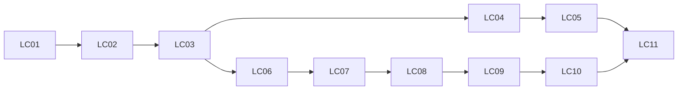

# Windows 书架功能补齐实施方案与 Roadmap

## 1. 目标、基准与执行边界

本方案覆盖用户指定的 8 项书架直接能力、7 项关联设置，以及统一面板、Ctrl+方向键切换分类、顶部继续滚动刷新、Ctrl多选/Shift及长按范围选择，共 19 项需求。当前仅完成规划，未实施产品变更、运行产品测试或生成发布产物；所有任务保持未勾选。2026-09-28 用户进一步确认：未多选时单击打开漫画，进入多选后单击增减选择；Ctrl进入或增减多选，Shift选择范围。取消最后一项只退出多选，下一次普通单击才打开；不要求双击打开。

| 项目 | 固定依据 |
| --- | --- |
| 当前实现 | `dd4ac37264f03699b92ceb197d5846236b6e979c`；规划开始时工作树干净 |
| 官方上游 | 本地 `upstream/main` 的 `deb7b33118616d37536f1e5ef2ef85c8b5db0799`，提交日期 2026-08-26；不是对最新上游的声明 |
| 现有交互规范 | [Desktop UI 规范](../design/mihon-desktop-ui/README.md)、[组件事实表](../design/mihon-desktop-ui/desktop-reference.md)、[页面契约](../design/mihon-desktop-ui/page-contracts.md)；其 HTML 验收不能替代本方案的原生验收 |
| 历史计划 | [2026-09-08 书架计划](2026-09-08-desktop-library-interaction-parity-roadmap.md)已完成；本方案只接管下面明确列出的新缺口，不重开该计划全部任务 |
| 相关旧范围 | [非 Reader 计划](2026-08-02-mihon-desktop-non-reader-upstream-core-roadmap.md)中的书架与 LU-01 更新部分，仅在本方案范围内承接；不恢复其余暂停任务 |
| 状态权威 | [parity-manifest.json](../../app-desktop/src/test/resources/parity/parity-manifest.json)继续是 capability 状态与证据的唯一机器权威 |

SOURCE 指上述已读取的代码事实；PROJECT_POLICY 指用户需求及本方案冻结的目标行为。新增 Windows 手势阈值、键盘行为和布局属于 PROJECT_POLICY，不伪装成 Android 常量。最初规划轮未创建 HTML 原型；后续依用户请求补充独立的 [完整交互 DEMO](../prototypes/library-completion/README.md) 与 [详细审核条目](../prototypes/library-completion/ACCEPTANCE.md)，作为 HTML_ADAPTER 审阅产物，不代表下面产品任务已完成。

旧计划曾要求保留“继续阅读依赖未读角标”的耦合；本次固定官方版本在 `LibraryCompactGrid`、`LibraryList` 等处以真实 `LibraryItem.unreadCount` 控制按钮，角标独立使用 `LibraryItem.badges.unreadCount`。L03 以该版本及本次用户范围为准，明确覆盖旧要求；不改写历史测试结果。组件事实表关于同步恢复按钮的描述也不能代替当前 production 核对：当前 Desktop 控件仍判断 `badges.unreadCount`，状态中存在字段不等于接线已完成。

本文件是尚未激活的产品 child plan，不声明 `active-task`。执行进度从第一个未勾选项推导；正式开始实施时核对父计划当前指针及占用情况，将唯一 `active-child-plan` 切到本文件，不覆盖其他正在执行的工作。本轮规划不切换父指针，不把 manifest 中历史 VERIFIED 批量改成新状态。父文档现存摘要与指针若不一致，激活时按实际任务归属局部修正，不顺带治理所有历史记录。

范围外：阅读器内部算法、作者发现算法、同步协议、迁移引擎、下载引擎全面重写、扩展 API 升级、全站视觉重设计、应用退出后由 Windows 服务唤醒运行、新建自动化平台。保留现有作者页、同步、阅读进度、下载身份、6 小时更新选项和 Windows 平台能力。

## 2. 需求覆盖与生产入口

路径缩写：`D = app-desktop/src/main/kotlin/mihon/desktop/`，`A = app/src/main/java/`，`K = domain/src/commonMain/kotlin/`。下表为静态发现与目标映射，不是已复现或已修复证明。

| ID | 用户可见目标及当前缺口 | 主要复用入口 | 交付任务 |
| --- | --- | --- | --- |
| L01 | 四种书架布局可拖动滚动条快速定位；当前普通 Lazy 容器无滚动条 | `D/ui/library/LibraryComponents.kt` 的 `LibraryGrid/LibraryList` | LC04 |
| L02 | 自定义封面和同地址封面变化正确显示；当前书架只传 URL/源 ID | `DesktopCustomCoverStore.resolveModel`、`MangaCoverRequest.kt`、详情封面链 | LC01 |
| L03 | 隐藏未读角标仍可继续阅读；当前按钮依赖角标投影值 | `LibraryScreenModel.continueReadingRequest`、`projectLibraryBadges` | LC01 |
| L04 | 追踪评分按统一十分制比较；当前直接平均原始 `Track.score` | `TrackerServiceRegistry`、`EvaluateLibrary`、Android `get10PointScore` | LC02 |
| L05 | 追踪筛选显示服务名称且有生效提示；当前显示数字 ID，顶栏普通筛选标签未涵盖追踪条件 | `LibraryFilterDropdown`、`LibraryState.hasActiveFilters`、tracker profile/session | LC02、LC03 |
| L06 | 唯一自定义分类也显示分类标签；当前只有分类数大于 1 才显示 | `projectLibraryCategories`、`LibraryTab` | LC01 |
| L07 | 单本更新失败后继续其他作品，并可查看和重试失败项；当前遇首个失败即 break | `LibraryUpdateScheduler`、`DesktopTaskScheduler`、现有通知服务 | LC08 |
| L08 | 更新后目录新增、改名、重排、移除及可识别链接替换的状态正确；当前主要只新增章节 | `SourceMangaUpdateService`、Android `SyncChaptersWithSource`、章节/漫画 repository | LC07 |
| S01 | 可选择新收藏的默认分类；当前入库链读取偏好但设置页无入口 | `LibraryPreferences.defaultCategory`、`MangaDetailScreenModel` 入库逻辑 | LC06 |
| S02 | 全库更新分类支持包含/排除及默认分类；当前 UI 仅排除自定义分类 | `selectLibraryMangaForUpdate`、共享分类偏好 | LC06 |
| S03 | 自动更新增加 48/72 小时且保留 6 小时；当前 enum 缺两项 | `LibraryPreferences.autoUpdateInterval`、现有 scheduler | LC09 |
| S04 | 已追平/已开始/未完结/预计更新期限制真正影响更新 | `LibraryPreferences.autoUpdateMangaRestrictions`、`FetchInterval`、Android 更新规则 | LC09 |
| S05 | 自动更新可限制 Wi-Fi/非计量/充电，并显示等待原因 | 现有 task constraints、网络状态接口、已依赖的 JNA/JNA-platform | LC10 |
| S06 | 用户可选择更新时刷新作品信息；当前请求固定不抓详情 | `SourceMangaUpdateService`、Android `UpdateManga.awaitFromRemote`、封面存储 | LC09 |
| S07 | 关闭按分类设置时清理旧分类排序，重开不会恢复旧值 | `ResetCategoryFlags`、`SetSortModeForCategory` | LC06 |
| I01 | Windows 使用 Ctrl+Left/Right 切换相邻分类 | `LibraryRootScreen`、`setSelectedCategoryIndex` | LC04 |
| I02 | 滚至顶部后继续向上滚动，先提示，再继续操作才刷新 | 原生滚动事件、现有当前分类刷新回调 | LC05 |
| I03 | 未多选单击打开、多选中单击增减，Ctrl多选，Shift替换可见范围，Ctrl+Shift/长按追加范围；覆盖固定锚点、跨分类/反向/失效 | `LibrarySelectionState`、`ShiftAwareClickModifier`、共享范围策略 | LC04 |
| I04 | 筛选/排序/显示集中于一个面板；再次点击书架打开它 | `LibraryNavigationHost.registerReselectHandler`、现有 model/偏好 | LC03 |

不重复开发已经存在的搜索、全局搜索、随机打开、全选/反选、批量分类/下载/删除/迁移。按分类设置当前作用于排序；显示布局、列数及角标仍按原有全局作用域保存，不能根据设置名称误改为分类独立布局。

## 3. 固定用户交互契约

### 3.1 统一书架面板（I04、L05）

- 普通书架顶栏以一个“筛选、排序与显示”入口代替三个独立菜单；保留搜索、同步、随机、分类管理、书架设置和刷新入口。窗口不足时收纳次要操作，不能让它们溢出不可达。面板是本页模态，不创建新 Screen/Tab。
- 面板固定三个标签：筛选、排序、显示。每次新会话默认进入“筛选”；会话内切页保存各页滚动位置。再次点击当前书架导航项打开同一面板，不切换分类、重建根页或压入导航栈。已打开时聚焦既有面板，不能叠加第二个。
- 筛选完整复用三态、下载模式锁定、追踪登录状态和自定义周期的发布门禁；单 tracker 使用“已追踪”，多 tracker 显示服务名称。顶栏有统一生效状态，面板内准确显示包含/排除，不只依赖颜色。
- 排序继续调用 `SetSortModeForCategory`；随机排序再次点击应刷新随机种子，不作为普通升降序切换。显示页提供四布局、横/纵列数、四种角标、继续按钮、分类标签和数量，全部复用相同 Preference，取消其他页面中同一展示偏好的重复编辑器或改为指向面板的入口。
- 筛选、排序及显示偏好即时生效，无“应用”草稿；切页和关闭不撤销已成功保存的值。持久化失败显示错误并回读权威值，不让 UI 假成功。搜索文本、选择 ID、分类、可见作品锚点不因开关面板被清空。
- Escape 一次只关闭最上层弹层；面板关闭后，下次 Escape 才退出选择，再下次退出搜索。入焦到当前标签或首个有效控件，Tab/Shift+Tab 限制在面板，背景不可交互；关闭还焦到触发按钮或书架导航项，触发器消失时回书架内容。
- 选择模式保留已选 ID；通过重选书架打开面板时，只改变可见集合，不清空隐藏选择。普通模式与选择模式共用一个面板状态。详情/阅读器等子页在前台时不响应根书架的重选面板请求，遵守现有导航返回行为。

### 3.2 滚动条、分类键盘与 Windows 多选（L01、I01、I03）

- 列表持有 `LazyListState`，三种网格持有 `LazyGridState`，使用适配当前 Compose Desktop 版本的滚动条。Android 的 `VerticalFastScroller` 依赖 Android API，不直接复制。优先调用现有 Compose scrollbar adapter；需要网格适配时只增加该适配，不另建滚动框架。
- 分类视图位置以分类稳定 ID 及布局族（列表/网格）为键，在当前书架会话及详情返回中保存。数量/列数变化以第一可见作品 ID 和偏移恢复，目标消失则钳制；不承诺跨进程恢复精确像素位置。不得用一个可变 index 将分类 A 的位置误当分类 B。
- `Ctrl+Left` 到前一分类，`Ctrl+Right` 到后一分类，按当前分类顺序，不循环；首/尾、0/1 分类不越界。只消费无 Alt/Shift 的 KeyDown，一次按压切一次，按住重复事件不连续翻页。快捷键说明出现在分类控件 tooltip/语义描述中。
- 仅根书架有焦点、无模态弹层、焦点不在可编辑文本中时生效。搜索输入框中的 Ctrl+方向键保留系统按词移动光标；面板、菜单、输入法组合输入和子页面不被抢键。切分类保留搜索/过滤及跨分类选择，载入该分类排序并反馈分类名。

SOURCE：当前 `ShiftAwareClickModifier` 只读取 `isShiftPressed`，`handlePrimaryClick` 只接收 Shift布尔值；Ctrl未传入实际选择链。`LibrarySelectionState` 的“Ctrl+Click”注释及其他文件的 Ctrl import均不是功能实现证据。当前 Shift策略是追加范围且每次移动锚点，不能原样充当下面的 Windows修饰键契约。

以下为用户确认后的 PROJECT_POLICY，统一应用于四种布局的漫画主体：

| 输入 | 动作 | 范围锚点 |
| --- | --- | --- |
| 无修饰键单击（未多选） | 打开该漫画，不要求双击 | 清除 |
| 无修饰键单击（多选中） | 切换目标选中状态，其余选择保留，不导航；取消最后一项仅退出多选，下一次普通单击才打开 | 更新为本次目标，取消最后一项时清除 |
| Ctrl+单击 | 未选则加入，已选则取消；其余选择不变，不打开漫画 | 以本次目标建立锚点；取消最后一项时清除 |
| Shift+单击 | 用锚点到目标的闭区间替换当前分类可见集合中的选择，允许扩大和缩小；其他分类/过滤隐藏的已选项保留 | 连续Shift操作保留同一起点，不随终点移动 |
| Ctrl+Shift+单击 | 把闭区间追加到已有选择，不取消其他项，不打开漫画 | 保留同一起点 |
| 长按 | 复用同一范围计算，按追加模式执行；无有效锚点时先选目标进入多选 | 有效锚点保留，无效则以目标重建 |
| Escape/选择栏关闭 | 在无更高层弹层时退出选择；下一次Escape才处理搜索 | 清除 |

- 修饰键处理优先级为 Ctrl+Shift → Shift → Ctrl → 普通单击。只有主键点击执行上述操作；右键、Alt修饰输入、面板控件及滚动不进入选择分派。Ctrl在本条仅代表 Windows Control，不能把 Meta键未经验证等同Ctrl。
- 范围按当前可见排序计算，包含两端、反向成立。没有锚点、跨分类或锚点被筛选隐藏时，本次范围退化为目标单项并重建锚点：Shift仍执行可见集替换，Ctrl+Shift/长按执行追加。事件提交前目标已被移除则忽略陈旧事件。所有身份用漫画和分类稳定ID，不用位置充当身份。
- 举例：可见顺序A–E，Ctrl点B→Shift点E得到B/C/D/E；继续Shift点C收缩为B/C；Ctrl点E得到B/C/E并把锚点设为E；Ctrl+Shift点D追加D得到B/C/D/E。不能保持旧实现中“每次范围都只追加、每次终点都变成起点”的行为。
- 全选/反选继续使用已有可见集合规则并清除范围锚点；切分类保留已选ID但不得跨分类生成区间。取消最后一个选中项退出选择；选中数量包括此前保留的隐藏项，批量操作对象仍由既有确认快照确定。
- 长按沿用既有 combinedClickable手势识别，不另设时长，抑制随后普通click，避免范围选择后又导航。继续阅读小按钮保留原有独立行为，不把它当漫画主体；右键菜单不因本次修改改变目标。选择模式下其现有选择动作也须与状态对象保持一致。
- 提取当前闭区间计算并让共享策略显式支持“可见集替换/追加”和“保留/更新锚点”；默认参数保持Android原有选择语义，Windows由一个selection入口指定模式，长按与修饰键不得各复制一份算法。重命名仅感知Shift的输入helper以准确表达Ctrl/Shift支持，同时修正误导注释。

### 3.3 顶部继续滚动刷新（I02）

明确“向上”指内容向列表起点移动，不直接把硬件 wheel delta 的正负当作业务方向。只处理漫画内容容器内无 Ctrl/Alt/Shift 修饰的原生滚动输入；滚动条拖动、代码定位、Home/PageUp、面板内部滚动、缩放手势及横向滚动不会刷新。

采用两段操作，避免滚到顶部时残余滚轮/触控板惯性立即发请求。以下为本方案初始固定参数，集中为可注入常量；不得在测试失败后通过放宽断言调参。

| 状态 | 输入与转移 | 用户反馈/副作用 |
| --- | --- | --- |
| Idle | 内容尚可向上滚动时只正常滚动；到达顶部后收到向上未消费量，进入 Hinting | 显示“继续向上滚动，准备刷新当前分类”，不发请求 |
| Hinting | 当前顶部操作累计归一化剩余距离达到 80dp，进入 Armed；反向/离顶/超过 3 秒无输入则取消 | 显示进度；达到阈值提示“再次向上滚动，刷新『分类名』” |
| Armed | 提示至少可见 300ms，且两段滚动输入间隔至少 400ms；3 秒有效期内新一段向上输入累计达到 48dp，进入 Refreshing | 只调用一次现有当前分类刷新命令；同一段惯性输入不能确认 |
| Refreshing | 请求已被 scheduler 接受；运行中滚动只浏览，不再次武装 | 使用真实更新进度；重复按钮请求沿用“更新已在进行”，不取消任务 |
| Cooldown | 接受启动后保持解除武装，任务结束且连续 800ms 无滚动后回 Idle | 完成/失败使用现有反馈；残余滚动不立即启动下一次 |

原生 adapter 将行式滚轮、像素滚动转为一致单位，并限制单个异常大事件的贡献；屏幕缩放不得改变物理操作门槛。无法精确识别触控板惯性时不假称完全识别，至少满足“提示可见时间 + 分段间隔 + 第二段阈值”，并用 Windows 实机轨迹验收。

切分类、改查询/筛选、开弹层、进入多选、失焦或离页立即清除尚未提交的提示；确认前再次核对分类稳定 ID，不能对已经离开的分类发请求。没有有效分类、空书架、加载或加载错误时不武装；非空分类即使内容不足一屏仍可触发。顶部提示不能移动内容导致反复判定离顶。

滚动刷新作用于当前分类的完整更新候选，不以搜索结果或可见筛选结果裁剪。全库更新仍由显式按钮触发。鼠标滚轮、精确触控板、自然滚动、125%/150%/200% 缩放分别验证；滚动条新增不得改变该状态机的输入范围。

### 3.4 展示与关联设置

- L02：书架和详情共用“自定义文件优先 → 源封面”的解析及版本化缓存键；不新建封面缓存。图片文件读取放在合适的 IO 路径，不能在每帧重组扫描所有文件。保留 Desktop 7:10 封面比例。
- L03：继续按钮资格使用真实未读状态，与角标开关解耦；点击仍通过现有 Reader 请求链，选择模式仍执行选择动作。同步阅读位置、过滤章节和下载资格保持既有行为。未接线的 `syncedResumeMangaIds` 不能作为已存在能力证据，不在本任务另创“全部已读时重新续读”规则。
- L06：显示分类标签时，多个分类或唯一非系统分类均可见；唯一系统默认分类仍不强加标签。搜索和分类数量语义与上游一致。
- S01：书架设置 → 默认分类，选项为“每次询问”、系统默认分类和现有自定义分类。仅影响后续入库，不批量搬动现有漫画；删除默认分类按既有 `DeleteCategory` 偏好处理回退。
- S02：书架设置 → 更新分类，使用独立草稿三态对话框：不指定/包含/排除，系统默认分类 ID 0 可选。确认才同时提交包含、排除；取消无写入。作品属于多个分类时排除优先，包含集为空代表全部。保存失败不留下半份新策略。
- S07：关闭按分类排序设置时先成功重置分类 flags，再提交关闭偏好；失败维持开启并提示。两存储不能假装共享数据库事务：采用已有 repository 原子更新及最小幂等恢复记录，重启补完已开始的关闭操作；排序写入与该操作串行，完成前禁用重复操作。恢复失败显示可重试原因，不静默丢弃。
- S03–S06：书架设置“更新”组包括周期、设备条件、更新分类、智能更新和刷新作品信息。修改周期/设备条件立即影响后续调度；运行中的作品更新不因切设置被突然中断。作品信息刷新不新增“始终改标题”，仍尊重既有标题保护与自定义封面规则。

## 4. 架构与复用决策

### 4.1 页面和追踪服务

`LibraryRootScreen → LibraryScreenModel → 共享 use case/Preference` 保持不变。统一面板仅拆出页面 Composable 和最小本地面板状态；滚动刷新使用页面级纯状态机加 Desktop 输入 adapter，不建立全应用动作总线。业务结果通过现有 StateFlow/通知回到 UI。

评分标准化追加到现有 tracker 服务契约或其共享评分策略，输入需包含 provider 的真实存储尺度/评分格式，输出规范化十分制值。不能统一除以 10 或依据“分数大于 10”猜尺度；不能改写 `Track.score` 导致回写远端失真。Android adapter 委托现有 `get10PointScore`，Desktop adapter按 provider 规则实现，同一契约 fixture验证。零分/未评分、未知服务和退出登录的处理先固定官方 characterization，再由共享平均分策略消费；错误格式不得生成 NaN。

tracker 名称来自 `TrackerProfile`，ID 只用于身份键；登录状态、名称、可用评分服务要通过真实 DI 和 flow 进入书架。保留会话变更响应，不能只在面板打开时读一次。

### 4.2 更新链路

目标调用链：

```text
书架按钮 / 顶部滚动 / 自动到期 / 失败重试
  → LibraryUpdateScheduler（互斥、请求身份、快照、检查点、恢复）
  → 共享更新范围及限制决策（含跳过原因）
  → SourceMangaUpdateService（现有源调用与错误边界）
  → 共享章节/作品更新规则 + SQLDelight 事务
  → 平台下载/封面副作用 adapter
  → 现有自动下载、作者观察链及进度通知
  → LibraryScreenModel / 书架结果摘要
```

不直接将 Android `SyncChaptersWithSource` 搬到 Desktop：它依赖 Android 下载管理、文件路径及源类型。抽取无平台依赖的差异计算、章节识别和状态承接决策至共享层，Android 与 Desktop 都实际调用；文件改名/封面失效等保留平台 adapter。章节规范化继续复用 `ChapterSanitizer`、`ChapterRecognition` 和 `ShouldUpdateDbChapter` 可共享部分，遵守 domain 不依赖 data 的方向。

| 能力 | 直接复用 | 必须补充的边界 |
| --- | --- | --- |
| 筛选/排序/分类 | `EvaluateLibrary`、分类投影、`SetSortModeForCategory`、`ResetCategoryFlags` | 页面接线、规范化评分输入、关闭设置的恢复 |
| 选择 | 共享闭区间规则、现有 selection state | Ctrl/Shift事件贯通、显式替换/追加及固定锚点；保留Android默认策略；真实键鼠集成测试 |
| 源请求 | `SourceMangaUpdateService`、现有 source/HTTP client | 不改代理/鉴权协议；使用源原始响应验证完整路径 |
| 章节同步 | Android 既有同步规则、repository、SQLDelight | 共享 planner/executor、单作品事务、平台副作用恢复 |
| 调度 | `LibraryUpdateScheduler`、`DesktopTaskScheduler`、现有 checkpoints | 请求范围持久化、逐本失败、周期及设备约束 |
| 文件及阅读状态 | 既有下载身份、封面仓库、阅读进度/配对映射 | 章节改名/换链时不破坏历史、书签、进度或本地文件关联 |

### 4.3 请求语义必须显式区分

新增的请求类型名称可随仓库命名调整，语义不可合并。作用域与运行状态使用稳定 ID；“未指定分类”与默认分类 0 不得混淆。

| 请求 | 分类范围 | 漫画智能限制 | 设备限制 | 工作集/恢复 |
| --- | --- | --- | --- | --- |
| ManualCategory | 指定分类；绕过全库包含/排除 | 与原版一致，仍应用漫画限制 | 不受自动调度设备开关限制；真实网络错误正常反馈 | 接受时冻结候选；离页不取消 |
| ManualAll | 应用包含/排除 | 应用 | 同上 | 接受时冻结候选 |
| Scheduled | 应用包含/排除 | 应用 | 满足已启用条件才启动 | 到期且可运行时冻结；等待期间不推进周期 |
| Retry/Resume | 原任务失败/未完成集合，不重新扩张到全库 | 复用原任务决策；执行前剔除已取消收藏/失效对象 | 自动恢复继续受当前设备条件限制；用户显式重试属于手动请求 | 保留原完成集合，不能误当新任务 |

搜索和 UI 筛选不参与更新工作集。漫画限制按原版顺序处理：不适用源/本地源策略、完结、未追平、未开始、预计更新期；零章节作品不能简单等同“未开始”跳过。明确记录每条规则的原版 fixture及原因文本。

普通“刷新”表示新一轮；失败面板“重试失败项”才复用上轮范围。运行中再次触发只提示已经进行，不创建第二 job。取消对本次任务立即生效，不能被后到错误覆盖为失败；下次普通刷新重新建快照。

### 4.4 完整章节同步及失败一致性（L08）

- 先完整抓取、去重、规范化远端响应，再计算新增/修改/移除/可识别替换；HTTP 成功不等于列表可信。远端错误、畸形或非本地源异常空列表不清空数据库；无法证明为完整目录的响应不得执行移除，并反馈无法完整同步。
- 更新 name、scanlator、sourceOrder、有效 dateUpload、识别章节号和 memo；无效日期按上游规则处理。保留原版新增日期排序、最后目录变化时间、预计更新窗口及重复章节已读规则，不能把所有变化当作新章节通知。
- 同 URL 章节尽量保留本地 ID、read、bookmark、lastPageRead；换 URL 的状态承接按原版可识别章节号规则，禁止以标题近似匹配任意合并。配对、历史、同步自然键等现有引用须验证保留或通过已有迁移入口重映射，不能因外键级联删除而悄悄丢失。
- 每本漫画目录和相关漫画字段在 SQLDelight 同一事务应用；网络不放在事务内。并发阅读/书签操作在提交前按最新状态合并，不能用请求开始时快照覆盖用户后来的阅读进度。跨作品失败隔离，单本失败不留下半份目录。
- 文件系统不能加入 SQL 事务。复用现有文件身份/重命名能力，为必要副作用记录最小可恢复操作：原/目标身份、阶段、操作 ID；可重入，目标冲突/权限失败有反馈。只为本次章节改名和封面失效服务，不建设通用 outbox 平台。
- 从目录移除不等于删除用户下载文件；除既有明确删除语义外，不扩大清理范围。成功目录提交后的自动下载要可去重，崩溃恢复不漏掉应入队的新章节；作者日期观察与目录完整性写入沿用已有链路，不因抽共享核心被省略。

### 4.5 逐本更新结果、检查点与结果入口（L07）

每本至少区分成功、失败、跳过、未处理；进度按已处理数/固定工作集计，不把失败当作零进度，也不把跳过当成功更新。书架显示摘要“成功 X，失败 Y，跳过 Z”，失败时有“查看详情／重试失败项”，明细使用作品名和可理解原因。取消显示已完成与未处理数量，离页继续运行，返回从任务权威状态恢复；通知只在有意义变化时发送。

在现有 `StoredTask` 中增加带默认值的可选书架专用上下文（拟名 `libraryUpdateContext`，包含 schema version、触发类型、分类作用域、规则快照、逐本结果及必要副作用进度），与已有 workset/completed IDs 在同一 store transaction 保存，不另建一套后台调度器。其他任务该字段为 null，序列化与旧失败格式保持兼容。

旧 checkpoint 已有 workset 时必须保留其精确 ID 集；没有触发类型或范围时不能猜成自动全库恢复。保留记录并在书架提供一次显式“继续旧更新”操作；未初始化工作集的旧任务须告知无法恢复原范围，由用户另发新请求。不得删除旧记录后声称恢复成功。

DB 已提交而 checkpoint 尚未写入的重试必须幂等；已完成作品不重新网络请求；文件/自动下载副作用未完成的作品只补适用阶段。持久化损坏、磁盘空间/权限错误为真实失败，保留既有损坏隔离机制并向用户反馈。

## 5. 偏好迁移、调度和平台约束

### 5.1 单一偏好权威

本次将书架更新周期、包含/排除及限制统一由已有 `LibraryPreferences` 提供。Desktop 的旧 `library_update_interval` enum 和逗号分类键只保留迁移读取，不长期双写。沿用 `LibraryPreferenceMigration` 的迁移风格，以独立版本标记最后写入；有效且显式设置的共享值优先，即使它等于默认值。

| 数据 | 转换/兼容规则 |
| --- | --- |
| 周期 | OFF/6/12/24/WEEKLY 映射到 0/6/12/24/168 小时；新增 48/72；未知值不猜成短周期，关闭调度并提示检查设置 |
| 包含/排除 | 解析旧 CSV 到共享字符串 ID 集，保留 0；未知/删除 ID 不造成扩大更新范围；解析失败记录诊断，不能静默吞掉全部限制 |
| 智能/设备限制 | 老 Desktop 没有实际执行限制，且共享键未显式设置时迁移为无新增限制，保留升级前行为；新配置使用共享默认值；用户显式保存/恢复的值必须保留 |
| 元数据刷新 | 沿用显式共享值；没有值时默认 false，不能升级后突然抓取/覆盖作品信息 |
| 重入/中断 | 重复运行结果一致；marker 最后写，失败不标完成；不删除旧键，不改同步/备份协议 |

S02 包含/排除写入要作为一份策略更新被消费者看到。当前 `PreferenceStore` 没有跨键事务接口，Desktop底层为 `java.util.prefs.Preferences`，不能假定连续两次 set 原子成功。增加仅服务书架分类策略的共享读写用例及平台端口：Android用一次 SharedPreferences编辑提交；Desktop用互斥、最小恢复记录和持久化确认完成两个现有键的写入，提交前消费者仍使用旧完整快照，提交后发布新快照。恢复记录不成为第二份设置权威，启动时完成或回退未完成写入后才能调度；失败时提示并禁止消费半份策略。不为此扩展成全应用通用事务框架。分类删除对相关偏好的清理也经过该入口；用户明确删除最后一个被包含分类时仍遵守已有清理语义，不能与迁移解析错误混为一谈。

### 5.2 周期规则

以可注入 Clock 和已有本机偏好保存最近自动运行时点/下次应运行时间，不依赖仅内存的 `lastRun`。设备限制不满足或网络未知时不视作执行完成。应用重启/唤醒且已到期，最多合并为一次运行，不补跑错过的每个周期；时间回拨不得形成紧密循环。

新启用周期后保留当前 Desktop“下一次调度检查可执行首轮”的习惯；正常运行结束（包括有失败的已尝试轮次）后安排下一周期。失败明细由重试入口处理，不在每分钟检查时重复全库请求。用户取消本轮后不得立即自动重启；显式手动更新不偷偷推迟独立自动周期，手动仍在运行时自动到期仅等待它结束，不并发启动。

更新周期设置为关闭时撤销尚未开始的自动运行，不取消用户已经发起的手动更新。新增设置文案明确：Desktop 的周期更新依赖应用进程运行（包括现有托盘运行）；本计划不安装 Windows 后台服务，不承诺关机/完全退出后更新。

### 5.3 Windows 设备条件（S05）

引入小范围 `LibraryUpdateDeviceStateProvider`，报告连通、Wi-Fi、非计量、外接电源/充电的三值状态：满足/不满足/未知及原因。现有 `JvmDesktopNetworkConnectivity` 只能提供粗粒度网络信息，不能被当作 Wi-Fi、计费或端到端服务可用性的证据。

Windows adapter优先复用已存在的 JNA/JNA-platform 依赖调用原生网络/供电查询；实现前核对本机依赖中的绑定及微软官方接口，不引入后台进程或第三方常驻服务。连通、接入类型与计费属性应来自实际活动连接，不能按网卡名称猜 Wi-Fi，不能把 VPN 虚拟网卡直接等同免费网络。多连接歧义返回未知，不静默放行。

选中的限制未知时等待并显示原因；未选中的未知字段不阻断。桌机无电池但确认使用外接电源时满足“接通电源/充电”，拔电/网络变化在下一作品开始前重新检查，保留已完成检查点，不将约束变化记成源失败；应用恢复/条件恢复只续跑同一任务。

平台装配避免在非 Windows 加载 Windows native 库。macOS 在本次范围内保持已有功能可运行；新 Windows 条件控件按平台能力显示，不能出现能勾选却无效果的开关。共享策略本身仍由同一契约验证；macOS 没有等效 adapter 的条件不宣称已补齐。

## 6. Roadmap：可独立交付的功能批次

下面按默认执行顺序排列；所有批次必须包含 production、红绿测试、必要文档和 evidence 更新。没有完成实现、独立审查、验证及提交前不勾选。每个批次原则上一份功能提交，审查修复最多增加一份，不为纯状态推进另开提交。

- [ ] **LC01 — 书架展示与继续阅读纠偏（L02/L03/L06）**。前置：本方案冻结。范围：`LibraryComponents`、`LibraryTab`、封面请求 adapter及其现有测试。先写真实四布局红测，覆盖隐藏未读角标但仍能续读、自定义封面替换/删除、单自定义分类显示；最小接线后验证真实 Reader 请求和图片 request key。交付：共用封面解析、正确按钮资格及分类标签。禁止修改 Reader 内部目标选择、封面比例或全局图片网络策略。退出：四布局、详情返回、持久化偏好复验通过。估算 1–1.5 人日。

- [ ] **LC02 — 追踪排序与筛选表达（L04/L05）**。前置：LC01，以避免同一页面冲突。范围：tracker 契约/adapter、model 评分投影、筛选名称和活动状态。先用 AniList 百分制、十分制、多追踪均值、无评分/注销 fixture触发红测；再验证真实 provider parser→仓库→model→排序及 Root 筛选操作。交付：规范化评分接口、服务名、完整筛选提示。禁止重写 OAuth、改数据库原始 score 或扩增追踪供应商。退出：Android/Desktop 共享评分契约、服务回写无变化、UI/DI 集成通过。估算 1–2 人日。

- [ ] **LC03 — 统一筛选/排序/显示面板（I04，承接 L05）**。前置：LC02。范围：书架顶栏、面板组件、reselect 接线及展示设置入口；无新导航层级。先挂载真实 Root 和导航宿主验证三标签、重选不叠加、即时偏好、随机重排、分类排序作用域、Escape/焦点；再复用现有回调实现面板。交付：替代分散菜单的统一面板、更新的设置入口和文案。禁止顺带重做分类管理/批量删除。退出：浅深主题、200% 字号、窄窗口可达及输入焦点行为通过。估算 1–2 人日。

- [ ] **LC04 — 快速浏览、分类快捷键与 Windows 多选（L01/I01/I03）**。前置：LC03 的弹层/焦点状态稳定。范围：书架滚动容器、页面级键盘分派、Ctrl/Shift/长按事件链、共享范围策略的显式模式参数。先挂载四布局真实Root，执行Ctrl点选/取消、Shift替换与连续扩大/收缩、Ctrl+Shift追加、未多选普通单击导航、多选普通单击增减且取消最后一项不导航、长按不误导航的红测；再测滚动条、Ctrl+Left/Right、输入框抢键防护、跨分类、反向、排序变更、筛选隐藏锚点和目标删除。事件必须走pointer modifier→卡片/列表→Root→selection→实际导航，不能仅直接传布尔参数测试helper。交付：四布局滚动条、分类位置恢复、准确修饰键与固定锚点选择。禁止增加Ctrl+A、框选或双击打开要求。退出：第3.2节操作表全部通过，Android默认策略共享回归通过，千本夹具快速定位，真实事件不误导航或刷新。估算 1–2 人日。

- [ ] **LC05 — 顶部两段滚动刷新（I02）**。前置：LC04。范围：页面级状态机、原生 wheel adapter、顶端提示及当前分类刷新 wiring。先用可控时钟覆盖第 3.3 节所有状态转移，再通过真实 Root 注入滚动事件核对 scheduler 仅启动一次；至少覆盖惯性、超时、反向、分类切换、空库、多选、弹层和运行中重复。交付：可见提示→再次操作→真实刷新；按钮刷新仍可用。禁止新增另一套更新器或用定时器模拟进度。退出：Windows 鼠标和触控板实际验证，与 DPI 无关；缺硬件证据保持未完成。估算 1–2 人日。

- [ ] **LC06 — 分类设置与更新范围统一（S01/S02/S07）**。前置：LC03；默认在 LC05 后串行执行。范围：设置页、默认分类入库消费、包含/排除偏好迁移、scheduler 范围参数、ResetCategoryFlags 接线。先写真实 SQLDelight/偏好迁移/Root 设置红测，覆盖默认 0、每次询问、分类删除、多分类排除优先、草稿取消、重置失败和中断重启；再实现单一权威读写。交付：三类完整设置、幂等迁移及失败恢复。禁止改变收藏去重、批量分类的既有规则。退出：相关 Android/Desktop 契约与 DI、旧值迁移、重开设置均通过，数据边界独立审查后下游才能消费。估算 1.5–2.5 人日。

- [ ] **LC07 — 完整章节同步共享核心（L08）**。前置：LC06；以第 4.4 节为固定数据契约。范围：Android 同步用例的共享抽取、Desktop `LibraryUpdateChecker` 接入、chapter/manga repository事务与必要文件 adapter；同类详情写入至少共用所抽核心，避免详情刷新与书架刷新相互覆盖。先针对原版规则写 characterization 与双端共享契约，确认现有 Desktop 对改名/重排/换链等失败，再实现；必要 schema migration 只进入权威 SQLDelight目录。交付：真实源响应→事务→书架数量/排序及文件关联的完整链路。禁止全面重写下载器、源网络或 Reader；只保护现有引用与能力。退出：目录与进度并发、故障注入、重入、空响应不删数据、作者观察与自动下载保留全部通过；须独立审查后 LC08/09 才能依赖。估算 3–5 人日。

- [ ] **LC08 — 更新容错、恢复与失败结果（L07）**。前置：LC07。范围：scheduler、书架专用持久化上下文、状态反馈/详情/重试入口及任务 store兼容。先测 A成功/B失败/C成功、取消、普通刷新与重试区别、离页、崩溃窗口、旧 checkpoint 与损坏存储；最小改造逐本处理和幂等副作用。交付：失败不阻断、准确计数、可操作失败明细及有限恢复。禁止只删除 break，禁止修改其他后台任务语义。退出：production factory→scheduler→实际数据库→Root反馈通过，备份/追踪/作者任务 store 回归通过。估算 1.5–3 人日。

- [ ] **LC09 — 更新周期、智能规则与元数据（S03/S04/S06）**。前置：LC06–LC08。范围：剩余偏好迁移、共享候选规则/FetchInterval、周期时钟及作品信息更新策略、设置与跳过反馈。先测 48/72h、旧 6h保留、重启/回拨/唤醒、零章节、所有限制组合、智能规则仍作用于手动分类、元数据开关及自定义封面保护；再把 Android/Desktop 接入同一规则。交付：全部选项真正影响 production任务，等待/跳过有原因。禁止变更标题保护默认值或扩展同步/备份配置项范围。退出：共享/双端集成、虚拟时钟、真实源响应、迁移中断通过。估算 2–3 人日。

- [ ] **LC10 — Windows 设备限制与调度等待（S05）**。前置：LC08–LC09。范围：小型设备状态 port、Windows native adapter、runtime DI、调度边界和设置可用性。先测满足/不满足/未知、手动绕过、自动恢复、运行中切网/拔电、无电池桌机、多网络及休眠；验证真实 Windows adapter查询与发布 runtime走相同实例。交付：可解释的等待状态、条件恢复后仅续跑一次、macOS 安全装配。禁止修改系统网络/电源设置，禁止安装后台服务。退出：实际 Windows 环境可验证项有记录；不可模拟的硬件组合用 contract + native边界测试并列出证据限制，核心原生调用不可仅靠 mock验收。估算 1.5–3 人日。

- [ ] **LC11 — 集成、文档和发布收口**。前置：LC01–LC10 全部功能验收通过。范围：受影响文档/manifest准确证据、遗漏的交叉集成测试、全量矩阵、正式构建及运行验收。新增测试只针对未覆盖风险：面板改偏好→四布局→快捷键/刷新→更新结果→详情返回，以及升级保留数据；不重复实现功能。交付：最终报告、Windows正式 EXE、Android必要候选及 macOS 构建/运行证据。退出：第 7 节全部门禁、实际产物路径/哈希和检查点兼容确认；环境阻塞不能勾选。估算 1–2 人日，另受远端设备/签名可用性影响。

### 6.1 依赖及调度



图表示技术依赖，实际默认按 LC01→LC11 串行。LC04/05 与 LC06–10 理论上有部分独立性，但共享 `LibraryTab`、设置、DI 和 Gradle资源，本方案不默认并行写入。首个实施任务簇 LC01 必须交给实施子代理，后续优先复用同一代理；主代理负责契约、交接、独立审查和集成，不重复写代理负责部分。

执行建议使用 1 个长期复用的实施子代理，主代理独立审查；不额外建立专职审查代理。每批先完成真实行为红绿重构，主代理在稳定批次检查产物和关键路径。高风险共享/迁移/检查点接口在下游使用前审查。结构化回执包含 `status/diff/tests/commit/process/next`，可用现有 `scripts/agent-handoff.py` 校验；长工具调用先报命令、PID/日志和预计时间，外层超时先查询协调器，不能重复启动。

### 6.2 工程量和预算解释

上列总估算为 **15.5–28 人日**，其中 LC07–10 的数据一致性、恢复和 Windows native验收占主要成本；这是规划级工程量，不是对无人值守 Agent 的墙钟承诺。按单实施者串行推进，人工工作日约对应 3–6 周，模型执行可更快但受 Gradle和设备验收约束；不凭源码行数估算准确完成时间。

本轮规划预算为 0 子代理、1 次文档只读核验、1 份方案、0 产品测试/构建。未来实施的建议预算为 1 实施代理，按批次一次初审组成整个实施审查轮次、最多一次必要修复复审；不在最后重复发起全仓审查。每批 focused红/绿/重构及相关回归，阶段按受影响模块验证，最终完整 Android/Desktop矩阵仅一次。

由于完整 roadmap跨多个可独立交付批次，执行前须向用户声明当次实际采用的批次范围与审查/验证预算；本文件不是预先获得追加审查、代理、重复全量或长时间成本的许可。超过当次已声明预算时暂停相关扩展并说明未通过项、真实证据、原因与新增成本。若需把“逐批初审”按多个独立审查轮次计，应在执行前明确申请该预算，不能用改名规避上限。

## 7. 测试、发布及证据要求

### 7.1 测试层次与复用资产

| 层次 | 必做内容 | 复用/扩展位置 |
| --- | --- | --- |
| 共享行为契约 | 评分转换、范围选择、更新范围/限制、目录差异、元数据、取消/恢复不变量；同一数据集驱动两端真实 adapter | `domain/src/commonTest`、Android Library/Chapter tests、Desktop对应 tests |
| 原生 Compose | 四布局、面板三页/焦点/Escape、Ctrl单击/Shift范围/Ctrl+Shift追加、长按、滚动条及两段wheel事件；分别断言选择集合、固定锚点、是否导航及请求次数 | `LibraryPageCompositionTest`、`LibraryParityIntegrationTest`、`LibrarySortUiTest`及按功能新增的类 |
| DI/导航 | 工厂解析新评分/设备/同步/偏好依赖，Root重选宿主与普通 Screen类型正确 | `LibraryScreenModelFactory`、已有 DI/导航测试；不以调用 helper替代页面接线 |
| HTTP/源 | 原始响应至章节/评分/作品对象：成功、空/缺失、403/429/500、畸形、源异常；parser不得 mock | `MockWebServer`、`DesktopProviderTrackerServiceTest`、`LibraryUpdateCheckerTest`扩展 |
| 数据/文件 | 真实 SQLDelight与临时目录、已读/书签/配对/历史、文件重名/权限失败、崩溃重入、旧偏好/任务 JSON | `data`集成测试、`LibraryPreferenceMigrationTest`、`DesktopTaskSchedulerIntegrationTest`、`LibraryUpdateRecoveryIntegrationTest` |
| 系统/发布 | 打包 runtime真实 native查询；真实鼠标/触控板；书架从操作到更新结果；升级不清数据 | 现有 Test Mode/Robot + 外部键鼠验收，正式 Windows应用 |

红绿循环仅跑当前行为 focused tests；绿后必要清理再跑同组。批次完成跑相关单元、集成、wiring及格式；共享同步阶段完成跑对应共享模块完整测试一次。已对最终相同内容跑完的模块结果可复用到最终矩阵，避免机械重复。只扫描源码字符串或复制算法的测试不能作为产品完成证据。

在 PowerShell 中先设置 `$ErrorActionPreference = 'Stop'`、`PYTHONUTF8=1`、`PYTHONIOENCODING=utf-8`、`PYTHONDONTWRITEBYTECODE=1`；Android设置当前会话 SDK为 `D:\Android\Sdk`，验证真实工具文件。外网访问前仅在当前会话设置仓库代理。重型 Gradle串行，经现有协调器执行，例如：

```powershell
python scripts/gradle-coordinator.py run --key library-focused -- .\gradlew.bat :app-desktop:jvmTest --tests "mihon.desktop.ui.library.LibraryPageCompositionTest"
python scripts/gradle-coordinator.py run --key library-shared -- .\gradlew.bat :domain:jvmTest --tests "tachiyomi.domain.library.LibrarySelectionPolicyTest"
python scripts/gradle-coordinator.py run --key library-format -- .\gradlew.bat spotlessCheck
```

以上为现有入口示例，实施时按已新增实际测试类收窄，不将示例当作所有批次统一必跑命令。协调器仍在 STARTING/RUNNING 时继续等待原任务，不重启 Gradle；需要停止只终止所记录进程树。

### 7.2 最终一次完整矩阵与构建

1. 冻结待发布 diff及测试环境。完整 Android JVM、Desktop JVM（含集成）与相关共享模块、`test-desktop`完成一个最终矩阵；确切任务按执行时模块 Gradle配置核对。已知无关失败须保留原始证据并说明阻塞，不改断言、跳过测试或声称全绿。
2. Desktop 完整测试优先由 `bash ./scripts/build-desktop.sh full-tests`运行一次；随后同一未提交功能 diff用 `bash ./scripts/build-desktop.sh build-only`完成正式构建与运行验收，避免再跑一份完整 Desktop测试。若 diff或环境发生相关变化，仅复验受影响范围；不擅自再跑全量。脚本内部已有协调时不再外层嵌套同一协调器。
3. 按仓库收口要求完成 Windows和 macOS构建及运行验收；macOS使用已核对的隔离 checkout/路径，不覆盖用户现用应用或未提交改动。Windows新增输入和设备条件只在 Windows验收，macOS验证共享变更及既有启动链未回归。
4. Android受共享用例改动影响，执行受影响集成及必要候选构建。交付 APK使用 `python scripts/build-android.py candidate`，先按规范预检身份/签名；不直接交付 `app/build/outputs`，不因签名缺失生成替代密钥；安装和设备操作需独立授权。
5. Windows正式运行验收使用构建日志 `Final unpacked EXE:` 指向的实际文件，确认存在且位于 `app-desktop/artifacts/windows/...`，报告链接必须来自该值。测试输入若需内部目录不将其作为交付地址。Test Mode只验真实操作/状态，不读取桌面像素；视觉用离屏测试或外部验收工具。
6. 对受影响 manifest action逐一更新真实证据，保留官方旧基线和本次新来源的区别，不能全局替换 fixedMainRef。`finalParityAudit`在最后运行一次，不逐批重复。组件事实表/维护说明随本次真实行为更新，不把规划目标写作已实现 SOURCE。

### 7.3 最终用户验收集合

本节是未来验收模板，当前没有任何通过声明；实际执行结果统一记入一份证据报告，不创建逐任务快照。

| 场景 | 操作与预期 |
| --- | --- |
| 四布局和封面 | 替换/删除自定义封面后返回四种书架，显示正确；隐藏未读角标仍可进入下一可读章节；只有一个自定义分类仍见分类名 |
| 面板和追踪 | 重点书架打开统一面板；三页切换即时生效；单独追踪筛选也有生效提示；混合评分得到规范化顺序；Escape关闭并还焦 |
| 分类与选择 | 未多选时普通单击打开，多选中普通单击增减，取消最后一项仅退出多选；Ctrl单击增减多选且不导航；连续Shift可扩大/收缩；Ctrl+Shift和长按追加；跨分类/过滤后锚点失效退化单项；Ctrl+Left/Right切分类且输入框不被抢键；Android既有策略不变 |
| 滚动 | 千本漫画拖动滚动条快速定位；滚动到顶本身不更新；顶部出现提示后再次操作只更新当前分类一次；反向/离页取消待触发状态 |
| 分类设置 | 默认分类影响新收藏；包含/排除保存/取消正确且包含默认分类0；关闭分类排序后重开无旧值回弹，失败/重启有一致恢复 |
| 更新目录 | 源改名/重排/换链/移除后，书架数量及目录正确，阅读/书签/下载/配对引用保持；空错误响应不清库 |
| 更新容错 | 一成一败一成，最后一本仍更新；结果含准确失败明细，重试不重复成功对象；中断后恢复无新增重复数据 |
| 策略与系统 | 周期含6/48/72h；智能条件和元数据开关实际生效；受限网络/供电等待、恢复继续；完全退出不承诺后台更新 |
| 发布回归 | 最终EXE真实运行；Android共享行为、macOS装配与启动；旧配置/数据库/任务记录升级保留；产物链接及测试日志可追溯 |

## 8. 风险与停止条件

| 风险 | 处理及何时停止 |
| --- | --- |
| 旧测试固化错误耦合 | 先保留新官方 characterization和正确红测，说明旧要求覆盖关系；不以历史绿测否定本次需求 |
| 章节状态或下载文件损坏 | LC07必须先通过真实DB/文件/并发与恢复审查；存在数据损失风险时不得接入后续策略或发布 |
| Windows输入阈值不适配硬件 | 用真实原生轨迹定位单位/惯性问题；仍不能稳定区分时保持失败并报告，不能删掉“先提示再刷新”验收 |
| 设备状态无法可靠获取 | 选中限制为未知时明确等待；在限定 adapter范围内修复，不能用 TCP成功冒充计费/Wi-Fi识别 |
| 偏好迁移改变升级用户行为 | 显式值优先、旧键保留、marker最后写、限制默认按旧行为；校验失败不启动自动任务 |
| 工程量超过预估 | 8文件/400行仅说明内聚性与风险；出现架构假设失效、额外迁移或新能力时重规划，不机械拆碎批次 |
| 构建/设备/签名不可用 | 保留源代码和已通过证据，说明缺失门禁及影响，不安装无关工具或把未验证产物宣布完成 |

文档交付不等于实施授权或产品验收。本方案完成后由用户决定何时开始功能实施；开始时按本文件首个未勾选批次及实际预算推进，禁止跳过失败门禁通过改写 checkbox或 manifest“收口”。
