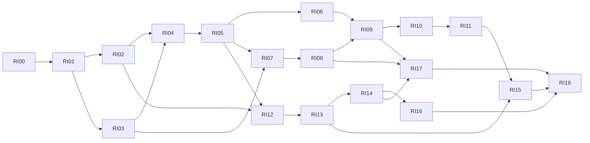

# Mihon Desktop 实机交互迭代 Roadmap

## 1. 目标与执行状态

按[最终设计](../design/mihon-desktop-ui/2026-09-30-interaction-final-design.md)将本次会话定稿的交互落到 Windows 实机：书架全部直接能力及七项设置，Ctrl／Shift选择与Ctrl滚轮，分类管理，详情全部差异和后续UI收敛，根导航／更多／作者子页签，全部主题及外观页面。

本文件取代旧书架 LC01–LC11 作为本轮整体实施入口，但保留其有效数据一致性与恢复要求。不重新执行已完成的旧 LI 计划，不恢复其他暂停 backlog，不复制已有 Reader、下载、同步、作者或迁移引擎。已有能力先核对和复验，能复用则接线／修正，不能为了完成任务编号另起一套实现。

2026-09-30 已在隔离工作树 `D:/Codex/worktrees/99ac/mihon`、基线 `0f6ed07dc2` 开始 RI00／RI01。开始时本工作树干净；原仓库的其他原型改动不在本轮写入范围。父计划唯一 active-child-plan 已切换到本计划，不恢复作者或其他 backlog。实际实现、测试、审查及构建证据统一记录于[迭代证据](../evidence/desktop-interaction-iteration-2026-09-30.md)。进度仍从第一个未勾选项推导，本产品 child plan 不声明 active-task；未满足完整退出条件的批次保持未勾选。parity-manifest.json 仍是原生 capability 状态与证据的机器权威，本文件不把 DEMO 勾选提升为产品完成。

实施基线：DEMO `bb877736abcbdaac665c39e540b00af8bf79dae7`；主题／外观官方来源 `866d045c7aba343fd739c57d15c81ff6df59e796`；早期书架／详情审计来源 `deb7b33118616d37536f1e5ef2ef85c8b5db0799`。RI00重核当前production事实与明确差异，不全局改写manifest的上游基线。SOURCE、PROJECT_POLICY、HTML_ADAPTER的区别及覆盖优先级以最终设计为准。

## 2. 交付边界与复用接口

路径缩写：`D = app-desktop/src/main/kotlin/mihon/desktop/`；`A = app/src/main/java/`；`K = domain/src/commonMain/kotlin/`。入口是本轮读取到的定位线索，执行时再核对符号／依赖与实际调用链，不把拟新增名称声称为已存在。

| 能力 | 首选生产入口 | 复用及必要增量 |
| --- | --- | --- |
| 根导航／浏览作者 | `D/ui/home/HomeScreen.kt`、`ui/browse/BrowseTab.kt`、`ui/authors/AuthorsTab.kt`、`test/navigation/TestNavigationController.kt` | 复用Voyager和作者model；调整入口与旧route映射；只有Tab进入TabNavigator，普通页面进入嵌套Navigator。 |
| 更多／设置 | `D/ui/settings/MoreRootScreen.kt`、`SettingsRootScreen.kt`、`DesktopSettingsCatalog.kt`、`DesktopSettingsAnchor.kt` | 公共层级按原版，保留Desktop页面、搜索和锚点；增量双栏宿主，避免第二套目录和路由表。 |
| 主题／外观 | `D/ui/theme/DesktopTheme.kt`、`ui/settings/AppearanceSettingsScreen.kt`、`platform/DesktopLocaleAdapter.kt`、共享`AppThemeColorScheme`／`UiPreferences` | 共用颜色、模式、语言和反馈；新平板／日期／相对时间／简介图片偏好只有一个权威，且接到真实消费者。 |
| 书架投影／UI | `D/ui/library/LibraryComponents.kt`、`LibraryTab.kt`、`LibraryScreenModel.kt`、`LibraryPageWiring.kt`、`LibraryNavigationHost.kt` | 不重写搜索／排序／全选／批量；统一面板、图标和入口，补真实wheel／Ctrl事件与滚动状态。 |
| 范围选择 | `LibrarySelectionState.kt`、`K/tachiyomi/domain/library/LibrarySelectionPolicy.kt`、`D/ui/library/ChapterSelectionState.kt` | 抽取共享闭区间计算；显式配置替换／追加、锚点、隐藏选择策略；书架和章节独立所有者。 |
| 封面 | `DesktopCustomCoverStore`、`MangaCoverRequest`及详情现有解析链 | 共用优先级和版本键；不建新缓存、不改网络／代理策略、不丢7:10。 |
| 详情 | `D/ui/library/MangaDetailScreen.kt`、`MangaDetailComponents.kt`、`MangaDetailChapterListItems.kt`、`MangaDetailScreenModel.kt`、`MangaDetailWiring.kt`、`MangaDetailNavigation.kt` | 复用真实model与action，按最终布局收敛组件；业务目标由共同用例承接，不复制DEMO模型。 |
| 分类／偏好 | `D/ui/library/CategoryManagementDialog.kt`、`ui/settings/LibrarySettingsScreen.kt`、`settings/LibraryPreferenceMigration.kt`、共享分类use case及`ResetCategoryFlags` | 把管理视图转为共用子页，保留use case；排序／默认／更新策略迁移和失败恢复只增目标所需端口。 |
| 目录／更新 | `D/domain/LibraryUpdateChecker.kt`、`LibraryUpdateScheduler.kt`、`task/DesktopTaskScheduler.kt`、Android章节同步及SQLDelight权威schema | 共享差异计划／事务核心＋平台文件副作用；详情和书架同链；不新建调度器或通用outbox。 |
| 下载／阅读 | 现有下载manager／`FilterChaptersForDownload`、详情Reader请求、同步恢复映射、浏览器adapter | 以现有队列／阅读身份消费精确工作集，改UI接线和适用性；不改Reader内部算法。 |
| 追踪／外链 | `D/tracking/`、`ui/tracking/`、provider registry及`network/DesktopBrowserLoginAdapter.kt` | 评分共享契约、真实查询／回写、平台浏览／复制；不重写OAuth或Cookie流程。 |
| 迁移 | `D/ui/migration/`及`DesktopMigrateMangaUseCase` | 复用独立目标作品和章节、已有字段和文件策略；仅补搜索／确认／失败UI及缺少的保留接线。 |

UI无业务入口或反馈、用例无production wiring均不算完成。设置目录中的既有实机页面不能因HTML禁用而停用；作者和同步只是调整入口，保持原协议和既有任务行为。Windows动态色没有真实provider时沿源码平台条件不提供可用MONET卡，旧值默认回退并反馈；本路线不新增壁纸采色服务。

## 3. 全范围覆盖与旧计划衔接

| 定稿需求 | 实施批次 | 必要退出证据 |
| --- | --- | --- |
| L01 快速滚动与位置恢复 | RI04、RI08 | 四布局、千本／200章、换分类与详情返回 |
| L02 封面一致性 | RI04、RI08 | 同址版本、自定义优先、真实文件／Coil请求 |
| L03 继续阅读资格 | RI04、RI10 | 隐角标、过滤及同步页码的真实Reader请求 |
| L04 评分规范化；L05服务筛选 | RI05、RI11 | provider解析→存储→投影→UI、回写不变 |
| L06 单分类标签 | RI02、RI04 | 系统默认与唯一自定义分类区别 |
| L07 更新容错／恢复 | RI14 | 精确工作集、计数、取消、失败重试、旧记录 |
| L08 完整目录同步 | RI13 | 事务／并发用户状态／文件引用／恢复 |
| S01 默认分类；S02包含／排除；S07清理分类排序 | RI12，分类管理RI02 | 持久化、升级、中断、错误恢复；无半份策略 |
| S03周期；S04智能规则；S06元数据 | RI14，偏好迁移RI13 | 时钟／候选规则／源响应／标题和封面保护 |
| S05 Windows设备限制 | RI16 | production原生adapter、真实发布runtime、等待／续跑 |
| I01 Ctrl滚轮；I03 Ctrl／Shift／长按及多选UI | RI06 | 真实事件→选择／导航、惯性分段、Android隔离 |
| I02两段顶部刷新 | RI17 | 书架完整分类和详情当前作品两种作用域、真实键鼠 |
| I04统一面板；I05书架顶栏 | RI05、RI01 | 真实reselect、偏好、三页、焦点、菜单范围 |
| I06宽屏导航；I07更多；I08浏览作者 | RI01 | 五根入口、左栏／底栏、更多层级、旧作者路由 |
| CUI1–CUI8 | RI02、RI06、RI12 | 分类页及单本／批量三态、排序、删除引用 |
| 详情A1–I4全部74项 | RI07–RI15、RI13–RI17及RI01／02／03／04 | 最终设计6.2逐条映射，不执行已替代入口 |
| DUI1–DUI15 | RI08、RI09、RI10及RI02 | 布局、独立滚动、状态标记、精简UI、对应图标 |
| T01–T08全部主题；AP01–AP15外观 | RI03及RI01／07／08 | 全ColorScheme、系统主题／locale／消费者、平台条件 |
| V01–V16共同实机收口 | RI18 | 原生事件／存储／网络／系统／正式产物证据 |

旧LC计划只作为技术背景引用，不再独立排队：LC01→RI04，LC02→RI05，LC03→RI01／RI05，LC04→RI04／RI06，LC05→RI17，LC06→RI02／RI12，LC07→RI13，LC08→RI14，LC09→RI12／RI14，LC10→RI16，LC11→RI18。旧19项业务和迁移／恢复要求不得因扩展UI范围而遗漏。

## 4. 可独立交付的任务批次

每条勾选须包含本批固定范围的实现、真实测试、必要独立审查、文档与证据、提交；不是“代码写完”或“截图看起来正确”。同一验收编号跨批次时，早期批次只完成下文明确的子语义，整个能力由最后一个责任批次闭环后才能更新manifest为完成；已有动作继续接真实生产链，未接通的新增动作不以空回调或假成功对外开放。实现前固定该批验收，按红→绿→清理→复验；不得在失败后取消必做项。估算为工程人日，不是模型运行墙钟或自动授权预算。

### 阶段一：基线、导航、分类与外观

- [x] **RI00 — 固定实机契约与characterization基线**（0.5–1人日）。前置：本设计定稿。范围：重核上述源码、正在执行的父／子计划、已改工作树、既有测试与manifest action映射；逐项辨别已有可复用／需补接线／确有缺口。交付：在本roadmap记录实际起点和一份贯穿全迭代的证据报告；冻结窗口adapter、图标来源、选择策略、偏好权威和迁移对象。先用现有真实组件及use case保留characterization，再为后续新增行为定义红测位置。不得顺带刷新全部上游、改manifest状态或治理无关backlog。退出：设计74条详情与全部书架／外观编号都有任务归属，受影响现有能力有可复现保护基线，未知常量如小屏封面／命中区按实际组件查清；没有以源码字符串测试充当行为证据。

- [x] **RI01 — 根导航、更多、浏览作者和设置宿主**（1.5–2.5人日）。前置：RI00。范围：Home、MoreRoot、Browse／Authors入口、SettingsRoot／catalog／search／anchor、Test导航；统一窗口布局adapter。保留根入口书架／更新／历史／浏览／更多；宽屏原版NavigationRail，窄屏NavigationBar，更多移除捐赠并恢复原版分组，作者成为浏览第二子页签，旧author请求映射；设置宽屏目录＋默认外观、窄屏目录→子页，子页隐藏根导航。先写真实宿主红测：Tab／Screen类型、旧通知／Test Mode作者路由、子页返回、宽窄重排及搜索锚点；再做最小导航调整。禁止改作者发现／同步／Reader算法或禁用其他设置页。退出：N02／N06–N08、AP01–AP02、D-A5真实导航通过，无重复顶栏／分割线；既有作者详情、设置搜索和退出路径保持。

- [x] **RI02 — 共用分类管理子页与详情归属**（1.5–2人日）。前置：RI01。范围：现有分类use case／repository、CategoryManagementDialog视图转子页、更多入口及详情分类对话框。实现卡片、拖动手柄、编辑／删除、添加FAB、名称验证；详情更多→编辑分类→编辑进入同一页，草稿丢弃且返回详情。先用真实repository和Compose事件红测拖动保存失败、名称空／重复／未变、默认0隐藏、删除确认／取消、作品回默认、设置搜索返回。删除对默认／更新偏好的清理复用现有用例，必要接口由RI12完善，不能引入第二份category列表。退出：CUI1–CUI8单本路径、D-C3全通，重启后顺序／归属保持，删除不删作品；危险与引用清理边界须主代理独立核对。禁止在书架／书架设置添加管理入口或常驻上移下移按钮。

- [x] **RI03 — 上游主题与外观完整闭环**（2–3人日）。前置：RI01，窗口adapter固定。范围：共享主题enum／色表、DesktopTheme、AppearanceSettingsScreen、UiPreferences／locale adapter、日期与简介图片消费者、catalog／search锚点。完整固定主题浅／深／纯黑、三段模式和横向卡，LIGHT整行隐藏纯黑，平台MONET条件及旧值回退；语言子页、平板四项及安全重启反馈、六日期格式、相对时间、简介图片。先红测实际ColorScheme角色、系统信号／主题不重导航、locale失败／回退、单选当前值不关闭、日历日边界、Markdown开关及持久化；再复用原版控件／既有adapter。Desktop旧列数偏好先保留并交RI05迁移入口，不能中途丢值。退出：AP01–AP15原生适用项和T主题矩阵通过；全部可用固定主题有真实UI截图与角色断言；全应用locale链与日期消费者真实接线；不复制68语言JSON或HTML外层工具为产品功能。安全重启不突然丢弃草稿或运行任务；若无可复用重启入口，提供明确手动重启提示，而非强行kill进程。

### 阶段二：书架投影、统一面板和选择

- [x] **RI04 — 四布局、封面、滚动恢复与续读**（1–1.5人日）。前置：RI02／RI03。范围：LibraryComponents／Tab／model投影、现有封面仓库和request、Lazy状态。实现四布局右侧滚动条及分类ID位置恢复，共用封面解析与版本键，续读与角标解耦，单自定义分类标签。先红测自定义替换／删除、同URL版本、隐藏角标真实Reader请求、唯一分类／默认0、千本拖动和详情返回。退出：L01／L02／L03／L06、A01–A06／A10–A11，四布局实际事件和图片请求key通过；持久偏好／临时浏览位置边界明确。禁止改Reader内部目标算法、封面7:10、全局缓存或源网络策略。

- [x] **RI05 — 追踪评分、书架顶栏与统一面板**（1.5–2.5人日）。前置：RI04。范围：tracker评分契约／registry投影、Library toolbar／panel／reselect、现有排序显示偏好及列数迁移。顶栏搜索、统一面板、同步第三、更多；云＋循环图标，更新全库／分类／随机进紧凑菜单；三页原版选项、活动条件完整提示、即时偏好、随机重排，移除独立设置／清除筛选。先红测真实provider格式→数据库→评分排序，Root reselect不叠层、当前子页保护、全局仅下载锁定、保存失败回权威值、列数旧值迁移和搜索定位、Escape／焦点。退出：L04／L05、I04／I05、B01–B13、N01／N03–N05／N09，十排序及四布局／列数消费者全通；远端原始分数回写无变化。禁止改OAuth／供应商范围、维护第二套列数或另造路由。

- [x] **RI06 — Windows书架选择、Ctrl滚轮与原版多选UI**（1.5–2.5人日）。前置：RI05；分类／删除use case复用RI02。范围：真实pointer modifier→卡片／列表→Root→selection→导航，范围共享策略和wheel adapter、选择顶栏／底栏、批量归属／删除。先红测未选普通点击打开／多选普通点击增减、Ctrl、Shift替换扩大收缩、Ctrl+Shift追加、反向／跨类／排序／隐藏锚点／陈旧目标／长按抑制click；再核对Ctrl滚轮250ms分段、边界、不抢输入／IME／模态、旧方向键移除。补批量分类三态、混合成员保持、编辑清选、双项删除固定快照、全本地动作分支。退出：C01–C21全部目标、共享Android策略回归、真实鼠标事件无误导航或缩放；批量结果及失败重试真实可见。禁止追加Ctrl+A、框选、双击要求或把书架隐藏选择策略套给章节。

### 阶段三：详情全能力和平台动作

- [x] **RI07 — 章节偏好、默认策略与实时列表投影**（1.5–2.5人日）。前置：RI03／RI05。范围：MangaDetail model／列表处理、共享章节偏好、缺章、扫描组排除和过滤默认值。实现统一筛选／排序／显示三页、已读／下载／书签三态、全局下载锁定、单本持久化、设默认／重置／显式批量应用；扫描组草稿只确认保存。先红测实际repository→flow→Compose列表、缺章降序边界、默认不自动覆盖已有作品、下载状态变动即入／出列表、筛选裁剪章节选择与锚点。退出：D-D1–D-D6／D-D9完整，D-D7／D-D8处理模型及D-D10列表响应在真实repository变更事件下通过，AP日期消费接口与缺章隐藏两处一致；共享Android相同契约通过。D-D7／D-D8资料显示由RI08闭环，D-D10真实队列／文件动作由RI10闭环，不作为本批前向完成要求。禁止更改下载器或按当前可见条目数量截断真实章节号；与RI09约定裁剪接口后再接批量操作。

- [x] **RI08 — 详情布局、作品资料、笔记与封面查看器**（1.5–3人日）。前置：RI02／RI03／RI04／RI07。范围：MangaDetail组件和既有作者／源搜索／收藏／笔记／封面actions；窗口、独立滚动和还焦。按450dp／65%公式、无分割线、仅右滚动条、精简工具栏，根导航隐藏；计数共N章、真实组名、副标题、未读／书签／下载标记；查看器内封面编辑、文字上下文搜索／复制、笔记摘要与格式草稿、重复收藏／取消收藏下载确认、单本间隔显示。先用真实Compose红测窗口布局／滚动互不影响、空字段和所有状态、实际搜索导航、空笔记无卡片、保存失败草稿、封面真实文件反馈和重复收藏对象。退出：D-A1／A2／A5／A7、D-B1–B8／B10、D-C2／C6–C8、D-F8和DUI非选择视觉／导航部分通过；D-B9在本批完成查看／缩放／编辑／还焦，保存由RI10、分享由RI11闭环；D-C1完成重复检测／查看／继续加入及有效迁移导航，迁移事务由RI15闭环；D-C4／C5完成间隔偏好与当前可得预测展示，新增更新预测消费由RI14闭环。主题／窄窗／200%字体通过。不照搬360px，保持7:10；保存／分享平台行为由RI10／RI11复用，不以空回调完成。

- [x] **RI09 — 章节选择与原版上下动作栏**（1.5–2.5人日）。前置：RI06共享范围、RI07裁剪接口、RI08页面骨架。范围：ChapterSelectionState／Actions、真实行事件、选择工具栏及批量用例。Ctrl增减、Shift／长按追加闭区间、可见全选／反选、清零退出和焦点；原版图标顶栏／右半宽底栏、选中背景无复选框、隐藏普通动作／FAB／章节头入口／刷新。先红测跨作品／反向／失效锚点、隐藏章从批量集剔除、前序已读不含当前且不受显示升降序影响、书签／读态动作条件、删除快照、混合状态适用子集及失败保留。退出：D-A3／A4、D-E1–E4／E7／E8／E9以及DUI选择视图通过；D-E5／E6／E10本批完成适用集合／对象快照／确认／结果保选模型和现有manager调用集成，真实队列／文件失败执行由RI10闭环，不以未来批次结果作为本批前置。实机图标来源逐项一致。移除更多全部标已读，不能添加冗余退出／计数；保留既有选择范围策略，不未经决定改成书架替换语义。

- [ ] **RI10 — 下载工作集、队列、阅读及封面文件动作**（2–3人日）。前置：RI07–RI09。范围：FilterChaptersForDownload与manager现有入口、Reader请求／同步页码、外部章节浏览adapter、封面保存；书架下载批量共享消费者。先红测后续1／5／10／25的真实叙事候选、已读书签、是否跳过筛选、优先／立即／取消／失败重试、非收藏非阻塞提示、本地／失效源／外部章节资格；继续阅读过滤与同步恢复页码、选择模式不误读、阅读模式只在Reader且重启持久。真实临时目录核对取消／删除对象及封面保存失败。退出：D-F1–F7／F9–F11、D-B9文件动作、D-E5／E6／E10下载、书架C17跨页状态真实一致；实际Reader请求／文件／队列证据通过。禁止改图片引擎、下载身份协议或同步算法。

- [ ] **RI11 — 追踪操作、源网页登录与分享**（2–3人日）。前置：RI08–RI10、RI05评分契约。范围：现有追踪Screen/model/provider、自动追踪偏好、浏览器／剪贴板／系统分享和登录恢复adapter。先用MockWebServer真实形状响应红测标题初始查询／重新匹配、绑定数与状态、远端打开／复制、服务总章数约束、已读自动／询问／关闭、增强匹配、失败／重试；覆盖403／429／500／空／畸形及登录恢复。实机分享无能力时明确复制链接结果，剪贴板失败反馈。退出：D-H1–H9、作者／来源搜索连接不回归，真实production provider→repository→UI／回写以及浏览器登录链证据通过。禁止重写OAuth、代理或账号管理；Windows适配不伪装Android系统分享。

### 阶段四：书架设置、完整更新及实机输入

- [ ] **RI12 — 书架设置入口及偏好一致性**（1.5–2.5人日）。前置：RI02／RI05；其余设置消费者接口以RI14–RI16实现。范围：LibrarySettingsScreen、共享LibraryPreferences、LibraryPreferenceMigration、分类策略发布端口、ResetCategoryFlags及新收藏入口。入口固定设置→书架，管理入口不出现；S01／S02／S07有完整真实持久值与消费者，S03–S06先交付迁移／值域／消费端口，不把未接通的新选项提前提供给用户。先红测默认0／每次询问／删除回退，包含排除一份快照及多归属排除优先、保存失败／升级中断／显式共享值优先，关闭分类排序的DB与偏好串行恢复。退出：S01／S02／S07完整通过、S03–S06迁移及接口测试通过，但周期／智能规则／元数据由RI14验收、Windows设备限制由RI16验收；真实双存储故障审查通过后RI14消费。禁止长期双写或把连续set当原子事务；本批不能宣称七项已全部完成。

- [ ] **RI13 — 书架／详情共用完整目录同步核心**（3–5人日）。前置：RI12；保留现有迁移章节adapter接口并提供可测试的共用边界，供后续RI15调用，不在本批完成迁移UI。范围：Android目录用例可共享部分、Desktop checker、chapter／manga repository、SQLDelight事务及必要文件／自动下载adapter。先固定官方characterization和双端共享契约，再写Desktop缺口红测：新增／改名／重排／移除／可识别换链、同URL身份、读／书签／页码／历史／配对／同步键、并发读写、异常空和不完整响应不清库。网络不入事务，单本更新原子合并最新用户状态；文件不伪装SQL原子，最小可恢复阶段记录，自动下载去重、作者观察保留。退出：L08、D-G2／G3、D24–D31目标、真实DB／HTTP／文件／崩溃窗口与幂等测试全通；共享抽取和数据边界独立审查后RI14使用。禁止全局outbox平台、重建SQL schema镜像、下载文件自动清理或标题近似任意合并。

- [ ] **RI14 — 更新容错、精确恢复、周期与元数据策略**（2–3.5人日）。前置：RI12／RI13。范围：LibraryUpdateScheduler、DesktopTaskScheduler书架专用上下文及checkpoint、逐本结果UI、FetchInterval／Clock／限制决策、作品信息合并。先红测A成B败C成、成功／失败／跳过／未处理、取消晚到错误、离页、重试失败与新刷新、精确工作集恢复、旧无范围记录、不重复DB和副作用；6／48／72h及每周、回拨／睡眠／重启、零章节／本地／全部智能条件、默认关元数据及自定义封面／标题保护。手动分类绕过全库范围但仍用作品限制；UI筛选不裁剪任务。退出：L07、S03／S04／S06、D-C4／C5预测消费、D-G1／G4／G5全部真实链通过；旧task JSON与其他后台任务兼容、恢复失败明细和重试可见。禁止第二scheduler、假进度或只删除break来冒充容错；内部上下文仅服务书架任务。

- [ ] **RI15 — 迁移搜索、确认与失败事务UI**（2–3人日）。前置：RI02／RI08–RI11／RI13；目录与章节身份接口已稳定。范围：现有MigrationSearch／config／use case、字段选择和所需文件副作用接线。先红测目标源改词／分页／换源、空／错误返回，复制与迁移区别、取消／目标失败不改变旧作品、目标独立章节身份；确认选项完整保留章节状态、分类、封面、笔记、旧下载策略。用真实DB／临时目录和故障注入验证仅适用字段复制、失败可重试、UI进度准确。退出：D-I1–I4、D-C1迁移分支及书架批量迁移，无旧chapter挂到新URL，存储与文件边界独立审查后方可勾选。禁止把迁移简化为改源名／sourceId或全面重写迁移器；需要目录核心接口时直接复用RI13已交付部分，不复制实现。

- [ ] **RI16 — Windows设备条件与自动等待**（1.5–3人日）。前置：RI14。范围：小型设备状态port、Windows原生adapter、runtime DI、scheduler作品边界及设置能力反馈。复用已有JNA等依赖，不新装服务。先红测满足／不满足／未知、未选字段不阻断、Wi-Fi／非计量／外接电源、多连接歧义、无电池、条件变化、休眠恢复、手动／显式重试绕过与自动同任务仅续一次；再验证打包runtime与DI所用真实实例。退出：S05、G06–G09，真实Windows系统查询和production调用链验收；macOS不加载Windows库，不显示能选却无效的Windows条件。TCP成功不等于源请求成功。不可获得的硬件证据明确记录，核心native调用不得仅靠mock勾选。禁止改系统网络／供电设置或安装后台唤醒服务。

- [ ] **RI17 — 书架及详情两段顶部刷新**（1–2人日）。前置：RI06／RI08／RI09／RI14，确保作用域和真实任务权威稳定。范围：页面纯状态机、原生wheel归一化adapter、提示区域和既有刷新命令；共用状态机但书架／详情各自作用域和滚动所有者。先可控Clock红测80／48dp、300ms可见、400ms分段、3秒绝对有效期、800ms静默冷却、反向／离顶／失焦／多选／模态／切类、空与短列表；真实Compose wheel→Root→scheduler断言单次请求与完整分类／单作品范围。退出：I02、书架ACCEPTANCE.md中D01–D08两段刷新、D-A6，Windows鼠标和精确触控板、自然滚动、125%／150%／200%DPI有记录；左栏／拖滚动条／Home／Ctrl滚轮无误触，任务运行不重复。禁止定时器假更新或另建更新器；缺实机输入证据仍未完成。

### 阶段五：集成与正式交付

- [ ] **RI18 — 跨能力集成、证据与正式发布收口**（1–2人日，外加设备等待）。前置：RI00–RI17的功能实现、focused风险门禁和必要独立审查满足；其中必须依赖最终发布runtime的RI16／RI17实机证据在本批统一补齐，相关checkbox在证据齐全前保持未勾选。范围：未覆盖交叉风险、最终设计与组件事实更新、manifest受影响action证据、升级数据、一次最终全量矩阵及正式构建运行。验收最终设计V01–V16，尤其导航→主题／locale→统一面板→Ctrl选择／滚轮→分类／详情→真实下载／更新→重启／失败恢复。确认Android共享契约及macOS装配，保留旧数据／配置／任务；只追加未覆盖风险测试，不复制全部focused tests。退出：下节门禁及RI00–RI17全部原定退出条件通过、Windows最终EXE／必要Android候选／macOS产物与日志可追溯，用户可按实机条目审核；真实阻塞不勾选。禁止以HTML全绿代替产品或更新历史测试结果为本轮证据。

## 5. 依赖与执行预算



图为技术依赖；默认按RI00→RI18串行，避免同时写Library／MangaDetail／Settings／Home／DI及占用Gradle。RI15迁移排在RI13共享目录核心之后，直接消费已稳定接口；无前向等待，不为赶顺序复制实现。RI03的图片／日期先接当前真实消费者，RI07／08改消费者后必须保留对应回归。

工程量粗估合计 **30–50人日**，主要成本在共享同步／恢复、真实系统与键鼠验收、全详情接线；实际已有能力可降低改造量，RI00之后逐批收窄。2026-09-30 用户已要求实现本 roadmap；首簇预算为一名实施代理、主代理独立审查一轮、必要修复复审一轮，focused 红绿测试按行为执行。2026-09-30 用户继续要求完成剩余 roadmap，按既有逐功能批审查流程继续：复用当前1名实施代理，每批主代理独立初审1轮及必要修复复审1轮；不新增代理或多轮审查。访问真实账号、安装实体设备及扩大其他成本仍须明确授权。2026-09-30 用户明确要求全部任务完成后再进行全量测试：RI00–RI17 按批次完成红绿、受影响集成／wiring、格式检查、审查及提交；完整 Android／Desktop 矩阵和正式构建集中到 RI18。首簇不再追加全量，也不因缺少最终发布产物阻断后续实现；涉及数据、安全和跨模块协议的专项验证仍须在下游依赖前通过。

未来每次执行先声明当次批次、耗时、工具／代理、focused／全量次数和审查预算。建议复用1名实施代理负责首个实质功能簇RI01及后续相邻实现，主代理规划、固定接口、独立验收，不只把审查委派；共享迁移／数据／native接口在下游前必须独立审查。每个当次授权范围默认一次独立初审、一次必要修复复审；完整全量仅在 RI18 的最终冻结 diff 上执行一次；完整roadmap跨多个交付会话时逐会话声明，不能把逐批多轮审查改名规避预算。增加代理／复审／全量或显著成本前说明具体失败和追加范围，等待用户决定。

实现者回执包含status／diff／tests／commit／process／next，优先用原实施者修复。长运行报告命令、PID／日志及预计时长，外层超时先查协调器，STARTING／RUNNING时不再启动另一Gradle。同worktree重型Gradle始终由一个协调者串行。

## 6. 测试及正式产物门禁

### 6.1 每批红绿与真实集成

| 层次 | 必测内容／可复用入口 |
| --- | --- |
| 共享契约 | 分数尺度、闭区间／不同选择策略、章节过滤、更新范围／限制、差异同步、元数据保护及恢复不变量；同fixtures驱动Android／Desktop实际实现，不复制算法。 |
| Compose事件 | 扩展LibraryPageCompositionTest／LibraryParityIntegrationTest、MangaDetailParityIntegrationTest及既有设置可达性测试；执行真实点击／修饰键／wheel／focus／导航，不只直接调helper。 |
| 导航／DI | 实例化每个Screen／Tab，检查嵌套Navigator上下文，旧作者路由；factory和真实runtime解析新依赖，破坏绑定时测试必须失败。 |
| HTTP | 真实原始响应→parser→领域对象→UI／存储；MockWebServer覆盖成功、空／缺失、403／429／500、畸形；不能mock parser。 |
| 存储／文件 | SQLDelight／Preference／task store及临时目录，旧键／JSON／中断迁移／磁盘权限和冲突；并发阅读、书签、配对与下载引用不得丢失。 |
| 系统／视觉 | 打包runtime真实locale／系统主题／网络供电adapter，实机鼠标与触控板；离屏或外部截图注明版本、语言、主题、DPI、窗口尺寸，和固定源码参数对照。 |

红绿循环只跑当前行为focused；清理后同组复验。批次和阶段完成跑明确受影响的单元／集成／wiring与格式检查，风险专项在相关下游依赖前执行；完整 Android／Desktop 矩阵统一在 RI00–RI17 完成后的 RI18 收口阶段执行。旧测试与明确新设计冲突时先保留失败事实并依据定稿修正操作路径，不放宽业务断言或删掉不便场景。

命令示例（实际类／任务须按当次Gradle配置核对；本轮文档未运行）：

```powershell
$ErrorActionPreference = 'Stop'
$env:PYTHONUTF8 = '1'
$env:PYTHONIOENCODING = 'utf-8'
$env:PYTHONDONTWRITEBYTECODE = '1'
$env:ANDROID_HOME = 'D:\Android\Sdk'
$env:ANDROID_SDK_ROOT = 'D:\Android\Sdk'
python scripts/gradle-coordinator.py run --key interaction-focused -- .\gradlew.bat :app-desktop:jvmTest --tests "mihon.desktop.ui.library.LibraryPageCompositionTest"
python scripts/gradle-coordinator.py run --key interaction-format -- .\gradlew.bat spotlessCheck
```

检查Shell实际exit code，不能仅靠ErrorActionPreference认定native命令成功。外网依仓库会话代理规则，保留用户未提交改动；schema只改权威commonMain目录，不为测试安装同名替代程序或清理所有Java进程。

### 6.2 最终一次矩阵与发布

用户要求功能全部实现后才执行全量，故最终发布runtime与硬件证据统一在本节取得，不为RI16／RI17提前重复全量或发布。其实现及专项风险检查先完成，实机门禁随后按原要求验收；没有删除、降级或豁免任何必做项，缺证据的任务保持未勾选。

1. 冻结功能diff，执行相关共享／Android／Desktop／test-desktop完整矩阵一次；每项记录实际命令、结果、环境、失败／跳过。Android共享变化须包括真实集成，macOS包括平台装配和启动，不能把Windows通过外推。
2. Desktop构建只能走`scripts/build-desktop.sh`。可先`bash ./scripts/build-desktop.sh full-tests`完成完整Desktop JVM证据；同一未提交diff已有等价证据后用`bash ./scripts/build-desktop.sh build-only`正式构建与运行，避免重复全量。若执行普通build入口则把其内部测试计入本次预算，不另外并发Gradle。
3. Windows运行验收使用日志`Final unpacked EXE:`实际文件，确认位于`app-desktop/artifacts/windows/...`并存在；记录版本／哈希／日志，最终报告给可点击绝对路径，不能交付tmp或Gradle build内EXE。Test Mode检查真实状态／动作，不读取桌面屏幕像素；视觉用离屏或外部验收工具。
4. macOS在核对过的隔离checkout／产物执行共享UI、启动和配置保留验收，不覆盖用户现有安装。Windows专用条件不在macOS伪装可用；无法验收则标真实阻塞。
5. Android共享代码受影响时按规范执行必要候选构建：`python scripts/build-android.py check --signing`，再`candidate`和`verify`。APK交付正式候选地址；签名缺失不造替代密钥。不隐式安装或操作用户实体设备，设备验收另按授权。
6. 最后一次`finalParityAudit`，仅更新受影响manifest action与真实证据，不全局重置状态／fixedMainRef。更新组件事实、最终设计偏差及用户报告；所有任务实现／独立审查／验证／提交满足后才勾选。

### 6.3 实机手动验收顺序

- [ ] 打开最终Windows EXE→宽／窄主导航、更多分组、浏览作者；旧作者通知／快捷入口及设置搜索仍正确。
- [ ] 更多→设置→外观→全部固定主题浅／深／纯黑、系统主题、语言子页、日期／相对时间／图片；重启后持久化，返回路径不叠栏。
- [ ] 书架四布局→滚动条／分类恢复／封面替换删除／续读→统一面板三页；搜索、同步第三、更多三动作顺序与范围正确。
- [ ] Ctrl选择→普通点击增减→Shift扩大／收缩／反向→Ctrl+Shift／长按→跨分类；多选上下UI、分类三态及删除确认正确。
- [ ] 更多→分类→新建／重命名／拖动／删除；详情编辑分类→编辑同页→返回，作品归属／默认／更新策略无丢失。
- [ ] 详情宽屏450dp／65%与独立滚动→窄屏→章节计数／真实组名／状态标记→章节面板／默认策略／多选全反选与批量结果。
- [ ] 下载／取消／优先／重试→真实文件→过滤／同步页码续读；阅读模式仅Reader；封面保存／分享、笔记取消／失败保草稿。
- [ ] 追踪真实查询／绑定／改匹配／进度／自动询问→源登录恢复→链接分享降级；迁移搜索／复制／迁移及取消／失败边界。
- [ ] 更新一成一败一成→明细／失败重试／新刷新→中断恢复；目录增删改／换链／文件保留及元数据保护、新章队列去重。
- [ ] S01–S07及旧配置升级→周期时钟→Windows网络／供电等待／恢复；应用完全退出不承诺唤醒。
- [ ] Ctrl滚轮分类→顶部先提示再刷新；鼠标／触控板／自然滚动／DPI，左栏、输入、模态、选择、拖滚动条无误触。
- [ ] Android共享行为、macOS启动、200%字号／键盘焦点／深浅视觉、真实重启与升级数据，证据及正式产物链接齐全。

## 7. 风险、失败处理与停点

| 风险 | 处理与停止条件 |
| --- | --- |
| 老验收恢复已移除UI | 先对照最终设计第2节；只修正对应旧路径，不以历史绿测否定新定稿或删除业务能力。 |
| 原版dp与HTML像素混用 | RI00固定组件消费，RI01统一窗口adapter，RI08／03各自公式；没有原生截图不能宣称像素100%一致。 |
| 目录／迁移／偏好数据损坏 | 相应批次完成真实DB／文件／故障注入和独立审查前，下游不得依赖或发布；遇到未知损失风险先停止写入并保留证据。 |
| 共享提取降级Desktop功能 | 作者、笔记、同步页码、登录恢复、文件身份与旧6h必须有保护测试；不能以对齐为由删除。 |
| 系统条件误放行或假动态色 | 未知所选条件等待并反馈；MONET按实际平台条件；production DI／发布runtime核验，不用独立curl／JDK替代。 |
| 硬件／签名／macOS环境不足 | 继续不依赖它的批次，记录真实阻塞与未验收项；不模拟后勾选，不重新安装或覆盖用户环境。 |
| 工作树或其他活动任务冲突 | 列出具体文件／接口，保护用户改动；协调写入边界和父指针，不reset、不扩大无关重构。 |

本roadmap的任务状态、最终设计与一份实际证据报告一起维护；不创建逐任务快照、巨型diff包或第二套状态系统。纯文档归档完成不等于本roadmap开始执行。
