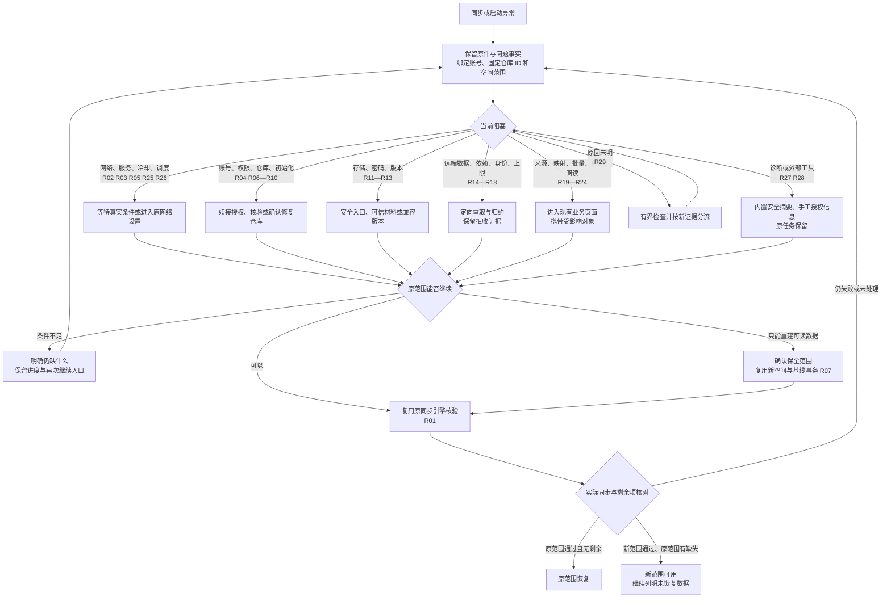

# 同步异常处理闭环

日期：2026-10-07。代码基线：`9a6651d5d8`（产品代码与 `92d8204ddb` 相同）。

输入：[118 项异常清单](../2026-10-07-sync-exception-flow-audit.md)、[96 项缺口与 R01–R29 逐项对应表](../2026-10-07-desktop-sync-recovery-closure-review.md#5-118-项逐一判定)。原表每个“缺/部”项均在本次范围内；“有/对照”用于回归，不新增另一套异常分类。2026-10-08 的实现、验证与产物记录保留在[实施记录](../evidence/sync-recovery-completion-2026-10-07.md)。**2026-10-10 状态更正：异常入口、错误分类和接续仍有遗漏，撤回“全部闭环”的完成结论，P3–P5 重新打开；P1/P2 的已取得证据不被作废，但不能据此宣布所有用户路径完成。** 后续以[处理路径补全设计](2026-10-10-sync-recovery-path-completion-design.md)补正，本次仅完成设计，尚未实施补正。

## 目标与复用边界

**PROJECT_POLICY**：从发生问题的同步页面进入处理，保留已完成步骤，经过真实同步验证后显示恢复结果。依赖第三方权限、服务、兼容版本或可信副本时，明确显示尚未满足的条件，允许继续；永久丢失的数据不能被描述为已恢复。

**SOURCE**：沿用共享 `SyncPanel/Controller`、`SyncRuntime`、onboarding、现有 PREPARING/ACTIVATING 切换事务、inbox/projector、run store、账号请求门控和双端 production HTTP 客户端。网络设置、扩展、迁移、备份、阅读器和更新复用原平台页面/服务。

**HTML_ADAPTER**：本次直接实现原生功能，不新增 HTML 或云端发布；原型不能代替 APK、Desktop 或 production wiring 验证。

只新增必要的恢复上下文、可追溯失败记录、操作和平台回调，不创建第二个同步引擎、替代数据库或通用任务系统。不清空用户数据库，不丢弃未上传事件，不修改已发布事件的身份，不降低协议、TLS 或快照防回退校验。不触碰用户真实 GitHub 仓库进行破坏性测试。

## 页面契约与统一结果

- 入口：设置、初始化、交换、待处理结果中均可进入同一“解决同步问题”流程；旧绑定不可读也有安全入口。一个主操作对应当前根因，诊断为次要入口。
- 信息：问题及影响范围 → 已完成/待处理步骤 → 当前可执行操作。成功授权、已创建仓库、已经通过的身份检查只在其依据失效时重做。显示当前账号/目标的必要可读信息，不记录密码、token、配对码。
- 目标绑定：检查结果绑定账号、凭据版本、固定 repository ID、space/generation。请求完成前后核对上下文；旧请求不得覆盖新目标。新名称不是身份。
- 返回：取消确认框优先；返回原问题仍保留检查结果；关闭面板不取消已提交激活，不自动越过暂停/取消。平台设置返回后由用户继续或按已授权恢复意图核验。
- 危险操作：新建/切换、仓库属性修改、恢复数据和身份重建先展示具体目标、可恢复/尚不可恢复范围并确认。PREPARING 可确认取消；ACTIVATING 只能继续完成。
- 结果：①原范围恢复并同步验证通过；②新范围同步成功，旧范围仍有未恢复项目；③仍有待处理项目；④等待外部条件。重查 HTTP 成功、授权成功、日志导出、关闭页面都不是同步恢复成功。
- 进度：保留统计期间无限动画、不计时；确定总量后完成/总量与已用，ETA 可用后追加；暂停冻结，恢复统计重新播放动画；不恢复右端装饰亮点。
- 布局：共享 Compose 语义；Material 组件、一个主操作、次要操作分组；长内容可滚动，窄窗/平板横竖屏不溢出。Desktop 焦点/返回沿现有 panel 外壳；Android 沿现有 sheet。

## 逐组处理路径与复用

每组承接输入审查表中所有引用该 R 编号的原异常。条件不成立时保留该项，不把“前往设置”本身计为完成。

| 组 | 从异常到恢复的路径 | 复用与失败分支 |
|---|---|---|
| R01 | 识别当前失败与对象 → 生成步骤 → 执行修复 → 继续同步并验证 → 列出剩余项 | 同一恢复入口/上下文/结果；真实 run 与未处理事实共同决定完成 |
| R02 | 用同步 production 客户端检查 → 区分代理/TLS/HTTP → 打开实际网络配置 → 应用或重启后继续 → 验证 | 复用网络设置；断网/外部代理不可用明确等待，不把通用连通性当业务成功 |
| R03 | 服务/格式异常 → 有界等待/重试 → 网络分支 R02 或兼容分支 R13 → 验证 | 复用请求预算；持续 5xx 不建议默认新建空间 |
| R04 | 拒绝可重新申请、过期生成新码、撤销重新连接 → 核对账号 → 原流程继续 | 错账号保留原凭据并提示原账号授权；明确迁移可读数据才切换账号 |
| R05 | 依据响应识别限流 → 显示真实重试门限 → 到期继续原步骤 | 共用账号门控；普通 403 走权限，手动按钮不得绕过门限 |
| R06 | 检查 App 安装/Contents/目标可见与可写 → 补足唯一未满足项 → 回来自动或明确继续核验 | 复用授权流程；允许权限范围内原生添加仓库，缺管理员/同意时保留官方操作与状态 |
| R07 | 无可用仓库/删除/名称占用 → 确认可读数据与范围 → 选新名称 → 创建私有空仓库 → 授权/读回 ID → 原初始化/切换 → 基线同步 | 与 R14/R17 共享重建事务；响应不确定先查已提交名称/ID，不能盲建重复仓库；缺创建权限提供确切授权或官方创建接续 |
| R08 | 有证据的归档/公开 → 确认目标和修改 → 解除归档/设为私有 → 读回 → 验证 | 复用仓库管理 API；权限不足转 R06 或 R07；404 不能叫归档 |
| R09 | 安装暂停/平台停用 → 明确恢复主体与官方入口 → 状态复查 → 验证 | 不能在客户端存 App 私钥；平台未解除时保持未恢复，可用新目标才提供 R07 |
| R10 | 初始化检查点异常 → 读回归属/阶段 → 同一次继续、已完成空间加入、或重新选择目标 | 传递精确失败原因；封存不确定记录，禁止覆盖不明内容；复用切换检查点 |
| R11 | 安全恢复入口 → 检查存储/数据库/凭据 → 可丢弃缓存清理或保全后恢复备份/可写位置 → 重新关联 → 验证 | 密钥/数据库不可读不删除原件；数据库打不开需启动安全入口；系统权限/硬盘不可用明确外部条件 |
| R12 | 密码/空间材料检查 → 重输正确密码、导入可信恢复材料或已解锁设备可读副本 → 验证 | 普通备份不称为密钥备份；无密钥走 R07 的明确有限重建，不能复制 actor/token |
| R13 | 不支持格式 → 显示版本/协议事实 → 可信本 fork 更新或明确当前无兼容包 → 续接核验 | 禁止向上游不同身份包升级；可读本机数据可选择 R07，未知数据不能强解析 |
| R14 | 回退/丢文件/损坏 → 无副作用重取 → 展示可信本机/备份范围 → 新空间重建 → 验证并列明未恢复范围 | 共用 R07；保留旧空间、guard 和失败证据，禁止 force push |
| R15 | 拒收批次 → 保存 ID/路径/校验原因/范围 → 重取并重新校验 → 已知可重建数据进入 R14 | 不修改旧事件复用 ID；无法解释的语义保持未恢复，可按可信副本重建 |
| R16 | 缺依赖 → 展示缺失对象 → 按已验证清单补取/重新归约 → 缺失仍存在转 R14/R15 | 不造父引用、不无限显示正常完成；失败事实可恢复读取 |
| R17 | 身份/序号冲突 → 保全未上传与本机事实 → 新合法身份/新空间基线 → 验证 | 共用保全重建；不能原地重编号或修改另一台设备，重现转存储/版本问题 |
| R18 | 超限 → 检查可读本机数据 → 确认保全范围后复用 R07，在新空间/合法身份下由现有基线 importer 与 journal 按上限重新规划 → 校验并同步；单个对象仍超限则迁移/可信副本恢复后继续 | 既有 outbox 的校验本身不能当成重规划。已持久化事件不原地改号或改批次身份；旧记录保留，明确属于新范围重建。复用 importer/journal 上限，不截断 ID/URL/密文、不丢因果关系 |
| R19 | 不可用源列表 → 携 source ID 进入现有扩展管理 → 安装/启用/更新 → 重试受影响项 | 源停服则用户确认迁移；不以隐藏失败项当恢复 |
| R20 | 描述缺失 → 重取合法对象/源元数据 → 重算 → 同步 | 可靠描述不可得则备份/迁移；禁止用猜测标题补身份 |
| R21 | 身份无法对应 → 原对象与候选 → 用户确认迁移/映射 → 产生合法新事实 → 重算 | 复用现有迁移/章节能力；作者和章节不强套作品映射，不能确定则可信副本重建 |
| R22 | 批量结果失败 → 失败集合与原因 → 处理条件 → 新冻结集合确认 → 仅重试仍适用失败项 → 验证 | 不重新执行 APPLIED，不把旧 job 的 resume 当失败重试 |
| R23 | 基线/备份部分失败 → 对应恢复结果 → 处理失败对象或另选副本 → 仅成功单元生成基线 → 验证 | 复用备份 UI/恢复器；取消保留，坏备份不反复强导入 |
| R24 | 阅读位置不可用 → 刷新章节/修复源或迁移 → 用户选择实际章节/页面 → 产生新的阅读操作 → 验证 | 复用阅读器，不把自动回退记成用户更正 |
| R25 | 等待/耗尽 → 显示真实条件 → 网络/冷却/设置入口 → 用户继续 → 实际调度与同步核验 | 复用 scheduler；暂停只由用户恢复；Desktop 退出时不许诺后台执行 |
| R26 | 停滞/旧 owner/切换中断 → 核对 owner/检查点 → 合法接管或继续 → PREPARING 可取消重选 | 活跃 owner 不强解锁，ACTIVATING 不撤回；存储问题转 R11 |
| R27 | 诊断/报告失败 → 内置可读摘要与缺失说明 → 重新采集/复制/另存 → 返回原修复 | 诊断不得挡住修复；内置读取脱敏，保存失败不覆盖原错误 |
| R28 | 浏览器/复制/查看器失败 → 原任务保留 → 显示手工输入所需码/URL或内置报告 → 再试/继续核验 | 不收集 GitHub 密码；无可用授权途径标明待满足条件 |
| R29 | 未知失败 → 有界账号/空间/网络/本机检查 → 按新证据转以上路径 → 验证 | 未知缺陷无修正版保持未恢复；保全/诊断/联系支持不是成功结果 |

## 共用处理流程

处理路径共用以下骨架；R 编号的精确触发与失败分支见上表。外部步骤返回后继续同一个任务，不能把打开页面算作完成。

## 实施批次与职责

最多两个 `gpt-6.1-sol`、`high` 实施子代理。主代理负责本契约、接口整合、一轮独立审查和发布；必要修复复审一轮。每批由原实施者修复，避免新建代理。交付一个实施与验证记录，不制作逐任务快照。

首簇并行边界：A 只改 auth/onboarding/HTTP/空间管理及对应测试；B 只改 inbox/projector/repair 服务、必要 SQL 和对应测试。之后 A 承担共享 runtime/controller/state，B 承担共享 Compose 和双端平台入口；公共 state 接口由 A 定义并提前交接，UI 不复制分类器。i18n 由 B 单独写。两者不得并行运行重型 Gradle，测试由主代理授予串行时段。

- [x] **P1：权限、创建与空间异常基础（A）。** R04–R10：真实 HTTP 错误分类、限流与安装权限，原生创建/授权/属性修改、明确新名称和结果不确定读回，精确初始化失败。先失败契约再最小实现。成功、空/缺字段、401/403/429/500、畸形、响应丢失、不同账号/ID/已有非空空间及取消均有行为测试。新增 API 不以模拟测试声称真实 App 权限已配置。
- [x] **P2：数据问题可追踪与安全重处理（B，与 P1 独立）。** R14–R18/R22 的持久失败事实、针对性重新获取/投影、失效依赖和失败集合重试。先覆盖当前缺口的红测；验证重启、重复调用、旧成功项不再执行、不可变 ID/causal guard 不变。给 controller 提供小型 repair 服务/报告，保全重建复用空间事务；不复制 runtime。
- [ ] **P3：共享恢复流程（A，依赖 P1，消费 P2 接口）。** R01–R13/R25–R26/R29 的真实状态、操作接续、授权记忆、最终验证、剩余项和平台处理动作。覆盖未知错误分流、旧绑定坏、暂停取消、晚到结果、重启与失败不循环。P2 的安全数据接口经主代理关键边界检查后接入。
- [ ] **P4：原生交互与外围能力接入（B，依赖 P2/P3 接口）。** 全组 UI，尤其 R11–R13/R19–R24/R27–R28：复用网络/扩展/迁移/备份/阅读器/可信更新入口并携带恢复上下文、返回核验；补启动安全入口和安全保全所需最小能力；清晰提供条件不足的接续方案。所有可见操作必须有 production 实现和反馈，不能只是文案或占位回调。Desktop/Android 导航、DI、Screen 与共享面板点击测试。
- [ ] **P5：整合、独立审查与正式产物（主代理）。** 核对 96 项对应组、真实操作与条件；重点审查凭据/账号/仓库身份、写后读回、不可逆影响、保全/重建范围、持久接续和跨端 wiring。先相关 focused/集成/格式；最终稳定后一次必要完整模块/Android/Desktop 验证和正式构建，失败仅补验受影响范围，不每个修复重跑全量。使用统一脚本构建签名 APK，不自动安装、不上传云端；Desktop 修改按正式脚本进行构建与 runtime 验证。记录真实环境不可用的验收限制，不改成已通过。

## 验收与预算

用户验收：已删除仓库重新连接 → 清楚的新空间创建/权限步骤 → 创建或官方授权返回后继续 → 密码与基线同步；权限/限流/公开/归档不会混成“已删除”；故障页可直接进入有效处理。数据修复后仍失败的具体范围可见；新空间成功不抹除未恢复旧数据。统计/暂停/总量/ETA 的已批准交互不得退化。

执行成本以本轮声明的数小时为预算；主要耗时为 Kotlin/Android/Desktop 编译、HTTP/持久化契约与发布优化。focused 红绿按真实行为需要串行执行；不添加无关性能评测、云端发布、后台服务或全仓扫描。额外代理、审查、扩范围或真实远端破坏性操作须另行说明并等待决定。外部权限/服务不可用时继续独立实施与可复现验证，明确记录条件，不假造端到端成功。
