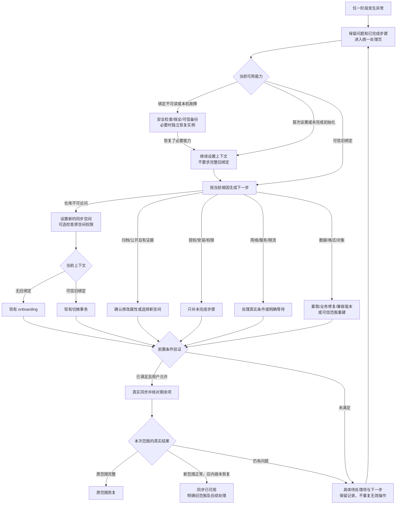

# 同步异常处理路径补全设计

日期：2026-10-10。产品源码基线：`3ff64e8c61`。状态：**补正实现、相关自动化验证及 Android/Windows 正式产物已交付；真机与外部条件待用户验收**。实际范围与组合证据见[实施记录](../evidence/sync-recovery-path-completion-2026-10-10.md)，不表示118项原始故障已逐项在实机复现。

本方案纠正[上一轮方案](2026-10-07-sync-recovery-completion-roadmap.md)的“全部闭环”结论。继承[118 项原清单及 R01–R29 对应关系](../2026-10-07-desktop-sync-recovery-closure-review.md#5-118-项逐一判定)，不另建互相竞争的异常分类。原 96 项缺/部仍须逐项证明处理路径，14 项既有路径及 8 项正常行为继续作为回归对照。不是重新实现全部同步功能。

设计轮只交付设计并更正原完成状态；用户后续授权实施，本轮已修改产品、完成相关验证并构建正式产物。没有操作真机业务或用户远端仓库；不能据源码或模拟 HTTP 认定某台设备的唯一根因。原方案未满足的外部权限、可信版本/副本仍明确保留，不作为已经恢复。

## 1. 事实、缺口与复用边界

**SOURCE**：以下是本轮读取的实现事实。F01–F12 是补正任务编号，原 R 编号仍负责业务分类。

| 补正 | 当前事实和证据 | 需要消除的遗漏 |
|---|---|---|
| F01 原因与文案 | `SyncOnboarding.verifyRepository` 将 404、ID/owner 不符交给不可访问异常；`SyncPanelContent.setupProblemText` 对 `REPOSITORY_UNAVAILABLE` 使用 `sync_setup_repository_unavailable`，中文仍是“已归档或停用” | 未证实归档/停用却作肯定提示；不同原因诱导同一无效操作 |
| F02 入口与执行条件 | `SyncPanelController.refresh` 中 `canChangeSpace` 要求可读、已启用、格式支持的连接和凭据；`SetupErrorActions`、`ErrorRecoveryExit` 复用它控制入口 | 需要恢复的状态可能没有入口；入口与危险操作权限混用 |
| F03 主操作分流 | `RecoveryPage` 的分支只处理部分 discovery 值，末尾使用通用新建/验证；`SETUP.ERROR` 又有独立的安装、重试等判断 | 相同根因跨页按钮不同；安装暂停、停用、名称占用、初始化异常等缺少统一的下一步契约。具体运行结果需补测，不断言全部分支必然失败 |
| F04 操作记忆 | `setupFailed` 默认参数可把账号/安装上下文改成 null；授权确认、创建记录、setup 和 recovery 各有自己的状态；`StoredSyncRecoveryFlow` 以完整绑定为基础 | 首次设置、失败重连与已连接恢复需共用接续规则；缺信息不能以“重新授权”掩盖；成功步骤不能因普通失败被重置 |
| F05 新建与替代路径 | 仓库 manager 已支持创建、读回、手工选择和属性修改；`beginSwitch` 必须读旧连接；共享创建按钮仍部分受 `canChangeSpace` 限制 | 同一“创建新空间”意图没有按无绑定/健康绑定/坏绑定明确路由；不能仅放开按钮就调用旧切换事务 |
| F06 安全恢复能力 | `SyncRecoveryWorkflow.facts/openPlatform/verify` 首先调用 `runtime.recoveryBinding()`；controller 在平台动作失败时只有 STORAGE 可无绑定降级 | 安全页可显示备份/更新等按钮，但执行仍可能因相同坏绑定失败；要按真实能力提供替代步骤 |
| F07 初始化与切换接续 | 已有 12 种 `SyncInitializationFailureReason` 和 PREPARING/ACTIVATING 事务，但错误页未按这些原因形成完整主操作表 | 检查点存在不能证明每种中断都有用户可达的续接方案 |
| F08 数据修复分流 | 已有拒收报告、重取、重新投影、分页、失败批量重试；共享页在 report.remaining > 0 时统一优先“修复数据” | 对缺扩展、未知格式、身份冲突、永久缺依赖等，重复重取并不改变根因；需要按组安排动作及失败后的下一步 |
| F09 平台返回 | 双端 recovery screen 按对象打开现有扩展/迁移/详情/备份页，返回依赖 `DisposableEffect`；无法解析对象时进入通用回退页 | 页面关闭不能证明用户做过修复；章节/作者不能套作品映射；必须有操作结果及原任务验证接续 |
| F10 兼容版本 | 双端 `SyncRecoveryPlatformAction.UPDATE` 当前直接 blocked/null，显示无兼容包 | 未检查就断言没有版本；“检查更新”不是实际检查能力 |
| F11 恢复中的二次失败 | 有 `recoveryPersistenceFailed`、平台失败和诊断回退，但多个动作仍依赖同一存储/绑定；`recheckSpace` 和 `verifyRecovery` 是不同动作 | 修复失败、报告失败、状态保存失败必须保留原问题及可执行出口，不能退回无效重试或冒充完整恢复 |
| F12 验收与状态 | 删除仓库重授权回归用例先建立连接，最终断言 `canChangeSpace=true`，再直接分派恢复动作；原 P3–P5 已勾选完成 | 该证据不能证明无绑定/坏绑定等状态的真实页面点击路径；必须补入口、按钮、真实执行、接续和结果的组合验证 |

**PROJECT_POLICY**：只复用现有共享 controller/runtime、GitHub manager、onboarding、切换事务、repair service、run store、原生平台页面和构建入口。新增一个同步范围内的“恢复动作决策”与可选绑定的上下文适配，不建立通用工作流引擎或第二个同步引擎。

**HTML_ADAPTER**：本轮没有 HTML 改动；原型无法作为原生入口或业务恢复证据。UI 规则依据[Desktop UI 规范](../design/mihon-desktop-ui/README.md)、组件事实表和实际共享 Compose 源码。

## 2. 共用页面与状态契约（F02–F04、F11）

| 字段 | 必须实现的行为 |
|---|---|
| 入口 | 设置失败、统计失败、交换失败、部分完成、待处理失败、切换失败、启动失败均能直接进入处理；只读处理入口不依赖有效 token、旧绑定或 `canChangeSpace` |
| 首屏 | 标题“解决同步问题”；一行准确原因和影响；已确认步骤摘要；一个主操作；“其他处理方式”中放适用替代方案；“查看详情”作为末级辅助入口 |
| 状态 | 正在检查、需要操作、正在处理、等待外部条件、用户已暂停、准备验证、正在同步验证、原范围已恢复、新范围可同步但旧数据未恢复、仍需处理；检查失败与检查未做分开 |
| 入口权限 | `canOpenRecovery` 只表达是否有问题/用户主动进入；正常启动不可用时由现有安全外壳承接。界面不自行解码绑定 |
| 操作权限 | 每个动作返回 `Ready`、`NeedsStep(具体前置动作)`、`Waiting(条件)` 或 `NotApplicable`；缺前置时按钮推进到前置步骤，不能无说明置灰。后台执行前再次核验目标与权限 |
| 主操作排序 | 未完成的已提交事务 → 阻断安全读取/写入的问题 → 身份及授权 → 仓库条件 → 数据和应用对象 → 实际同步验证；用户暂停优先保留，不自动恢复 |
| 反馈 | 打开浏览器＝“等待完成”；回应用＝“正在验证”；服务端核验通过＝该步骤已完成。已完成项变状态行，不继续占主按钮；原条件没变化的重复检查提示“仍缺少……”，转能改变条件的操作 |
| 返回与关闭 | 确认框先取消；步骤返回问题页；问题页返回来源；关闭保留已持久确认结果。关闭不自动取消已提交事务；ACTIVATING 只许安全继续，PREPARING 提供明确取消 |
| 布局与焦点 | 沿用 Material、共享面板和平台导航；主按钮随内容可滚达；窄窗/平板横竖屏、200% 字号不截断；返回恢复焦点和输入，切主题不重发请求 |
| 进度 | 统计期间无限动画且不计时；总量确定后显示“同步中，已完成 X/Y 条”和已用；ETA 未知不显示；暂停冻结，恢复统计重播动画，确定进度无尾端装饰点 |

恢复上下文分两种来源，沿用同一动作决策和同一结果模型：

- **有可信绑定**：使用现有 `StoredSyncRecoveryFlow`、固定账号/仓库 ID、space/generation、凭据 revision 和检查点。
- **无完整绑定**：仅保存来源阶段、当前可核验账号、设置/创建 attempt ID、绑定读取状态、已确认步骤及未恢复范围。允许字段未知，不伪造旧仓库 ID、密钥或 actor。数据库/安全存储均不可写时退到现有安全外壳的内存上下文，明确“本次步骤暂不能保存”；禁止继续需要持久意图的写操作。

失效范围：账号变更使所有目标权限事实失效；凭据版本变更重新查权限，但不遗忘已创建仓库 ID/尝试归属；仓库 ID 变化须重新确认新目标；改名且 ID 不变只更新地址；space/generation 变化重查数据和验证结果。过期回调只能丢弃或提示目标已变，不覆盖新任务。

共享的动作决策必须被 `SetupErrorActions`、`ErrorRecoveryExit`、`RecoveryPage`、启动安全页和 controller 一致消费。UI 负责展示，controller 负责转前置步骤，runtime 保留最终安全校验。禁止各页面再维护不同的枚举兜底规则。

## 3. 原因、提示和下一步（F01、F03）

以下每行均包含适用的真实 `SyncDiscoveryProblem`；枚举新增时要求补全映射及行为用例。通用 `else -> 新建/重试` 不能覆盖一个新的已知分类。

| 证据 / 类型 | 首屏提示与主操作 | 失败接续 / 其他选择 |
|---|---|---|
| `REPOSITORY_UNAVAILABLE`：404 或暂不能访问 | “无法访问原同步空间，可能已删除或失去访问权限。”主操作“设置新的同步空间”，直接进入创建/选择；其他方式“检查原空间访问权限” | 404 不证明删除，更不证明归档。账号未授权先补授权，再回同一选择；不要求先恢复不存在的仓库 |
| ID/owner 与原记录不一致 | “当前仓库与原同步空间不是同一个。”展示已核验的区别；“选择同步空间” | 检查原账号/原固定 ID；同名新仓库需按新空间验证并确认，不能继承旧身份。新增结构化 identity-mismatch 事实，禁止重新折成归档 |
| `REPOSITORY_ARCHIVED` / `REPOSITORY_NOT_PRIVATE` | 有明确属性证据才显示“解除归档并继续” / “设为私有并继续”，确认具体仓库与影响 | 权限不足→补管理权限或打开准确官方设置后读回；仍不能修复→创建/选择其他空间。设为私有不消除历史公开影响 |
| `REPOSITORY_DISABLED` / `INSTALLATION_SUSPENDED` | “GitHub 停用了仓库” / “同步 App 的安装已暂停”；“查看恢复步骤”，写明需要谁处理 | 有权主体的官方操作→回应用核验；仓库级限制且其他目标获准时可换空间；账号/App 级限制影响所有目标时不承诺换仓库能解决，保留本机及等待任务 |
| `AUTHORIZATION_REQUIRED` | “连接 GitHub”；保留恢复目的 | 拒绝停在待授权、过期生成新码、撤销重连；不覆盖原账号绑定；成功后去下一个未完成步骤 |
| `NEEDS_INSTALLATION` | “安装同步 App”；明确当前账号 | 返回检查安装事实；无仓库时进入创建步骤，不能原样循环安装 |
| `NEEDS_REPOSITORY_ACCESS` / `NEEDS_INSTALLATION_ACCESS_PERMISSION` | “授权访问此同步空间”；展示目标 | 权限允许使用现有 manager 添加；否则官方安装范围页面或安装列表→用户选择→核验目标。没有 installation ID 时先发现安装，不能隐藏入口 |
| `NEEDS_CONTENTS_PERMISSION` / `REPOSITORY_NOT_WRITABLE` | “检查同步写入权限” | 区分用户角色与 App Contents 权限；App 权限未配置不能靠反复登录修复，明确外部条件及可用替代目标 |
| `NEEDS_CREATION_PERMISSION` | “在 GitHub 创建空间”；同页保留账号、名称、私有/空仓库要求 | 创建后回应用核验同一候选并授权；若能补足原生创建权限则回原步骤。不要只提供再次设备登录 |
| `NEEDS_ADMINISTRATION_PERMISSION` | “管理此仓库权限” | 修复属性的官方替代操作及读回；用户没有管理权时新建/选择其他可写空间 |
| `RATE_LIMITED` | “等待 GitHub 允许继续”，显示有依据的门限 | 到期检查原步骤；手动操作不绕过账号门控；没有服务端期限时明确未知，不伪造倒计时 |
| `RETRYABLE` / 网络 / 5xx | 按真实网络阶段“检查连接”或“稍后继续” | 有界退避；持续失败转网络配置/服务等待。不是默认创建仓库 |
| `MALFORMED` | 区分用户输入和远端异常：输入问题回原表单就地修改；响应问题“检查连接与服务响应” | 网络正常仍异常→兼容检查/明确待修复；不得自动覆盖不明数据 |
| `INCOMPATIBLE` | “检查兼容版本” | F10 的实际检查、可信安装包或有限重建；未知格式保持原件，不能强解码 |
| `NAME_OCCUPIED` | 回创建表单：“这个名称已被占用”；“换一个名称” | 可建议新名称，核验后确认；已有合法空间可另选加入，不清空、改名或删除无关仓库 |
| `CREATION_UNCONFIRMED` | “创建结果尚未确认”；“确认刚才创建的空间” | 按原 attempt、名称和固定 ID 读回；权限不够补权限；长期不明允许确认封存尝试并选择新名称，提示可能残留仓库，不重复原 POST |
| `INITIALIZATION_REQUIRES_ACTION` / `INITIALIZATION_UNCONFIRMED` | 使用第 6 节细分原因给主操作 | 不以顶层 RETRYABLE 丢掉失败阶段和对象 |
| `STORAGE_ERROR` | “处理本机存储问题” | 第 5 节按可用能力恢复；错误页不依赖故障库才能打开 |
| `ACCOUNT_CHANGED` | “当前账号与原账号不同”；“使用原账号连接” | 其他方式为显式保全并用新账号设置新空间，不静默替换旧凭据/队列 |
| `MULTIPLE_SPACES` | “选择同步空间”，列出已核验候选 | 选择后固定 ID、解锁并继续；列表为空时创建或修正授权；不自动猜中第一个 |
| UNKNOWN / 未知错误 | “暂未确定同步失败原因”；“检查同步条件” | 一轮有界读取账号→权限/仓库→网络/存储证据，已知原因重新分流；无新证据不无限同样重试。显示仍可执行的原目标检查、新空间或安全恢复选项及限制 |

对于无法访问的旧空间，新建/选择是直接可见的解决方向；权限检查是保留原空间的选择，不能成为反复重试的必经障碍。“设置新的同步空间”只是进入流程，实际创建/写入仍须明确确认。

## 4. 新空间、授权记忆与创建接续（F04、F05）

同一个“创建新同步空间”入口，按本机事实选择现有事务：

| 进入时状态 | 处理路线 |
|---|---|
| 首次连接，没有旧绑定 | 复用 onboarding；账号/安装检查→私有空仓库候选→密码→初始化→基线同步；不调用 `beginSwitch` |
| 有可信旧绑定，启用或用户已停用 | 明确用户是否恢复/更换；保全原范围→现有切换事务；缺凭据先授权。停用不是存储损坏，不自动创建新 profile |
| 旧设置尚未完成，没有正式连接 | 读取创建/初始化 attempt；能确认归属则继续；失效则保留原记录并重选，不假造完整 oldConnection |
| 原仓库已删除/不可访问，但本机绑定可读 | 旧空间可读不是切换前提；检查本机保全范围→新名称/其他空间→现有切换→同步，旧远端范围标记尚未恢复 |
| 绑定/密钥不可读、未来格式、数据库失败 | 先进入第 5 节安全路线；不能拿坏绑定调用切换。可读副本准备好后通过现有独立恢复实例/onboarding 新关联 |
| 已有 PREPARING / ACTIVATING | 先恢复该事务；PREPARING 可明确取消再另选；ACTIVATING 固定目标继续，不能另起覆盖 |

页面步骤使用“GitHub 已连接 / 同步 App 待授权 / 空间已创建 / 正在准备 / 正在验证同步”等事实状态。步骤完成保留，但按钮点击不能作为完成证据；成功授权后不再默认突出“重新授权”。普通失败保留同一目标上下文，账号变更时显式作废而非保留陈旧链接。

创建确认包含：账号、名称、私有性、将同步的本机范围、未能从旧空间取回的范围、其他设备需加入新空间。创建成功而授权失败时，固定已创建 ID，主操作改为授权这一仓库；返回、关闭、进程重启仍继续该 ID。写响应不确定时先读回；无法持久记录意图时禁止新写。名称相同不等于同一仓库，官方手工创建候选仍需用户确认和空状态检查。

## 5. 无绑定、密码和本机故障（F02、F06）

安全入口提供的是分层能力，不能用一键“重新开始”替代诊断或保全：

1. **偏好/绑定不可读，但主库可读**：显示“本机书库可读取，同步关联无法读取”；保全可读书库并保留坏记录，提供恢复关联或独立实例重新设置；未知格式先兼容检查。不清同步表、不复制旧 actor。
2. **凭据后端暂不可读**：提供系统凭据可用性检查和明确解锁/权限步骤；修复后读回原凭据再继续。重新登录不能绕过写不进去的后端；真正不可恢复时转独立实例并说明范围。
3. **磁盘/路径不可写**：显示可核实的容量/路径问题，允许选择可写导出/恢复位置；只清理可证实可再生成的缓存。保存失败不启动远端创建。Desktop 不直接移动带路径绑定密钥的目录。
4. **主数据库不能打开**：复用当前启动安全外壳；保留原目录→选择空恢复位置/Android 隔离恢复实例→导入可信书库备份或用可用密码加入空间→验证。原库只保全，不冒充已修复；没有副本时明确无法还原部分内容。
5. **密码错误/忘记密码**：就地更正输入；“无法解锁？”展开可信设备导出书库备份→本机现有备份恢复→新空间的有限重建。无密码不能解密旧密文。当前没有专用同步密钥恢复包，因此不提供假导入按钮，也不在本次额外发明跨设备密钥协议。

网络设置、可信版本检查、内置诊断、选择备份文件等不要求旧同步绑定的动作，必须支持无绑定上下文。导入备份需可写且健康的目标数据库；不具备时先创建隔离实例再导入。绑定相关的数据重取/验证在条件不足时明确引导前置步骤，不以同一个 storage 错误循环。

## 6. 初始化、切换与任务所有权（F07）

| 初始化原因 / 状态 | 处理与后续失败出口 |
|---|---|
| `SPACE_IDENTITY_CHANGED`、`REPOSITORY_IDENTITY_CHANGED` | 重新核验固定 ID/空间→用户确认选择目标；不继承旧检查点；不可访问转 F01/F05 |
| `ATTEMPT_INVALID` | 展示当前尝试已失效；只读确认远端归属→同一有效尝试继续，或封存本地尝试再选目标；不删除不明远端内容 |
| `DEFAULT_BRANCH_CHANGED` | 重新读取分支与归属；初始化前安全更新候选并重新确认；已写入则按实际检查点继续或另选，不能静默重定向写入 |
| `NOT_EMPTY`、`UNRECOGNIZED_DATA` | 识别为合法现有空间则“加入该空间”；不明内容则“选择其他空间/新名称”，不清仓库 |
| `BOOTSTRAP_MISSING`、`BOOTSTRAP_CHANGED` | 定向重取；仍缺失/变化进入可信副本或新空间重建，保留旧证据 |
| `BOOTSTRAP_UNCONFIRMED`、`REQUEST_UNCONFIRMED` | 使用原 attempt 读回；无结果先网络/权限处理；长期不明可确认放弃本地尝试并另选，不重发不可判定写入 |
| `EXISTING_SPACE_REQUIRES_JOIN` | 明确“空间已经准备完成”；验证后进入解锁/加入流程，不重复初始化 |
| `UNKNOWN` | 保留阶段、请求类别与脱敏原因；有界检查后按新事实分流，不能吞成只有重试 |
| PREPARING / ACTIVATING | 原事务继续；仅 PREPARING 可确认取消。ACTIVATING 失败转存储修复/固定目标核验，不能当普通创建重来 |
| 活跃 owner / 过期 owner / CAS 冲突 | 活跃任务显示当前任务并等待；过期任务按既有恢复机制接管；冲突读最新记录并提示变化。不得清锁、重编号或强写来消除提示 |
| 暂停 / 统计未完成 / 条件等待 | 尊重暂停；继续统计恢复等待动画；网络/调度显示真实条件，检查成功后用户或原授权意图继续。Desktop 退出后不承诺后台执行 |

## 7. 数据与外围修复的有效操作（F08、F09）

数据报告必须产生“需要补源 / 需要映射 / 需要兼容版本 / 可重取 / 可重建 / 需要副本”的动作类别。标题采用产品语言，协议码、批次 ID、路径仅在详情；列表保留原件与剩余总量，翻页不丢处理对象。

| 根因 | 主处理 → 不能完成时的接续 |
|---|---|
| 暂态读取、认证/快照失败 | 在原校验下定向重取→同原因无进展则密码/网络/数据损坏分流；不无限点击重取 |
| 远端回退、丢历史、损坏（R14） | 重取排除缓存→可信本机/备份范围预览→现有新空间基线重建；原空间及未恢复范围保留 |
| 非法事件/因果图/同 ID 异内容（R15、R17） | 展示受影响范围→有可信事实时由现有 importer/journal 在新合法身份/空间重建；无法解释时保留未恢复。不得改旧 ID、删父引用、任选冲突一方 |
| 缺依赖（R16） | 从已认证清单补取→重新归约；清单无对象或对象仍缺失时列为缺失数据，转可信副本/有限重建，不永久“等待确认” |
| 超限（R18） | 新范围内用既有上限重新规划基线；单一对象仍无法表达时指出对象及限制，合法迁移/可信副本或兼容修正版。禁止截断身份、URL、密文或关系；排除项不能算完整恢复 |
| 源不可用（R19） | 携带源标识打开扩展→安装/启用/更新→重查真实源能力→重试受影响项；源停服显示受影响作品并提供原生迁移/可信备份 |
| 描述缺失（R20） | 真实源查询或可信副本→核对原身份→写入合法新事实→重新投影；拉取失败保留原因和扩展/迁移/备份选项，不猜标题和 ID |
| 身份无法对应（R21） | 对象类型及候选映射→确认→现有迁移链路。作品可走既有迁移；章节需先确认父作品，再刷新章节并选定真实章节；作者不能强套作品映射，缺合法映射能力时明确走可信副本/新范围并保留旧项 |
| 批量失败（R22） | 按根因修前置→仅 FAILED 且仍适用项构成新冻结集合→显示范围再次确认→真实应用；APPLIED 不再执行，取消保留未处理 |
| 备份部分失败（R23） | 接收恢复器实际成功/失败/取消结果及对象范围；成功部分进入基线，失败对象仍列出可处理项；更换副本/修复存储后继续，不把回到同步页当已导入 |
| 阅读位置不可用（R24） | 定位作品及目标章节→刷新/修源→实际阅读器选择合法位置→产生用户阅读事实→同步验证；单纯打开详情或自动回退不算完成 |

平台请求复用现有 request ID 和对象上下文，补充返回结果：`Cancelled`、`NoChange`、`Changed(范围)`、`Failed(原因)`、`RestartRequired`。`onDispose` 只能表示离开页面，不能独自代表 Changed。没有业务结果回调的页面，返回后做针对性只读检查并显示“尚未确认”，用户点击“继续验证”；取消不自动发起同步。

无法解析 source/object 时在原处理流程显示具体缺失条件，提供可解析的父对象、扩展、可信备份或有限重建，不打开错误对象，不以通用“备份”覆盖所有原因。返回原流程必须绑定 request ID、账号、固定目标，陈旧回调不被接受。

## 8. 兼容版本、辅助失败与最终结果（F10、F11）

**兼容版本**：先展示可读取的版本事实；“检查兼容版本”必须执行已配置的本 fork 可信发布检查。复用现有更新和正式包身份验证，不能直接使用上游默认更新源。结果区分“发现兼容版本”“没有配置可信来源”“检查失败”“已检查但无兼容版本”；不能提前写死“无兼容包”。有包则下载/选择本地正式包→核验身份、签名和版本→按平台确认安装→保存恢复任务→重启后继续核验。未配置在线来源时提供选择可信本地安装包的路径；错误包拒绝并保留原任务。仅可读本机数据允许有限重建；没有可用版本/副本则保持未恢复，不编造下载地址或降低校验。

**恢复中再次失败**：保留原故障，新增“处理这一步时发生……”及当前可执行动作。导出失败可内置查看、选择可写位置或复制脱敏摘要；诊断读取失败显示可用部分，不阻断账号/网络/安全恢复。复制/浏览器失败保留可手动输入的当次官方地址与有效配对码；过期只更新码，不重置创建目标。暂态冷却使用同一请求门控；没有新事实时不无限同样重试。

**重新检查与验证同步分开**：“重新检查”只更新前置事实，不显示恢复成功。条件都满足后主操作为“继续同步并验证”；若用户此前已经授权自动接续，且未暂停/取消，可直接进入验证。最终必须绑定本次目标、实际 run ID 和其完成结果，核对未上传、拒收、缺依赖、投影失败及待处理决定。仅详情导出、授权成功、仓库创建或普通 HTTP 成功不改变最终结论。

结果使用现有四种 outcome，并补充具体下一步：原范围已恢复；新范围同步成功但旧范围有未恢复内容；仍有待处理项目；等待外部条件。历史成功遇到新失败、目标或凭据变更须失效；旧范围“未知”不能折算为 0。正常用户待决定项提供明确决定入口，不能被当作传输失败，也不能在恢复报告中凭空消失。

## 9. 原 29 组逐组覆盖

本表继承原 118 项逐一对应关系；每个 R 组包含原表引用该组的全部编号，不缩减原异常范围。这里记录补正设计，不宣称该组所有实现都有 bug，也不把已有通过用例重新标成失败。

| 原处理组 | 本轮补正及必须验收的接续 |
|---|---|
| R01 统一恢复 | F02/F03/F04/F11/F12：所有入口、上下文、真实同步结果 |
| R02 网络 | F02/F03/F06/F09：无绑定也可进实际网络设置，按 production 网络阶段返回核验 |
| R03 服务/响应 | F01/F03/F11：服务等待、畸形响应分流；不默认建库 |
| R04 授权/账号 | F03/F04/F05：拒绝/过期/错账号/重连和原目的接续 |
| R05 限流 | F03/F04/F11：发现、授权、修复、验证同门控，不重复授权绕过 |
| R06 安装/权限 | F03/F04/F05：缺 installation ID、已创建但未授权、无法取得权限的替代目标 |
| R07 删除/无空间/名称 | F01/F02/F05：删除、404 不明、同名异 ID、未完成 setup 均直接进入新空间路线 |
| R08 归档/公开 | F01/F03/F05：属性证据、确认、权限不足替代、写后读回 |
| R09 暂停/停用 | F01/F03/F11：恢复主体、官方接续、替代目标的实际可用条件 |
| R10 初始化 | F04/F05/F07：12 种原因、尝试归属、加入/继续/另选 |
| R11 存储 | F02/F06/F11：启动前入口、可读能力、保全/隔离、保存失败阻止写入 |
| R12 密码/密钥 | F05/F06/F08：正确密码或可信可读副本；没有专用密钥包时不显示虚假能力 |
| R13 不兼容 | F02/F06/F10：无绑定检查可信版本、实际结果、安装返回及有限重建 |
| R14 回退/损坏 | F05/F08/F11：认证重取、可信范围重建、旧范围保留 |
| R15 拒收/非法数据 | F03/F08/F11：按根因处理、不可变事实、无进展后替代路线 |
| R16 缺依赖 | F08/F11：补取、永久缺失分流及可读范围 |
| R17 身份/序号 | F05/F07/F08：新合法身份重建，不改旧事件、不强占 owner |
| R18 超限 | F08/F10/F11：重新规划、单对象失败的准确出口与未恢复范围 |
| R19 源 | F08/F09：真实源对象、安装结果、停服迁移、返回核验 |
| R20 描述 | F08/F09：来源查询和身份核对；失败可接续 |
| R21 身份映射 | F08/F09：作品/章节/作者分流，无映射能力不能伪称可修复 |
| R22 批量失败 | F08/F11：修前置、新冻结集合、只处理仍适用失败项 |
| R23 备份 | F06/F08/F09：目标数据库可写、真实恢复范围和取消/部分失败 |
| R24 阅读 | F08/F09：实际章节/页码及用户操作，详情页不等于阅读修复 |
| R25 调度/等待 | F03/F07/F11：真实条件、用户暂停、两端后台边界 |
| R26 owner/切换 | F02/F04/F07：过期结果、合法接管、坏检查点、不可取消激活 |
| R27 诊断 | F06/F11：内置摘要、可写导出、原问题及修复入口保留 |
| R28 外部工具 | F04/F09/F11：手工信息、打开失败、取消、重启返回 |
| R29 未知 | F01/F02/F03/F11：有界分类、适用替代操作、不误报恢复 |

## 10. 流程图与用户当前场景

**删除仓库后重新连接 GitHub**：设备授权完成→“GitHub 已连接”保留→按实际响应显示“无法访问原同步空间，可能已删除或失去访问权限”→主操作“设置新的同步空间”→创建新空间（默认）或选择已有空间→核对账号/名称/保全范围并确认→原生创建；权限不足就在同一步提供 GitHub 创建/授权接续→读回固定 ID→设置密码/初始化→基线同步→说明新范围同步成功及旧数据未恢复范围。全程无需退出同步页去猜“更换同步空间”在哪里，也不反复要求已成功的设备授权。

## 11. 实施批次与固定验收（F12）

实施时复用已有测试夹具，但用真实失败触发和原生按钮点击连接 UI、controller、runtime、HTTP/存储。下表为实施前固定验收，实际实现与组合证据见实施记录；用户真机清单仍待验收，不能凭设计或构建完成勾选。

| 批次 | 修改边界与交付 | 最小充分验收 |
|---|---|---|
| 1 入口、事实与决策 | F01–F04；shared panel/controller、错误事实和必要持久上下文适配。先固定动作决策接口，再交给 UI 消费 | 先红测复现 404 错文案、禁用/缺失绑定无入口；绿后逐个 discovery 分类检查正确主操作，旧回调不覆盖新目标；双端共享契约及真实 Compose 点击，不只 dispatch |
| 2 创建和安全接续 | F05–F07；复用 manager/onboarding/switch、安全外壳；只扩展缺失的前置路由 | 无绑定首次失败、未完成设置、停用绑定、凭据缺失、坏绑定、未来格式、DB 不可读、PREPARING、ACTIVATING 的适用路径；HTTP 403/404/429/500、畸形响应、写成功但响应/保存失败；原件和写入次数断言 |
| 3 数据、平台与兼容 | F08–F10；报告动作分流、平台结果回调、可信更新接续 | 每种数据类别至少一个真实修复成功及一个仍失败出口；分页、批量冻结集合、旧项不重放；导航/DI/返回接线；拒绝错误安装包、没有来源与查询失败分别显示 |
| 4 二次失败、结果与交付 | F11/F12；统一结果、必要诊断降级、原清单逐项绑定证据 | 原因→实际按钮→production 操作→失败下一步→关闭/重启接续→真实同步结果；原 118 行逐项填写实际测试/运行证据及未覆盖边界，原 96 项全部有路径才允许宣布闭环 |

连接状态至少覆盖：①从未连接，②setup 未完成，③可信且启用，④可信但停用，⑤凭据缺失/过期，⑥绑定损坏，⑦未来格式，⑧数据库/安全后端不可用，⑨PREPARING，⑩ACTIVATING。不是执行所有异常与状态的无意义全排列：对每条路径列出适用状态，尤其不得用“有效绑定”用例代替缺失/坏绑定分支；排除项必须给代码依据。

每条证据记录最少包含：原异常 ID、触发阶段和连接状态、真实首屏文案/可点击动作、测试名称、实际请求或本机操作、失败后接续、原件保护、同步验证结果、平台/版本。测试中直接把 UI state 拼成可恢复状态、直接 dispatch 隐藏按钮、只测枚举或源码字符串，均不能证明用户入口完整。

实施验证按批次 focused TDD、关联集成与格式检查；不因本次设计再跑全量。届时仅在最终约定范围需要时做一次完整模块验证，失败定点补验。共享高风险身份/持久化/写入边界须独立审查；最多两个实施代理、一轮独立审查及必要一轮修复复审，具体执行预算实施前声明。真实 GitHub App 权限未实测的项目保留外部验收状态，不把 MockWebServer 当真实账号验收。

正式交付沿 `scripts/build-android.py candidate`，保持应用身份、签名和可升级版本；Desktop 改动沿正式构建脚本验收。安装/用户自行验收/云端上传按届时明确请求执行，不隐式操作实体设备。

## 12. 审阅与完成边界

- [ ] 删除原仓库→重新连接 GitHub→本页进入新空间创建/选择，不出现未经证实的“已归档或停用”。
- [ ] 首次连接失败、旧关联停用/损坏、凭据缺失→都有准确处理入口；不能执行的动作引导前置处理，不进入同一个错误循环。
- [ ] 完成 GitHub 授权→显示已连接；完成创建→固定目标继续授权；关页/重启后不要求重复创建和已完成的授权。
- [ ] 原空间确实归档→解除归档或改用新空间；权限不足→可执行的官方步骤/替代目标；平台限制尚未解除→明确等待，不显示恢复成功。
- [ ] 平台页面取消/未修改→原问题仍在；实际修复→返回原问题验证；应用更新查询失败与没有兼容版本清晰区分。
- [ ] 同步成功→核对当前范围和旧范围剩余项；日志导出、检查通过、换空间成功本身不被称为完整恢复。

上述是用户真机验收清单，尚未由用户执行；自动化已覆盖共用路径、原生真实点击、HTTP/持久化、阅读和备份接续，证据逐项映射及边界见实施记录。Android 正式候选已构建并验签，Windows 正式脚本运行校验通过。没有宣称最终重新全量全绿、所有第三方条件均已满足或所有旧数据都已恢复。
